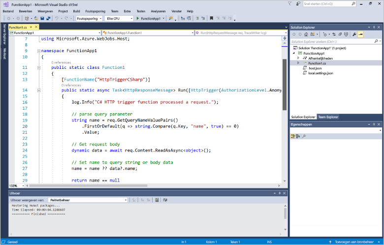
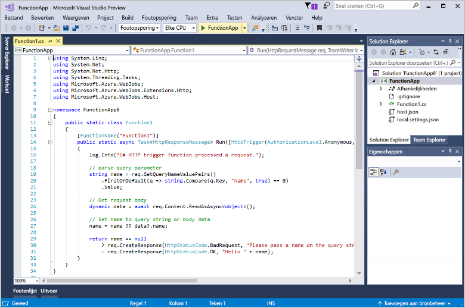
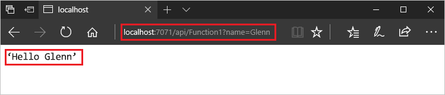
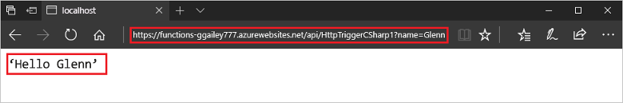

# Uw eerste functie maken met Visual Studio

Met Azure Functions kunt u uw code in een [serverloze](https://azure.microsoft.com/overview/serverless-computing/) omgeving uitvoeren zonder dat u eerst een virtuele machine moet maken of een webtoepassing publiceren.

In dit artikel leert u hoe u met de Visual Studio 2017-hulpprogramma’s voor Azure Functions lokaal een ‘Hallo wereld’-functie kunt maken en testen. Vervolgens publiceert u de functiecode op Azure. Deze hulpprogramma's zijn beschikbaar als onderdeel van de Azure-ontwikkelworkload in Visual Studio 2017.

Dit onderwerp omvat een [video](#watch-the-video) die dezelfde basisstappen laat zien.

## Vereisten

Vereisten voor het voltooien van deze zelfstudie:

* Installeer [Visual Studio 2017 versie 15.4](https://www.visualstudio.com/vs/) of een latere versie, met inbegrip van de **Azure-ontwikkelworkload**.

    

* Zorg ervoor dat u over de meest recente versie van Azure Functions en WebJobs Tools beschikt. Dat kunt u controleren onder **Updates** > **Visual Studio Marketplace** in **Extensions and Updates**.
    
[!INCLUDE [quickstarts-free-trial-note](../../includes/quickstarts-free-trial-note.md)] 

## Een functie-appproject maken

[!INCLUDE [Create a project using the Azure Functions template](../../includes/functions-vstools-create.md)]

Visual Studio maakt een project met daarin een klasse die standaardcode voor het gekozen functietype bevat. Met het kenmerk **FunctionName** in de methode wordt de naam van de functie ingesteld. Met het kenmerk **HttpTrigger** wordt aangegeven dat de functie wordt geactiveerd door een HTTP-aanvraag. De standaardcode verzendt een HTTP-reactie met een waarde uit de hoofdtekst van de aanvraag of uit de query-tekenreeks. U kunt in- en uitvoerbindingen toevoegen aan een functie door de juiste kenmerken op de methode toe te passen. Zie de sectie [Triggers en bindingen](functions-dotnet-class-library.md#triggers-and-bindings) van de [Azure Functions C#-referentie voor ontwikkelaars](functions-dotnet-class-library.md) voor meer informatie.

Nu u uw functieproject en een HTTP-geactiveerde functie hebt gemaakt, kunt u deze testen op uw lokale computer.

## De functie lokaal testen

Met Azure Functions Core-hulpprogramma's kunt u een Azure Functions-project uitvoeren op uw lokale ontwikkelcomputer. De eerste keer dat u een functie vanuit Visual Studio start, wordt u gevraagd deze hulpprogramma's te installeren.  

1. Druk op F5 om de functie testen. Accepteer desgevraagd de aanvraag van Visual Studio om Azure Functions Core (CLI)-hulpprogramma's te downloaden en installeren. Mogelijk moet u ook een firewall-uitzondering inschakelen, zodat de hulpprogramma's HTTP-aanvragen kunnen afhandelen.

2. Kopieer de URL van uw functie vanuit de uitvoer van de Azure Functions-runtime.  

    

3. Plak de URL van de HTTP-aanvraag in de adresbalk van uw browser. Voeg de queryreeks `?name=<yourname>` toe aan de URL en voer de aanvraag uit. Hieronder ziet u de reactie op de lokale GET-aanvraag die door de functie wordt geretourneerd, weergegeven in de browser: 

    

4. Als u wilt stoppen met fouten opsporen, drukt u op Shift + F5.

Nadat u hebt gecontroleerd of de functie correct wordt uitgevoerd op uw lokale computer, is het tijd om het project te publiceren naar Azure.

## Het project naar Azure publiceren

Voordat u uw project kunt publiceren, moet u een functie-app in uw Azure-abonnement hebben. U kunt rechtstreeks vanuit Visual Studio een functie-app maken.

[!INCLUDE [Publish the project to Azure](../../includes/functions-vstools-publish.md)]

## Uw functie testen in Azure

1. Kopieer de basis-URL van de functie-app van de pagina Profiel publiceren. Vervang het `localhost:port`-deel van de URL dat u hebt gebruikt bij het lokaal testen van de functie door de nieuwe basis-URL. Zorg ervoor dat u net als eerder de queryreeks `?name=<yourname>` toevoegt aan de URL en de aanvraag uitvoert.

    De URL die uw HTTP-geactiveerde functie aanroept, moet de volgende indeling hebben:

        http://<functionappname>.azurewebsites.net/api/<functionname>?name=<yourname> 

2. Plak deze nieuwe URL van de HTTP-aanvraag in de adresbalk van uw browser. Hieronder ziet u het antwoord op de externe GET-aanvraag dat door de functie wordt geretourneerd, weergegeven in de browser: 

    

## Video bekijken

> [!VIDEO https://www.youtube-nocookie.com/embed/DrhG-Rdm80k]

## Volgende stappen

U hebt een C#-functie-app met een eenvoudige HTTP-geactiveerde functie gemaakt in Visual Studio. 

+ Zie [Het project configureren voor lokale ontwikkeling](functions-develop-vs.md#configure-the-project-for-local-development) in de sectie [Azure Functions-tools voor Visual Studio](functions-develop-vs.md) voor meer informatie over het configureren van uw project ter ondersteuning van andere soorten triggers en bindingen.
+ Zie voor meer informatie over het lokale testen en foutopsporing met behulp van de Azure Functions Core Tools, [Code and test Azure Functions locally](functions-run-local.md). 
+ Zie [Using .NET class libraries with Azure Functions](functions-dotnet-class-library.md) (.NET-klassebibliotheken gebruiken met Azure Functions) voor meer informatie over het ontwikkelen van functies als .NET-klassebibliotheken. 

