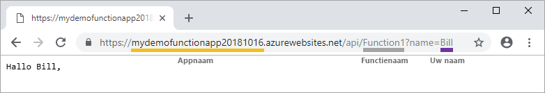

# Uw eerste functie maken met Visual Studio

Met Azure Functions kunt u uw code in een [serverloze](https://azure.microsoft.com/solutions/serverless/) omgeving uitvoeren zonder dat u eerst een virtuele machine moet maken of een webtoepassing publiceren.

In dit artikel leert u hoe u Visual Studio 2019 kunt gebruiken om lokaal een ' Hallo wereld ' te maken en te testen en vervolgens naar Azure te publiceren. Deze Quick start is ontworpen voor Visual Studio 2019. Wanneer u een functions-project maakt met behulp van Visual Studio 2017, moet u eerst de [nieuwste Azure functions-hulpprogram ma's](functions-develop-vs.md#check-your-tools-version)installeren.

## Vereisten

Als u deze zelf studie wilt volt ooien, moet u eerst [Visual Studio 2019](https://azure.microsoft.com/downloads/)installeren. Zorg ervoor dat de werkbelasting **Azure development** ook is geïnstalleerd.

[!INCLUDE [quickstarts-free-trial-note](../../includes/quickstarts-free-trial-note.md)]

## Een functie-appproject maken

[!INCLUDE [Create a project using the Azure Functions template](../../includes/functions-vstools-create.md)]

Visual Studio maakt een project en een klasse die standaard code voor het functie type HTTP-trigger bevatten. Met `FunctionName` het kenmerk voor de methode wordt de naam van de functie ingesteld, die standaard `HttpTrigger`is. Het `HttpTrigger` kenmerk geeft aan dat de functie wordt geactiveerd door een HTTP-aanvraag. De standaardcode verzendt een HTTP-reactie met een waarde uit de hoofdtekst van de aanvraag of uit de query-tekenreeks.

U kunt de mogelijkheden van uw functie uitbreiden met behulp van invoer-en uitvoer bindingen door de juiste kenmerken toe te passen op de-methode. Zie de sectie [Triggers en bindingen](functions-dotnet-class-library.md#triggers-and-bindings) van de [Azure Functions C#-referentie voor ontwikkelaars](functions-dotnet-class-library.md) voor meer informatie.

Nu u uw functieproject en een HTTP-geactiveerde functie hebt gemaakt, kunt u deze testen op uw lokale computer.

## De functie lokaal uitvoeren

Visual Studio kan worden geïntegreerd met Azure Functions Core Tools zodat u uw functies lokaal kunt testen met behulp van de volledige functions-runtime.  

[!INCLUDE [functions-run-function-test-local-vs](../../includes/functions-run-function-test-local-vs.md)]

Nadat u hebt gecontroleerd of de functie correct wordt uitgevoerd op uw lokale computer, is het tijd om het project te publiceren naar Azure.

## Het project naar Azure publiceren

Voordat u uw project kunt publiceren, moet u een functie-app in uw Azure-abonnement hebben. Visual Studio Publishing maakt een functie-app voor u de eerste keer dat u uw project publiceert.

[!INCLUDE [Publish the project to Azure](../../includes/functions-vstools-publish.md)]

## Uw functie testen in Azure

1. Kopieer de basis-URL van de functie-app van de pagina Profiel publiceren. Vervang het `localhost:port`-deel van de URL dat u hebt gebruikt bij het lokaal testen van de functie door de nieuwe basis-URL. Zorg ervoor dat u net als eerder de queryreeks `?name=<YOUR_NAME>` toevoegt aan de URL en de aanvraag uitvoert.

    De URL die uw HTTP-geactiveerde functie aanroept, moet de volgende indeling hebben:

        http://<APP_NAME>.azurewebsites.net/api/<FUNCTION_NAME>?name=<YOUR_NAME> 

2. Plak deze nieuwe URL van de HTTP-aanvraag in de adresbalk van uw browser. Hieronder ziet u het antwoord op de externe GET-aanvraag dat door de functie wordt geretourneerd, weergegeven in de browser:

    

## Volgende stappen

U hebt Visual Studio gebruikt voor het maken en publiceren C# van een functie-app in azure met een eenvoudige, door http geactiveerde functie. Zie [Azure functions C# Naslag informatie voor ontwikkel aars](functions-dotnet-class-library.md)voor meer informatie over het ontwikkelen van functies als .net-klassen bibliotheken.

> [!div class="nextstepaction"]
> [Een Azure Storage wachtrij binding aan uw functie toevoegen](functions-add-output-binding-storage-queue-vs.md)
