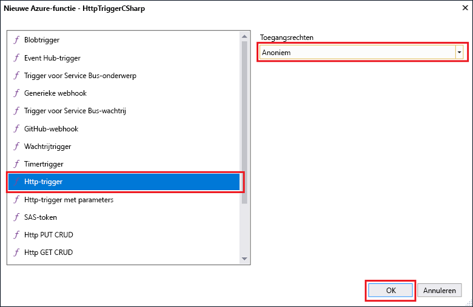

# Uw eerste functie maken met Visual Studio

Azure Functions, kunt u het uitvoeren van uw code in een [zonder server](https://azure.microsoft.com/overview/serverless-computing/) omgeving zonder eerst een virtuele machine maken of een webtoepassing publiceren.

In dit onderwerp leert u hoe u met de Visual Studio 2017 hulpprogramma's voor Azure Functions maken en testen van een functie 'Hallo wereld' lokaal. Vervolgens publiceert u de functiecode op Azure. Deze hulpprogramma's zijn beschikbaar als onderdeel van de Azure-ontwikkelworkload in Visual Studio 2017 versie 15.3 of een latere versie.

## Vereisten

Voor deze zelfstudie installeert u het volgende:

* [Visual Studio 2017 versie 15,3](https://www.visualstudio.com/vs/preview/) of een latere versie, met inbegrip van de **ontwikkelen van Azure** werkbelasting.

    
    
[!INCLUDE [Create a project using the Azure Functions](../../includes/functions-vstools-install-note.md)] 

[!INCLUDE [quickstarts-free-trial-note](../../includes/quickstarts-free-trial-note.md)] 

## Een Azure Functions-project in Visual Studio maken

[!INCLUDE [Create a project using the Azure Functions template](../../includes/functions-vstools-create.md)]

Nu u het project hebt gemaakt, kunt u uw eerste functie maken.

## De functie maken

1. Klik in **Solution Explorer** met de rechtermuisknop op het projectknooppunt en selecteer  > **Nieuw item****Toevoegen**. Selecteer **Azure-functie** en klik op **Toevoegen**.

2. Selecteer **HttpTrigger**, typ een **Functienaam**, selecteer **Anoniem** bij **Toegangsrechten** en klik op **Maken**. De gemaakte functie wordt geopend door een HTTP-aanvraag vanaf een client. 

    

    Een bestand met code wordt toegevoegd aan uw project met een klasse die de functiecode implementeert. Deze code is gebaseerd op een sjabloon waarmee u een naamwaarde en het gebruik weer ontvangt. De **functienaam** kenmerk stelt de naam van de functie. De **HttpTrigger** kenmerk geeft aan dat het bericht dat de functie activeert. 

    

Nu u een HTTP-geactiveerde-functie hebt gemaakt, kunt u deze testen op uw lokale computer.

## De functie lokaal testen

Met Azure Functions Core-hulpprogramma's kunt u Azure Functions-projecten uitvoeren op uw lokale ontwikkelcomputer. De eerste keer dat u een functie vanuit Visual Studio start, wordt u gevraagd deze hulpprogramma's te installeren.  

1. Druk op F5 om de functie testen. Accepteer desgevraagd de aanvraag van Visual Studio om Azure Functions Core (CLI)-hulpprogramma's te downloaden en installeren.  Mogelijk moet u ook een firewall-uitzondering inschakelen, zodat de hulpprogramma's HTTP-aanvragen kunnen afhandelen.

2. Kopieer de URL van uw functie vanuit de uitvoer van de Azure Functions-runtime.  

    

3. Plak de URL van de HTTP-aanvraag in de adresbalk van uw browser. Voeg de queryreeks `?name=<yourname>` toe aan de URL en voer de aanvraag uit. Hieronder ziet u de reactie op de lokale GET-aanvraag die door de functie wordt geretourneerd, weergegeven in de browser: 

    

4. Als u de foutopsporing wilt stoppen, klikt u op de knop **Stop** op de werkbalk van Visual Studio.

Nadat u hebt gecontroleerd of de functie correct wordt uitgevoerd op uw lokale computer, is het tijd om het project te publiceren naar Azure.

## Het project naar Azure publiceren

Voordat u uw project kunt publiceren, moet u een functie-app in uw Azure-abonnement hebben. U kunt rechtstreeks vanuit Visual Studio een functie-app maken.

[!INCLUDE [Publish the project to Azure](../../includes/functions-vstools-publish.md)]

## Uw functie testen in Azure

1. Kopieer de basis-URL van de functie-app van de pagina Profiel publiceren. Vervang het `localhost:port`-deel van de URL dat u hebt gebruikt bij het lokaal testen van de functie door de nieuwe basis-URL. Zorg ervoor dat u net als eerder de queryreeks `?name=<yourname>` toevoegt aan de URL en de aanvraag uitvoert.

    De URL die uw HTTP-geactiveerde functie aanroept, ziet er als volgt uit:

        http://<functionappname>.azurewebsites.net/api/<functionname>?name=<yourname> 

2. Plak deze nieuwe URL van de HTTP-aanvraag in de adresbalk van uw browser. Hieronder ziet u het antwoord op de externe GET-aanvraag dat door de functie wordt geretourneerd, weergegeven in de browser: 

    
 
## Volgende stappen

U hebt een C#-functie-app met een eenvoudige HTTP-geactiveerde functie gemaakt in Visual Studio. 

+ Zie [Het project configureren voor lokale ontwikkeling](functions-develop-vs.md#configure-the-project-for-local-development) in de sectie [Azure Functions-tools voor Visual Studio](functions-develop-vs.md) voor meer informatie over het configureren van uw project ter ondersteuning van andere soorten triggers en bindingen.
+ Zie voor meer informatie over het lokale testen en foutopsporing met behulp van de Azure Functions Core Tools, [Code and test Azure Functions locally](functions-run-local.md). 
+ Zie [Using .NET class libraries with Azure Functions](functions-dotnet-class-library.md) (.NET-klassebibliotheken gebruiken met Azure Functions) voor meer informatie over het ontwikkelen van functies als .NET-klassebibliotheken. 

