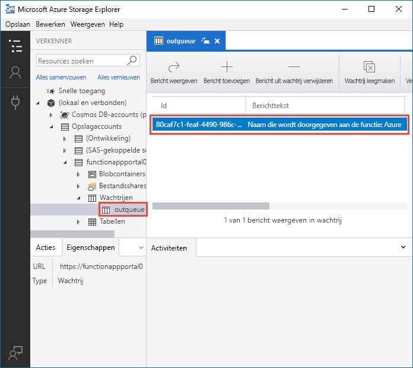
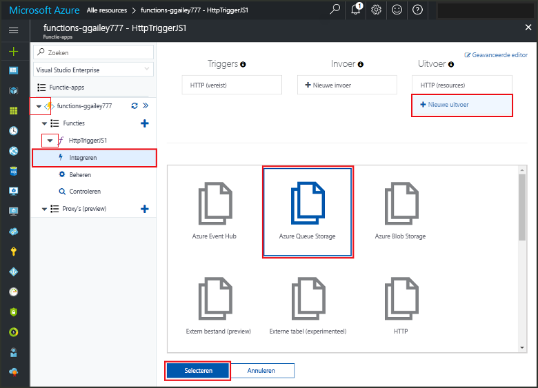
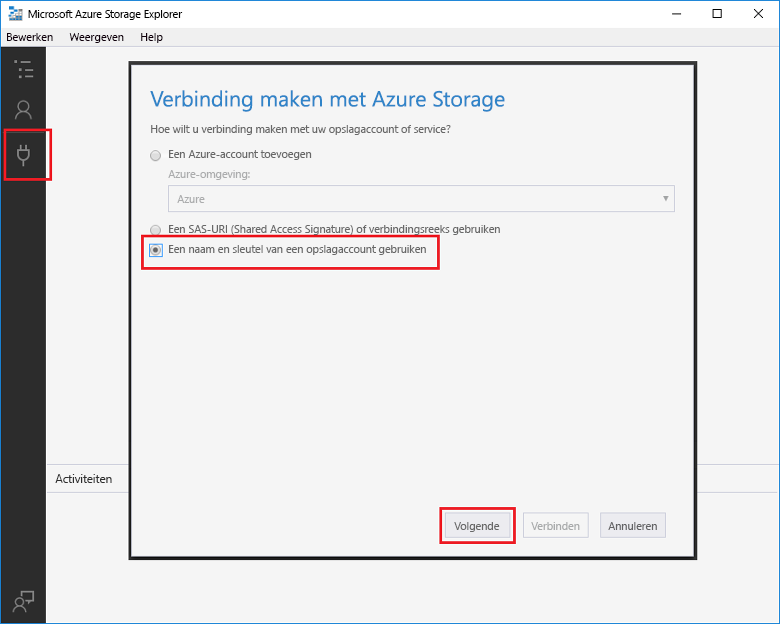
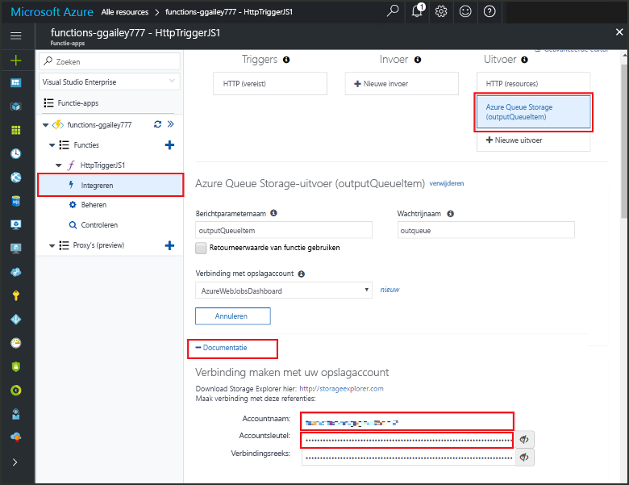
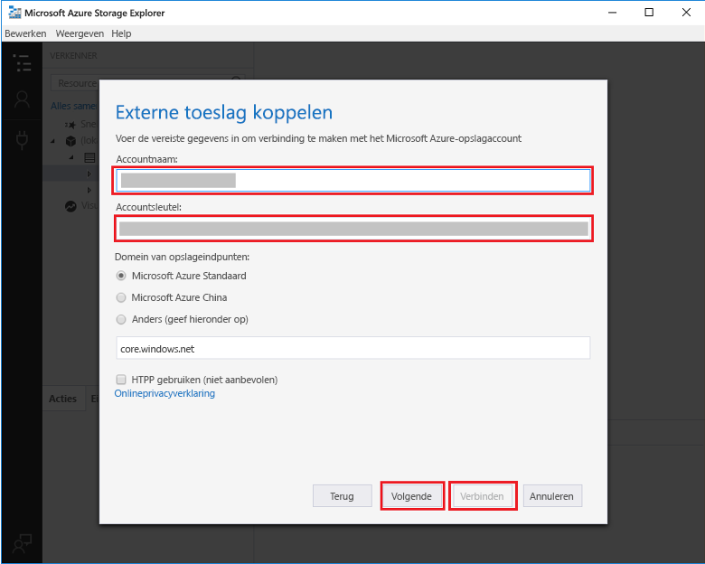

# <a name="add-messages-to-an-azure-storage-queue-using-functions"></a>Berichten aan een Azure Storage-wachtrij toevoegen met behulp van Functions

In Azure Functions bieden invoer- en uitvoerbindingen een verklarende manier om gegevens van externe services beschikbaar te maken voor uw code. In deze snelstartgids gebruikt u een uitvoerbinding om een bericht in een wachtrij te maken wanneer een functie wordt geactiveerd met een HTTP-aanvraag. U gebruikt Azure Storage Explorer om de wachtrijberichten weer te geven die worden gemaakt met uw functie:



## <a name="prerequisites"></a>Vereisten 

Dit zijn de vereisten voor het voltooien van deze snelstartgids:

* Volg de instructies in [Uw eerste functie maken vanuit Azure Portal](functions-create-first-azure-function.md) en voer de stap **Resources opschonen** niet uit. In deze snelstartgids worden de functie-app en de functie gemaakt die u hier gebruikt.

* Installeer [Microsoft Azure Storage Explorer](http://storageexplorer.com/). Dit is een hulpprogramma dat u gebruikt om wachtrijberichten te onderzoeken die worden gemaakt met de uitvoerbinding.

## <a name="add-binding"></a>Een uitvoerbinding toevoegen

In deze sectie gebruikt u de gebruikersinterface van de portal om een Queue Storage-uitvoerbinding toe te voegen aan de functie die u eerder hebt gemaakt. Met deze binding kunt u minimale code schrijven om een bericht te maken in een wachtrij. U hoeft geen code te schrijven voor taken zoals het openen van een opslagverbinding, het maken van een wachtrij of het krijgen van een verwijzing naar een wachtrij. Deze taken worden voor u verwerkt via Azure Functions-runtime en Queue Storage-uitvoerbinding.

1. Open in Azure Portal de pagina Functie-app voor de functie-app die u hebt gemaakt in [Uw eerste functie maken vanuit Azure Portal](functions-create-first-azure-function.md). Selecteer hiervoor **Meer services > Functie-apps**, en selecteer vervolgens de functie-app.

2. Selecteer de functie die u in deze eerdere snelstartgids hebt gemaakt.

1. Selecteer **Integreren > Nieuwe uitvoer > Azure Queue Storage**.

1. Klik op **Selecteren**.
    
    

3. Gebruik bij **Azure Queue Storage-uitvoer** de instellingen die zijn opgegeven in de tabel na deze schermopname: 

    

    | Instelling      |  Voorgestelde waarde   | Beschrijving                              |
    | ------------ |  ------- | -------------------------------------------------- |
    | **Naam van de berichtparameter** | outputQueueItem | De naam van de uitvoerbindingparameter. | 
    | **Opslagaccountverbinding** | AzureWebJobsStorage | U kunt de opslagaccountverbinding gebruiken die al door de functie-app wordt gebruikt of u kunt een nieuwe maken.  |
    | **Wachtrijnaam**   | outqueue    | De naam van de wachtrij waarmee u verbinding moet maken in uw opslagaccount. |

4. Klik op **Opslaan** om de binding toe te voegen.
 
Nu u een uitvoerbinding hebt gedefinieerd, moet u de code bijwerken, zodat u de binding kunt gebruiken om berichten aan een wachtrij toe te voegen.  

## <a name="add-code-that-uses-the-output-binding"></a>Code toevoegen die gebruikmaakt van de uitvoerbinding

In deze sectie voegt u code toe waarmee een bericht wordt geschreven naar de uitvoerwachtrij. Het bericht bevat de waarde die wordt doorgegeven aan de HTTP-trigger in de querytekenreeks. Als de querytekenreeks bijvoorbeeld `name=Azure` bevat, is het wachtrijbericht: *Naam wordt doorgegeven aan de functie: Azure*.

1. Selecteer de functie om de functiecode in de editor weer te geven. 

2. Voor een C#-functie voegt u een methodeparameter voor de binding toe en schrijft u code om deze te gebruiken:

   Voeg een parameter **outputQueueItem** toe aan de methodehandtekening zoals weergegeven in het volgende voorbeeld. De parameternaam is dezelfde naam die u hebt ingevoerd bij **Naam van de berichtparameter** tijdens het maken van de binding.

   ```cs   
   public static async Task<HttpResponseMessage> Run(HttpRequestMessage req, 
       ICollector<string> outputQueueItem, TraceWriter log)
   {
       ...
   }
   ```

   Voeg in de hoofdtekst van de C#-functie, net voor de instructie `return`, code toe die gebruikmaakt van de parameter om een wachtrijbericht te maken.

   ```cs
   outputQueueItem.Add("Name passed to the function: " + name);     
   ```

3. Voeg voor een JavaScript-functie code toe die gebruikmaakt van de uitvoerbinding voor het object `context.bindings` om een wachtrijbericht te maken. Voeg deze code toe vóór de instructie `context.done`.

   ```javascript
   context.bindings.outputQueueItem = "Name passed to the function: " + 
               (req.query.name || req.body.name);
   ```

4. Selecteer **Opslaan** om de wijzigingen op te slaan.
 
## <a name="test-the-function"></a>De functie testen 

1. Nadat de codewijzigingen zijn opgeslagen, selecteert u **Uitvoeren**. 

    

   U ziet dat de **Aanvraagtekst** de waarde `name` *Azure* bevat. Deze waarde ziet u in het wachtrijbericht dat wordt gemaakt wanneer de functie wordt aangeroepen.

   In plaats van hier **Uitvoeren** te selecteren, kunt u de functie aanroepen door een URL in te voeren in een browser en de waarde `name` op te geven in de querytekenreeks. De browsermethode kunt u bekijken in de [vorige snelstartgids](functions-create-first-azure-function.md#test-the-function).

2. Raadpleeg de logboeken om er zeker van te zijn dat de functie is voltooid. 

Wanneer de uitvoerbinding voor het eerst wordt gebruikt, wordt er door de runtime van Functions een nieuwe wachtrij met de naam **outqueue** gemaakt in uw opslagaccount. U gebruikt Storage Explorer om te controleren of de wachtrij en een bijbehorend bericht zijn gemaakt.

### <a name="connect-storage-explorer-to-your-account"></a>Storage Explorer verbinden met uw account

Sla deze sectie over als u Storage Explorer al hebt geïnstalleerd en hebt verbonden met het opslagaccount dat u gebruikt voor deze snelstartgids.

2. Voer het hulpprogramma [Microsoft Azure Storage Explorer](http://storageexplorer.com/) uit, selecteer het verbindingspictogram aan de linkerkant, kies **Een opslagaccountnaam en -sleutel gebruiken** en selecteer **Volgende**.

    

1. Selecteer in Azure Portal, op de pagina Functie-app, de betreffende functie, en selecteer vervolgens **Integreren**.

1. Selecteer de **Azure Queue Storage**-uitvoerbinding die u in een eerdere stap hebt toegevoegd.

1. Vouw onder aan de pagina de sectie **Documentatie** uit. 

   In de portal ziet u referenties die u in Storage Explorer kunt gebruiken om verbinding te maken met het opslagaccount.

   

1. Kopieer de waarde **Accountnaam** in de portal en plak deze in het vak **Accountnaam** in Storage Explorer.
 
1. Klik op het pictogram weergeven/verbergen naast **Accountsleutel** om de waarde weer te geven. Kopieer vervolgens de waarde **Accountsleutel** en plak deze in het vak **Accountsleutel** in Storage Explorer.
  
3. Selecteer **Volgende > Verbinding maken**.

   

### <a name="examine-the-output-queue"></a>De uitvoerwachtrij controleren

4. Selecteer in Storage Explorer het opslagaccount dat u gebruikt voor deze snelstartgids.

1. Vouw het knooppunt **Wachtrijen** uit en selecteer vervolgens de wachtrij met de naam **outqueue**. 

   De wachtrij bevat het bericht dat met de Queue Storage-uitvoerbinding is gemaakt toen u de met HTTP geactiveerde functie hebt uitgevoerd. Als u de functie hebt aangeroepen met de standaardwaarde `name` van *Azure*, is het wachtrijbericht *Naam is doorgegeven aan de functie: Azure*.

    

2. Voer de functie opnieuw uit. Er wordt nu een nieuw bericht weergegeven in de wachtrij.  

## <a name="clean-up-resources"></a>Resources opschonen

[!INCLUDE [Clean up resources](../../includes/functions-quickstart-cleanup.md)]

## <a name="next-steps"></a>Volgende stappen

In deze snelstartgids hebt u een uitvoerbinding toegevoegd aan een bestaande functie. Zie [Azure Functions Storage queue bindings](functions-bindings-storage-queue.md) (Opslagwachtrijbindingen van Azure Functions) voor meer informatie over de binding met Queue Storage. 

[!INCLUDE [Next steps note](../../includes/functions-quickstart-next-steps.md)]
