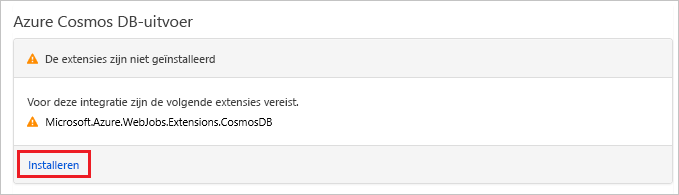

# <a name="store-unstructured-data-using-azure-functions-and-azure-cosmos-db"></a>Ongestructureerde gegevens opslaan met behulp van Azure Functions en Azure Cosmos DB

[Azure Cosmos DB](https://azure.microsoft.com/services/cosmos-db/) is een geweldige manier om ongestructureerde gegevens en JSON-gegevens op te slaan. Cosmos DB biedt, in combinatie met Azure Functions, een snelle en eenvoudige manier om gegevens op te slaan met veel minder code dan nodig is voor het opslaan van gegevens in een relationele database.

> [!NOTE]
> Op dit moment werken de Azure Cosmos DB-trigger, invoerbindingen en uitvoerbindingen alleen met SQL API- en Graph API-accounts.

In Azure Functions bieden invoer- en uitvoerbindingen een verklarende manier om verbinding te maken met externe servicegegevens vanuit uw functie. In dit artikel wordt uitgelegd hoe u een bestaande functie kunt bijwerken voor het toevoegen van een uitvoerbinding die niet-gestructureerde gegevens in een Azure Cosmos DB-document opslaat.


## <a name="prerequisites"></a>Vereisten

Vereisten voor het voltooien van deze zelfstudie:

[!INCLUDE [Previous quickstart note](../../includes/functions-quickstart-previous-topics.md)]

## <a name="create-an-azure-cosmos-db-account"></a>Maak een Azure Cosmos DB-account

U moet een Azure Cosmos DB-account hebben dat gebruikmaakt van de SQL-API voordat u de uitvoerbinding maakt.

[!INCLUDE [cosmos-db-create-dbaccount](../../includes/cosmos-db-create-dbaccount.md)]

## <a name="add-an-output-binding"></a>Een uitvoerbinding toevoegen

1. Ga in de portal naar de functie-app die u eerder hebt gemaakt en vouw uw functie-app en de functie uit.

1. Selecteer rechts boven op de pagina **Integreren** en **+ Nieuwe uitvoer**. Kies **Azure Cosmos DB**, en klik op **Selecteren**.

    

1. Als een bericht **Extensies niet geïnstalleerd** wordt weergegeven, kiest u **Installeren** om de Azure Cosmos DB-bindingen-extensie te installeren in de functie-app. Dit kan een paar minuten duren.

    

1. Gebruik de **Azure Cosmos DB-uitvoer**instellingen zoals opgegeven in de tabel:

    

    | Instelling      | Voorgestelde waarde  | Beschrijving                                |
    | ------------ | ---------------- | ------------------------------------------ |
    | **Parameternaam van document** | taskDocument | Naam die in code verwijst naar het Cosmos DB-object. |
    | **Databasenaam** | taskDatabase | Naam van database waarin documenten worden opgeslagen. |
    | **Naam van verzameling** | TaskCollection | Naam van de databaseverzameling. |
    | **Indien waar, worden de Cosmos-DB-database en -verzameling gemaakt** | Geselecteerd | De verzameling bestaat nog niet, dus moet u deze maken. |
    | **Verbinding met het Azure Cosmos DB-account** | Nieuwe instelling | Selecteer **Nieuw** en kies vervolgens uw **abonnement**, het **Database-account** dat u eerder hebt gemaakt, en **Selecteren**. Hiermee maakt u een toepassingsinstelling voor uw accountverbinding. Deze instelling wordt gebruikt door de binding om verbinding te maken met de database. |
    | **Doorvoer op niveau van verzameling** |400 RU| U kunt de doorvoer later opschalen als u de latentie wilt beperken. |

1. Selecteer **Opslaan** om de binding te maken.

## <a name="update-the-function-code"></a>De functiecode bijwerken

Vervang de bestaande functiecode door het volgende in de door u gekozen taal:

# <a name="ctabcsharp"></a>[C\#](#tab/csharp)

Vervang de bestaande C#-functie door de volgende code:

```csharp
#r "Newtonsoft.Json"

using Microsoft.AspNetCore.Mvc;
using Microsoft.AspNetCore.Http;
using Microsoft.Extensions.Logging;

public static IActionResult Run(HttpRequest req, out object taskDocument, ILogger log)
{
    string name = req.Query["name"];
    string task = req.Query["task"];
    string duedate = req.Query["duedate"];

    // We need both name and task parameters.
    if (!string.IsNullOrEmpty(name) && !string.IsNullOrEmpty(task))
    {
        taskDocument = new
        {
            name,
            duedate,
            task
        };

        return (ActionResult)new OkResult();
    }
    else
    {
        taskDocument = null;
        return (ActionResult)new BadRequestResult();
    }
}
```

# <a name="javascripttabnodejs"></a>[JavaScript](#tab/nodejs)

Vervang de bestaande JavaScript-functie door de volgende code:

```js
module.exports = async function (context, req) {

    // We need both name and task parameters.
    if (req.query.name && req.query.task) {

        // Set the output binding data from the query object.
        context.bindings.taskDocument = req.query;

        // Success.
        context.res = {
            status: 200
        };
    }
    else {
        context.res = {
            status: 400,
            body: "The query options 'name' and 'task' are required."
        };
    }
};
```
---

In dit codevoorbeeld worden de queryreeksen van de HTTP-aanvraag gelezen en toegewezen aan het velden in het `taskDocument`-object. De `taskDocument`-binding verzendt de objectgegevens van deze bindingsparameter voor opslag in de gebonden documentdatabase. De database wordt de eerste keer dat de functie wordt uitgevoerd gemaakt.

## <a name="test-the-function-and-database"></a>De functie en database testen

1. Vouw het rechtervenster uit en selecteer **Testen**. Klik onder **Query** op **+ Parameter toevoegen** en voeg de volgende parameters toe aan de querytekenreeks:

    + `name`
    + `task`
    + `duedate`

1. Klik op **Uitvoeren** en controleer of een 200-status wordt geretourneerd.

    

1. Vouw aan de linkerkant van Azure Portal de pictogrammenbalk uit, typ `cosmos` in het zoekveld en selecteer **Azure Cosmos DB**.

    

1. Kies uw Azure Cosmos DB-account en selecteer vervolgens **Data Explorer**.

1. Vouw de knooppunten **Verzamelingen** uit, selecteer het nieuwe document en controleer of het document uw querytekenreekswaarden, samen met enkele aanvullende metagegevens, bevat.

    

U hebt een binding toegevoegd aan de HTTP-trigger waarmee niet-gestructureerde gegevens worden opgeslagen in een Azure Cosmos DB.

[!INCLUDE [Clean-up section](../../includes/clean-up-section-portal.md)]

## <a name="next-steps"></a>Volgende stappen

[!INCLUDE [functions-quickstart-next-steps](../../includes/functions-quickstart-next-steps.md)]

Zie [Azure Functions Cosmos DB bindings](functions-bindings-cosmosdb.md) (Bindingen tussen Azure Functions en Cosmos DB) voor meer informatie over de binding met een Cosmos DB database.
