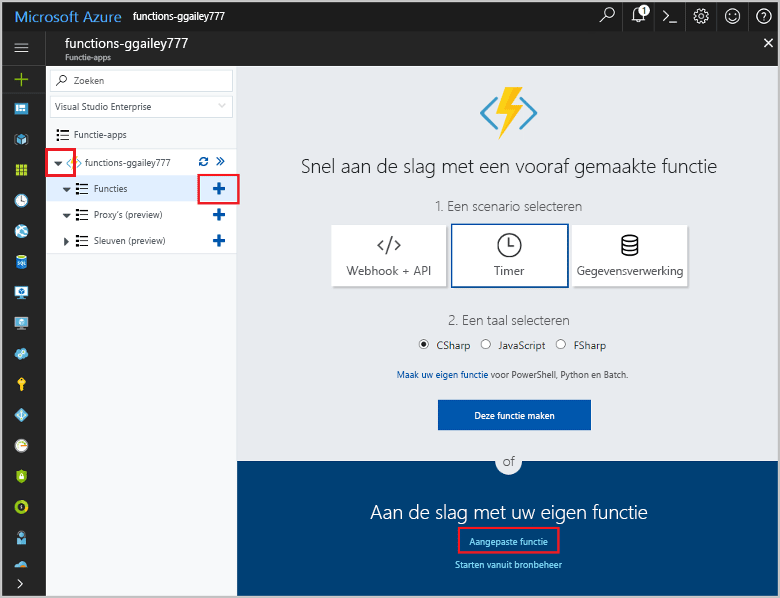

# <a name="create-an-openapi-definition-for-a-function"></a>De OpenAPI-definitie maken voor een functie
REST-API's worden vaak beschreven met behulp van de definitie van een OpenAPI (voorheen bekend als een [Swagger](http://swagger.io/)-bestand). Deze definitie bevat informatie over welke bewerkingen beschikbaar zijn in een API en hoe de gegevens van de aanvraag en respons voor de API moeten worden opgebouwd.

In deze zelfstudie maakt u een functie waarmee wordt bepaald of een noodherstelproces op een windturbine rendabel is. Vervolgens maakt u een OpenAPI-definitie voor de functie-app zodat de functie kan worden aangeroepen vanuit andere apps en services.

In deze zelfstudie leert u het volgende:

> [!div class="checklist"]
> * Een maken functie in Azure
> * Een OpenAPI-definitie genereren met OpenAPI-hulpprogramma’s
> * De definitie wijzigen voor het leveren van aanvullende metagegevens
> * De definitie testen door het aanroepen van de functie

## <a name="create-a-function-app"></a>Een functie-app maken

U moet een functie-app hebben die als host fungeert voor de uitvoering van uw functies. Met een functie-app kunt u functies groeperen in een logische eenheid, zodat u resources eenvoudiger kunt beheren, implementeren schalen en delen. 

[!INCLUDE [Create function app Azure portal](../../includes/functions-create-function-app-portal.md)]

[!INCLUDE [functions-portal-favorite-function-apps](../../includes/functions-portal-favorite-function-apps.md)]


## <a name="create-the-function"></a>De functie maken

Deze zelfstudie maakt gebruik van een HTTP-geactiveerde functie waarvoor twee parameters zijn vereist: de geschatte tijd voor het herstellen van een turbine (in uren); en de capaciteit van de turbine (in kilowatt). De functie berekend vervolgens hoeveel een reparatie kost en hoeveel omzet de turbine in een periode van 24 uur zou kunnen maken.

1. Vouw de functie-app uit en klik op de knop **+** naast **Functies**. Als dit de eerste functie in de functie-app is, selecteert u **Aangepaste functie**. U ziet nu de volledige set het functiesjablonen. 

    

2. Typ `http` in het zoekveld en kies vervolgens**C#** voor het HTTP-activatiesjabloon. 
 
    

3. Type `TurbineRepair` voor de functie **Naam**, kies `Function` bij  **[Verificatieniveau](functions-bindings-http-webhook.md#http-auth)**, en selecteer vervolgens **Maken**.  

    

1. Vervang de inhoud van het bestand run.csx door de volgende code en klik vervolgens op **Opslaan**:

    ```csharp
    using System.Net;

    const double revenuePerkW = 0.12; 
    const double technicianCost = 250; 
    const double turbineCost = 100;

    public static async Task<HttpResponseMessage> Run(HttpRequestMessage req, TraceWriter log)
    {   

        //Get request body
        dynamic data = await req.Content.ReadAsAsync<object>();
        int hours = data.hours;
        int capacity = data.capacity;

        //Formulas to calculate revenue and cost
        double revenueOpportunity = capacity * revenuePerkW * 24;  
        double costToFix = (hours * technicianCost) +  turbineCost;
        string repairTurbine;

        if (revenueOpportunity > costToFix){
            repairTurbine = "Yes";
        }
        else {
            repairTurbine = "No";
        }

        return req.CreateResponse(HttpStatusCode.OK, new{
            message = repairTurbine,
            revenueOpportunity = "$"+ revenueOpportunity,
            costToFix = "$"+ costToFix         
        }); 
    }
    ```
    Deze functiecode retourneert een bericht van `Yes` of `No` om aan te geven of een noodherstelproces rendabel is, evenals de kans op omzet die de turbine vertegenwoordigt en de kosten om de turbine te repareren. 

1. Om de functie te testen, klikt u op **Testen** helemaal rechts op het tabblad om de testresultaten uit te breiden. Voer de volgende waarde in voor de **Aanvraagtekst**, en klik vervolgens op **Uitvoeren**.

    ```json
    {
    "hours": "6",
    "capacity": "2500"
    }
    ```

    

    De volgende waarde wordt in de hoofdtekst van het antwoord geretourneerd.

    ```json
    {"message":"Yes","revenueOpportunity":"$7200","costToFix":"$1600"}
    ```

U hebt nu een functie die de kosteneffectiviteit van noodreparaties bepaalt. Vervolgens genereert en wijzigt u de definitie van een OpenAPI voor de functie-app.

## <a name="generate-the-openapi-definition"></a>De OpenAPI-definitie genereren

U nu kunt de OpenAPI-definitie genereren. Deze definitie kan zowel worden gebruikt door andere Microsoft-technologieën, zoals API-Apps [PowerApps](functions-powerapps-scenario.md) en [Microsoft Flow](../azure-functions/app-service-export-api-to-powerapps-and-flow.md), als door hulpprogramma's voor ontwikkelaars door derden, zoals [Postman](https://www.getpostman.com/docs/importing_swagger) en [nog veel meer pakketten](http://swagger.io/tools/).

1. Selecteer alleen de *werkwoorden* die uw API ondersteunt (in dit geval POST). Hierdoor is de gegenereerde API-definitie schoner.

    1. Op het tabblad **Integreren** van uw nieuwe functie in de HTTP-Trigger wijzigt u **Toegestane HTTP-methoden** naar **Geselecteerde methoden**

    1. In **Geselecteerde HTTP-methoden** schakelt u elke optie uit behalve **POST**, vervolgens klikt u op **Opslaan**.

        
        
1. Klik op uw de naam van uw functie app (zoals **function-demo-energy**) > **Platformfuncties** > **API-definitie**.

    

1. Op het tabblad **API-definitie** klikt u op **Functie**.

    

    Deze stap maakt een reeks OpenAPI-opties mogelijk voor uw functie-app, met inbegrip van een eindpunt voor het hosten van een OpenAPI-bestand uit het domein van uw functie app, een inline-kopie van de [OpenAPI Editor](http://editor.swagger.io), en een sjabloongenerator voor API-definities.

1. Klik op **Sjabloon voor API-definitie genereren** > **Opslaan**.

    

    Azure scant uw functie-app op HTTP-triggerfuncties en maakt gebruik van de gegevens in functions.json voor het genereren van de definitie van een OpenAPI. Hier volgt de definitie die wordt gegenereerd:

    ```yaml
    swagger: '2.0'
    info:
    title: function-demo-energy.azurewebsites.net
    version: 1.0.0
    host: function-demo-energy.azurewebsites.net
    basePath: /
    schemes:
    - https
    - http
    paths:
    /api/TurbineRepair:
        post:
        operationId: /api/TurbineRepair/post
        produces: []
        consumes: []
        parameters: []
        description: >-
            Replace with Operation Object
            #http://swagger.io/specification/#operationObject
        responses:
            '200':
            description: Success operation
        security:
            - apikeyQuery: []
    definitions: {}
    securityDefinitions:
    apikeyQuery:
        type: apiKey
        name: code
        in: query
    ```

    Deze definitie wordt beschreven als een _sjabloon_ omdat hiervoor meer metagegevens voor de definitie van een volledige OpenAPI nodig zijn. U gaat de definitie in de volgende stap wijzigen.

## <a name="modify-the-openapi-definition"></a>De OpenAPI-definitie bewerken
Nu dat u een sjabloondefinitie hebt, wijzigt u het om de aanvullende metagegevens over de bewerkingen van de API en de gegevensstructuren te leveren. In **API-definitie** verwijdert u de gegenereerde definitie uit `post` naar de onderkant van de definitie. Plak onderstaande content en klik op **Opslaan**.

```yaml
    post:
      operationId: CalculateCosts
      description: Determines if a technician should be sent for repair
      summary: Calculates costs
      x-ms-summary: Calculates costs
      x-ms-visibility: important
      produces:
        - application/json
      consumes:
        - application/json
      parameters:
        - name: body
          in: body
          description: Hours and capacity used to calculate costs
          x-ms-summary: Hours and capacity
          x-ms-visibility: important
          required: true
          schema:
            type: object
            properties:
              hours:
                description: The amount of effort in hours required to conduct repair
                type: number
                x-ms-summary: Hours
                x-ms-visibility: important
              capacity:
                description: The max output of a turbine in kilowatts
                type: number
                x-ms-summary: Capacity
                x-ms-visibility: important
      responses:
        200:
          description: Message with cost and revenue numbers
          x-ms-summary: Message
          schema:
           type: object
           properties:
            message:
              type: string
              description: Returns Yes or No depending on calculations
              x-ms-summary: Message 
            revenueOpportunity:
              type: string
              description: The revenue opportunity cost
              x-ms-summary: RevenueOpportunity 
            costToFix:
              type: string
              description: The cost in $ to fix the turbine
              x-ms-summary: CostToFix
      security:
        - apikeyQuery: []
definitions: {}
securityDefinitions:
  apikeyQuery:
    type: apiKey
    name: code
    in: query
```

In dit geval kunt u alleen bijgewerkte metagegevens plakken, maar het is belangrijk om de soorten wijzigingen te begrijpen die we in het standaardsjabloon hebben gemaakt:

+ Opgegeven dat de API gegevens produceert en consumeert in een JSON-indeling.

+ De vereiste parameters opgegeven met hun namen en gegevenstypen.

+ De retourwaarden opgeven voor een geslaagde respons met hun namen en gegevenstypen.

+ Beschrijvende samenvattingen en beschrijvingen geleverd voor de API en zijn bewerkingen en parameters. Dit is belangrijk voor mensen die deze functie zullen gebruiken.

+ x-ms-summary en x-ms-visibility toegevoegd, die worden gebruikt in de gebruikersinterface voor Microsoft Flow en Logic Apps. Zie voor meer informatie [OpenAPI-extensies voor aangepaste API's in Microsoft Flow](https://preview.flow.microsoft.com/documentation/customapi-how-to-swagger/).

> [!NOTE]
> We hebben de definitie van de beveiliging laten staan met de standaardmethode voor verificatie van de API-sleutel. U moet deze sectie van de definitie wijzigen als u een ander type verificatie gebruikt.

Zie voor meer informatie over het definiëren van de API-bewerkingen de [Open API-specificatie](https://swagger.io/specification/#operationObject).

## <a name="test-the-openapi-definition"></a>De OpenAPI-definitie testen
Voordat u de API-definitie gebruikt, is het een goed idee om deze te testen in de gebruikersinterface van Azure Functions.

1. Kopieer in het tabblad **Beheren** van de functie onder **Hostsleutels** de **standaard**-sleutel.

    

    > [!NOTE]
    >U gebruikt deze sleutel voor het testen en u zult deze ook gebruiken wanneer u de API vanuit een app of service aanroept.

1. Ga terug naar de API-definitie: **function-demo-energy** > **Platformfuncties** > **API-definitie**.

1. Klik in het rechterdeelvenster op **Verifiëren**, voer de API-sleutel die u heeft gekopieerd en klik op **Verifiëren**.

    

1. Scroll naar beneden en klik op **Probeer deze bewerking**.

    

1. Voer waarden in voor **uren** en **capaciteit**.

    

    U ziet hoe de beschrijvingen van de API-definitie door de gebruikersinterface worden gebruikt.

1. Klik op **Aanvraag Verzenden**, klik vervolgens op het tabblad **Pretty** voor een overzicht van de uitvoer.

    

## <a name="next-steps"></a>Volgende stappen

In deze zelfstudie heeft u het volgende geleerd:

> [!div class="checklist"]
> * Een maken functie in Azure
> * Een OpenAPI-definitie genereren met OpenAPI-hulpprogramma’s
> * De definitie wijzigen voor het leveren van aanvullende metagegevens
> * De definitie testen door het aanroepen van de functie

Ga naar het volgende onderwerp voor informatie over het maken van een PowerApps-app die gebruikmaakt van de definitie van de OpenAPI die u hebt gemaakt.
> [!div class="nextstepaction"]
> [Een functie van PowerApps aanroepen](functions-powerapps-scenario.md)
