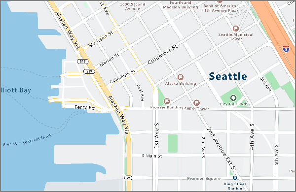

# <a name="what-is-azure-maps"></a>Wat is Azure Maps?

Azure Maps is een verzameling georuimtelijke services die wordt ondersteund door de nieuwste kaartgegevens die beschikbaar zijn en uw webtoepassingen en mobiele toepassingen van een nauwkeurige geografische context voorzien. Azure Maps bestaat uit REST-API's voor het weergeven van **kaarten** met verschillende stijlen en satellietbeeldmateriaal, **zoeken** naar adressen, plaatsen en bezienswaardigheden over de hele wereld; **routes** van punt naar punt, meerdere punten, optimalisatie van meerdere punten, isochronen, commerciële voertuigen, beïnvloed door verkeer en matrixroutes; weergeven van de beste verkeersstroom en incidenten; achterhalen van de locatie van de gebruiker via **geolocatie**; en de locatie converteren naar **tijdzones**, evenals het ophalen van de tijd op een locatie. Bovendien biedt Azure Maps services voor **geofencing**, opslag van **kaartgegevens** - hosten van locatiegegevens in Azure; en **ruimtelijke bewerkingen**, die locatie-informatie bieden via georuimtelijke analyses. Azure Maps-services zijn rechtstreeks beschikbaar als REST-API's of via onze robuuste **Web SDK** of **Android SDK**. Met deze hulpprogramma's kunnen ontwikkelaars snel oplossingen ontwikkelen en schalen waarmee locatiegegevens vanuit de Azure-cloud worden geïntegreerd in Azure-oplossingen. Meld u nu aan voor een gratis [Azure Maps-account](https://azure.microsoft.com/services/azure-maps/) en begin met ontwikkelen!

In de volgende video wordt Azure Maps in detail uitgelegd:

<iframe src="https://channel9.msdn.com/Shows/Azure-Friday/Azure-Location-Based-Services/player" width="960" height="540" allowFullScreen frameBorder="0"></iframe>

## <a name="map-controls"></a>Kaartbesturingselementen

### <a name="web-control"></a>Webbesturingselement

Met het Azure Maps-webbesturingselement kunt u interactieve kaarten aanpassen met uw eigen inhoud en beeldmateriaal om weer te geven in uw web- of mobiele toepassingen. Dit besturingselement maakt gebruik van WebGL, zodat u grote gegevenssets kunt weergeven met hoge prestaties. Ontwikkel met het besturingselement met behulp van JavaScript of TypeScript.


## <a name="services-in-azure-maps"></a>Services in Azure Maps

Azure Maps bestaat uit de volgende zes services die uw Azure-toepassingen van geografische context kunnen voorzien.

### <a name="render-service"></a>Service voor rendering

De Render Service is ontworpen voor ontwikkelaars zodat zij webtoepassingen en mobiele toepassingen kunnen maken voor het maken van kaarten. De service maakt gebruik van een raster met grafische afbeeldingen van hoge kwaliteit, beschikbaar in 19 zoomniveaus, of volledig aanpasbare kaartafbeeldingen in een vectorindeling.



De Render Service biedt nu preview-API's die ontwikkelaars met satellietbeelden laten werken. Lees de pagina [Render-API's voor Azure Maps](https://docs.microsoft.com/rest/api/maps/render) voor meer informatie.

### <a name="route-service"></a>Routeservice

De Route Service bevat robuuste geometrische berekeningen voor de infrastructuur in de echte wereld en routebeschrijvingen voor meerdere manieren van reizen. Met de service kunnen ontwikkelaars richtingen berekenen voor een aantal manieren van reizen, zoals met de auto, vrachtwagen, fiets of wandelen. In de service kan ook rekening worden gehouden met invoerwaarden voor verkeersomstandigheden, gewichtsbeperkingen of transport van gevaarlijke stoffen.


De Route Service biedt nu een preview voor geavanceerde functies, zoals batchverwerking van meerdere aanvragen voor routes, matrices voor de reistijd en afstand tussen een set met herkomsten en bestemmingen, en het vinden van routes of afstanden die u kunt afleggen op basis van de tijd die u hebt of van de benodigde hoeveelheid brandstof. Lees de pagina [Routering-API’s voor Azure Maps](https://docs.microsoft.com/rest/api/maps/route) voor meer informatie over de routeringsmogelijkheden.

### <a name="search-service"></a>Zoekservice

De Search Service is ontworpen voor ontwikkelaars zodat zij naar adressen, plaatsen, bedrijfsvermeldingen op naam of categorie, en andere geografische informatie kunnen zoeken. Met de Search Service kan ook [de geocode worden omgekeerd](https://en.wikipedia.org/wiki/Reverse_geocoding) voor adressen en dwarsstraten op basis van breedte- en lengtegraden.


De Search Service biedt ook geavanceerde functies, zoals zoeken langs een route, zoeken binnen een groter gebied, een groep zoekaanvragen samenvoegen tot een batch en zoeken naar een groter gebied in plaats van naar een specifieke locatie. Er zijn momenteel preview-versies beschikbaar van API’s voor zoeken in batches en zoeken naar gebieden. Lees de pagina [Zoek-API's voor Azure Maps](https://docs.microsoft.com/rest/api/maps/search) voor meer informatie over de zoekmogelijkheden.

### <a name="time-zone-service"></a>Time Zone Service

Met de Time Zone Service kunt u actuele, historische en toekomstige tijdzonegegevens opvragen met behulp van breedtegraad/lengtegraad-combinaties of een [IANA-id](https://www.iana.org/). Met de Time Zone service kunnen ook id’s voor Microsoft Windows-tijdzones worden geconverteerd naar IANA-tijdzones, door een tijdzoneverschil naar UTC op te halen en de huidige tijd op te halen in een respectieve tijdzone. Een typisch JSON-antwoord voor een query in de Time Zone service ziet er als volgt uit:

```JSON
{
    "Version": "2017c",
    "ReferenceUtcTimestamp": "2017-11-20T23:09:48.686173Z",
    "TimeZones": [{
        "Id": "America/Los_Angeles",
        "ReferenceTime": {
            "Tag": "PST",
            "StandardOffset": "-08:00:00",
            "DaylightSavings": "00:00:00",
            "WallTime": "2017-11-20T15:09:48.686173-08:00",
            "PosixTzValidYear": 2017,
            "PosixTz": "PST+8PDT,M3.2.0,M11.1.0"
        }
    }]
}
```

Ga naar de pagina [Tijdzone-API’s voor Azure Maps](https://docs.microsoft.com/rest/api/maps/timezone) voor meer informatie over deze service.

### <a name="traffic-service"></a>Verkeersservice

De Traffic Service is een suite met webservices die is ontworpen voor ontwikkelaars zodat zij webtoepassingen en mobiele toepassingen kunnen maken die te maken hebben met verkeer. De service omvat twee gegevenstypen:

* Verkeersstroom - waargenomen snelheden en reistijden in realtime voor alle belangrijke wegen in het netwerk.
* Verkeersincidenten - een nauwkeurige weergave van files en incidenten op het wegennet.


Ga naar de pagina [Verkeers-API’s voor Azure Maps](https://docs.microsoft.com/rest/api/maps/traffic) voor meer informatie.

### <a name="ip-to-location"></a>IP-adres naar locatie

Met de IP van de locatie-service krijgt u een voorbeeld van het opgehaalde tweeletterige landnummer voor een bepaald IP-adres. Deze service kan u helpen om de gebruikerservaring aan te passen en te verbeteren door het inschakelen van aangepaste toepassingsinhoud op basis van geografische locatie.

Raadpleeg de pagina [Azure Maps Geoloctatie-API's](https://docs.microsoft.com/rest/api/maps/geolocation) voor informatie over de REST API's voor IP-naar-locatie-service.

## <a name="programming-model"></a>Programmeermodel

Azure Maps is gebouwd voor mobiliteit en kan platformoverschrijdende toepassingen aansturen. Het maakt gebruik van een programmeermodel dat taalonafhankelijk is en dat JSON-uitvoer ondersteunt door middel van [REST API's](https://docs.microsoft.com/rest/api/maps/).

Bovendien biedt Azure Maps een handig [kaartbesturingselement in JavaScript](https://docs.microsoft.com/javascript/api/azure-maps-control) met een eenvoudig programmeermodel voor het snel en gemakkelijk ontwikkelen van webtoepassingen en mobiele toepassingen.

## <a name="usage"></a>Gebruik

Voor toegang tot de services van Azure Maps gaat u naar [Azure Portal](https://portal.azure.com) en maakt u een Azure Maps-account.

Azure Maps maakt gebruik van een verificatieschema op basis van sleutels. Uw account wordt geleverd met twee sleutels die vooraf voor u zijn gegenereerd. U kunt deze locatiemogelijkheden direct integreren in uw toepassing met behulp van een van de sleutels en een aanvraag aan de Azure Maps-service te maken.

## <a name="supported-regions"></a>Ondersteunde regio’s

De Azure Maps-API is momenteel wereldwijd beschikbaar, met uitzondering van de volgende landen/regio's:

* Argentinië
* China
* India
* Marokko
* Pakistan
* Zuid-Korea

Verifieer of de locatie van uw IP-adres niet in een van de bovenstaande landen is, die niet worden ondersteund.

## <a name="next-steps"></a>Volgende stappen

Meer informatie over de nieuwe functies van Azure Maps:

> [!div class="nextstepaction"]
> [Routematrix, isochronen, IP opzoeken en meer](https://azure.microsoft.com/blog/route-matrix-isochrones-ip-lookup-and-more-added-to-azure-maps/)

U kunt een voorbeeld-app met de service uitproberen:

> [!div class="nextstepaction"]
> [Demo van interactief zoeken naar kaarten starten](quick-demo-map-app.md)
