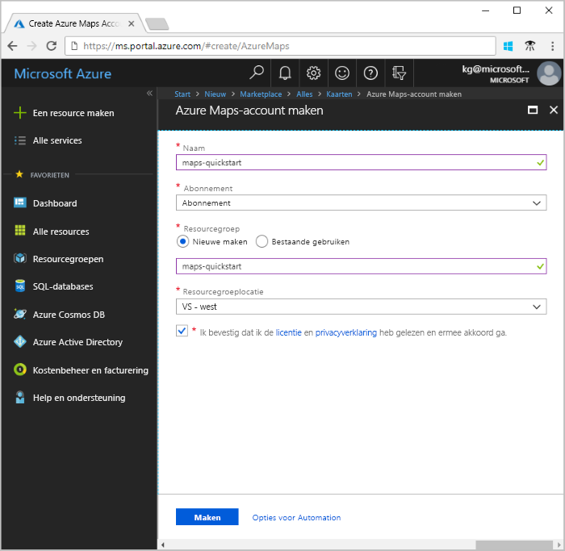
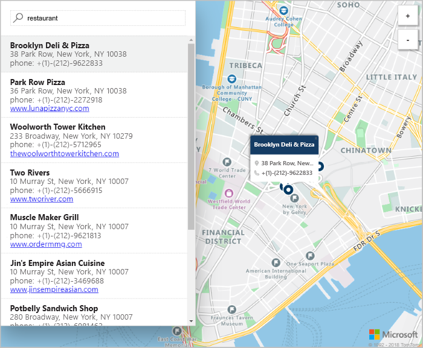

# Een interactief doorzoekbare kaart maken met Azure Maps

In dit artikel wordt gedemonstreerd hoe u een kaart maakt met Azure Maps om gebruikers een interactieve zoekervaring te bieden. U wordt door de volgende basisstappen geleid:
* Uw eigen Azure Maps-account maken.
* Uw accountsleutel ophalen om te gebruiken in de demo-webtoepassing.

Als u nog geen abonnement op Azure hebt, maak dan een [gratis account](https://azure.microsoft.com/free/?WT.mc_id=A261C142F) aan voordat u begint.

## Aanmelden bij Azure Portal

Meld u aan bij [Azure Portal](https://portal.azure.com/).

## Een account maken en de sleutel ophalen

1. Selecteer in de linkerbovenhoek van de [Azure-portal](https://portal.azure.com) **Een resource maken**.
2. Voer **Maps** in in het vak **Marketplace doorzoeken**.
3. Selecteer **Toewijzingen** in de **Resultaten**. Selecteer de knop **Maken** die onder de kaart wordt weergegeven.
4. Voer de volgende waarden in op de pagina **Azure Maps-account maken**:
   - De **Naam** van uw nieuwe account.
   - Het **Abonnement** dat u wilt gebruiken voor dit account.
   - De **Resourcegroep** voor dit account. U kunt kiezen of u een **Nieuwe** of **Bestaande** resourcegroep wilt gebruiken.
   - Selecteer de gewenste **prijscategorie**.
   - Lees de **Licentie** en **Privacyverklaring**. Schakel het selectievakje in om de voorwaarden te accepteren.
   - Selecteer tot slot de knop **Maken**.

     

5. Nadat uw account is gemaakt, opent u het account en zoekt u de sectie Instellingen van het accountmenu. Selecteer **Sleutels** om de primaire en secundaire sleutel voor uw Azure Maps-account weer te geven. Kopieer de waarde van de **Primaire sleutel** naar uw lokale klembord voor gebruik in de volgende sectie.

## De toepassing downloaden

1. Download of kopieer de inhoud van het bestand [interactiveSearch.html](https://github.com/Azure-Samples/AzureMapsCodeSamples/blob/master/AzureMapsCodeSamples/Tutorials/interactiveSearch.html).
2. Sla de inhoud van dit bestand lokaal op als **AzureMapDemo.html**. Open het in een teksteditor.
3. Zoek naar de tekenreeks `<insert-key>`. Vervang deze door de waarde van de **primaire sleutel** uit de voorgaande sectie.

## De toepassing openen

1. Open het bestand **AzureMapDemo.html** in een browser naar keuze.
2. Bekijk de kaart van Los Angeles. Zoom in en uit om te zien hoe de kaart automatisch met meer of minder informatie wordt weergegeven, afhankelijk van het zoomniveau. 
3. Wijzig de standaardinstelling voor het midden van de kaart. Zoek in het bestand **AzureMapDemo.html** naar de variabele **center**. Vervang de lengte- en breedtegraad voor deze variabele door deze nieuwe waarden: **[-74.0060, 40.7128]**. Sla het bestand op en vernieuw de browser.
4. Probeer de interactieve zoekervaring uit. Zoek in het zoekvak linksboven in de demo-webtoepassing naar **restaurants**.
5. Beweeg de muis over de lijst met adressen en locaties die worden weergegeven onder het zoekvak. U ziet hoe bij de bijbehorende speld op de kaart een pop-upvenster met informatie over die locatie wordt weergegeven. Ten behoeve van de privacy van particuliere bedrijven worden er fictieve namen en adressen weergegeven.

    

## Resources opschonen

In de zelfstudies vindt u gedetailleerde informatie over het gebruik en de configuratie van Azure Maps met uw account. Als u wilt doorgaan met de zelfstudies, verwijder de resources die u in deze quickstart hebt gemaakt dan niet. Als u niet van plan bent om door te gaan, voert u deze stappen uit voor het opschonen van de resources:

1. Sluit de browser waarin de **AzureMapDemo.html**-webtoepassing wordt uitgevoerd.
2. Selecteer in het linker menu van de Azure-portal de optie **Alle resources**. Selecteer vervolgens uw Azure Maps-account. Selecteer bovenaan de blade **Alle resources** de optie **Verwijderen**.

## Volgende stappen

In deze quickstart hebt u een Azure Maps-account gemaakt en een demo-toepassing gemaakt. Als u meer informatie wilt over het maken van uw eigen toepassing met behulp van de Azure Maps-API's, gaat u verder met de volgende zelfstudie:

> [!div class="nextstepaction"]
> [Zoeken naar nuttige plaatsen in de buurt met behulp van Azure Maps](./tutorial-search-location.md)

Bekijk de volgende handleidingen voor meer codevoorbeelden en een interactieve coderingservaring:

> [!div class="nextstepaction"]
> [Een adres vinden met behulp van de Azure Maps-zoekservice](./how-to-search-for-address.md)

> [!div class="nextstepaction"]
> [Azure Maps Map Control gebruiken](./how-to-use-map-control.md)
