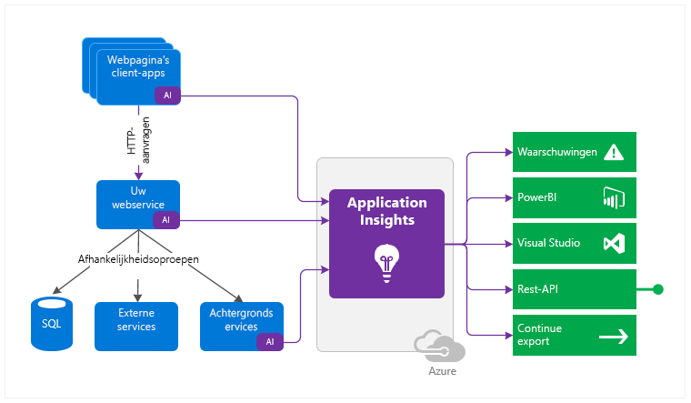
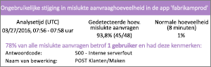
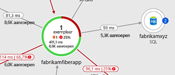
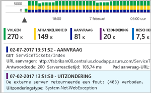
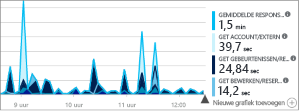
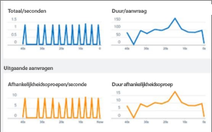
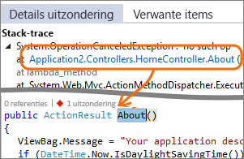
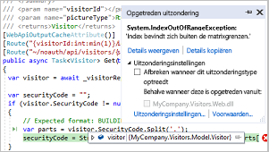
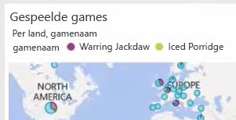
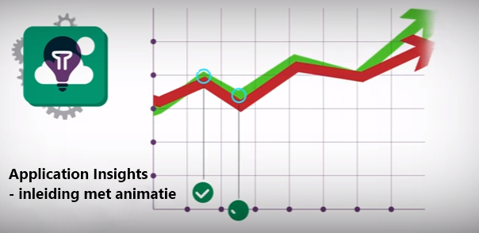

# Wat is Application Insights?
Application Insights is een uitbreidbare APM-service (Application Performance Management) voor webontwikkelaars op meerdere platforms. Hiermee kunt u uw livewebtoepassing controleren. Afwijkende prestaties worden automatisch gedetecteerd. De service bevat krachtige analysehulpmiddelen om u te helpen bij het vaststellen van problemen en te begrijpen wat gebruikers daadwerkelijk doen met uw app.  De service is bedoeld om u te helpen de prestaties en bruikbaarheid van uw apps continu te verbeteren. Het werkt voor apps op uiteenlopende platforms, waaronder .NET, Node.js en Java EE, on-premises, of in een hybride of openbare cloud gehost. De service kan ook worden geïntegreerd met uw DevOps-proces en bevat verbindingspunten naar verschillende hulpmiddelen voor ontwikkelaars. Gebruik de service voor het controleren en analyseren van telemetrie van mobiele apps door Application Insights te integreren met Visual Studio App Center.

[Bekijk het introductiefilmpje](https://www.youtube.com/watch?v=fX2NtGrh-Y0).

## Hoe werkt Application Insights?
U installeert een klein instrumentatiepakket in uw toepassing en u stelt een Application Insights-resource in de Microsoft Azure Portal in. Met dit instrumentatiepakket wordt uw app gecontroleerd en worden telemetriegegevens naar de portal verzonden. (De toepassing kan op elke locatie worden uitgevoerd - deze hoeft niet te worden gehost in Azure.)

U kunt niet alleen de webservicetoepassing instrumenteren, maar ook de onderdelen die op de achtergrond worden uitgevoerd en de JavaScript-code van de webpagina's zelf. 

Bovendien kunt u telemetrie ophalen uit de hostomgevingen, zoals gegevens van prestatiemeteritems, diagnostische gegevens van Azure of gegevens uit Docker-logboeken. U kunt ook webtests instellen die periodiek synthetische aanvragen naar uw webservice verzenden.

Al deze telemetrie-gegevensstromen worden geïntegreerd in de Azure Portal, waar u krachtige analyse- en zoekhulpmiddelen kunt loslaten op de onbewerkte gegevens.

### Wat is de impact?
De impact op de prestaties van uw app is erg klein. De aanroepen voor het bijhouden van het appgebruik blokkeren uw app niet en worden batchgewijs in een afzonderlijke thread verzonden.

## Wat wordt er door Application Insights gecontroleerd?

Application Insights is bedoeld voor het ontwikkelingsteam en helpt u om te begrijpen hoe de app presteert en op welke manier de app wordt gebruikt. Met deze service kunt u het volgende controleren:

* **Aantal aanvragen, reactietijden en foutpercentages** - ga na welke pagina's het populairst zijn op welke tijdstippen van de dag en waar uw gebruikers zich bevinden. Ontdek welke pagina's het beste presteren. Als uw reactietijden en foutpercentages omhoog gaan wanneer er meer aanvragen binnenkomen, hebt u mogelijk te weinig resources. 
* **Aantal afhankelijkheidsrelaties, reactietijden en foutpercentages** - controleer of externe services zorgen voor vertraging.
* **Uitzonderingen** - analyseer de cumulatieve statistische gegevens of kies specifieke gegevens en zoom in op de stack-trace en verwante aanvragen. Zowel server- als browseruitzonderingen worden gerapporteerd.
* **Paginaweergaven en de prestaties bij het laden van pagina’s** - deze gegevens worden gerapporteerd door de browsers van uw gebruikers.
* **AJAX-aanroepen** van webpagina's - ga na wat het aantal aanroepen, de reactietijden en de foutpercentages zijn.
* **Aantal gebruikers en sessies**.
* **Prestatiemeteritems** van uw Windows- of Linux-servers, zoals die voor CPU-, geheugen- en netwerkgebruik. 
* **Diagnostische gegevens van hosts** van Docker of Azure. 
* **Diagnostische traceerlogboeken** van uw app - met behulp hiervan kunt u de samenhang vaststellen tussen traceergebeurtenissen en aanvragen.
* **Aangepaste gebeurtenissen en functies voor het verzamelen van metrische gegevens** die u zelf schrijft in de client- of servercode - hiermee kunt u zakelijke gebeurtenissen bijhouden, zoals het aantal verkochte artikelen of gewonnen spellen.

## Waar kan ik mijn telemetrie bekijken?

Er zijn tal van manieren om uw gegevens te verkennen. Lees de volgende artikelen:

|  |  |
| --- | --- |
| [**Slimme detectie en handmatige waarschuwingen**](../../azure-monitor/app/proactive-diagnostics.md) De functie die automatische waarschuwingen genereert, kan normale telemetriepatronen van uw app herkennen en wordt geactiveerd wanneer er zich iets voordoet dat buiten het normale patroon valt. U kunt ook [waarschuwingen instellen](../../azure-monitor/app/alerts.md) voor bepaalde niveaus van aangepaste functies of standaardfuncties voor het verzamelen van metrische gegevens. | |
| [**Overzicht van de toepassing**](../../azure-monitor/app/app-map.md) Bekijk de onderdelen van uw app met belangrijke metrische gegevens en waarschuwingen. |  |
| [**Profiler**](../../azure-monitor/app/profiler.md) Inspecteer de uitvoeringsprofielen van voorbeeldaanvragen. | |
| [**Gebruiksanalyse**](../../azure-monitor/app/usage-overview.md) Analyseer de segmentatie en retentie van gebruikers.| |
| [**Diagnostische zoekactie naar gegevens van bepaalde items**](../../azure-monitor/app/diagnostic-search.md) U kunt zoeken naar gebeurtenissen, zoals aanvragen, uitzonderingen, afhankelijkheidsaanroepen, logboektraceringen en paginaweergaven en deze gegevens ook filteren.  | |
| [**Metrics Explorer voor cumulatieve gegevens**](../../azure-monitor/app/metrics-explorer.md) Verken, filter en segmenteer cumulatieve gegevens, zoals aantallen aanvragen, fouten en uitzonderingen, reactietijden en paginalaadtijden. | |
| [**Dashboards**](../../azure-monitor/app/app-insights-dashboards.md#dashboards) Combineer gegevens van meerdere resources tot een mash-up en deel deze met anderen. Ideaal voor toepassingen met meerdere onderdelen en om continu weer te geven in de teamkamer. | |
| [**Live Metrics Stream**](../../azure-monitor/app/live-stream.md) Wanneer u een nieuwe build implementeert, kunt u kijken naar deze 'near-realtime' prestatie-indicatoren om te controleren of dat alles naar verwachting werkt. | |
| [**Analytics**](../../azure-monitor/app/analytics.md) Beantwoord moeilijke vragen over de prestaties en het gebruik van uw app met behulp van deze krachtige querytaal. | |
| [**Visual Studio**](../../azure-monitor/app/visual-studio.md) Bekijk prestatiegegevens in de code. Ga naar de code vanuit stack-traces.| |
| [**Snapshot Debugger**](../../azure-monitor/app/snapshot-debugger.md) Spoor fouten op in momentopnamen van live activiteiten, inclusief parameterwaarden.| |
| [**Power BI**](../../azure-monitor/app/export-power-bi.md ) Integreer metrische gegevens over het gebruik van de toepassing met andere business intelligence.| |
| [**REST API**](https://dev.applicationinsights.io/) Schrijf code voor het uitvoeren van query's op uw functies voor het verzamelen van metrische gegevens en op onbewerkte gegevens.|  |
| [**Continue export**](../../azure-monitor/app/export-telemetry.md) Exporteer onbewerkte gegevens bulksgewijs naar de opslag zodra de gegevens binnenkomen. | |

## Hoe kan ik Application Insights gebruiken?

### Controleren
Installeer Application Insights in uw app, stel de [beschikbaarheidswebtests](../../azure-monitor/app/monitor-web-app-availability.md) in en ga als volgt te werk:

* Stel een [dashboard](../../azure-monitor/app/app-insights-dashboards.md) in voor uw teamkamer om de laadtijd, reactiesnelheid en prestaties van uw afhankelijkheden, paginalaadacties en AJAX-aanroepen in de gaten te houden.
* Ga na welke aanvragen het langzaamst worden verwerkt en de meeste fouten vertonen.
* Bekijk [Live Stream](../../azure-monitor/app/live-stream.md) wanneer u een nieuwe release implementeert, zodat u onmiddellijk op de hoogte bent van een eventuele afname van de prestaties.

### Fouten detecteren en een diagnose stellen
Ga als volgt te werk als u een waarschuwing ontvangt of een probleem detecteert:

* Beoordeel hoeveel gebruikers last hebben van het probleem.
* Ga na of er een verband is tussen fouten en uitzonderingen, afhankelijkheidsaanroepen en traceringen.
* Bekijk de informatie van Profiler, momentopnamen, stackdumps en traceerlogboeken.

### Meten is weten
[Meet de effectiviteit](../../azure-monitor/app/usage-overview.md) van elke nieuwe functie die u implementeert.

* Maak plannen om te meten hoe klanten de nieuwe gebruikerservaring of zakelijke functies gebruiken.
* Schrijf aangepaste telemetrie in uw code.
* Baseer de volgende ontwikkelingscyclus op de harde bewijzen die uw telemetrie u bieden.

## Aan de slag
Application Insights is een van de vele services die worden gehost binnen Microsoft Azure en telemetrie wordt naar deze service verzonden om te worden geanalyseerd en gepresenteerd. Dus voor u aan de slag kunt gaan, hebt u eerst een abonnement op [Microsoft Azure](https://azure.com) nodig. U kunt zich gratis aanmelden en als u kiest voor het basis[prijsplan](https://azure.microsoft.com/pricing/details/application-insights/) van Application Insights, hebt u geen kosten totdat het gebruik van uw toepassing zodanig is toegenomen dat er sprake is van substantieel gebruik. Als uw organisatie al een abonnement heeft, kan uw Microsoft-account aan dat abonnement worden toegevoegd.

Er zijn verschillende manieren om van start te gaan. Begin op de manier die voor u het beste werkt. U kunt later ook andere manieren gebruiken.

* **Tijdens runtime: instrumenteer uw web-app op de server.** Hiermee voorkomt u dat u updates moet uitvoeren op de code. U hebt moet beheerderstoegang tot uw server hebben.
  * [**IIS on-premises of op een VM**](../../azure-monitor/app/monitor-performance-live-website-now.md)
  * [**Azure web-app of VM**](../../azure-monitor/app/monitor-performance-live-website-now.md)
* **Tijdens het ontwikkelen: voeg Application Insights toe aan uw code.** Dit stelt u in staat om aangepaste telemetrie te schrijven en om back-end- en desktop-apps te instrumenteren.
  * [Visual Studio](../../azure-monitor/app/asp-net.md) 2013 update 2 of hoger.
  * [Java](../../azure-monitor/app/java-get-started.md)
  * [Node.js](../../azure-monitor/app/nodejs.md)
  * [Andere platforms](../../azure-monitor/app/platforms.md)
* **[Instrumenteer uw webpagina’s](../../azure-monitor/app/javascript.md)** voor paginaweergaven, AJAX-aanroepen en andere telemetrie op de clientzijde.
* **[Analyseer het gebruik van uw mobiele app](../../azure-monitor/learn/mobile-center-quickstart.md)** door de service te integreren met Visual Studio App Center.
* **[Beschikbaarheidstests](../../azure-monitor/app/monitor-web-app-availability.md)** - ping uw website regelmatig vanaf onze servers.

## Volgende stappen
Gebruik tijdens runtime:

* [IIS-server](../../azure-monitor/app/monitor-performance-live-website-now.md)

Gebruik tijdens het ontwikkelen:

* [ASP.NET](../../azure-monitor/app/asp-net.md)
* [Java](../../azure-monitor/app/java-get-started.md)
* [Node.js](../../azure-monitor/app/nodejs.md)

## Ondersteuning en feedback
* Vragen en problemen:
  * [Problemen oplossen][qna]
  * [MSDN-forum](https://social.msdn.microsoft.com/Forums/vstudio/home?forum=ApplicationInsights)
  * [StackOverflow](https://stackoverflow.com/questions/tagged/ms-application-insights)
* Uw suggesties:
  * [UserVoice](https://feedback.azure.com/forums/357324-application-insights/filters/top)
* Blog:
  * [Application Insights-blog](https://azure.microsoft.com/blog/tag/application-insights)

## Video's

> [!VIDEO https://channel9.msdn.com/events/Connect/2016/100/player] 

<!--Link references-->

[android]: ../../azure-monitor/learn/mobile-center-quickstart.md
[azure]: ../../insights-perf-analytics.md
[client]: ../../azure-monitor/app/javascript.md
[desktop]: ../../azure-monitor/app/windows-desktop.md
[detect]: ../../azure-monitor/app/detect-triage-diagnose.md
[greenbrown]: ../../azure-monitor/app/asp-net.md
[ios]: ../../azure-monitor/learn/mobile-center-quickstart.md
[java]: ../../azure-monitor/app/java-get-started.md
[knowUsers]: app-insights-web-track-usage.md
[platforms]: ../../azure-monitor/app/platforms.md
[portal]: https://portal.azure.com/
[qna]: ../../azure-monitor/app/troubleshoot-faq.md
[redfield]: ../../azure-monitor/app/monitor-performance-live-website-now.md
