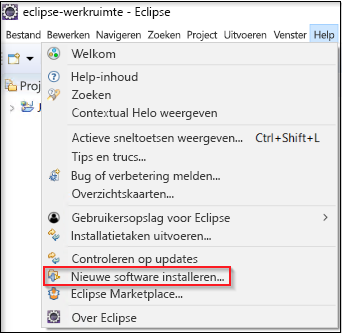
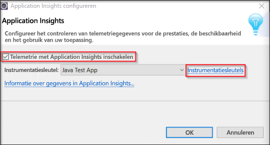

# <a name="start-monitoring-your-java-web-application"></a>Beginnen met controleren van de Java-webtoepassing

Met Azure Application Insights kunt u eenvoudig de beschikbaarheid, de prestaties en het gebruik van een webtoepassing controleren. U kunt ook snel fouten in de toepassing identificeren en er een diagnose voor uitvoeren, zonder dat u hoeft te wachten totdat een gebruiker ze heeft gerapporteerd. Met de Application Insights Java SDK kunt u de algemene pakketten van derden controleren, inclusief MongoDB, MySQL en Redis.

Deze snelstartgids helpt u de Application Insights SDK toe te voegen aan een bestaand Java Dynamic-webproject.

## <a name="prerequisites"></a>Vereisten

Dit zijn de vereisten voor het voltooien van deze snelstart:

- JRE 1.7 of 1.8 installeren
- [Gratis Eclipse IDE voor Java EE-ontwikkelaars](https://www.eclipse.org/downloads/) installeren. In deze snelstartgids wordt gebruikgemaakt van Eclipse Oxygen (4.7)
- U hebt een Azure-abonnement en een bestaand Java Dynamic-webproject nodig
 
Als u geen Java Dynamic-webproject hebt, kunt u er een maken met behulp van de [snelstartgids Een Java-web-app maken](https://docs.microsoft.com/azure/app-service-web/app-service-web-get-started-java).

Als u nog geen Azure-abonnement hebt, maakt u een [gratis account](https://azure.microsoft.com/free/) voordat u begint.

Als u liever de Spring-framework, de [configureren van een Spring Boot-initialisatie-app voor het gebruik van Application Insights-handleiding](https://docs.microsoft.com/java/azure/spring-framework/configure-spring-boot-java-applicationinsights)

## <a name="sign-in-to-the-azure-portal"></a>Aanmelden bij Azure Portal

Meld u aan bij [Azure Portal](https://portal.azure.com/).

## <a name="enable-application-insights"></a>Application Insights inschakelen

Met Application Insights kunnen telemetriegegevens worden verzameld vanuit elke toepassing met een internetverbinding, ongeacht of deze on-premises wordt uitgevoerd of in de cloud. Gebruik de volgende stappen om deze gegevens te bekijken.

1. Selecteer **Een resource maken** > **Hulpprogramma's voor ontwikkelaars** > **Application Insights**.

   

   

   Er wordt een configuratiescherm weergegeven. Gebruik de volgende tabel om de invoervelden in te vullen.

    | Instellingen        | Waarde           | Beschrijving  |
   | ------------- |:-------------|:-----|
   | **Naam**      | Globaal unieke waarde | Naam die de app beschrijft die u wilt controleren |
   | **Toepassingstype** | Java-webtoepassing | Type app dat u wilt controleren |
   | **Resourcegroep**     | myResourceGroup      | Naam voor de nieuwe resourcegroep waarin App Insights-gegevens worden gehost |
   | **Locatie** | US - oost | Kies een locatie in uw buurt of in de buurt van waar de app wordt gehost |

2. Klik op **Create**.

## <a name="install-app-insights-plugin"></a>App Insights-invoegtoepassing installeren

1. Start **Eclipse** > Klik op **Help** > Selecteer **Nieuwe software installeren**.

   

2. Kopieer ```https://dl.microsoft.com/eclipse``` in het veld Werken met > Schakel **Azure-toolkit voor Java** in > Selecteer **Application Insights-invoegtoepassing voor Java** > **Schakel** de optie uit voor het contact opnemen met alle updatesites tijdens de installatie om de vereiste software te vinden.

3. Zodra de installatie is voltooid, wordt u gevraagd om **Eclipse opnieuw te starten**.

## <a name="configure-app-insights-plugin"></a>App Insights-invoegtoepassing configureren

1. Start **Eclipse** > Open uw **project** > Klik met de rechtermuisknop op de projectnaam in **Projectverkenner** > Selecteer **Azure** > Klik op **Aanmelden**.

2. Selecteer de verificatiemethode **Interactief** > Klik op **Aanmelden** > Voer uw **Azure-referenties** in wanneer u hierom wordt gevraagd > Selecteer uw **Azure-abonnement**.

3. Klik met de rechtermuisknop op de naam van uw project in **Projectverkenner** > Selecteer **Azure** > Klik op **Application Insights configureren**.

4. Schakel **Telemetrie met Application Insights inschakelen** in > Selecteer de App Insights-resource en bijbehorende **Instrumentatiesleutel** die u wilt koppelen aan de Java-app.

   

5. Na het configureren van de Application Insights-invoegtoepassing, moet u uw toepassing opnieuw [publiceren](https://docs.microsoft.com/azure/app-service/app-service-web-get-started-java#deploy-the-app), voordat deze telemetrie kan gaan verzenden.

> [!NOTE]
> Met de Application Insights SDK voor Java kunt u live metrische gegevens vastleggen en visualiseren. Als u het verzamelen van telemetriegegevens de eerste keer inschakelt, kan het echter enkele minuten duren voordat deze worden weergegeven in de portal. Let op: als deze app een test-app met weinig verkeer is, worden de meeste metrische gegevens alleen vastgelegd bij actieve aanvragen en bewerkingen.

## <a name="start-monitoring-in-the-azure-portal"></a>Beginnen met controleren in Azure Portal

1. U kunt nu opnieuw openen met de Application Insights **overzicht** pagina in de Azure portal om weer te geven details over de toepassing die momenteel wordt uitgevoerd.

   

2. Klik op **Toepassingsoverzicht** voor een visueel overzicht van de afhankelijkheidsrelaties tussen de onderdelen van de toepassing. Voor elk onderdeel worden KPI's weergegeven, zoals belasting, prestaties, fouten en waarschuwingen.

   

3.  Klik op de **Appanalyses** pictogram  **weergeven in Analytics**.  Hierdoor wordt **Application Insights Analytics** geopend. Dit biedt een querytaal met opmaak voor het analyseren van alle gegevens die zijn verzameld met Application Insights. In dit geval wordt er een query gegenereerd waarmee het aantal aanvragen wordt weergegeven als een grafiek. U kunt uw eigen query's schrijven om andere gegevens te analyseren.

   

4. Ga terug naar de pagina **Overzicht** en bekijk de KPI-grafieken. Dit dashboard biedt statistische gegevens over de toepassingsstatus, waaronder het aantal inkomende aanvragen, de duur van deze aanvragen en eventuele fouten die optreden.

   

   Als u de grafiek **Laadtijd voor paginaweergave** wilt vullen met **telemetriegegevens aan de clientzijde**, voegt u dit script toe aan elke pagina die u wilt bijhouden:

   ```HTML
   <!-- 
   To collect user behavior analytics about your application, 
   insert the following script into each page you want to track.
   Place this code immediately before the closing </head> tag,
   and before any other scripts. Your first data will appear 
   automatically in just a few seconds.
   -->
   <script type="text/javascript">
     var appInsights=window.appInsights||function(config){
     function i(config){t[config]=function(){var i=arguments;t.queue.push(function(){t[config].apply(t,i)})}}var t={config:config},u=document,e=window,o="script",s="AuthenticatedUserContext",h="start",c="stop",l="Track",a=l+"Event",v=l+"Page",y=u.createElement(o),r,f;y.src=config.url||"https://az416426.vo.msecnd.net/scripts/a/ai.0.js";u.getElementsByTagName(o)[0].parentNode.appendChild(y);try{t.cookie=u.cookie}catch(p){}for(t.queue=[],t.version="1.0",r=["Event","Exception","Metric","PageView","Trace","Dependency"];r.length;)i("track"+r.pop());return i("set"+s),i("clear"+s),i(h+a),i(c+a),i(h+v),i(c+v),i("flush"),config.disableExceptionTracking||(r="onerror",i("_"+r),f=e[r],e[r]=function(config,i,u,e,o){var s=f&&f(config,i,u,e,o);return s!==!0&&t["_"+r](config,i,u,e,o),s}),t
    }({
        instrumentationKey:"<instrumentation key>"
    });

    window.appInsights=appInsights;
    appInsights.trackPageView();
   </script>
    ```

5. Klik op **Live Stream**. Hier vindt u live metrische gegevens die betrekking hebben op de prestaties van de Java-web-app. **Live Metrics Stream** bevat gegevens die betrekking hebben op het aantal inkomende aanvragen, de duur van deze aanvragen en eventuele fouten die optreden. U kunt ook in realtime de kritieke prestatiegegevens controleren, zoals de processor en het geheugen.

   

Bekijk de [extra Java-documentatie voor App Insights](./../../azure-monitor/app/java-get-started.md) voor meer informatie over het controleren van Java.

## <a name="clean-up-resources"></a>Resources opschonen

Wanneer u klaar bent met testen, kunt u de resourcegroep verwijderen en alle gerelateerde resources. Om te dus de volgende stappen.

1. Klik in het menu links in Azure Portal op **Resourcegroepen** en klik vervolgens op **myResourceGroup**.
2. Klik op de pagina van uw resourcegroep op **Verwijderen**, typ **myResourceGroup** in het tekstvak en klik vervolgens op **Verwijderen**.

## <a name="next-steps"></a>Volgende stappen

> [!div class="nextstepaction"]
> [Prestatieproblemen zoeken en diagnoses uitvoeren](https://docs.microsoft.com/azure/application-insights/app-insights-analytics)