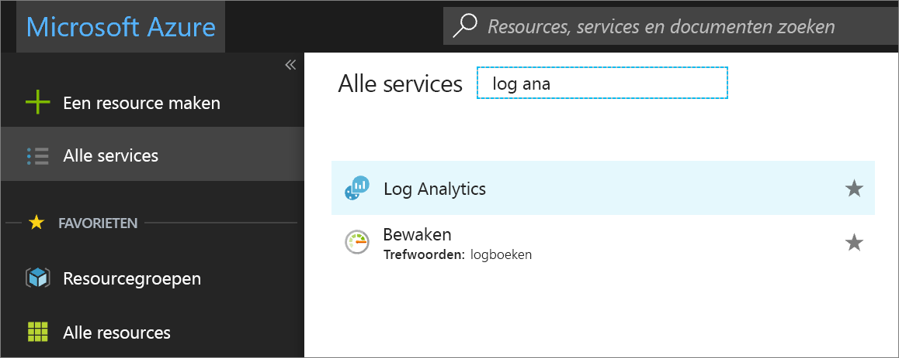
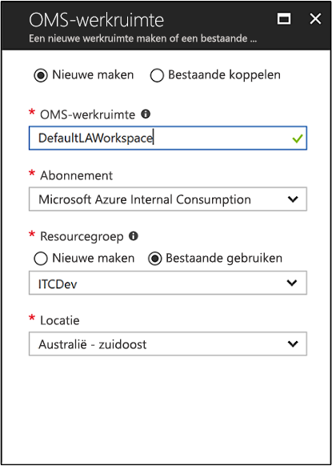
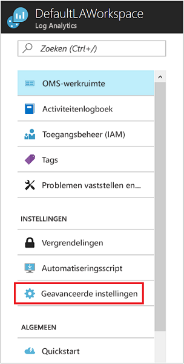
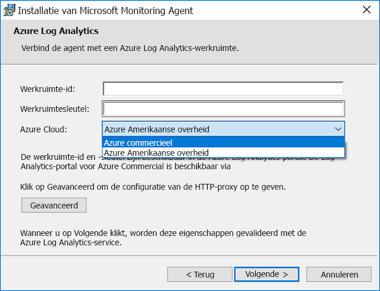
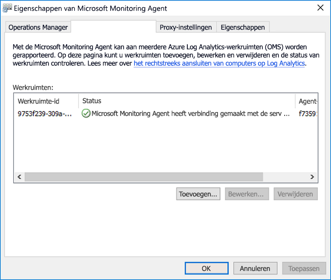
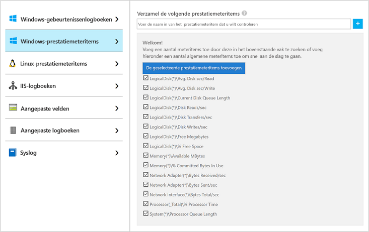
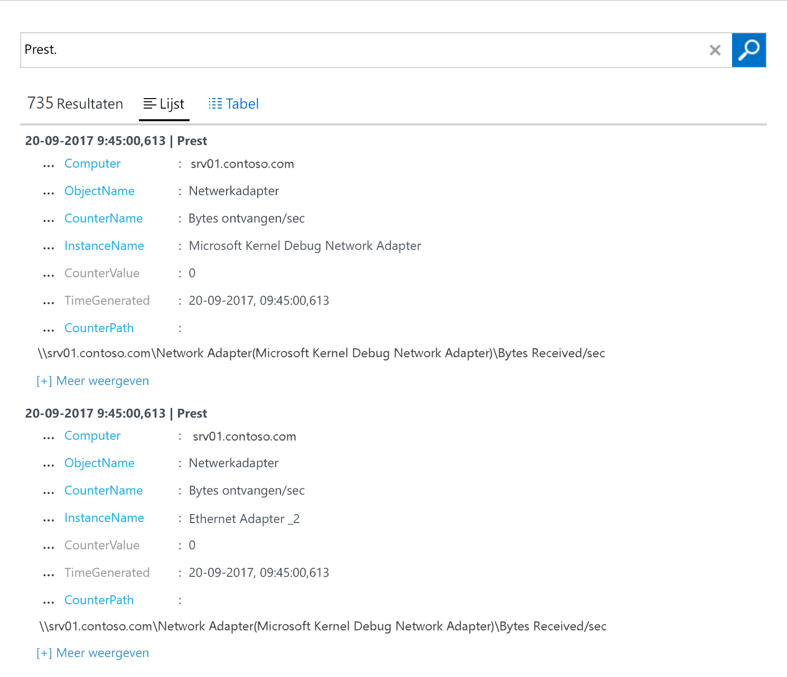
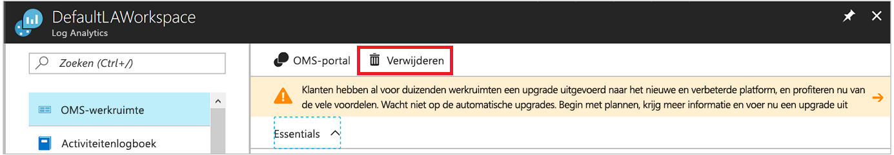

# De Log Analytics-agent voor Windows-computers in een hybride omgeving configureren
[Azure Log Analytics](../../azure-monitor/platform/agent-windows.md) kan gegevens rechtstreeks vanuit uw fysieke of virtuele Windows-computers verzamelen in één opslagplaats voor uitvoerige analyse en correlatie. Log Analytics kan gegevens verzamelen vanuit een datacenter of andere cloudomgeving. In deze quickstart wordt beschreven hoe u met een paar eenvoudige stappen gegevens van uw Windows-computer configureert en verzamelt.  Zie voor meer informatie over Azure Windows VM's [verzamelen van gegevens over Azure virtual machines](../../azure-monitor/learn/quick-collect-azurevm.md).  

Zie voor meer informatie over de ondersteunde configuratie, [ondersteund Windows-besturingssystemen](../../azure-monitor/platform/log-analytics-agent.md#supported-windows-operating-systems) en [firewall netwerkconfiguratie](../../azure-monitor/platform/log-analytics-agent.md#network-firewall-requirements).
 
Als u nog geen abonnement op Azure hebt, maak dan een [gratis account](https://azure.microsoft.com/free/?WT.mc_id=A261C142F) aan voordat u begint.

## Aanmelden bij Azure Portal
Meld u aan bij de Azure Portal op [https://portal.azure.com](https://portal.azure.com).

## Een werkruimte maken
1. Selecteer in de Azure-portal de optie **Alle services**. Voer in het zoekvak **Log Analytics**. Terwijl u typt, de lijst gefilterd op basis van uw invoer. Selecteer **Log Analytics**:

    
  
2. Selecteer **maken**, en geef vervolgens de volgende gegevens:

   * Voer een naam voor de nieuwe **Log Analytics-werkruimte**. Ongeveer als **Standaardlawerkruimte**.
   * Selecteer een **abonnement** om aan te koppelen. Als de standaardwaarde niet die u wilt gebruiken, selecteert u een andere naam in de lijst.
   * Voor de **resourcegroep**, selecteer een bestaande resourcegroep met een of meer virtuele machines van Azure.  
   * Selecteer de **Locatie** waarop uw virtuele machines zijn geïmplementeerd. Hier volgt een lijst van [regio's waarin Log Analytics beschikbaar is](https://azure.microsoft.com/regions/services/).  
   * Als u een werkruimte maakt in een abonnement dat is gemaakt na 2 April 2018, wordt de werkruimte wordt automatisch gebruikt de **Per GB** prijsplan. Kunt u zich niet aan een prijscategorie selecteren. Als u een werkruimte maakt in een abonnement dat u hebt gemaakt vóór 2 April 2018, of in een abonnement dat is gekoppeld aan een bestaande EA-inschrijving, selecteert u de prijscategorie die u wilt gebruiken. Zie de [Log Analytics prijsinformatie](https://azure.microsoft.com/pricing/details/log-analytics/) voor informatie over Prijscategorieën.

           

3. Na het opgeven van de vereiste gegevens in de **Log Analytics-werkruimte** venster **OK**.  

Hoewel de informatie wordt gecontroleerd en de werkruimte wordt gemaakt, u kunt de voortgang volgen onder **meldingen** in het menu.

## De werkruimte-ID en sleutel ophalen
Voordat u Microsoft Monitoring Agent voor Windows hebt geïnstalleerd, moet u de werkruimte-ID en sleutel voor uw Log Analytics-werkruimte. De wizard setup moet u deze informatie om correct te configureren van de agent en zorg ervoor dat deze kan communiceren met Log Analytics.  

1. Selecteer in de linkerbovenhoek van Azure portal **alle services**. Voer in het zoekvak **Log Analytics**. Terwijl u typt, de lijst gefilterd op basis van uw invoer. Selecteer **Log Analytics**.
2. Selecteer de werkruimte die u eerder hebt gemaakt in uw lijst met Log Analytics-werkruimten. (U mogelijk hebt met de naam het **Standaardlawerkruimte**.)
3. Selecteer **geavanceerde instellingen**:

    
  
4. Selecteer **Verbonden bronnen** en selecteer vervolgens **Windows-servers**.
5. Kopieer de waarden aan de rechterkant van **werkruimte-ID** en **primaire sleutel**. Plak deze in uw favoriete editor.

## De agent voor Windows installeren
De volgende stappen uit installeren en configureren van de agent voor Log Analytics in Azure en Azure Government. De Setup van Microsoft Monitoring Agent-programma gebruikt u de agent installeren op uw computer.

1. Verder te gaan van de voorgaande reeks stappen, de **Windows Servers** weergeeft, schakelt de **Windows-Agent downloaden** versie die u wilt downloaden. Selecteer de juiste versie van de processorarchitectuur van uw Windows-besturingssysteem.
2. Voer Setup uit om de agent op de computer te installeren.
2. Op de pagina **Welkom** selecteert u **Volgende**.
3. Lees de licentie op de pagina **Licentievoorwaarden** en selecteer **Akkoord**.
4. Op de pagina **Doelmap** wijzigt u desgewenst de standaardinstallatiemap en selecteert u **Volgende**.
5. Op de **installatieopties voor Agent** pagina, de agent verbinden met Azure Log Analytics en selecteer vervolgens **volgende**.
6. Op de **Azure Log Analytics** pagina, voert u deze stappen uit:
   1. Plak het **werkruimte-ID** en **Werkruimtesleutel (primaire sleutel)** die u eerder hebt gekopieerd. Als de computer laten bij een Log Analytics-werkruimte in Azure Government rapporteren wilt, selecteert u **Azure US Government** in de **Azure-Cloud** lijst.  
   2. Als de computer met de Log Analytics-service moet communiceren via een proxyserver, selecteert u **Geavanceerd** en geeft u de URL en het poortnummer van de proxyserver op. Als uw proxyserver verificatie is vereist, de gebruikersnaam en wachtwoord invoeren voor verificatie met de proxyserver en selecteer vervolgens **volgende**.  
7. Selecteer **volgende** nadat u de configuratie-instellingen hebt toegevoegd:

    

8. Controleer op de pagina **Gereed om te installeren** uw keuzes en selecteer **Installeren**.
9. Op de **configuratie voltooid** weergeeft, schakelt **voltooien**.

Wanneer de installatie en configuratie is voltooid, wordt Microsoft Monitoring Agent wordt weergegeven in het Configuratiescherm. U kunt de configuratie controleren en verifiëren of de agent is verbonden met Log Analytics. Wanneer de verbinding is gemaakt, op de **Azure Log Analytics** tabblad en de agent wordt dit bericht weergegeven: **De Microsoft Monitoring Agent heeft verbinding gemaakt met de service Microsoft Log Analytics.**   

## Gebeurtenis- en prestatiegegevens verzamelen
Log Analytics kunt verzamelen van gebeurtenissen die u opgeeft in de Windows-gebeurtenislogboek en prestatiemeteritems voor langere termijn analyse en rapportage. Het kan ook een actie ondernemen wanneer er een bepaalde voorwaarde wordt gedetecteerd. Volg deze stappen om eerst het verzamelen van gebeurtenissen uit de Windows-gebeurtenislogboeken en diverse algemene prestatiemeters te configureren.  

1. Selecteer in de linkerbenedenhoek van de Azure-portal **meer services**. Voer in het zoekvak **Log Analytics**. Terwijl u typt, de lijst gefilterd op basis van uw invoer. Selecteer **Log Analytics**.
2. Selecteer **geavanceerde instellingen**:

    
 
3. Selecteer **Gegevens** en selecteer vervolgens **Windows-gebeurtenislogboeken**.  
4. U kunt een gebeurtenislogboek toevoegen door de naam van het logboek te voeren. Voer **System**, en selecteer vervolgens het plusteken (**+**).  
5. Selecteer in de tabel de **fout** en **waarschuwing** dagen per week.
6. Selecteer **opslaan** aan de bovenkant van de pagina.
7. Selecteer **Windows-prestatiemeteritems** om het verzamelen van prestatiemeteritems op een Windows-computer in te schakelen.
8. Wanneer u Windows-prestatiemeteritems voor een nieuwe werkruimte voor logboekanalyse voor het eerst configureert, krijgt u de optie voor het snel verschillende algemene prestatiemeteritems te maken. Elke optie wordt weergegeven, met een selectievakje ernaast:

    .
    
    Selecteer **de geselecteerde prestatiemeteritems toevoegen**. De items die zijn toegevoegd en vooraf ingesteld met een controle-interval van tien seconden.

9. Selecteer **opslaan** aan de bovenkant van de pagina.

## Verzamelde gegevens weergeven
Nu dat u gegevensverzameling hebt ingeschakeld, gaan we een eenvoudige logboekzoekopdracht om te zien van bepaalde gegevens van de doelcomputer te worden uitgevoerd.  

1. Selecteer in de Azure portal, in de geselecteerde werkruimte, de **logboeken** tegel.  
2. Op de **zoeken in logboeken** invoeren in het deelvenster in het queryvak **Perf** en klikt u op **uitvoeren** boven aan de query in:
 
    

    Bijvoorbeeld: de query in deze afbeelding 735 prestatierecords geretourneerd:

    

## Resources opschonen
U kunt de agent verwijderen van uw computer en de Log Analytics-werkruimte verwijderen als u deze niet meer nodig hebt.  

Als u wilt verwijderen van de agent, de volgende stappen uit:

1. Open het Configuratiescherm.
2. Open **Programma's en onderdelen**.
3. In **programma's en onderdelen**, selecteer **Microsoft Monitoring Agent** en selecteer vervolgens **verwijderen**.

Als u wilt verwijderen van de Log Analytics-werkruimte die u eerder hebt gemaakt, selecteert u deze, en selecteer op de pagina voor de resource **verwijderen**:

## Volgende stappen
Nu dat u operationele verzamelt en prestatiegegevens van uw Windows-computer, kunt u gemakkelijk beginnen met verkennen, analyseren en uitvoeren van de gegevens u verzamelt, voor *gratis*.  

Voor informatie over het weergeven en analyseren van de gegevens gaat u verder met de zelfstudie:

> [!div class="nextstepaction"]
> [Gegevens weergeven of analyseren in Log Analytics](tutorial-viewdata.md)
