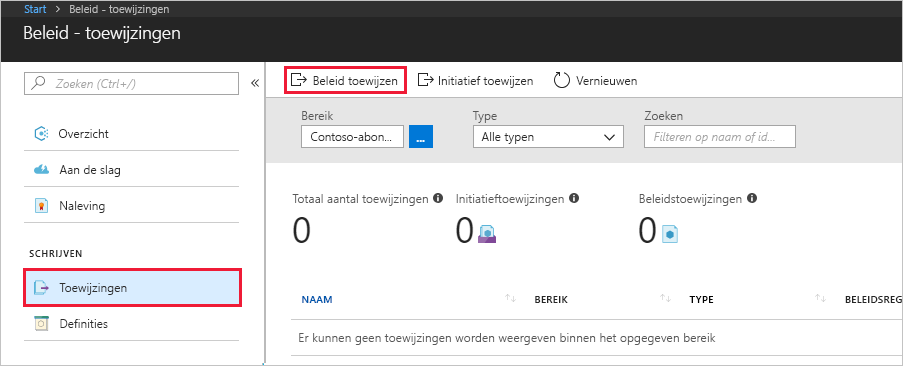
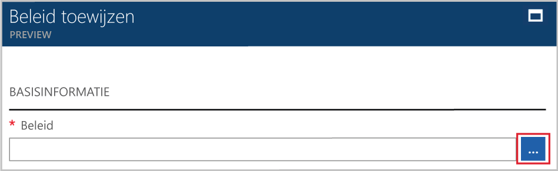
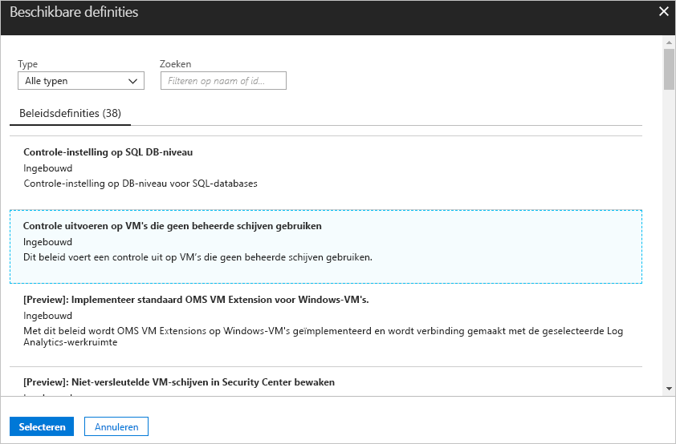
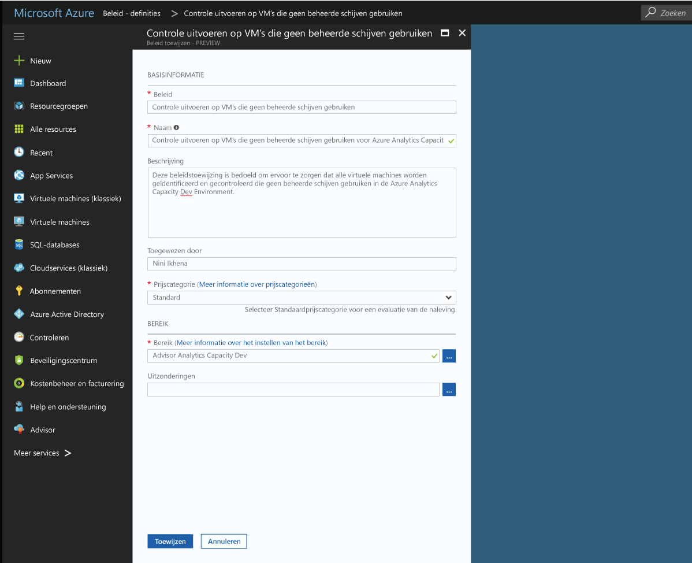

# Een beleidstoewijzing maken om niet-compatibele resources te identificeren in uw Azure-omgeving
De eerste stap in het begrijpen van naleving in Azure is het identificeren van de status van uw resources. In deze snelstartgids gaat u een beleidstoewijzing maken voor het identificeren van virtuele machines die geen beheerde schijven gebruiken.

Als u dit proces helemaal hebt doorlopen, kunt u virtuele machines identificeren die geen beheerde schijven gebruiken. Deze zijn *niet-compatibel* met de beleidstoewijzing.

Als u nog geen abonnement op Azure hebt, maak dan een [gratis account](https://azure.microsoft.com/free/?WT.mc_id=A261C142F) aan voordat u begint.

## Een beleidstoewijzing maken

In deze snelstartgids maakt u een beleidstoewijzing en wijst u de beleidsdefinitie *Virtuele machines zonder beheerde schijven controleren* toe.

1. Selecteer **Toewijzingen** in het linkerdeelvenster van de Azure Policy-pagina.
2. Selecteer **Beleid toewijzen** boven in het deelvenster **Toewijzingen**.

   

3. Klik op de pagina **Beleid toewijzen** op de knop  naast het veld **Beleid** om de lijst met beschikbare definities te openen.

   

   Azure Policy wordt geleverd met ingebouwde beleidsdefinities die u kunt gebruiken. U ziet ingebouwde beleidsdefinities als:

   - Tag en waarde afdwingen
   - Tag en waarde toepassen
   - SQL Server-versie 12.0 vereisen

    Zie [Beleidssjablonen](json-samples.md) voor een volledige lijst met alle beschikbare ingebouwde beleidsregels.

4. Doorzoek uw beleidsdefinities en zoek de definitie *Virtuele machines die geen beheerde schijven gebruiken controleren* op. Klik op dit beleid en vervolgens op **Selecteren**.

   

5. Geef een weergave**naam** op voor de beleidstoewijzing. In dit geval gebruiken we *Virtuele machines die geen beheerde schijven gebruiken controleren*. U kunt ook een optionele **Beschrijving** opgeven. De beschrijving bevat details over de manier waarop de beleidstoewijzing alle virtuele machines identificeert die geen beheerde schijven gebruiken.
6. Wijzig de prijscategorie in**Standard** om ervoor te zorgen dat het beleid wordt toegepast op bestaande resources.

   Er zijn twee prijscategorieën in Azure Policy: *Gratis* en *Standard*. Met de prijscategorie Gratis kunt alleen beleid afdwingen op toekomstige resources, terwijl u met Standard ook beleid kunt afdwingen op bestaande resources om een beter inzicht te krijgen in uw nalevingsstatus. Zie [Prijzen voor Azure Policy](https://azure.microsoft.com/pricing/details/azure-policy/) voor meer informatie over prijzen.

7. Selecteer het **Bereik** waarop u het beleid wilt toepassen.  Het bereik bepaalt op welke resources of groep resources de beleidstoewijzing wordt afgedwongen. Dit kan variëren van een abonnement tot resourcegroepen.
8. Selecteer het eerder geregistreerde abonnement (of de eerder geregistreerde resourcegroep). In dit voorbeeld wordt het abonnement **Azure Analytics Capacity Dev** gebruikt. Uw opties kunnen echter verschillen. Klik op **Selecteren**.

   

9. Laat **Uitsluitingen** voorlopig leeg en klik vervolgens op **Toewijzen**.

U bent er nu klaar voor om niet-compatibele resources te identificeren om inzicht te krijgen in de nalevingsstatus van uw omgeving.

## Niet-compatibele resources identificeren

Selecteer **Naleving** in het linkerdeelvenster en zoek de beleidstoewijzing op die u hebt gemaakt.

Als er bestaande resources zijn die niet compatibel zijn met deze nieuwe toewijzing, worden deze weergegeven bij **Niet-compatibele resources**.

Als een voorwaarde wordt geëvalueerd ten opzichte van uw bestaande resources en deze waar blijkt te zijn, worden deze resources gemarkeerd als niet-compatibel met het beleid. In de voorgaande voorbeeldafbeelding worden niet-compatibele resources weergegeven. In de volgende tabel ziet u hoe verschillende beleidsacties werken met de evaluatie van voorwaarden voor de resulterende nalevingsstatus. U kunt de evaluatielogica niet zien in Azure Portal, maar de resultaten voor de nalevingsstatus worden wel weergegeven. Het resultaat voor de nalevingsstatus is compatibel of niet-compatibel.

|Resource  |Als voorwaarde in het beleid wordt geëvalueerd als  |Actie in het beleid   |Nalevingsstatus  |
|-----------|---------|---------|---------|
|Bestaat     |True     |Weigeren     |Niet-compatibel |
|Bestaat     |False    |Weigeren     |Compatibel     |
|Bestaat     |True     |Toevoegen   |Niet-compatibel |
|Bestaat     |False    |Toevoegen   |Compatibel     |
|Bestaat     |True     |Controleren    |Niet-compatibel |
|Bestaat     |False    |Controleren    |Niet-compatibel |

## Resources opschonen

Andere handleidingen in deze verzameling zijn op deze snelstartgids gebaseerd. Als u door wilt gaan met andere zelfstudies, verwijdert u de resources die u in deze snelstartgids hebt gemaakt, niet. Als u niet wilt doorgaan, gebruikt u de volgende stappen om alle resources te verwijderen die tijdens het doorlopen van deze snelstartgids in Azure Portal zijn gemaakt.
1. Selecteer **Toewijzingen** in het linkerdeelvenster.
2. Zoek de toewijzing die u hebt gemaakt en klik er met de rechtermuisknop op.

   

3.  Selecteer **Toewijzing verwijderen**.

## Volgende stappen

In deze snelstartgids hebt u een beleidsdefinitie toegewezen aan een bereik. De beleidsdefinitie controleert of alle resources in het bereik compatibel zijn en identificeert welke dit niet zijn.

Voor meer informatie over het toewijzen van beleid om er voor te zorgen dat **toekomstige** resources die worden gemaakt compatibel zijn, gaat u verder met de zelfstudie voor:

> [!div class="nextstepaction"]
> [Beleid maken en beheren](./create-manage-policy.md)
