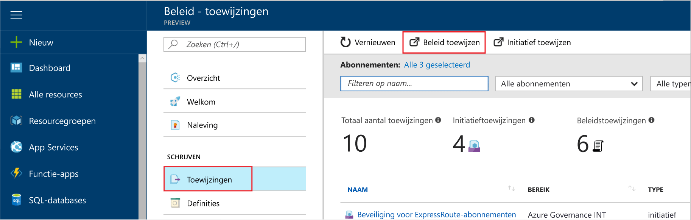

# <a name="create-and-manage-policies-to-enforce-compliance"></a>Beleidsregels voor het afdwingen van compatibiliteit maken en beheren

Informatie over het maken en beheren van beleid in Azure is belangrijk voor het voldoen aan uw bedrijfsnormen en serviceovereenkomsten bijwerkt. In deze zelfstudie leert u Azure beleid gebruiken voor het uitvoeren van de algemene taken met betrekking tot het maken, toewijzen en beheren van beleid in uw organisatie, zoals:

> [!div class="checklist"]
> * Toewijzen van een beleid voor het afdwingen van een voorwaarde voor bronnen die u in de toekomst zult maken
> * Maken en toewijzen van de definitie van een initiatief om bij te houden van naleving voor meerdere resources
> * Een niet-compatibele of geweigerde resource oplossen
> * Een nieuw beleid binnen een organisatie implementeren

Als u toewijzen van een beleid wilt voor het identificeren van de huidige nalevingsstatus van uw bestaande resources, gaat u de Quick Start-artikelen over hoe u dit doet. Als u nog geen abonnement op Azure hebt, maak dan een [gratis account](https://azure.microsoft.com/free/?WT.mc_id=A261C142F) aan voordat u begint.

## <a name="assign-a-policy"></a>Geen beleid toewijzen

De eerste stap bij het afdwingen van compatibiliteit met beleid voor Azure is een beleidsdefinitie toewijzen. Een beleidsdefinitie definieert onder welke voorwaarde een beleid wordt afgedwongen en welke actie moet worden uitgevoerd. In dit voorbeeld toewijzen een ingebouwde beleidsdefinitie aangeroepen *vereisen SQL Server-versie 12.0*, af te dwingen de voorwaarde dat alle SQL Server-databases v12.0 moet te voldoen.

1. Starten van de service Azure-beleid in de Azure-portal door te zoeken en te selecteren **beleid** in het linkerdeelvenster.

   

2. Selecteer **Toewijzingen** in het linkerdeelvenster van de Azure Policy-pagina. Een toewijzing is een beleid dat is toegewezen aan plaatsvinden binnen een bepaald bereik.
3. Selecteer **Beleid toewijzen** boven in het deelvenster **Toewijzingen**.

   

4. Klik op de pagina **Beleid toewijzen** op de knop  naast het veld **Beleid** om de lijst met beschikbare definities te openen. U kunt de beleidsdefinitie filteren **Type** naar *BuiltIn* alle weergeven en lezen van de bijbehorende beschrijvingen.

   

5. Selecteer **is SQL Server-versie 12.0**. Als u deze meteen niet vinden, typt u **vereisen SQL Server-versie 12.0** in het zoekvak en druk op ENTER.

   

6. De weergegeven **naam** wordt automatisch ingevuld, maar u kunt dit wijzigen. In dit voorbeeld gebruiken *vereisen SQL Server versie 12.0*. U kunt ook een optionele **Beschrijving** opgeven. De beschrijving bevat details over hoe de toewijzing van dit beleid zorgt ervoor alle SQL-servers gemaakt in deze omgeving dat versie 12.0 zijn.

7. Wijzig de prijscategorie in**Standard** om ervoor te zorgen dat het beleid wordt toegepast op bestaande resources.

   Er zijn twee prijscategorieën in Azure Policy: *Gratis* en *Standard*. Met de prijscategorie Gratis kunt alleen beleid afdwingen op toekomstige resources, terwijl u met Standard ook beleid kunt afdwingen op bestaande resources om een beter inzicht te krijgen in uw nalevingsstatus. Omdat beleid van de Azure Preview-versie is, er is nog een uitgebracht prijsmodel gebruikt, zodat u ontvangt geen een factuur voor het selecteren van *standaard*. Zie [Prijzen voor Azure Policy](https://azure.microsoft.com/pricing/details/azure-policy) voor meer informatie over prijzen.

8. Selecteer de **bereik** -abonnement (of de resourcegroep) u eerder hebt geregistreerd. Het bereik bepaalt op welke resources of groep resources de beleidstoewijzing wordt afgedwongen. Dit kan variëren van een abonnement tot resourcegroepen.

   In dit voorbeeld wordt de **Azure Analytics capaciteit Dev** abonnement. Uw abonnement zijn.

10. Selecteer **Toewijzen**.

## <a name="implement-a-new-custom-policy"></a>Een nieuw aangepast beleid implementeren

Nu dat u een ingebouwde beleidsdefinitie toegewezen hebt, kunt u meer kunt doen met Azure-beleid. Maak vervolgens een nieuw aangepast beleid voor het opslaan van de kosten door ervoor te zorgen dat virtuele machines die zijn gemaakt in uw omgeving kunnen niet in de reeks G. Op deze manier telkens wanneer een gebruiker in uw organisatie wil de virtuele machine maken in de reeks G wordt de aanvraag geweigerd.

1. Selecteer **definitie** onder **ontwerpen** in het linkerdeelvenster.

   

2. Selecteer **+ beleidsdefinitie**.
3. Voer het volgende:

   - De naam van de beleidsdefinitie - *vereisen VM-SKU's kleiner is dan de G-serie*
   - De beschrijving van de beleidsdefinitie is bedoeld om u te doen: de beleidsdefinitie voor dit wordt afgedwongen dat alle virtuele machines die zijn gemaakt in dit bereik hebben SKU's kleiner is dan de reeks G om kosten te beperken.
   - Het abonnement waaronder de beleidsdefinitie zich bevindt. In dit geval de beleidsdefinitie bevindt zich in **Advisor Analytics capaciteit Dev**. De lijst met abonnementen zijn.
   - Kies uit bestaande opties of maak een nieuwe categorie voor dit beleidsdefinitie.
   - Kopieer de volgende json-code en werk vervolgens voor uw behoeften met:
      - De beleidsparameters.
      - De regels/beleidsvoorwaarden, in dit geval – VM SKU-grootte die gelijk is aan G serie
      - Het beleid effect in dit geval – **weigeren**.

    Dit is wat de json moet eruitzien als. Plak uw herziene code in de Azure-portal.

    ```json
{
    "policyRule": {
      "if": {
        "allOf": [
          {
            "field": "type",
            "equals": "Microsoft.Compute/virtualMachines"
          },
          {
            "field": "Microsoft.Compute/virtualMachines/sku.name",
            "like": "Standard_G*"
          }
        ]
      },
      "then": {
        "effect": "deny"
      }
    }
}
    ```

    De waarde van de *eigenschap veld* in het beleid moet een van de volgende opties: naam, Type, locatie, Tags of een alias. Bijvoorbeeld `"Microsoft.Compute/VirtualMachines/Size"`.

    Als u meer voorbeelden van json-code, lezen de [sjablonen voor Azure beleid](json-samples.md) artikel.

4. Selecteer **Opslaan**.

## <a name="create-a-policy-definition-with-rest-api"></a>Een beleidsdefinitie maken met de REST-API

U kunt een beleid maken met de REST-API voor definities van beleid. De REST-API kunt u maken en verwijderen van beleidsdefinities en informatie over bestaande definities.
Als u wilt een beleidsdefinitie maken, gebruikt u het volgende voorbeeld:

```
PUT https://management.azure.com/subscriptions/{subscription-id}/providers/Microsoft.authorization/policydefinitions/{policyDefinitionName}?api-version={api-version}

```
Vergelijkbaar met het volgende voorbeeld wordt een aanvraagtekst omvatten:

```
{
  "properties": {
    "parameters": {
      "allowedLocations": {
        "type": "array",
        "metadata": {
          "description": "The list of locations that can be specified when deploying resources",
          "strongType": "location",
          "displayName": "Allowed locations"
        }
      }
    },
    "displayName": "Allowed locations",
    "description": "This policy enables you to restrict the locations your organization can specify when deploying resources.",
    "policyRule": {
      "if": {
        "not": {
          "field": "location",
          "in": "[parameters('allowedLocations')]"
        }
      },
      "then": {
        "effect": "deny"
      }
    }
  }
}
```

## <a name="create-a-policy-definition-with-powershell"></a>Een beleidsdefinitie maken met PowerShell

Controleer voordat u doorgaat met het PowerShell-voorbeeld, of dat u de nieuwste versie van Azure PowerShell hebt geïnstalleerd. Beleidsparameters zijn toegevoegd in versie 3.6.0. Als er een eerdere versie, retourneren in de voorbeelden foutmelding dat de parameter kan niet worden gevonden.

U kunt een beleid maakt definitie met de `New-AzureRmPolicyDefinition` cmdlet.

Als u wilt een beleidsdefinitie maken uit een bestand, geeft u het pad naar het bestand. Gebruik het volgende voorbeeld voor een extern bestand:

```
$definition = New-AzureRmPolicyDefinition `
    -Name denyCoolTiering `
    -DisplayName "Deny cool access tiering for storage" `
    -Policy 'https://raw.githubusercontent.com/Azure/azure-policy-samples/master/samples/Storage/storage-account-access-tier/azurepolicy.rules.json'
```

Voor het gebruik van een lokaal bestand, gebruikt u het volgende voorbeeld:

```
$definition = New-AzureRmPolicyDefinition `
    -Name denyCoolTiering `
    -Description "Deny cool access tiering for storage" `
    -Policy "c:\policies\coolAccessTier.json"
```

Als de beleidsdefinitie van een maken met een inline-regel, gebruikt u het volgende voorbeeld:

```
$definition = New-AzureRmPolicyDefinition -Name denyCoolTiering -Description "Deny cool access tiering for storage" -Policy '{
  "if": {
    "allOf": [
      {
        "field": "type",
        "equals": "Microsoft.Storage/storageAccounts"
      },
      {
        "field": "kind",
        "equals": "BlobStorage"
      },
      {
        "not": {
          "field": "Microsoft.Storage/storageAccounts/accessTier",
          "equals": "cool"
        }
      }
    ]
  },
  "then": {
    "effect": "deny"
  }
}'
```

De uitvoer wordt opgeslagen in een `$definition` -object, dat wordt gebruikt tijdens de toewijzing van configuratiebeleid.
Het volgende voorbeeld wordt de beleidsdefinitie van een met parameters:

```
$policy = '{
    "if": {
        "allOf": [
            {
                "field": "type",
                "equals": "Microsoft.Storage/storageAccounts"
            },
            {
                "not": {
                    "field": "location",
                    "in": "[parameters(''allowedLocations'')]"
                }
            }
        ]
    },
    "then": {
        "effect": "Deny"
    }
}'

$parameters = '{
    "allowedLocations": {
        "type": "array",
        "metadata": {
          "description": "The list of locations that can be specified when deploying storage accounts.",
          "strongType": "location",
          "displayName": "Allowed locations"
        }
    }
}'

$definition = New-AzureRmPolicyDefinition -Name storageLocations -Description "Policy to specify locations for storage accounts." -Policy $policy -Parameter $parameters
```

## <a name="view-policy-definitions"></a>Definities van beleid weergeven

Als alle beleidsdefinities in uw abonnement wilt weergeven, gebruikt u de volgende opdracht:

```
Get-AzureRmPolicyDefinition
```

Retourneert alle beschikbare door beleidsdefinities, met inbegrip van ingebouwde beleid. Elk beleid wordt geretourneerd in de volgende indeling:

```
Name               : e56962a6-4747-49cd-b67b-bf8b01975c4c
ResourceId         : /providers/Microsoft.Authorization/policyDefinitions/e56962a6-4747-49cd-b67b-bf8b01975c4c
ResourceName       : e56962a6-4747-49cd-b67b-bf8b01975c4c
ResourceType       : Microsoft.Authorization/policyDefinitions
Properties         : @{displayName=Allowed locations; policyType=BuiltIn; description=This policy enables you to
                     restrict the locations your organization can specify when deploying resources. Use to enforce
                     your geo-compliance requirements.; parameters=; policyRule=}
PolicyDefinitionId : /providers/Microsoft.Authorization/policyDefinitions/e56962a6-4747-49cd-b67b-bf8b01975c4c
```

## <a name="create-a-policy-definition-with-azure-cli"></a>Een beleidsdefinitie maken met Azure CLI

U kunt een definitie voor Azure CLI gebruiken met de opdracht van de definitie beleid maken.
Als de beleidsdefinitie van een maken met een inline-regel, gebruikt u het volgende voorbeeld:

```
az policy definition create --name denyCoolTiering --description "Deny cool access tiering for storage" --rules '{
  "if": {
    "allOf": [
      {
        "field": "type",
        "equals": "Microsoft.Storage/storageAccounts"
      },
      {
        "field": "kind",
        "equals": "BlobStorage"
      },
      {
        "not": {
          "field": "Microsoft.Storage/storageAccounts/accessTier",
          "equals": "cool"
        }
      }
    ]
  },
  "then": {
    "effect": "deny"
  }
}'
```

## <a name="view-policy-definitions"></a>Definities van beleid weergeven

Als alle beleidsdefinities in uw abonnement wilt weergeven, gebruikt u de volgende opdracht:

```
az policy definition list
```

Retourneert alle beschikbare door beleidsdefinities, met inbegrip van ingebouwde beleid. Elk beleid wordt geretourneerd in de volgende indeling:

```
{                                                            
  "description": "This policy enables you to restrict the locations your organization can specify when deploying resources. Use to enforce your geo-compliance requirements.",                      
  "displayName": "Allowed locations",
  "id": "/providers/Microsoft.Authorization/policyDefinitions/e56962a6-4747-49cd-b67b-bf8b01975c4c",
  "name": "e56962a6-4747-49cd-b67b-bf8b01975c4c",
  "policyRule": {
    "if": {
      "not": {
        "field": "location",
        "in": "[parameters('listOfAllowedLocations')]"
      }
    },
    "then": {
      "effect": "Deny"
    }
  },
  "policyType": "BuiltIn"
}
```

## <a name="create-and-assign-an-initiative-definition"></a>Maken en toewijzen van de definitie van een initiatief

U kunt verschillende beleidsdefinities om een overkoepelende doel te bereiken groeperen met een initiatief definitie. U maakt een definitie van een initiatief om ervoor te zorgen dat resources binnen het bereik van de definitie voldoen aan de beleidsdefinities die gezamenlijk de initiatief definitie blijven.  Zie de [overzicht Azure](./azure-policy-introduction.md) voor meer informatie over het initiatief definities.

### <a name="create-an-initiative-definition"></a>De definitie van een initiatief maken

1. Selecteer **definities** onder **ontwerpen** in het linkerdeelvenster.

   

2. Selecteer **initiatief definitie** aan de bovenkant van de pagina deze selectie gaat u naar de **initiatief definitie** formulier.
3. Voer de naam en beschrijving van het initiatief.

   Zorg ervoor dat resources in overeenstemming met beleidsdefinities zijn over het ophalen van beveiligde in dit voorbeeld. Ja, de naam van het initiatief wordt **ophalen Secure**, en de beschrijving is: **dit initiatief is gemaakt voor het afhandelen van alle beleidsregels die zijn gekoppeld aan het beveiligen van bronnen**.

   

4. Blader door de lijst met **beschikbare definities** en selecteert u het beleid (s) die u wilt toevoegen aan dit initiatief. Voor onze **beveiligen van uw** initiatief **toevoegen** de volgende ingebouwde beleidsdefinities:
   - SQL Server versie 12.0 vereisen
   - Niet-beveiligde webtoepassingen in Security Center bewaken.
   - Monitor strikte netwerk via in Security Center.
   - Controleren op mogelijke app Whitelisting in Security Center.
   - Niet-versleutelde VM-schijven in Security Center bewaken.

   

   Na het selecteren van de beleidsdefinities in de lijst ziet u in **beleidsregels en parameters**, zoals wordt weergegeven in de voorgaande afbeelding.

5. Gebruik **definitie locatie** om een abonnement voor het opslaan van de definitie te selecteren. Selecteer **Opslaan**.

### <a name="assign-an-initiative-definition"></a>De definitie van een initiatief toewijzen

1. Ga naar de **definities** tabblad onder **ontwerpen**.
2. Zoeken naar de **beveiligen van uw** initiatief definitie die u hebt gemaakt.
3. Het initiatief definitie selecteren en selecteer vervolgens **toewijzen**.

   

4. Vul de **toewijzing** formulier hiertoe het volgende voorbeeldinformatie. U kunt uw eigen gegevens.
   - naam: beveiligde toewijzing ophalen
   - Beschrijving: Deze initiatief toewijzing is aangepast om af te dwingen van deze groep van voor beleidsdefinities van de **Azure Advisor capaciteit Dev** abonnement.
   - Prijscategorie: standaard
   - Waar u deze toewijzing toegepast wilt op bereik: **Azure Advisor capaciteit Dev**. U kunt uw eigen abonnement en de resource-groep.

5. Selecteer **Toewijzen**.

## <a name="resolve-a-non-compliant-or-denied-resource"></a>Een niet-compatibele of geweigerde resource oplossen

Na het bovenstaande voorbeeld, na het toewijzen van de beleidsdefinitie vereisen SQL server-versie 12.0, zou een SQL-server die is gemaakt met een andere versie ophalen geweigerd. In deze sectie helpt u bij het oplossen van een geweigerde poging te maken van een andere versie van een SQL-server door het aanvragen van een uitsluiting. Uitsluiting is in wezen voorkomt u dat beleid worden afgedwongen. Een uitsluiting kunt toepassen op een resourcegroep of u kunt de uitsluiting van de afzonderlijke bronnen beperken.

1. Selecteer **Toewijzingen** in het linkerdeelvenster.
2. Blader door alle beleidstoewijzingen en open de *vereisen SQL Server versie 12.0* toewijzing.
3. **Selecteer** een uitzondering voor resources in de resourcegroepen waar u probeert te maken van de SQL-server. In dit voorbeeld uitsluiten Microsoft.Sql/servers/databases: *azuremetrictest/testdb* en *azuremetrictest/testdb2*.

   

   Andere manieren een geweigerde bron kan worden omgezet, bijvoorbeeld: uit naar de contactpersoon die zijn gekoppeld aan het beleid, hebt u een sterk reden voor dat de SQL-server gemaakt en het beleid rechtstreeks te bewerken als u toegang hebt tot is bereikt.

4. Klik op **toewijzen**.

In deze sectie kunt u de denial-of hebt geprobeerd te maken van een SQL-server met versie 12.0, door het aanvragen van een uitsluiting aan de resources opgelost.

## <a name="clean-up-resources"></a>Resources opschonen

Als u van plan bent om door te gaan werken met de volgende zelfstudies, geen clean up maakt van de resources in deze handleiding hebt gemaakt. Als u niet van plan bent om door te gaan, gebruikt u de volgende stappen uit voor het verwijderen van de toewijzingen of de definities die eerder is gemaakt:

1. Selecteer **definities** (of **toewijzingen** als u probeert te verwijderen van een toewijzing) in het linkerdeelvenster.
2. Zoeken naar het nieuwe beleid of initiatief definitie (of toewijzing) u zojuist hebt gemaakt.
3. Selecteer het beletselteken aan het einde van de definitie of de toewijzing en selecteer **definitie verwijderen** (of **toewijzing verwijderen**).

## <a name="next-steps"></a>Volgende stappen

In deze zelfstudie maakt doen u met succes het volgende:

> [!div class="checklist"]
> * Een beleid voor het afdwingen van een voorwaarde voor bronnen die u in de toekomst maakt toegewezen
> * Gemaakt en de definitie van een initiatief om bij te houden van naleving voor meerdere resources toe te wijzen
> * Een resource niet-compatibele of niet wordt opgelost
> * Een nieuw beleid geïmplementeerd in een organisatie

Bekijk dit artikel voor meer informatie over de structuur van de beleidsdefinities:

> [!div class="nextstepaction"]
> [Definitie van Azure beleidsstructuur](policy-definition.md)
