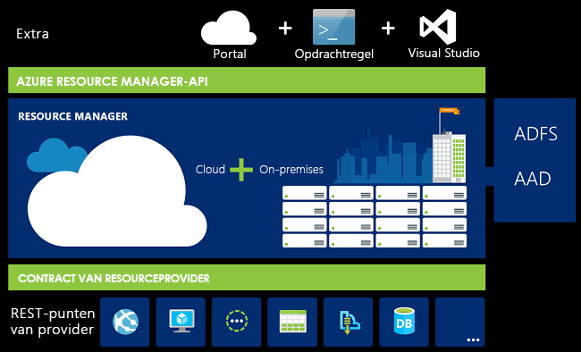
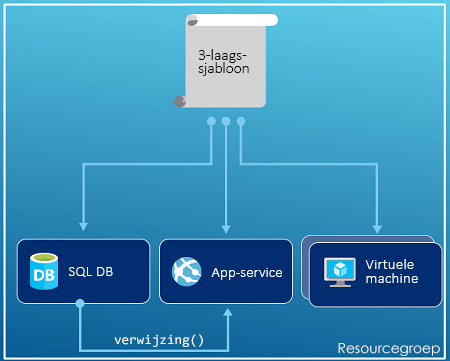
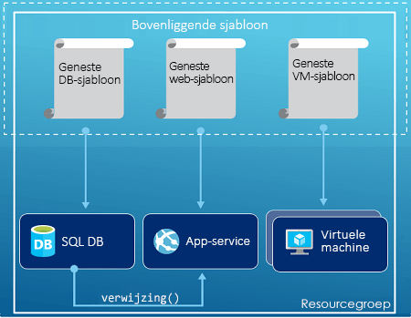
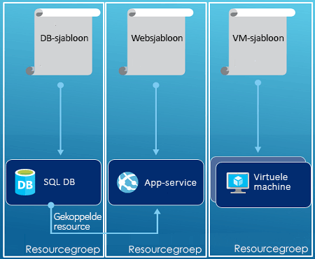

# <a name="azure-resource-manager-overview"></a>Overzicht van Azure Resource Manager
De infrastructuur voor uw toepassing bestaat meestal uit veel onderdelen, zoals een virtuele machine, een opslagaccount en een virtueel netwerk, of een webtoepassing, database, databaseserver en services van derden. Deze onderdelen moet u niet zien als afzonderlijke entiteiten, maar als onderdelen die één entiteit vormen en aan elkaar zijn gerelateerd en afhankelijk zijn van elkaar. U implementeert, beheert en bewaakt deze onderdelen als groep. Met Azure Resource Manager kunt u met de resources als groep in uw oplossing werken. U kunt alle resources voor uw oplossing implementeren, bijwerken of verwijderen in een enkele, gecoördineerde bewerking. Voor implementatie gebruikt u een sjabloon. Deze sjabloon kan voor verschillende omgevingen worden gebruikt, zoals testen, faseren en productie. Resource Manager biedt beveiliging, controle en tagfuncties die u na de implementatie helpen bij het beheren van uw resources. 

## <a name="terminology"></a>Terminologie
Als u nog geen ervaring hebt met de Azure Resource Manager, zijn er enkele termen die u mogelijk niet kent.

* **resource** - een beheerbaar item dat beschikbaar is via Azure. Sommige algemene resources zijn een virtuele machine, opslagaccount, webtoepassing en virtueel netwerk, maar er zijn er veel meer.
* **resourcegroep** - een container met gerelateerde resources voor een Azure-oplossing. De resourcegroep kan alle resources voor de oplossing bevatten of enkel de resources die u als groep wilt beheren. U bepaalt hoe resources worden toegewezen aan resourcegroepen op basis van wat voor uw organisatie het meest zinvol is. Zie [Resourcegroepen](#resource-groups).
* **resourceprovider** - Een service die de resources levert die u kunt implementeren en beheren met de Resource Manager. Elke resourceprovider biedt bewerkingen voor het werken met de resources die zijn geïmplementeerd. Enkele veelvoorkomende resourceproviders zijn Microsoft.Compute, dat voor de resource van de virtuele machine zorgt, Microsoft.Storage dat voor de resource van de opslagaccount zorgt, en Microsoft.Web, dat zorgt voor resources met betrekking tot web-apps. Zie [Resourceproviders](#resource-providers).
* **Resource Manager sjabloon** - Een JavaScript Object Notation (JSON)-bestand dat één of meer resources definieert die worden geïmplementeerd op een resourcegroep. Het definieert ook de afhankelijkheden tussen de geïmplementeerde resources. De sjabloon kan worden gebruikt om de resources consistent en herhaaldelijk te implementeren. Zie [Sjabloonimplementatie](#template-deployment).
* **declaratieve syntaxis** - een syntaxis waarmee u kunt aangeven 'Dit is wat ik wil maken' zonder hiervoor de nodige reeks programmeeropdrachten te hoeven maken. De sjabloon Resource Manager is een voorbeeld van een declaratieve syntaxis. In het bestand definieert u de eigenschappen voor de infrastructuur te implementeren naar Azure. 

## <a name="the-benefits-of-using-resource-manager"></a>De voordelen van Resource Manager
Resource Manager biedt diverse voordelen:

* U kunt alle resources voor uw oplossing implementeren, beheren en bewaken als groep, in plaats van deze resources afzonderlijk te verwerken.
* U kunt gedurende de ontwikkelingscyclus uw oplossing herhaaldelijk implementeren en erop vertrouwen dat uw resources consistent worden geïmplementeerd.
* U kunt uw infrastructuur beheren via declaratieve sjablonen in plaats van scripts.
* U kunt de afhankelijkheden tussen resources zo definiëren dat deze in de juiste volgorde worden geïmplementeerd.
* U kunt toegangsbeheer toepassen op alle services in de resourcegroep omdat op rollen gebaseerd toegangsbeheer (RBAC) is geïntegreerd in het beheerplatform.
* U kunt tags toepassen op de resources om alle resources in uw abonnement op een logische manier te organiseren.
* U kunt de facturering van uw organisatie transparanter maken door te kijken naar de kosten voor een groep resources met dezelfde tag.  

Resource Manager biedt een nieuwe manier om uw oplossingen te implementeren en te beheren. Als u het eerdere implementatiemodel hebt gebruikt en meer te weten wilt komen over de wijzigingen, leest u [Resource Manager-implementatie en klassieke implementatie begrijpen](resource-manager-deployment-model.md).

## <a name="consistent-management-layer"></a>Consistente beheerlaag
Resource Manager biedt een consistente beheerlaag voor de taken die u uitvoert via Azure PowerShell, Azure CLI, Azure portal, REST API en ontwikkelhulpprogramma's. Alle hulpprogramma's gebruiken een gemeenschappelijke set bewerkingen. U kunt de hulpprogramma's gebruiken die voor u het meest geschikt zijn en u kunt ze zonder problemen door elkaar gebruiken. 

In de volgende afbeelding ziet u hoe alle hulpprogramma's werken met dezelfde Azure Resource Manager-API. Via de API worden aanvragen doorgegeven aan de Resource Manager-service, waar de aanvragen worden geverifieerd en geautoriseerd. De aanvragen worden vervolgens via Resource Manager naar de juiste resourceproviders geleid.



## <a name="guidance"></a>Richtlijnen
Met de volgende tips kunt u profiteren van alle mogelijkheden die Resource Manager voor uw oplossingen biedt.

1. Definieer en implementeer uw infrastructuur via de declaratieve syntaxis in de Resource Manager-sjablonen, in plaats van via imperatieve opdrachten.
2. Definieer alle implementatie- en configuratiestappen in de sjabloon. Handmatige stappen voor het installeren van uw oplossing zijn niet nodig.
3. Voer imperatieve opdrachten uit voor het beheren van uw resources, zoals het starten of stoppen van een app of machine.
4. Breng resources met dezelfde levenscyclus onder in een resourcegroep. Gebruik tags voor het organiseren van alle andere resources.

Ga voor aanbevelingen over sjablonen naar [Aanbevolen procedures voor het maken van Azure Resource Manager-sjablonen](resource-manager-template-best-practices.md).

Voor begeleiding bij de manier waarop ondernemingen Resource Manager effectief kunnen gebruiken voor het beheer van abonnementen, gaat u naar [Azure enterprise-platform - Prescriptieve abonnementsgovernance](resource-manager-subscription-governance.md).

## <a name="resource-groups"></a>Resourcegroepen
Er zijn een aantal belangrijke factoren waarmee u rekening moet houden bij het definiëren van de resourcegroep:

1. Alle resources in uw groep moeten dezelfde levenscyclus hebben. U implementeert ze samen, werkt ze samen bij en verwijdert ze samen. Als een resource, zoals een databaseserver, in een andere implementatiecyclus moet werken, moet deze in een andere resourcegroep worden geplaatst.
2. Elke resource kan in slechte één resourcegroep voorkomen.
3. U kunt een resource op elk gewenst moment toevoegen aan of verwijderen uit een resourcegroep.
4. U kunt een resource van de ene naar de andere resourcegroep verplaatsen. Zie voor meer informatie [Resources verplaatsen naar een nieuwe resourcegroep of een nieuw abonnement](resource-group-move-resources.md).
5. Een resourcegroep kan resources uit verschillende regio’s bevatten.
6. Een resourcegroep kan worden gebruikt voor het bepalen van de mate van toegangsbeheer voor beheertaken.
7. Een resource kan communiceren met resources in andere resourcegroepen. Deze communicatie is gebruikelijk wanneer er een relatie bestaat tussen de twee resources, maar deze niet de dezelfde levenscyclus delen (bijvoorbeeld web-apps die verbinding maken met een database).

Als u een resourcegroep maakt, moet u voor die resourcegroep een locatie opgeven. U vraagt zich misschien af: 'Waarom heeft een resourcegroep een locatie nodig? En als de resources andere locaties kunnen hebben dan de resourcegroep, wat is dan het nut van een locatie voor de resourcegroep?' De resourcegroep slaat metagegevens op over de resources. Dat is de reden waarom u moet aangeven waar die metagegevens moeten worden opgeslagen als u een locatie voor de resourcegroep opgeeft. In verband met nalevingsvereisten moet u er mogelijk voor zorgen dat uw gegevens worden opgeslagen in een bepaalde regio.

## <a name="resource-providers"></a>Resourceproviders
Elke resourceprovider biedt een set resources en bewerkingen voor werken met een Azure-service. Als u bijvoorbeeld sleutels en geheimen wilt opslaan, werkt u met de resourceprovider **Microsoft.KeyVault**. Deze resourceprovider biedt een resourcetype **kluizen** voor het maken van de sleutelkluis. 

De naam van een resourcetype heeft deze syntaxis: **{resourceprovider}/{resourcetype}**. Het type sleutelkluis wordt bijvoorbeeld geschreven als **Microsoft.KeyVault\vaults**.

Voordat u aan de slag gaat met de implementatie van uw resources, dient u inzicht te hebben in de beschikbare resourceproviders. Als u de namen van resourceproviders en resources kent, bent u beter in staat resources te definiëren die u wilt implementeren in Azure. Bovendien moet u voor elk resourcetype de geldige locaties en API-versies weten. Zie [Resourceproviders en -typen](resource-manager-supported-services.md) voor meer informatie.

## <a name="template-deployment"></a>Sjabloonimplementatie
Met Resource Manager kunt u een sjabloon maken (in JSON-indeling) waarmee de infrastructuur en configuratie van uw Azure-oplossing worden gedefinieerd. Door het gebruik van een sjabloon kunt u gedurende de levenscyclus de oplossing herhaaldelijk implementeren en erop vertrouwen dat uw resources consistent worden geïmplementeerd. Wanneer u een oplossing vanaf de portal maakt, bevat de oplossing automatisch een sjabloon voor de implementatie. U hoeft de sjabloon niet helemaal zelf te maken. U kunt beginnen met de sjabloon voor uw oplossing en deze aanpassen aan uw specifieke behoeften. U kunt een sjabloon voor een bestaande resourcegroep ophalen door de huidige status van de resourcegroep te exporteren of door de sjabloon die is gebruikt voor een bepaalde implementatie, weer te geven. Raadplegen van de [geëxporteerde sjabloon](resource-manager-export-template.md) is een handige manier om de syntaxis van de sjabloon te leren kennen.

Voor meer informatie over de indeling van de sjabloon en hoe u deze samenstelt, raadpleegt u [Uw eerste Azure Resource Manager-sjabloon maken](resource-manager-create-first-template.md). Als u de JSON-syntaxis voor resourcetypen wilt bekijken, raadpleegt u [Define resources in Azure Resource Manager templates](/azure/templates/) (Resources definiëren in Azure Resource Manager-sjablonen).

De sjabloon wordt via Resource Manager verwerkt zoals alle andere aanvragen (zie de afbeelding voor [Consistente beheerlaag](#consistent-management-layer)). De sjabloon wordt geparseerd en de bijbehorende syntaxis wordt geconverteerd naar REST API-bewerkingen voor de juiste resourceproviders. Bijvoorbeeld wanneer Resource Manager een sjabloon ontvangt met de volgende resourcedefinitie:

```json
"resources": [
  {
    "apiVersion": "2016-01-01",
    "type": "Microsoft.Storage/storageAccounts",
    "name": "mystorageaccount",
    "location": "westus",
    "sku": {
      "name": "Standard_LRS"
    },
    "kind": "Storage",
    "properties": {
    }
  }
]
```

De definitie wordt geconverteerd naar de volgende REST API-bewerking, die wordt verzonden naar de Microsoft.Storage-resourceprovider:

```HTTP
PUT
https://management.azure.com/subscriptions/{subscriptionId}/resourceGroups/{resourceGroupName}/providers/Microsoft.Storage/storageAccounts/mystorageaccount?api-version=2016-01-01
REQUEST BODY
{
  "location": "westus",
  "properties": {
  }
  "sku": {
    "name": "Standard_LRS"
  },   
  "kind": "Storage"
}
```

U kunt helemaal zelf bepalen hoe u sjablonen en resourcegroepen definieert en hoe u de oplossing beheert. U kunt de toepassing met drie lagen bijvoorbeeld met een enkele sjabloon implementeren in een enkele resourcegroep.



Maar u hoeft uw volledige infrastructuur niet te definiëren in één sjabloon. Vaak is het handiger om uw implementatievereisten te verdelen over een aantal gerichte sjablonen met een specifiek doel. U kunt deze sjablonen eenvoudig opnieuw gebruiken voor verschillende oplossingen. Voor het implementeren van een bepaalde oplossing kunt u een basissjabloon gebruiken die is gekoppeld aan alle vereiste sjablonen. In de volgende afbeelding ziet u hoe u een oplossing met drie lagen kunt implementeren via een bovenliggende sjabloon die drie geneste sjablonen bevat.



De lagen hebben afzonderlijke levenscycli, zodat u ze kunt toepassen op verschillende resourcegroepen. Opmerking: de resources kunnen nog steeds worden gekoppeld aan resources in andere resourcegroepen.



Zie [Patterns for designing Azure Resource Manager templates](best-practices-resource-manager-design-templates.md) (Patronen voor het ontwerpen van Azure Resource Manager-sjablonen) voor meer informatie over het ontwerpen van uw sjablonen. Zie [Using linked templates with Azure Resource Manager](resource-group-linked-templates.md) (Gekoppelde sjablonen gebruiken met Azure Resource Manager) voor meer informatie over geneste sjablonen.

Azure Resource Manager analyseert afhankelijkheden om ervoor te zorgen dat de resources in de juiste volgorde worden gemaakt. Als een resource afhankelijk is van een waarde uit een andere resource (zoals een virtuele machine die een opslagaccount nodig heeft voor schijven), stelt u een afhankelijkheid in. Zie voor meer informatie [Afhankelijkheden definiëren in Azure Resource Manager-sjablonen](resource-group-define-dependencies.md).

U kunt de sjabloon ook gebruiken voor updates aan de infrastructuur. U kunt bijvoorbeeld een resource toevoegen aan uw oplossing en configuratieregels toevoegen voor de resources die al zijn geïmplementeerd. Als de sjabloon specificeert dat een resource wordt gemaakt maar die resource al bestaat, wordt er geen nieuwe asset gemaakt. In plaats daarvan voert Azure Resource Manager een update uit. Azure Resource Manager werkt de bestaande asset bij naar dezelfde toestand als een nieuwe asset.  

Resource Manager biedt uitbreidingen voor scenario's waarin aanvullende bewerkingen moeten worden uitgevoerd, zoals het installeren van bepaalde software die niet is opgenomen in de installatie. Als u al een configuratiebeheerservice gebruikt, zoals DSC, Chef of Puppet, kunt u via uitbreidingen met deze service blijven werken. Zie voor meer informatie over de extensies van virtuele machines [Informatie over extensies en functies van virtuele machines](../virtual-machines/windows/extensions-features.md?toc=%2fazure%2fvirtual-machines%2fwindows%2ftoc.json). 

De sjabloon wordt uiteindelijk onderdeel van de broncode van uw app. U kunt de broncode inchecken in uw broncodeopslag en deze bijwerken naarmate uw app zich verder ontwikkelt. U kunt de sjabloon bewerken met Visual Studio.

Nadat u de sjabloon hebt gedefinieerd, kunt u de resources in Azure implementeren. Zie voor de opdrachten voor het implementeren van de resources:

* [Resources implementeren met Resource Manager-sjablonen en Azure PowerShell](resource-group-template-deploy.md)
* [Resources implementeren met Resource Manager-sjablonen en Azure CLI](resource-group-template-deploy-cli.md)
* [Resources implementeren met Resource Manager-sjablonen en Azure Portal](resource-group-template-deploy-portal.md)
* [Resources implementeren met Resource Manager-sjablonen en Resource Manager REST API](resource-group-template-deploy-rest.md)

## <a name="tags"></a>Tags
Resource Manager biedt een tagfunctie waarmee u resources kunt categoriseren volgens uw vereisten voor beheer of facturering. Gebruik tags wanneer u een verzameling complexe resourcegroepen en resources hebt en u deze assets moet visualiseren op een manier die relevant voor u is. U kunt bijvoorbeeld resources taggen die een vergelijkbare rol hebben in uw organisatie of bij dezelfde afdeling horen. Zonder tags kunnen gebruikers in uw organisatie meerdere resources maken die later mogelijk moeilijk zijn te identificeren en te beheren. Bijvoorbeeld als u alle resources voor een bepaald project wilt verwijderen. Als deze resources niet van een tag zijn voorzien voor het project, moet u er handmatig naar zoeken. Taggen kan een belangrijke manier zijn om onnodige kosten in uw abonnement te voorkomen. 

Resources hoeven niet tot dezelfde resourcegroep te behoren om een tag te kunnen delen. U kunt uw eigen tagtaxonomie maken om ervoor te zorgen dat alle gebruikers in uw organisatie gebruikmaken van veelgebruikte tags en niet per ongeluk afwijkende tags toepassen (zoals 'afd' in plaats van 'afdeling').

In het volgende voorbeeld ziet u een tag die is toegepast op een virtuele machine.

```json
"resources": [    
  {
    "type": "Microsoft.Compute/virtualMachines",
    "apiVersion": "2015-06-15",
    "name": "SimpleWindowsVM",
    "location": "[resourceGroup().location]",
    "tags": {
        "costCenter": "Finance"
    },
    ...
  }
]
```

Gebruik de volgende PowerShell-cmdlet om alle resources met een tagwaarde op te halen:

```powershell
Find-AzureRmResource -TagName costCenter -TagValue Finance
```

Of voer de volgende Azure CLI 2.0-opdracht uit:

```azurecli
az resource list --tag costCenter=Finance
```

U kunt ook getagde resources via Azure Portal weergeven.

Het [gebruiksrapport](../billing/billing-understand-your-bill.md) voor uw abonnement bevat tagnamen en -waarden, zodat u de kosten op basis van tags kunt opdelen. Zie [Tags gebruiken om uw Azure-resources te organiseren](resource-group-using-tags.md) voor meer informatie over tags.

## <a name="access-control"></a>Toegangsbeheer
Met Resource Manager kunt u bepalen wie er toegang heeft tot bepaalde acties voor uw organisatie. Op rollen gebaseerd toegangsbeheer (RBAC) is in het beheerplatform geïntegreerd. Resource Manager past dat toegangsbeheer toe op alle services in uw resourcegroep. 

Er zijn twee belangrijke concepten die u moet begrijpen als u werkt met op rollen gebaseerd toegangsbeheer:

* Roldefinities: beschrijven een set machtigingen en kunnen worden gebruikt in meerdere toewijzingen.
* Roltoewijzingen: koppelen een definitie aan een identiteit (gebruiker of groep) voor een bepaald bereik (abonnement, resourcegroep of resource). De toewijzing wordt overgenomen door lagere bereiken.

U kunt gebruikers toevoegen aan een vooraf gedefinieerd platform en resourcespecifieke rollen. U kunt bijvoorbeeld profiteren van de vooraf gedefinieerde rol met de naam 'Lezer' waarmee gebruikers resources kunnen weergeven, maar niet wijzigen. U voegt gebruikers in uw organisatie toe die dit type toegang tot de rol Lezer nodig hebben, en u past de rol toe op het abonnement, de resourcegroep of de resource.

Azure biedt de volgende vier platformrollen:

1. Eigenaar: kan alles beheren, inclusief toegang
2. Inzender: kan alles beheren behalve toegang
3. Lezer: kan alles weergeven, maar kan geen wijzigingen aanbrengen
4. Beheerder gebruikerstoegang: kan gebruikerstoegang tot Azure-resources beheren

Azure biedt ook diverse resourcespecifieke rollen. Een aantal gangbare zijn:

1. Inzender voor virtuele machines: kan virtuele machines beheren maar geen toegang verlenen, en kan het virtuele netwerk of het opslagaccount waarmee ze zijn verbonden, niet beheren
2. Inzender voor netwerken: kan alle netwerkbronnen beheren, maar geen toegang verlenen
3. Inzender voor opslagaccounts: kan opslagaccounts beheren, maar geen toegang verlenen
4. Inzender voor SQL Server: kan SQL-servers en -databases beheren, maar niet het beveiligingsbeleid
5. Inzender voor websites: kan websites beheren, maar niet de webabonnementen waarmee ze zijn verbonden

Zie voor een volledige lijst met functies en toegestane acties [RBAC: ingebouwde rollen](../active-directory/role-based-access-built-in-roles.md). Zie voor meer informatie over op rollen gebaseerd toegangsbeheer [Op rollen gebaseerd Azure-toegangsbeheer](../active-directory/role-based-access-control-configure.md). 

In sommige gevallen wilt u code of scripts uitvoeren die toegang hebben tot resources, maar dan niet via de referenties van een gebruiker. In plaats daarvan kunt u een identiteit, een service-principal, voor de toepassing maken en de juiste rol voor de service-principal toewijzen. Met Resource Manager kunt u referenties voor de toepassing maken en de toepassing programmatisch verifiëren. Raadpleeg een van de volgende onderwerpen voor informatie over het maken van service-principals:

* [Azure PowerShell gebruiken om een service-principal te maken voor toegang tot resources](resource-group-authenticate-service-principal.md)
* [Azure CLI gebruiken om een service-principal te maken voor toegang tot resources](resource-group-authenticate-service-principal-cli.md)
* [Portal gebruiken voor het maken van een Azure Active Directory-toepassing en een -service-principal die toegang hebben tot resources](resource-group-create-service-principal-portal.md)

U kunt kritieke resources ook expliciet vergrendelen om te voorkomen dat gebruikers deze wijzigen of verwijderen. Zie voor meer informatie [Resources vergrendelen met Azure Resource Manager](resource-group-lock-resources.md).

## <a name="activity-logs"></a>Activiteitenlogboeken
Resource Manager registreert alle bewerkingen waarmee een resource wordt gemaakt, gewijzigd of verwijderd. U kunt de activiteitenlogboeken gebruiken om fouten te vinden bij foutoplossing of om te controleren hoe een gebruiker in uw organisatie een resource heeft gewijzigd. Selecteer **Activiteitenlogboeken** op de blade **Instellingen** voor een resourcegroep om de logboeken in te zien. U kunt de logboeken filteren op veel verschillende waarden, inclusief welke gebruiker de bewerking heeft gestart. Zie voor meer informatie over het werken met de activiteitenlogboeken [View activity logs to manage Azure resources](resource-group-audit.md) (Activiteitenlogboeken weergeven met Resource Manager).

## <a name="customized-policies"></a>Aangepast beleid
Met Resource Manager kunt u aangepaste beleidsregels maken voor het beheer van resources. De soorten beleid die u maakt, kunnen diverse scenario's bevatten. U kunt een naamgevingsconventie voor resources afdwingen, u kunt beperken welke typen resources en resource-exemplaren kunnen worden geïmplementeerd of u kunt beperken welke regio's als host voor een bepaald type resource kunnen fungeren. U kunt een tagwaarde voor resources verplicht stellen, om te organiseren dat facturering per afdeling plaatsvindt. U maakt beleid om kostenverlaging te stimuleren en consistentie binnen uw abonnement te waarborgen. 

U definieert beleid met JSON en past dat beleid vervolgens toe op uw abonnement of binnen een resourcegroep. Beleidsregels zijn anders dan op rollen gebaseerd toegangsbeheer, omdat ze worden toegepast op resourcetypen.

Het volgende voorbeeld bevat een beleid dat zorgt voor consistentie van tags doordat wordt opgegeven dat alle resources een costCenter-tag moeten bevatten.

```json
{
  "if": {
    "not" : {
      "field" : "tags",
      "containsKey" : "costCenter"
    }
  },
  "then" : {
    "effect" : "deny"
  }
}
```

Er zijn nog veel meer soorten beleid die u kunt maken. Zie voor meer informatie [Beleid gebruiken voor het beheren van resources en toegang](resource-manager-policy.md).

## <a name="sdks"></a>SDK's
Azure SDK's zijn beschikbaar voor meerdere talen en platforms. Elk van deze taalimplementaties is beschikbaar via zijn ecosystem package manager en GitHub.

Hier vindt u onze Open Source SDK-opslagplaatsen. We ontvangen graag uw feedback, vragen bij problemen en pull-aanvragen.

* [Azure-SDK voor .NET](https://github.com/Azure/azure-sdk-for-net)
* [Azure-beheerbibliotheken voor Java](https://github.com/Azure/azure-sdk-for-java)
* [Azure-SDK voor Node.js](https://github.com/Azure/azure-sdk-for-node)
* [Azure-SDK voor PHP](https://github.com/Azure/azure-sdk-for-php)
* [Azure-SDK voor Python](https://github.com/Azure/azure-sdk-for-python)
* [Azure-SDK voor Ruby](https://github.com/Azure/azure-sdk-for-ruby)

Zie voor informatie over het gebruik van deze talen met uw resources:

* [Azure voor .NET-ontwikkelaars](/dotnet/azure/?view=azure-dotnet)
* [Azure voor Java-ontwikkelaars](/java/azure/)
* [Azure voor Node.js-ontwikkelaars](/nodejs/azure/)
* [Azure voor Python-ontwikkelaars](/python/azure/)

> [!NOTE]
> Als de SDK niet de vereiste functionaliteit biedt, kunt u ook de [Azure REST API](https://docs.microsoft.com/rest/api/resources/) ook rechtstreeks aanroepen.
> 
> 

## <a name="next-steps"></a>Volgende stappen
* Zie voor een eenvoudige introductie in het werken met sjablonen [Een Azure Resource Manager-sjabloon uit bestaande resources exporteren](resource-manager-export-template.md).
* Voor een uitgebreider overzicht van hoe u een sjabloon maakt, raadpleegt u [Uw eerste Azure Resource Manager-sjabloon maken](resource-manager-create-first-template.md).
* Zie [Sjabloonfuncties](resource-group-template-functions.md) voor inzicht in de functies die u in een sjabloon kunt gebruiken.
* Zie voor meer informatie over het gebruik van Visual Studio met Resource Manager [Azure-resourcegroepen maken en implementeren met Visual Studio](vs-azure-tools-resource-groups-deployment-projects-create-deploy.md).

Hier volgt een videodemonstratie van dit overzicht:

>[!VIDEO https://channel9.msdn.com/Blogs/Azure-Documentation-Shorts/Azure-Resource-Manager-Overview/player]


[powershellref]: https://docs.microsoft.com/powershell/resourcemanager/azurerm.resources/v3.2.0/azurerm.resources
