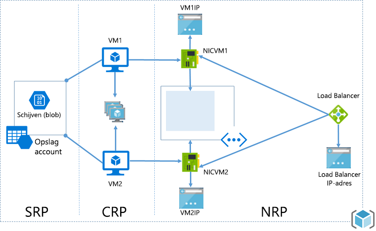
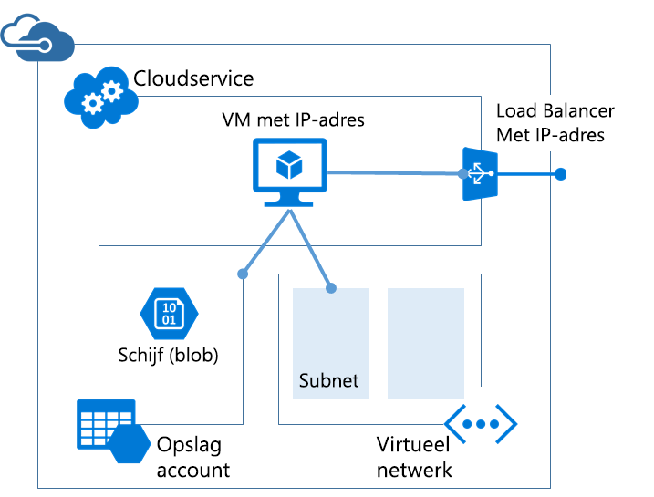

# <a name="azure-resource-manager-vs-classic-deployment-understand-deployment-models-and-the-state-of-your-resources"></a>Azure Resource Manager versus klassieke implementatie: implementatiemodellen en de status van uw resources begrijpen
In dit artikel leert u Azure Resource Manager en de klassieke implementatiemodellen. De resourcemanager en het klassieke implementatiemodel vertegenwoordigen twee verschillende manieren voor het implementeren en beheren van uw Azure-oplossingen. U werkt met ze via twee verschillende sets in de API en geïmplementeerde resources belangrijke verschillen kunnen bevatten. De twee modellen zijn niet compatibel met elkaar. Dit artikel wordt beschreven die verschillen.

Om te vereenvoudigen de implementatie en beheer van resources, wordt aangeraden dat u de Resource Manager voor alle nieuwe resources gebruiken. Indien mogelijk, wordt aangeraden dat u bestaande resources via Resource Manager opnieuw implementeren.

Als u nieuwe naar Resource Manager, wilt u mogelijk eerst doornemen van de terminologie die wordt gedefinieerd in de [overzicht van Azure Resource Manager](resource-group-overview.md).

## <a name="history-of-the-deployment-models"></a>Geschiedenis van het implementatiemodel
Door Azure geleverde oorspronkelijk alleen het klassieke implementatiemodel. In dit model bestonden elke resource afzonderlijk; Er is geen enkele manier verwante resources groeperen. In plaats daarvan moest u handmatig bijhouden welke resources bestaat uit uw oplossing of de toepassing en vergeet niet om deze te beheren in een gecoördineerde benadering. Voor het implementeren van een oplossing, moest u elke resource afzonderlijk via de portal maken of een script maken dat alle bronnen in de juiste volgorde geïmplementeerd. Als u wilt verwijderen van een oplossing, moest u elke resource afzonderlijk verwijderen. U kan niet eenvoudig toepassen en bijwerken van beleid voor toegangsbeheer voor verwante resources. Ten slotte kunt u niet toepassen tags aan resources label met voorwaarden die u helpen uw resources bewaken en beheren van facturering.

In 2014 geïntroduceerd Azure Resource Manager, dat het concept van een resourcegroep wordt toegevoegd. Een resourcegroep is een container voor resources die een gemeenschappelijk levenscyclus delen. Het implementatiemodel van Resource Manager biedt diverse voordelen:

* U kunt implementeren, beheren en bewaken van de services voor uw oplossing als een groep in plaats van afzonderlijk afhandeling van deze services.
* U kunt herhaaldelijk implementeren van uw oplossing gedurende de levenscyclus en erop vertrouwen dat uw resources worden geïmplementeerd in een consistente status.
* U kunt toegangsbeheer toepassen op alle resources in de resourcegroep en deze beleidsregels worden automatisch toegepast wanneer nieuwe resources worden toegevoegd aan de resourcegroep.
* U kunt tags toepassen op de resources om alle resources in uw abonnement op een logische manier te organiseren.
* U kunt notatie JSON (JavaScript Object) gebruiken voor het definiëren van de infrastructuur voor uw oplossing. Het JSON-bestand staat bekend als Resource Manager-sjabloon.
* U kunt de afhankelijkheden tussen resources zo definiëren dat deze in de juiste volgorde worden geïmplementeerd.

Wanneer het Resource Manager werd toegevoegd, zijn met terugwerkende kracht alle resources toegevoegd aan resourcegroepen standaard. Als u een resource via nu klassieke implementatie maakt, wordt automatisch de resource gemaakt binnen een standaardresourcegroep voor de service, ondanks dat u niet die resourcegroep op implementatie aangegeven hebt. Echter betekent alleen bestaande binnen een resourcegroep niet dat de resource is geconverteerd naar het Resource Manager-model.

## <a name="understand-support-for-the-models"></a>Ondersteuning voor de modellen begrijpen
Er zijn drie scenario's moet weten:

1. Cloud-Services biedt geen ondersteuning voor Resource Manager-implementatiemodel.
2. Virtuele machines, opslagaccounts en virtuele netwerken ondersteuning voor Resource Manager en de klassieke implementatiemodellen.
3. Alle andere Azure-services ondersteuning voor Resource Manager.

Voor virtuele machines, opslagaccounts en virtuele netwerken, als de resource is gemaakt via de klassieke implementatie, moet u verder via de klassieke bewerkingen worden uitgevoerd. Als de virtuele machine, de storage-account of het virtuele netwerk is gemaakt via de implementatie van Resource Manager, moet u verder met Resource Manager-bewerkingen. Dit verschil krijgt verwarrend wanneer uw abonnement een combinatie van resources via de Resource Manager en klassieke implementatie gemaakt bevat. Deze combinatie van resources kan onverwachte resultaten niet maken omdat de resources bieden geen ondersteuning voor dezelfde bewerkingen.

In sommige gevallen kan een Resource Manager-opdracht kan informatie ophalen over een bron via de klassieke implementatie gemaakt of een beheertaak zoals een klassieke resource verplaatsen naar een andere resourcegroep kunt uitvoeren. Maar deze gevallen geeft niet de indruk dat het type Resource Manager-bewerkingen ondersteunt. Stel dat u hebt een resourcegroep met een virtuele machine die is gemaakt met het klassieke implementatiemodel. Als u de volgende Resource Manager PowerShell-opdracht uitvoeren:

```powershell
Get-AzureRmResource -ResourceGroupName ExampleGroup -ResourceType Microsoft.ClassicCompute/virtualMachines
```

De virtuele machine wordt:

```powershell
Name              : ExampleClassicVM
ResourceId        : /subscriptions/{guid}/resourceGroups/ExampleGroup/providers/Microsoft.ClassicCompute/virtualMachines/ExampleClassicVM
ResourceName      : ExampleClassicVM
ResourceType      : Microsoft.ClassicCompute/virtualMachines
ResourceGroupName : ExampleGroup
Location          : westus
SubscriptionId    : {guid}
```

Echter, de Resource Manager-cmdlet **Get-AzureRmVM** retourneert alleen virtuele machines die zijn geïmplementeerd via Resource Manager. De volgende opdracht retourneert de virtuele machine via de klassieke implementatie gemaakt.

```powershell
Get-AzureRmVM -ResourceGroupName ExampleGroup
```

Alleen bronnen via Resource Manager support-tags is gemaakt. U kunt tags toepassen op klassieke resources.

## <a name="changes-for-compute-network-and-storage"></a>Wijzigingen voor compute, netwerk en opslag
Het volgende diagram toont compute, netwerk en opslag resources die zijn geïmplementeerd via Resource Manager.



Houd rekening met de volgende relaties tussen de bronnen:

* Alle resources bestaan binnen een resourcegroep.
* De virtuele machine is afhankelijk van een specifieke storage-account dat is gedefinieerd in de Storage resourceprovider voor het opslaan van de schijven in de blob-opslag (vereist).
* De virtuele machine verwijst naar een specifieke NIC die is gedefinieerd in de netwerkresourceprovider (vereist) en een beschikbaarheidsset gedefinieerd in de Compute-resourceprovider (optioneel).
* De NIC verwijst naar de virtuele machine toegewezen IP-adres (vereist), het subnet van het virtuele netwerk voor de virtuele machine (vereist) en een Netwerkbeveiligingsgroep (optioneel).
* Het subnet binnen een virtueel netwerk verwijst naar een Netwerkbeveiligingsgroep (optioneel).
* De load balancer-instantie verwijst naar de back-endpool van IP-adressen die verwijst naar een load balancer openbare of particuliere IP-adres (optioneel) en de NIC van een virtuele machine (optioneel) bevatten.

Hier worden de onderdelen en hun relaties voor klassieke implementatie:



De klassieke oplossing voor het hosten van een virtuele machine bevat:

* Een vereiste cloudservice die als een container fungeert voor het hosten van virtuele machines (berekenen). Virtuele machines worden automatisch voorzien van een netwerkinterfacekaart (NIC) en een IP-adres wordt toegewezen door Azure. Bovendien bevat de cloudservice een externe load balancer-exemplaar, een openbare IP-adres en Standaardeindpunten om toe te staan van extern bureaublad en externe PowerShell verkeer voor virtuele machines op basis van Windows en Secure Shell (SSH) voor op basis van Linux virtuele machines.
* Een vereiste storage-account waarmee de VHD's voor een virtuele machine, met inbegrip van het besturingssysteem, tijdelijk en extra gegevensschijven (opslag) worden opgeslagen.
* Een optioneel virtueel netwerk dat fungeert als een extra container waarin u kunt een structuur in een subnet maken en toewijzen van het subnet waarop de virtuele machine zich bevindt (netwerk).

De volgende tabel beschrijft de wijzigingen in de wisselwerking tussen resourceproviders voor Compute, netwerk en opslag:

| Item | Klassiek | Resource Manager |
| --- | --- | --- |
| Cloudservice voor virtuele machines |Cloudservice was een container voor de opslag van de virtuele machines waarvoor de beschikbaarheid van het platform en taakverdeling vereist was. |Cloudservice is niet langer een object dat is vereist voor het maken van een virtuele machine met het nieuwe model. |
| Virtuele netwerken |Een virtueel netwerk is optioneel voor de virtuele machine. Als opgenomen, kan niet het virtuele netwerk met Resource Manager worden geïmplementeerd. |Virtuele machine vereist een virtueel netwerk dat is geïmplementeerd met Resource Manager. |
| Opslagaccounts |De virtuele machine vereist een opslagaccount waarin de VHD's voor het besturingssysteem, tijdelijk en extra gegevensschijven wordt opgeslagen. |De virtuele machine vereist een opslagaccount voor het opslaan van de schijven in de blob-opslag. |
| Beschikbaarheidssets |De beschikbaarheid van het platform werd aangegeven door de configuratie van dezelfde "AvailabilitySetName" op de virtuele machines. Het maximumaantal foutdomeinen was 2. |Beschikbaarheidsset is een resource die beschikbaar wordt gesteld door Microsoft.Compute-provider. Virtuele machines die uiterst beschikbaar moeten zijn, worden opgenomen in de beschikbaarheidsset. Het maximumaantal foutdomeinen is nu 3. |
| Affiniteitsgroepen |Voor het maken van virtuele netwerken waren affiniteitsgroepen vereist. Door de introductie van regionale virtuele netwerken is dit echter niet meer nodig. |Het concept van affiniteitsgroepen bestaat niet meer in de API's die via Azure Resource Manager beschikbaar worden gesteld. |
| Taakverdeling |Bij het maken van een cloudservice wordt een impliciete load balancer voor de geïmplementeerde virtuele machines aangemaakt. |De load balancer is een resource die beschikbaar wordt gesteld door de Microsoft.Compute-provider. De primaire netwerkinterface van de virtuele machines waarvoor de taken moeten worden verdeeld moet verwijzen naar de load balancer. Load balancers kunnen intern of extern zijn. Een load balancer-exemplaar verwijst naar de back-endpool van IP-adressen die verwijst naar een load balancer openbare of particuliere IP-adres (optioneel) en de NIC van een virtuele machine (optioneel) bevatten. [Meer informatie.](../virtual-network/resource-groups-networking.md) |
| Virtueel IP-adres |Cloud-Services haalt een standaard VIP (virtuele IP-adres) wanneer een virtuele machine wordt toegevoegd aan een cloudservice. Het virtuele IP-adres is het adres dat is gekoppeld aan de impliciete load balancer. |Het openbare IP-adres is een resource die beschikbaar wordt gesteld door de Microsoft.Compute-provider. Openbaar IP-adres kan statisch (gereserveerd) of dynamisch zijn. Dynamische openbare IP-adressen kan worden toegewezen aan een Load Balancer. Openbare IP-adressen kunnen worden beveiligd met beveiligingsgroepen. |
| Gereserveerd IP-adres |U kunt een IP-adres in Azure reserveren en dit koppelen aan een cloudservice om ervoor te zorgen dat het IP-adres is vergrendeld. |Openbaar IP-adres kunnen worden gemaakt in de statische modus en biedt dezelfde mogelijkheden als een gereserveerd IP-adres. |
| Openbaar IP-adres (PIP) per VM |Openbare IP-adressen kan ook worden gekoppeld aan een virtuele machine rechtstreeks. |Het openbare IP-adres is een resource die beschikbaar wordt gesteld door de Microsoft.Compute-provider. Openbaar IP-adres kan statisch (gereserveerd) of dynamisch zijn. |
| Eindpunten |Invoereindpunten moesten eerder op een virtuele machine worden geconfigureerd voor open connectiviteit voor bepaalde poorten. Een van de algemene modi voor het maken van verbinding met virtuele machines wordt gerealiseerd door het instellen van invoereindpunten. |Inkomende NAT-regels kunnen op load balancers worden geconfigureerd om eindpunten in te schakelen op bepaalde poorten voor verbinding met de VM's. |
| DNS-naam |Een cloudservice krijgt een impliciete, globaal unieke DNS-naam. Bijvoorbeeld: `mycoffeeshop.cloudapp.net`. |DNS-namen zijn optionele parameters die voor de resource van een openbaar IP-adres kunnen worden opgegeven. De FQDN-naam is in de volgende indeling - `<domainlabel>.<region>.cloudapp.azure.com`. |
| Netwerkinterfaces |Primaire en secundaire netwerkinterface en de bijbehorende eigenschappen werden gedefinieerd als de netwerkconfiguratie van een virtuele machine. |De netwerkinterface is een resource die beschikbaar wordt gesteld door de Microsoft.Compute-provider. De levenscyclus van de netwerkinterface is niet gekoppeld aan een virtuele machine. Hierin wordt verwezen naar de virtuele machine toegewezen IP-adres (vereist), het subnet van het virtuele netwerk voor de virtuele machine (vereist) en een Netwerkbeveiligingsgroep (optioneel). |

Zie voor meer informatie over het verbinden van virtuele netwerken vanuit verschillende implementatiemodellen, [verbinding maken met virtuele netwerken vanuit verschillende implementatiemodellen in de portal](../vpn-gateway/vpn-gateway-connect-different-deployment-models-portal.md).

## <a name="migrate-from-classic-to-resource-manager"></a>Migreren van klassiek naar Resource Manager
Als u klaar bent om uw resources van klassieke implementatie naar Resource Manager-implementatie, Zie:

1. [Technische deep dive op platform ondersteund migratie van klassiek naar Azure Resource Manager](../virtual-machines/windows/migration-classic-resource-manager-deep-dive.md)
2. [Ondersteund platform migratie van IaaS-middelen van klassiek naar Azure Resource Manager](../virtual-machines/windows/migration-classic-resource-manager-overview.md)
3. [Migreren IaaS-middelen van klassiek naar Azure Resource Manager met behulp van Azure PowerShell](../virtual-machines/windows/migration-classic-resource-manager-ps.md)
4. [Migreren IaaS-middelen van klassiek naar Azure Resource Manager met behulp van Azure CLI](../virtual-machines/virtual-machines-linux-cli-migration-classic-resource-manager.md)

## <a name="frequently-asked-questions"></a>Veelgestelde vragen
**Kan ik een virtuele machine implementeren in een virtueel netwerk gemaakt met behulp van klassieke implementatie met Resource Manager maken?**

Deze configuratie wordt niet ondersteund. U kunt Resource Manager niet gebruiken voor het implementeren van een virtuele machine in een virtueel netwerk dat is gemaakt met de klassieke implementatie.

**Kan ik een virtuele machine met Resource Manager van een gebruikersinstallatiekopie die is gemaakt met het klassieke implementatiemodel maken?**

Deze configuratie wordt niet ondersteund. U kunt echter de VHD-bestanden kopiëren van een opslagaccount die is gemaakt met het klassieke implementatiemodel en toe te voegen aan een nieuw account gemaakt via Resource Manager.

**Wat zijn de gevolgen voor het quotum voor mijn abonnement?**

De quota voor de virtuele machines, virtuele netwerken en opslagaccounts die zijn gemaakt via de Azure Resource Manager zijn gescheiden van andere quota. Elk abonnement krijgt quota voor het maken van de resources met behulp van de nieuwe API's. U vindt [hier](../azure-subscription-service-limits.md) meer informatie over de extra quota.

**Kan ik mijn geautomatiseerde scripts gebruiken voor het inrichten van virtuele machines, virtuele netwerken en opslagaccounts via de API's van Resource Manager doorgaan?**

De automatisering en scripts die u hebt gemaakt blijven werken voor de bestaande virtuele machines, virtuele netwerken die zijn gemaakt in de Azure Service Management-modus. De scripts moeten echter worden bijgewerkt voor het gebruik van het nieuwe schema voor het maken van dezelfde resources via de modus Resource Manager.

**Waar vind ik voorbeelden van Azure Resource Manager-sjablonen**

Een uitgebreide set startsjablonen vindt u op [Azure Resource Manager Quick Start-sjablonen](https://azure.microsoft.com/documentation/templates/).

## <a name="next-steps"></a>Volgende stappen
* Als u wilt helpt bij het maken van een sjabloon met een definitie van een virtuele machine, een opslagaccount en een virtueel netwerk, Zie [overzicht voor Resource Manager-sjabloon](resource-manager-template-walkthrough.md).
* Zie voor de opdrachten voor het implementeren van een sjabloon [Implementeer een toepassing met Azure Resource Manager-sjabloon](resource-group-template-deploy.md).

