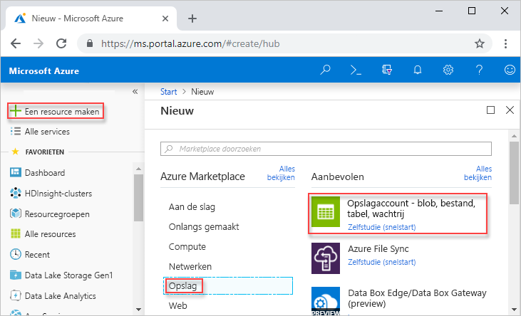
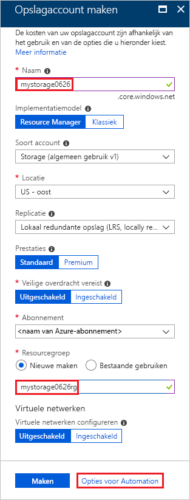
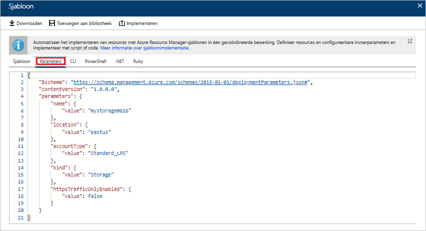
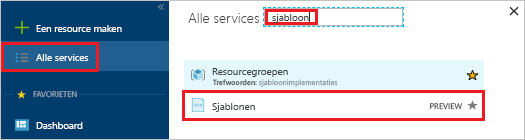
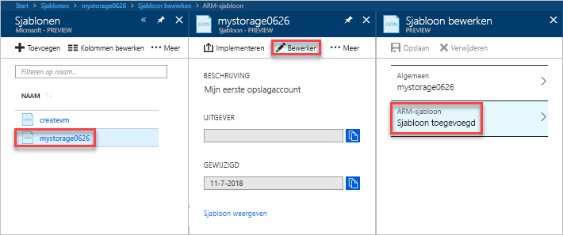
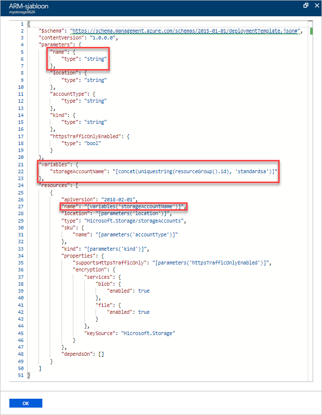
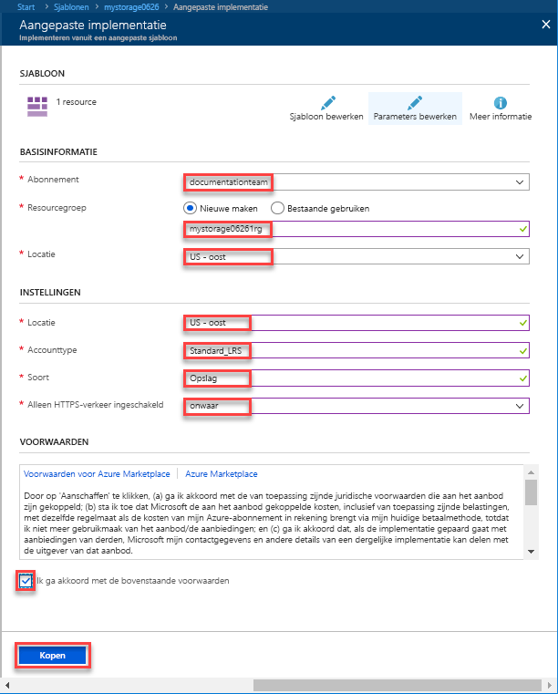
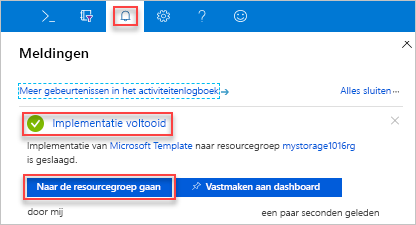

# <a name="quickstart-create-and-deploy-azure-resource-manager-templates-by-using-the-azure-portal"></a>Snelstart: Azure Resource Manager-sjablonen maken en implementeren via Azure Portal

Leer hoe u uw eerste Azure Resource Manager-sjabloon maakt door er een via Azure Portal te maken en hoe u de sjabloon vanaf de portal bewerkt en implementeert.

Resource Manager-sjablonen zijn JSON-bestanden die de resources definiëren die u voor uw oplossing moet implementeren. Als u een sjabloon wilt maken, hoeft u niet altijd bij het begin te beginnen. In deze zelfstudie leert u hoe u via Azure Portal een sjabloon kunt genereren. Vervolgens kunt u de sjabloon aanpassen en implementeren.

Met de instructies in deze zelfstudie wordt een Azure Storage-account gemaakt. U kunt dezelfde procedure gebruiken om andere Azure-resources te maken.

Als u geen abonnement op Azure hebt, maakt u een [gratis account](https://azure.microsoft.com/free/) voordat u begint.

## <a name="generate-a-template-using-the-portal"></a>Een sjabloon maken via de portal

In deze sectie maakt u een Storage-account via Azure Portal. Voordat u het Storage-account implementeert, hebt u de optie de sjabloon te bekijken die op basis van uw configuraties in de portal is gemaakt. U kunt de sjabloon opslaan voor later gebruik.

1. Meld u aan bij [Azure Portal](https://portal.azure.com).
2. Selecteer **Een resource maken** > **Opslag** > **Opslagaccount - blob, bestand, tabel, wachtrij**.

    
3. Voer de volgende informatie in. Zorg ervoor dat u in de volgende stap **Opties voor Automation** in laats van **maken** selecteert, zodat u de sjabloon kunt zien voor dat deze wordt geïmplementeerd.

    - **Naam**: geef het opslagaccount een unieke naam. In de schermafbeelding is de naam *mystorage0626*.
    - **Resourcegroep**: maak een nieuwe Azure-resourcegroep met een naam naar keuze. In de schermafbeelding is de naam van de resourcegroep *mystorage0626rg*.

    Voor de overige eigenschappen kunt u de standaardwaarden gebruiken.

    

    > [!NOTE]
    > Sommige geëxporteerde sjablonen moeten worden bewerkt voordat u ze implementeren.

4. Selecteer **Opties voor Automation** onder aan het scherm. In de portal wordt de sjabloon op het tabblad **Sjabloon** getoond:

    

    In het hoofdvenster wordt de sjabloon getoond. Het is een JSON-bestand met vier elementen van het hoogste niveau. Zie [Informatie over de structuur en de syntaxis van Azure Resource Manager-sjablonen](./resource-group-authoring-templates.md) voor meer informatie

    Onder het element **Parameter** zijn vijf parameters gedefinieerd. Selecteer het tabblad **Parameter** als u de waarden wilt zien die u tijdens de implementatie opgeeft.

    

    Deze waarden geven aan wat u hebt geconfigureerd in de vorige sectie. Met behulp van zowel de sjabloon- als de parameterbestanden kunt u een Azure Storage-account maken.

5. Boven aan de tabbladen bevinden zich drie menuopdrachten:

    - **Downloaden**: download de sjabloon- en de parameterbestanden op uw lokale computer.
    - **Toevoegen aan bibliotheek**: voeg de sjabloon toe aan de bibliotheek voor later gebruik.
    - **Implementeren**: implementeer het Azure Storage-account in Azure.

    In deze zelfstudie gebruikt u de optie **Toevoegen aan bibliotheek**.

6. Selecteer **Toevoegen aan bibliotheek**.
7. Voer **Naam** en **Beschrijving** in en selecteer **Opslaan**.

> [!NOTE]
> De functie van de sjabloonbibliotheek is in de previewfase. De meeste personen kiezen ervoor hun sjablonen op te slaan op hun lokale computer of in een openbare opslagplaats, bijvoorbeeld Github.  

## <a name="edit-and-deploy-the-template"></a>De sjabloon bewerken en implementeren

In deze sectie opent u de opgeslagen sjabloon vanuit de sjabloonbibliotheek, bewerkt u de sjabloon in de portal en implementeert u de herziene sjabloon. Als u een complexere sjabloon wilt bewerken, kunt u gebruikmaken van [Visual Studio Code](./resource-manager-quickstart-create-templates-use-visual-studio-code.md). Dit biedt meer functionaliteit.

Azure vereist dat elke Azure-service een unieke naam heeft. De implementatie mislukt als u de naam van een opslagaccount invoert dat al bestaat. Om dit probleem te vermijden, kunt u een sjabloon voor functieaanroep uniquestring() gebruiken voor het genereren van een unieke opslagaccountnaam.

1. Selecteer in Azure Portal **All services** in het linkermenu, voer **template** in het filtervak in en selecteer **Sjabloon (PREVIEW)**.

    
2. Selecteer de sjabloon die u in de laatste sectie hebt opgeslagen. De naam in de schermafbeelding is *mystorage0626*.
3. Selecteer **Bewerken** en vervolgens **Sjabloon toegevoegd**.

    

4. Voeg een element **variables** toe en voeg vervolgens één variabele toe zoals weergegeven in de volgende schermafbeelding:

    ```json
    "variables": {
        "storageAccountName": "[concat(uniquestring(resourceGroup().id), 'standardsa')]"
    },
    ```
    

    Er worden hier twee functies gebruikt: *concat()* en *uniqueString()*. uniqueString() is handig bij het maken van een unieke naam voor een resource.

5. Verwijder de parameter **name** (gemarkeerd in de vorige schermafbeelding).
6. Werk het naamelement bij van de resource **Microsoft.Storage/storageAccounts** voor gebruik van de nieuw gedefinieerde variabele in plaats van de parameter:

    ```json
    "name": "[variables('storageAccountName')]",
    ```

    De uiteindelijke sjabloon moet er als volgt uitzien:

    ```json
    {
        "$schema": "https://schema.management.azure.com/schemas/2015-01-01/deploymentTemplate.json#",
        "contentVersion": "1.0.0.0",
        "parameters": {
            "location": {
                "type": "string"
            },
            "accountType": {
                "type": "string"
            },
            "kind": {
                "type": "string"
            },
            "httpsTrafficOnlyEnabled": {
                "type": "bool"
            }
        },
        "variables": {
            "storageAccountName": "[concat(uniquestring(resourceGroup().id), 'standardsa')]"
        },
        "resources": [
            {
                "apiVersion": "2018-02-01",
                "name": "[variables('storageAccountName')]",
                "location": "[parameters('location')]",
                "type": "Microsoft.Storage/storageAccounts",
                "sku": {
                    "name": "[parameters('accountType')]"
                },
                "kind": "[parameters('kind')]",
                "properties": {
                    "supportsHttpsTrafficOnly": "[parameters('httpsTrafficOnlyEnabled')]",
                    "encryption": {
                        "services": {
                            "blob": {
                                "enabled": true
                            },
                            "file": {
                                "enabled": true
                            }
                        },
                        "keySource": "Microsoft.Storage"
                    }
                },
                "dependsOn": []
            }
        ]
    }
    ```
7. Selecteer **OK** en selecteer vervolgens **Opslaan** om de wijzigingen op te slaan.
8. Selecteer **Implementeren**.
9. Voer de volgende waarden in:

    - **Abonnement**: selecteer uw Azure-abonnement.
    - **Resourcegroep**: geef de resourcegroep een unieke naam.
    - **Locatie**: selecteer een locatie voor de resourcegroep.
    - **Locatie**: selecteer een locatie voor het opslagaccount.  U kunt dezelfde locatie gebruiken als voor de resourcegroep.
    - **Accounttype**: voer voor deze snelstart **Standard_LRS** in.
    - **Soort**: voer voor deze snelstart **Opslag** in.
    - **Alleen HTTPS-verkeer ingeschakeld**.  Selecteer voor deze snelstart **false**.
    - **Ik ga akkoord met de bovenstaande voorwaarden**: (selecteren)

    Dit is een schermafbeelding van een voorbeeldimplementatie:

    

10. Selecteer **Aankoop**.
11. Selecteer het belpictogram (meldingen) boven in het scherm om de implementatiestatus te zien.

    

12. Selecteer **Ga naar de resourcegroep** in het deelvenster meldingen. U ziet een scherm dat vergelijkbaar is met:

    

    U ziet dat de status van de implementatie is voltooid en er slechts één opslagaccount in de resourcegroep is. De naam van het opslagaccount is een unieke tekenreeks gegenereerd door de sjabloon. Zie voor meer informatie over het gebruik van Azure storage-accounts [Snelstart: blobs uploaden, downloaden, en noteren met behulp van de Azure Portal](../storage/blobs/storage-quickstart-blobs-portal.md).

## <a name="clean-up-resources"></a>Resources opschonen

Schoon de geïmplementeerd Azure-resources, wanneer u deze niet meer nodig hebt, op door de resourcegroep te verwijderen.

1. Selecteer **Resourcegroep** in het linkermenu van Azure Portal.
2. Voer de naam van de resourcegroep in het veld **Filter by name** in.
3. Selecteer de naam van de resourcegroep.  U ziet het opslagaccount in de resourcegroep.
4. Selecteer **Resourcegroep verwijderen** in het bovenste menu.

## <a name="next-steps"></a>Volgende stappen

In deze zelfstudie hebt u geleerd hoe u een sjabloon genereert in Azure Portal en hoe u de sjabloon via de portal implementeert. De gebruikte sjabloon in deze snelstart is een eenvoudige sjabloon met één Azure-resource. Als de sjabloon complex is, kunt u beter Visual Studio Code of Visual Studio gebruiken om de sjabloon te ontwikkelen.

> [!div class="nextstepaction"]
> [Create templates by using Visual Studio Code](./resource-manager-quickstart-create-templates-use-visual-studio-code.md) (Sjablonen maken met Visual Studio Code)
