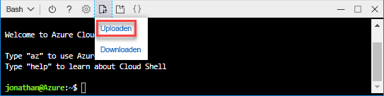

# <a name="quickstart-create-azure-resource-manager-templates-by-using-visual-studio-code"></a>Snelstart: Azure Resource Manager-sjablonen maken met Visual Studio Code

Leer hoe u Azure Resource Manager-sjablonen maakt met behulp van Visual Studio Code en de extensie voor Azure Resource Manager-hulpprogramma's. U kunt Resource Manager-sjablonen maken in Visual Studio Code zonder de extensie, maar de extensie biedt opties voor automatisch aanvullen die het ontwikkelen van sjablonen eenvoudiger maken. Zie [Overzicht van Azure Resource Manager](resource-group-overview.md) voor inzicht in de concepten die gerelateerd zijn aan het implementeren en beheren van uw Azure-oplossingen.

Als u geen abonnement op Azure hebt, maakt u een [gratis account](https://azure.microsoft.com/free/) voordat u begint.

## <a name="prerequisites"></a>Vereisten

Als u dit artikel wilt voltooien, hebt u het volgende nodig:

- [Visual Studio Code](https://code.visualstudio.com/).
- Extensie voor Azure Resource Manager-hulpprogramma's. Gebruik de volgende stappen om deze te installeren:

    1. Open Visual Studio Code.
    2. Druk op **Ctrl+Shift+X** om het deelvenster Extensies te openen
    3. Zoek **Azure Resource Manager-hulpprogramma’s** en selecteer **Installeren**.
    4. Selecteer **Opnieuw laden** om de installatie van de extensie te voltooien.

## <a name="open-a-quickstart-template"></a>Een snelstartsjabloon openen

In plaats van een sjabloon helemaal opnieuw te maken, opent u een sjabloon in [Azure-snelstartsjablonen](https://azure.microsoft.com/resources/templates/). Azure-snelstartsjablonen is een opslagplaats voor Resource Manager-sjablonen.

De in deze snelstart gebruikte sjabloon wordt [Create a standard storage account](https://azure.microsoft.com/resources/templates/101-storage-account-create/) (Standaardopslagaccount maken) genoemd. De sjabloon definieert een Azure Storage-accountresource.

1. Selecteer in Visual Studio Code **Bestand**>**Bestand openen**.
2. Plak de volgende URL in **Bestandsnaam**:

    ```url
    https://raw.githubusercontent.com/Azure/azure-quickstart-templates/master/101-storage-account-create/azuredeploy.json
    ```
3. Selecteer **Openen** om het bestand te openen.
4. Selecteer **Bestand**>**Opslaan als** om het bestand op uw lokale computer op te slaan als **azuredeploy.json**.

## <a name="edit-the-template"></a>De sjabloon bewerken

Als u wilt weten hoe u een sjabloon met behulp van Visual Studio Code bewerkt, voegt u een extra element toe aan de uitvoersectie.

1. Voeg in Visual Studio Code een extra uitvoer toe aan de geëxporteerde sjabloon:

    ```json
    "storageUri": {
      "type": "string",
      "value": "[reference(variables('storageAccountName')).primaryEndpoints.blob]"
    }
    ```

    Als u klaar bent, ziet de uitvoersectie er als volgt uit:

    ```json
    "outputs": {
      "storageAccountName": {
        "type": "string",
        "value": "[variables('storageAccountName')]"
      },
      "storageUri": {
        "type": "string",
        "value": "[reference(variables('storageAccountName')).primaryEndpoints.blob]"
      }
    }
    ```

    Als u de code in Visual Studio Code hebt geplakt, kunt u het element **value** opnieuw typen om een idee te krijgen van de intellisense-mogelijkheden van de extensie voor Resource Manager-hulpprogramma's.

    

2. Selecteer **Bestand**>**Opslaan** om het bestand op te slaan.

## <a name="deploy-the-template"></a>De sjabloon implementeren

Er bestaan meerdere methoden voor het implementeren van sjablonen.  In deze snelstart gebruikt u Cloud Shell van Azure Portal. Cloud Shell ondersteunt zowel Azure CLI als Azure PowerShell. De hier gebruikte instructies maken gebruik van CLI.

1. Meld u aan bij [Azure Portal](https://portal.azure.com)
2. Selecteer **Cloud Shell** in de rechterbovenhoek, zoals weergegeven in de volgende afbeelding:

    

3. Selecteer de pijl-omlaag en vervolgens **Bash** om van CLI naar PowerShell te schakelen.

    
4. Selecteer **Opnieuw starten** om de shell opnieuw te starten.
5. Selecteer **Upload/download files** en selecteer **Uploaden**.

    
4. Selecteer het bestand dat u eerder in de snelstart hebt opgeslagen. De standaardnaam is **azuredeploy.json**.
5. Voer vanaf Cloud Shell de opdracht **ls** uit om te verifiëren of het bestand is geüpload. U kunt de opdracht **cat** gebruiken om de sjablooninhoud te verifiëren.

    
6. Voer vanuit Cloud Shell de volgende opdrachten uit:

    ```cli
    az group create --name <ResourceGroupName> --location <AzureLocation>

    az group deployment create --name <DeploymentName> --resource-group <ResourceGroupName> --template-file <TemplateFileName>
    ```
    Dit is de schermafbeelding van een voorbeeldimplementatie:

    

    In de schermafbeelding worden de volgende waarden gebruikt:

    - **&lt;ResourceGroupName>**: myresourcegroup0709. De parameter komt tweemaal voor.  Zorg ervoor dat u dezelfde waarde gebruikt.
    - **&lt;AzureLocation>**: eastus2
    - **&lt;DeployName>**: mydeployment0709
    - **&lt;TemplateFile>**: azuredeploy.json

    In de uitvoer op de schermafbeelding ziet u dat de naam van het opslagaccount *3tqebj3slyfyestandardsa* is. 

7. Voer de volgende CLI-opdracht uit om het nieuw gemaakte opslagaccount weer te geven:

    ```cli
    az storage account show --resource-group <ResourceGroupName> --name <StorageAccountName>
    ```

## <a name="clean-up-resources"></a>Resources opschonen

Schoon de geïmplementeerd Azure-resources, wanneer u deze niet meer nodig hebt, op door de resourcegroep te verwijderen.

1. Selecteer **Resourcegroep** in het linkermenu van Azure Portal.
2. Voer de naam van de resourcegroep in het veld **Filter by name** in.
3. Selecteer de naam van de resourcegroep.  U ziet in totaal zes resources in de resourcegroep.
4. Selecteer **Resourcegroep verwijderen** in het bovenste menu.

## <a name="next-steps"></a>Volgende stappen

In deze zelfstudie hebt u geleerd hoe u een sjabloon maakt met behulp van Visual Studio Code en hoe u de sjabloon via Cloud Shell in Azure Portal implementeert. In de volgende zelfstudie leert u meer over het ontwikkelen van een sjabloon en het gebruiken sjabloonverwijzing.

> [!div class="nextstepaction"]
> [Een versleuteld Storage-account maken](./resource-manager-tutorial-create-encrypted-storage-accounts.md)
