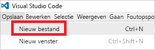
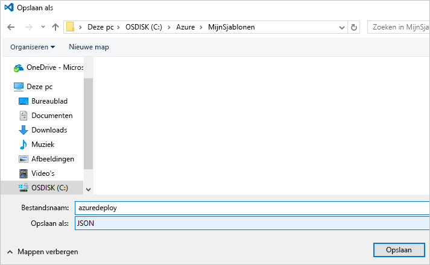

# <a name="use-visual-studio-code-extension-to-create-azure-resource-manager-template"></a>Visual Studio Code-extensie gebruiken om Azure Resource Manager-sjablonen te maken
In dit artikel ziet u de voordelen van het installeren en gebruiken van de Azure Resource Manager-extensie voor hulpprogramma's in Visual Studio Code. U kunt Resource Manager-sjablonen maken in VS Code zonder de extensie, maar de extensie biedt opties voor automatisch aanvullen die het ontwikkelen van sjablonen eenvoudiger maken. Er worden sjabloonfuncties, parameters en variabelen aangeraden die beschikbaar in de sjabloon zijn.

Als u dit artikel wilt voltooien, hebt u [Visual Studio Code](https://code.visualstudio.com/) nodig.

Zie [Overzicht van Azure Resource Manager](resource-group-overview.md) voor inzicht in de concepten die gerelateerd zijn aan het implementeren en beheren van uw Azure-oplossingen.

## <a name="create-the-template"></a>De sjabloon maken

Dit artikel is gebaseerd op de sjabloon die u hebt gemaakt in [Uw eerste Azure Resource Manager-sjabloon maken en implementeren](resource-manager-create-first-template.md). Als u deze sjabloon al hebt, kunt u deze sectie overslaan.

1. Als deze sjabloon eerst moet maken, start u VS Code. Selecteer **Bestand** > **Nieuw bestand**. 

   

2. Kopieer en plak de volgende JSON-syntaxis in het bestand:

   ```json
   {
     "$schema": "http://schema.management.azure.com/schemas/2015-01-01/deploymentTemplate.json#",
     "contentVersion": "1.0.0.0",
     "parameters": {
       "storageSKU": {
         "type": "string",
         "allowedValues": [
           "Standard_LRS",
           "Standard_ZRS",
           "Standard_GRS",
           "Standard_RAGRS",
           "Premium_LRS"
         ],
         "defaultValue": "Standard_LRS",
         "metadata": {
           "description": "The type of replication to use for the storage account."
         }
       },   
       "storageNamePrefix": {
         "type": "string",
         "maxLength": 11,
         "defaultValue": "storage",
         "metadata": {
           "description": "The value to use for starting the storage account name. Use only lowercase letters and numbers."
         }
       }
     },
     "variables": {
       "storageName": "[concat(toLower(parameters('storageNamePrefix')), uniqueString(resourceGroup().id))]"
     },
     "resources": [
       {
         "name": "[variables('storageName')]",
         "type": "Microsoft.Storage/storageAccounts",
         "apiVersion": "2016-01-01",
         "sku": {
           "name": "[parameters('storageSKU')]"
         },
         "kind": "Storage",
         "location": "[resourceGroup().location]",
         "tags": {},
         "properties": {
           "encryption":{
             "services":{
               "blob":{
                 "enabled":true
               }
             },
             "keySource":"Microsoft.Storage"
           }
         }
       }
     ],
     "outputs": {  }
   }
   ```

3. Sla dit bestand als **azuredeploy.json** op in een lokale map.

   

## <a name="install-the-extension"></a>De extensie installeren

1. Selecteer in VS Code **Extensies**.

   

2. Zoek **Azure Resource Manager-hulpprogramma’s** en selecteer **Installeren**.

   

3. Selecteer **Opnieuw laden** om de installatie van de extensie te voltooien.

## <a name="edit-the-template"></a>De sjabloon bewerken

1. Open het bestand azuredeploy.json.

2. De extensie haalt alle beschikbare [sjabloonfuncties](resource-group-template-functions.md) op. Bovendien worden de parameters en variabelen die u hebt gedefinieerd in de sjabloon gelezen. Als u deze functionaliteit wilt zien, voegt u twee waarden toe aan de sectie uitvoer. Vervang in de sjabloon de sectie uitvoer door:

   ```json
   "outputs": { 
       "groupLocation": {
         "type": "string",
         "value": ""
       },
       "storageUri": {
         "type": "string",
         "value": ""
       }
   }
   ```

3. Plaats de cursor binnen de aanhalingstekens voor de waarde in **groupLocation**. Typ het linkerhaakje (`[`). U ziet dat de extensie onmiddellijk de beschikbare sjabloonfuncties aanbeveelt.

   

4. Typ **resourceGroup**. Wanneer de functie `resourceGroup()` wordt weergegeven, drukt u op Tab of Enter.

   

5. De extensie vult de syntaxis van de functie in. De functie [resourceGroup](resource-group-template-functions-resource.md#resourcegroup) accepteert geen parameters. Voeg een punt na het rechterhaakje toe. De extensie geeft de eigenschappen die beschikbaar zijn voor het object dat wordt geretourneerd door de functie `resourceGroup()`. Selecteer `location`.

   

6. Voeg na **locatie** het juiste sluitingshaakje toe.

   ```json
   "outputs": { 
       "groupLocation": {
         "type": "string",
         "value": "[resourceGroup().location]"
       },
       "storageUri": {
         "type": "string",
         "value": ""
       }
   }
   ```

7. Plaats de cursor nu binnen de aanhalingstekens voor **storageUri**. Typ wederom het linkerhaakje. Typ **verwijzing**. Wanneer deze functie is geselecteerd, drukt u op Tab of Enter.

   

8. De [verwijzing](resource-group-template-functions-resource.md#reference) accepteert de resource-ID of naam van de resource als parameter. U hebt de naam van het opslagaccount al in een variabele. Type **var** en selecteer vervolgens Ctrl + spatie. De extensie stelt de functie variabelen voor.

   

   Druk op Tab of Enter.

9. De functie [variabelen](resource-group-template-functions-deployment.md#variables) vereist de naam van de variabele. Voeg een enkel aanhalingsteken toe tussen de haakjes. De extensie biedt de namen van variabelen die u hebt gedefinieerd in de sjabloon.

    

10. Selecteer de variabele **storageName**. Voeg het rechterhaakje toe. In het volgende voorbeeld ziet u de uitvoersectie:

   ```json
   "outputs": { 
       "groupLocation": {
         "type": "string",
         "value": "[resourceGroup().location]"
       },
       "storageUri": {
         "type": "string",
         "value": "[reference(concat('Microsoft.Storage/storageAccounts/',variables('storageName'))).primaryEndpoints.blob]"
       }
   }
   ```

De definitieve sjabloon is:

```json
{
  "$schema": "http://schema.management.azure.com/schemas/2015-01-01/deploymentTemplate.json#",
  "contentVersion": "1.0.0.0",
  "parameters": {
    "storageSKU": {
      "type": "string",
      "allowedValues": [
        "Standard_LRS",
        "Standard_ZRS",
        "Standard_GRS",
        "Standard_RAGRS",
        "Premium_LRS"
      ],
      "defaultValue": "Standard_LRS",
      "metadata": {
        "description": "The type of replication to use for the storage account."
      }
    },   
    "storageNamePrefix": {
      "type": "string",
      "maxLength": 11,
      "defaultValue": "storage",
      "metadata": {
        "description": "The value to use for starting the storage account name. Use only lowercase letters and numbers."
      }
    }
  },
  "variables": {
    "storageName": "[concat(toLower(parameters('storageNamePrefix')), uniqueString(resourceGroup().id))]"
  },
  "resources": [
    {
      "name": "[variables('storageName')]",
      "type": "Microsoft.Storage/storageAccounts",
      "apiVersion": "2016-01-01",
      "sku": {
        "name": "[parameters('storageSKU')]"
      },
      "kind": "Storage",
      "location": "[resourceGroup().location]",
      "tags": {},
      "properties": {
        "encryption":{
          "services":{
            "blob":{
              "enabled":true
            }
          },
          "keySource":"Microsoft.Storage"
        }
      }
    }
  ],
  "outputs": { 
    "groupLocation": {
      "type": "string",
      "value": "[resourceGroup().location]"
    },
    "storageUri": {
      "type": "string",
      "value": "[reference(concat('Microsoft.Storage/storageAccounts/',variables('storageName'))).primaryEndpoints.blob]"
    }
  }
}
```

## <a name="deploy-template"></a>Sjabloon implementeren

U kunt deze sjabloon nu implementeren. U kunt PowerShell of Azure CLI gebruiken om een resourcegroep te maken. Vervolgens implementeert u een opslagaccount in deze resourcegroep.

* Gebruik voor PowerShell de volgende opdrachten uit de map met de sjabloon:

   ```powershell
   Login-AzureRmAccount
   
   New-AzureRmResourceGroup -Name examplegroup -Location "South Central US"
   New-AzureRmResourceGroupDeployment -ResourceGroupName examplegroup -TemplateFile azuredeploy.json
   ```

* Gebruik voor een lokale installatie van Azure CLI de volgende opdrachten uit de map met de sjabloon:

   ```azurecli
   az login

   az group create --name examplegroup --location "South Central US"
   az group deployment create --resource-group examplegroup --template-file azuredeploy.json
   ```

Wanneer de implementatie is voltooid, worden de uitvoerwaarden geretourneerd.

## <a name="clean-up-resources"></a>Resources opschonen

Schoon de geïmplementeerd resources, wanneer u deze niet meer nodig hebt, op door de resourcegroep te verwijderen.

Gebruik voor PowerShell:

```powershell
Remove-AzureRmResourceGroup -Name examplegroup
```

Gebruik voor Azure CLI:

```azurecli
az group delete --name examplegroup
```

## <a name="next-steps"></a>Volgende stappen
* Zie [Azure Resource Manager-sjablonen samenstellen](resource-group-authoring-templates.md) voor meer informatie over de structuur van een sjabloon.
* Zie [Storage accounts template reference](/azure/templates/microsoft.storage/storageaccounts) (Sjabloonverwijzing voor opslagaccounts) voor meer informatie over de eigenschappen van een opslagaccount.
* Zie de [Azure-snelstartsjablonen](https://azure.microsoft.com/documentation/templates/) voor volledige sjablonen voor verschillende soorten oplossingen.
