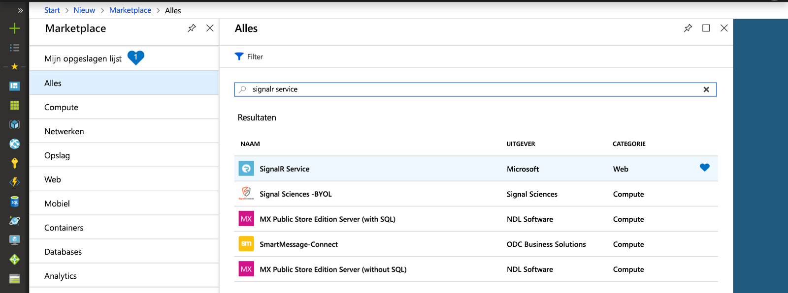
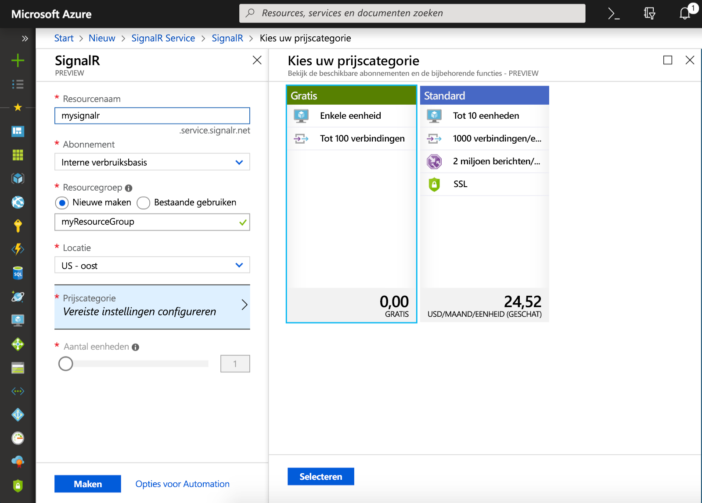

## Een exemplaar van de Azure SignalR Service maken

Uw toepassing maakt verbinding met een SignalR-Service-exemplaar in Azure.

1. Selecteer de knop Nieuw in de linkerbovenhoek van Azure Portal. Typ in het scherm Nieuw *SignalR Service* in het zoekvak in en druk op Enter.

    

1. Selecteer **SignalR Service** in de zoekresultaten en selecteer **Maken**.

1. Voer de volgende instellingen in.

    | Instelling      | Voorgestelde waarde  | Beschrijving                                        |
    | ------------ |  ------- | -------------------------------------------------- |
    | **Resourcenaam** | Wereldwijd unieke naam | Naam ter identificatie van uw nieuwe SignalR Service-exemplaar. Geldige tekens zijn `a-z`, `0-9` en `-`.  | 
    | **Abonnement** | Uw abonnement | Het abonnement waarin dit nieuwe SignalR Service-exemplaar is gemaakt. | 
    | **[Resourcegroep](../../azure-resource-manager/resource-group-overview.md)** |  myResourceGroup | Naam voor de nieuwe resourcegroep waarin het SignalR Service-exemplaar moet worden gemaakt. | 
    | **Locatie** | US - west | Kies een [regio](https://azure.microsoft.com/regions/) bij u in de buurt. |
    | **Prijscategorie** | Gratis | Probeer Azure SignalR Service gratis uit. |
    | **Aantal eenheden** |  Niet van toepassing | Het aantal eenheden geeft aan hoeveel verbindingen uw SignalR Service-exemplaar kan accepteren. Dit kan alleen worden geconfigureerd in de Standard-laag. |

    

1. Selecteer **Maken** om te beginnen met het implementeren van het SignalR-Service-exemplaar.