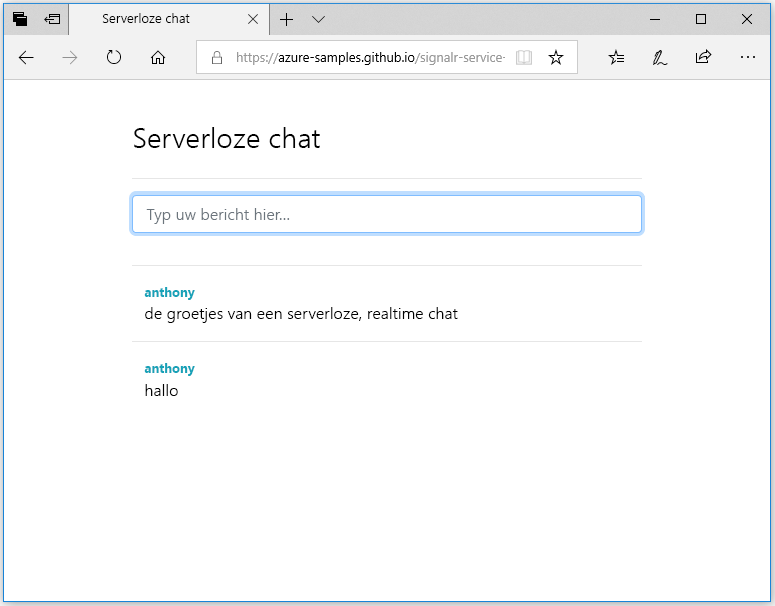

## De webtoepassing uitvoeren

1. Voor uw gemak wordt een voorbeeldwebtoepassing van één pagina in GitHub gehost. Open uw browser naar [https://azure-samples.github.io/signalr-service-quickstart-serverless-chat/demo/chat/](https://azure-samples.github.io/signalr-service-quickstart-serverless-chat/demo/chat/).

    > [!NOTE]
    > De bron van het HTML-bestand bevindt zich in [/docs/demo/chat/index.html](https://github.com/Azure-Samples/signalr-service-quickstart-serverless-chat/blob/master/docs/demo/chat/index.html).

1. Wanneer u om de basis-URL van de functie-app wordt gevraagd, voert u *http://localhost:7071* in.

1. Voer een gebruikersnaam in wanneer hierom wordt gevraagd.

1. De webtoepassing roept de functie *GetSignalRInfo* in de functie-app aan om de verbindingsgegevens voor het verbinden met Azure SignalR Service op te halen. Wanneer de verbinding is voltooid, wordt het invoervak voor het chat-bericht weergegeven.

1. Typ een bericht en druk op Enter. Het bericht wordt verzonden naar de functie *SendMessage* in de Azure-functie-app die vervolgens de SignalR-uitvoerbinding gebruikt om het bericht naar alle verbonden clients te verzenden. Als alles goed werkt, wordt het bericht weergegeven in de toepassing.

    

1. Open een ander exemplaar van de webtoepassing in een ander browservenster. U ziet dat alle verzonden berichten in alle exemplaren van de toepassing worden weergegeven.