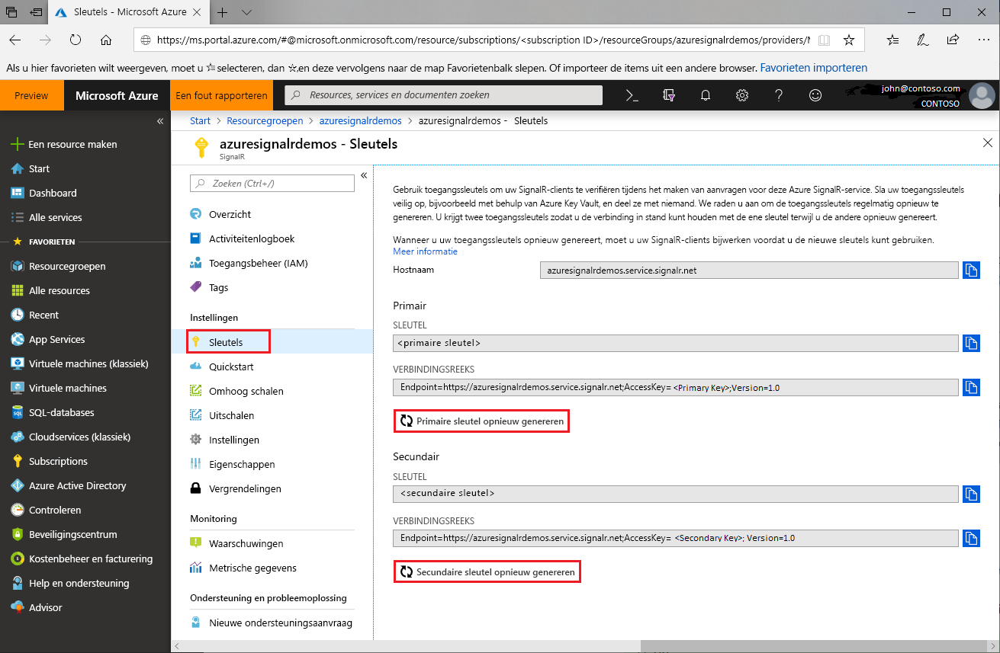

# Toegangssleutels roteren voor Azure SignalR Service

Elk Azure SignalR Service-exemplaar heeft een paar toegangssleutels: een primaire en een secundaire sleutel. Deze worden gebruikt om SignalR-klanten te verifiëren bij aanvragen bij de service. De sleutels zijn gekoppeld aan de eindpunt-URL van het exemplaar. Het is verstandig uw sleutels te beveiligen en regelmatig te roteren. Er worden twee toegangssleutels geleverd, zodat u met één sleutel verbonden kunt blijven terwijl u de andere sleutel opnieuw genereert.

## Waarom moet u toegangssleutels roteren?

Aan ontwikkelaars wordt om veiligheidsredenen en nalevingsvereisten aangeraden toegangssleutels regelmatig te roteren.

## Hoe worden toegangssleutels opnieuw gegenereerd?

1. Ga naar [Azure Portal](https://portal.azure.com/) en meld u aan met uw referenties.

1. Zoek de sectie **Sleutels** in het Azure SignalR Service-exemplaar waarvan u de sleutels opnieuw wilt genereren.

1. Klik op **Sleutels** in het navigatiemenu.

1. Klik op **Primaire sleutel opnieuw genereren** of **Secundaire sleutel opnieuw genereren**.

Er worden een nieuwe sleutel en bijbehorende verbindingsreeks gemaakt en weergegeven.

 

U kunt sleutels ook opnieuw genereren met [Azure CLI](/cli/azure/ext/signalr/signalr/key?view=azure-cli-latest#ext-signalr-az-signalr-key-renew).

## Configuraties bijwerken met nieuwe verbindingsreeksen

1. Kopieer de opnieuw gegenereerde verbindingsreeks.

1. Werk alle configuraties zo bij dat deze gebruikmaken van de nieuwe verbindingsreeks.

1. Start de toepassing opnieuw op, indien nodig.

## Toegangssleutels geforceerd opnieuw genereren

Azure SignalR-Service kan in bepaalde situaties afdwingen dat een toegangssleutel opnieuw wordt gegenereerd. Klanten worden hiervan per e-mail en via de portal op de hoogte gesteld. Als u een dergelijk bericht ontvangt of er een fout in de service optreedt met betrekking tot de toegangssleutel, moet u de sleutels roteren volgens de instructies in dit artikel.

## Volgende stappen

Om veiligheidsredenen is het raadzaam om de toegangssleutels regelmatig te roteren.

In dit artikel hebt u geleerd hoe u toegangssleutels opnieuw kunt genereren. Ga door met de volgende zelfstudies over verificatie met OAuth of met Azure Functions.

> [!div class="nextstepaction"]
> [Integreren met ASP.NET Core-identiteit](./signalr-authenticate-oauth.md)

> [!div class="nextstepaction"]
> [Een serverloze, realtime app met verificatie bouwen](./signalr-authenticate-azure-functions.md)