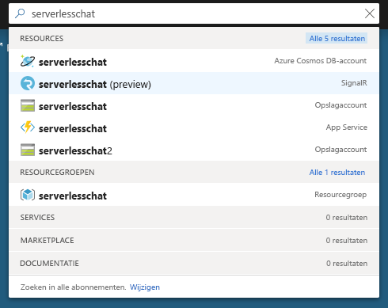
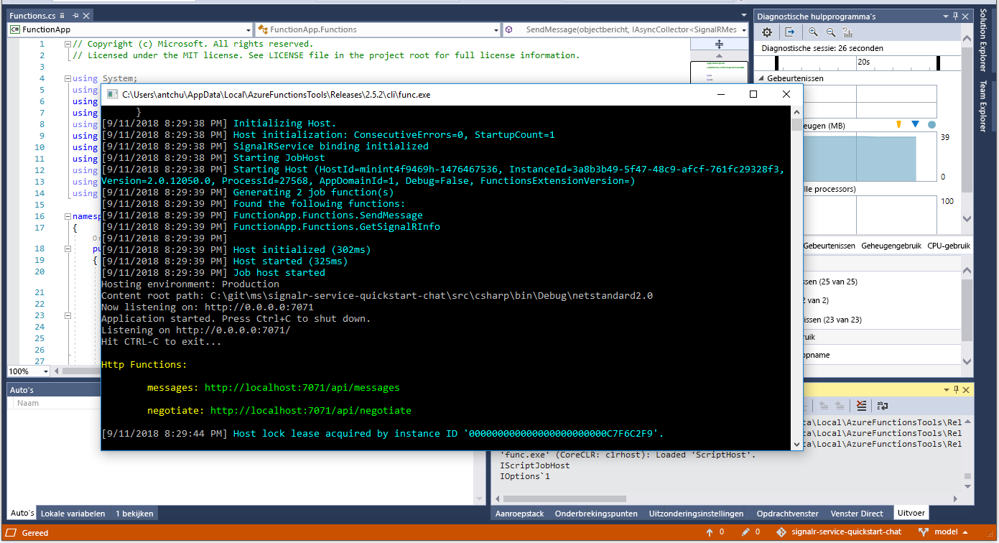

# Snelstart: Een chatruimte maken met Azure Functions en SignalR Service met behulp van C#

Met Azure SignalR Service kunt u eenvoudig realtime functionaliteit toevoegen aan uw toepassing. Azure Functions is een serverloos platform waarmee u uw code kunt uitvoeren zonder een infrastructuur te moeten beheren. In deze snelstart leert u hoe u SignalR Service en Functions gebruikt om een serverloze, realtime chattoepassing te bouwen.

## Vereisten

Als u Visual Studio 2017 nog niet hebt geïnstalleerd, kunt u het downloaden en de **gratis** [Community Edition van Visual Studio 2017](https://www.visualstudio.com/downloads/) gebruiken. Zorg ervoor dat u **Azure-ontwikkeling** inschakelt tijdens de installatie van Visual Studio.

[!INCLUDE [quickstarts-free-trial-note](../../includes/quickstarts-free-trial-note.md)]

## Meld u aan bij Azure.

Meld u met uw Azure-account aan bij Azure Portal op <https://portal.azure.com/>.

[!INCLUDE [Create instance](includes/signalr-quickstart-create-instance.md)]

[!INCLUDE [Clone application](includes/signalr-quickstart-clone-application.md)]

## De Azure Functions-app uitvoeren

1. Start Visual Studio en open de oplossing in de map *chat\src\csharp* van de gekloonde opslagplaats.

1. Controleer in de browser waarin de Azure Portal is geopend of het SignalR Service-exemplaar dat u eerder hebt geïmplementeerd, is gemaakt. Daarvoor typt u de naam ervan in het zoekvak bovenaan de portal. Selecteer het exemplaar om het te openen.

    

1. Selecteer **Sleutels** om de verbindingsreeksen voor het SignalR Service-exemplaar weer te geven.

1. Selecteer en kopieer de primaire verbindingsreeks.

1. Terug in Visual Studio wijzigt u in Solution Explorer de naam van *local.settings.sample.json* in *local.settings.json*.

1. In **local.settings.json** plakt u de verbindingsreeks in de waarde van de instelling **AzureSignalRConnectionString**. Sla het bestand op.

1. Open **Functions.cs**. Deze functie-app bevat twee HTTP-geactiveerde functies:

    - **GetSignalRInfo**: gebruikt de invoergegevensbinding *SignalRConnectionInfo* om geldige verbindingsgegevens te genereren en te retourneren.
    - **SendMessage**: ontvangt een chatbericht in de aanvraagbody en gebruikt de uitvoergegevensbinding *SignalR* om het bericht uit te zenden naar alle verbonden clienttoepassingen.

1. Selecteer in het menu **Fouten opsporen** de optie **Foutopsporing starten** om de toepassing uit te voeren.

    

[!INCLUDE [Run web application](includes/signalr-quickstart-run-web-application.md)]

[!INCLUDE [Cleanup](includes/signalr-quickstart-cleanup.md)]

## Volgende stappen

In deze snelstart hebt u een serverloze, realtime toepassing in VS Code gebouwd en uitgevoerd. Nu volgt meer informatie over het implementeren van Azure Functions vanuit VS Code.

> [!div class="nextstepaction"]
> [Azure Functions met VS Code implementeren](https://code.visualstudio.com/tutorials/functions-extension/getting-started)