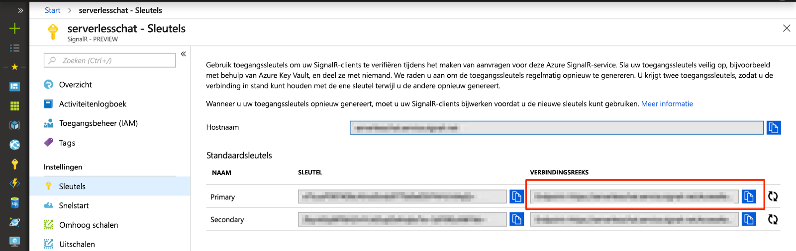

# <a name="quickstart-create-a-chat-room-with-azure-functions-and-signalr-service-using-javascript"></a>Quickstart: Een chatruimte maken met Azure Functions en de service SignalR met behulp van JavaScript

Met de service Azure SignalR kunt u eenvoudig realtimefunctionaliteit toevoegen aan een toepassing. Azure Functions is een serverloos platform waarmee u code kunt uitvoeren zonder een infrastructuur te beheren. In deze quickstart leert u hoe u de service SignalR en Functions gebruikt om een serverloze, realtimechattoepassing te bouwen.


## <a name="prerequisites"></a>Vereisten

Deze quickstart kan worden uitgevoerd op macOS, Windows of Linux.

Zorg ervoor dat u een code-editor hebt geïnstalleerd, bijvoorbeeld [Visual Studio Code](https://code.visualstudio.com/).

Installeer [Azure Functions Core Tools (v2)](https://github.com/Azure/azure-functions-core-tools#installing) om de Azure Function-apps lokaal uit te voeren.

Momenteel moet [.NET Core SDK](https://www.microsoft.com/net/download) zijn geïnstalleerd voor Azure Functions Core Tools om de extensies te installeren. Er is echter geen kennis van .NET vereist om JavaScript Azure-functie-apps te bouwen.

[!INCLUDE [quickstarts-free-trial-note](../../includes/quickstarts-free-trial-note.md)]


## <a name="log-in-to-azure"></a>Meld u aan bij Azure.

Meld u met uw Azure-account aan bij Azure Portal op <https://portal.azure.com/>.


[!INCLUDE [Create instance](includes/signalr-quickstart-create-instance.md)]

[!INCLUDE [Clone application](includes/signalr-quickstart-clone-application.md)]


## <a name="configure-and-run-the-azure-function-app"></a>De Azure-functie-app configureren en uitvoeren

1. Controleer in de browser waarin de Azure-portal is geopend, of het service-exemplaar van SignalR dat u eerder hebt geïmplementeerd, is gemaakt. Hiervoor typt u de naam van het exemplaar in het zoekvak boven in de portal. Selecteer het exemplaar om het te openen.

    

1. Selecteer **Sleutels** om de verbindingsreeksen voor het service-exemplaar van SignalR weer te geven.

1. Selecteer en kopieer de primaire verbindingsreeks.

    

1. Open in de code-editor de map *chat/src/javascript* in de gekloonde opslagplaats.

1. Wijzig de naam *local.settings.sample.json* in *local.settings.json*.

1. Plak in **local.settings.json** de verbindingsreeks in de waarde van de instelling **AzureSignalRConnectionString**. Sla het bestand op.

1. JavaScript-functies zijn georganiseerd in mappen. In elke map zitten twee bestanden: *function.json* definieert de bindingen die worden gebruikt in de functie, en *index.js* is de hoofdtekst van de functie. Deze functie-app bevat twee met HTTP geactiveerde functies:

    - **negotiate**: gebruikt de invoerbinding *SignalRConnectionInfo* om geldige verbindingsgegevens te genereren en te retourneren.
    - **messages**: ontvangt een chatbericht in de hoofdtekst van de aanvraag en gebruikt de uitvoerbinding *SignalR* om het bericht uit te zenden naar alle verbonden clienttoepassingen.

1. Zorg ervoor dat u zich in de terminal in de map *chat/src/javascript* bevindt. Gebruik Azure Functions Core Tools om extensies te installeren die zijn vereist om de app uit te voeren.

    ```bash
    func extensions install
    ```

1. Voer de functie-app uit.

    ```bash
    func start
    ```

    


[!INCLUDE [Run web application](includes/signalr-quickstart-run-web-application.md)]


[!INCLUDE [Cleanup](includes/signalr-quickstart-cleanup.md)]

## <a name="next-steps"></a>Volgende stappen

In deze quickstart hebt u een serverloze, realtimetoepassing in Visual Studio Code gebouwd en uitgevoerd. Nu volgt meer informatie over het ontwikkelen en implementeren van Azure Functions met behulp van Visual Studio Code.

> [!div class="nextstepaction"]
> [Azure Functions ontwikkelen met Visual Studio](../azure-functions/functions-develop-vs.md)