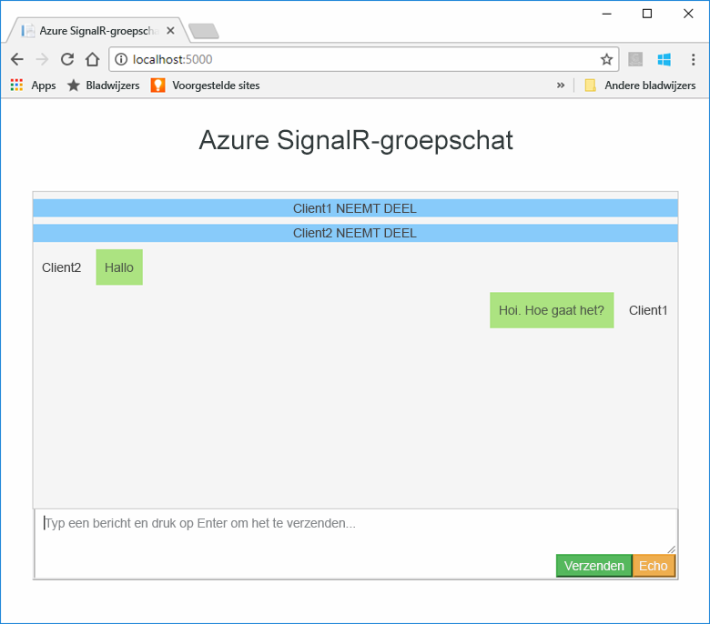
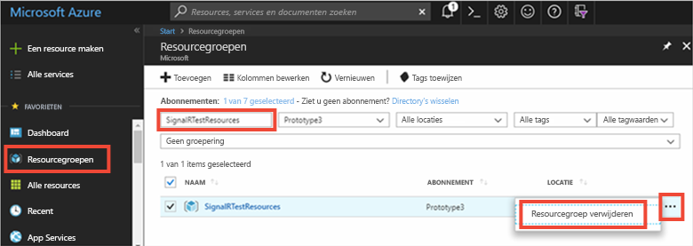

# <a name="quickstart-create-a-chat-room-with-signalr-service"></a>Snelstart: Een chatruimte maken met SignalR Service


De Azure SignalR-service is een Azure-service waarmee ontwikkelaars eenvoudig webtoepassingen met realtime-functies kunnen bouwen. Deze service is gebaseerd op [SignalR voor ASP.NET Core 2.0](https://docs.microsoft.com/aspnet/core/signalr/introduction).

In dit artikel leest u hoe u aan de slag gaat met de Azure SignalR-service. In deze snelstart maakt u een chattoepassing met behulp van een web-app van ASP.NET Core MVC. Deze app maakt verbinding met de resource van de Azure SignalR-service om inhoud in realtime bij te werken. U gaat de webtoepassing lokaal hosten en verbinding maken met verschillende browserclients. Elke client kan bijgewerkte inhoud pushen naar alle andere clients. 


U kunt elke code-editor gebruiken om de stappen in deze snelstart uit te voeren. [Visual Studio Code](https://code.visualstudio.com/) is een uitstekende optie die beschikbaar is op de Windows-, macOS- en Linux-platforms.

De code voor deze zelfstudie is beschikbaar als download in de [GitHub-opslagplaats met AzureSignalR-voorbeelden](https://github.com/aspnet/AzureSignalR-samples/tree/master/samples/ChatRoom).  De Azure-resources die worden gebruikt in deze snelstart kunnen ook worden gemaakt met de instructies in [Een SignalR-service maken](scripts/signalr-cli-create-service.md).



[!INCLUDE [quickstarts-free-trial-note](../../includes/quickstarts-free-trial-note.md)]


## <a name="prerequisites"></a>Vereisten

* De [.NET Core-SDK](https://www.microsoft.com/net/download/windows) installeren
* Download of kloon de [AzureSignalR-voorbeelden](https://github.com/aspnet/AzureSignalR-samples) uit de GitHub-opslagplaats. 

## <a name="create-an-azure-signalr-resource"></a>Een Azure SignalR-resource maken

[!INCLUDE [azure-signalr-create](../../includes/signalr-create.md)]

## <a name="create-an-aspnet-core-web-app"></a>Een ASP.NET Core-web-app maken

In dit gedeelte gebruikt u de [opdrachtregelinterface (CLI) van .NET Core](https://docs.microsoft.com/dotnet/core/tools/) om een nieuw web-app-project van ASP.NET Core MVC te maken. Het voordeel van de CLI van .NET Core ten opzichte van Visual Studio is dat de interface beschikbaar is voor Windows, macOS en Linux. 

1. Maak een nieuwe map voor uw project. In deze snelstart gebruiken we *E:\Testing\chattest*.

2. Voer in de nieuwe map de volgende opdracht uit om een nieuw web-app-project van ASP.NET Core MVC te maken:

        dotnet new mvc


## <a name="add-secret-manager-to-the-project"></a>Secret Manager toevoegen aan het project

In dit gedeelte voegt u het [hulpprogramma Secret Manager](https://docs.microsoft.com/aspnet/core/security/app-secrets) toe aan uw project. Dit hulpprogramma slaat gevoelige gegevens voor ontwikkeltaken op buiten de projectstructuur. Deze aanpak voorkomt dat er per ongeluk appgeheimen worden gedeeld in de broncode.

1. Open het bestand *.csproj*. Voeg een element `DotNetCliToolReference` toe voor *Microsoft.Extensions.SecretManager.Tools*. Voeg ook een element `UserSecretsId` toe zoals hieronder wordt weergegeven en sla het bestand daarna op.

    *chattest.csproj:*

    ```xml
    <Project Sdk="Microsoft.NET.Sdk.Web">
    <PropertyGroup>
        <TargetFramework>netcoreapp2.0</TargetFramework>
        <UserSecretsId>SignalRChatRoomEx</UserSecretsId>
    </PropertyGroup>
    <ItemGroup>
        <PackageReference Include="Microsoft.AspNetCore.All" Version="2.0.0" />
    </ItemGroup>
    <ItemGroup>
        <DotNetCliToolReference Include="Microsoft.VisualStudio.Web.CodeGeneration.Tools" Version="2.0.0" />
        <DotNetCliToolReference Include="Microsoft.Extensions.SecretManager.Tools" Version="2.0.0" />
    </ItemGroup>
    </Project>    
    ```

## <a name="add-azure-signalr-to-the-web-app"></a>Azure SignalR toevoegen aan de web-app

1. Voeg een verwijzing naar het NuGet-pakket `Microsoft.Azure.SignalR` door de volgende opdracht uit te voeren:

        dotnet add package Microsoft.Azure.SignalR -v 1.0.0-*

2. Voer de volgende opdracht uit om pakketten voor uw project te herstellen.

        dotnet restore

3. Voeg een geheim met de naam *Azure:SignalR:ConnectionString* toe aan Secret Manager. 

    Dit geheim bevat straks de verbindingsreeks voor toegang tot de resource van de SignalR-service. *Azure:SignalR:ConnectionString* is de configuratiesleutel waarnaar SignalR standaard zoekt om een verbinding tot stand brengen. Vervang de waarde in de onderstaande opdracht door de verbindingsreeks voor de resource van de SignalR-service.

    Deze opdracht moet worden uitgevoerd in de map met het bestand *.csproj*.

    ```
    dotnet user-secrets set Azure:SignalR:ConnectionString "Endpoint=<Your endpoint>;AccessKey=<Your access key>;"    
    ```

    Secret Manager wordt alleen gebruikt om de web-app te testen terwijl deze lokaal wordt gehost. In een latere zelfstudie gaat u de web-app voor de chatruimte implementeren in Azure. Als dat is gebeurd, gebruikt u een toepassingsinstelling in plaats van de verbindingsreeks op te slaan met Secret Manager.

    Dit geheim is toegankelijk met de configuratie-API. Een dubbele punt (:) werkt in de configuratienaam met de configuratie-API op alle ondersteunde platforms, zie [Configuratie per omgeving](https://docs.microsoft.com/aspnet/core/fundamentals/configuration/index?tabs=basicconfiguration&view=aspnetcore-2.0#configuration-by-environment). 


4. Open *Startup.cs* en werk de methode `ConfigureServices` bij voor het gebruik van de Azure SignalR-service door de methode `services.AddSignalR().AddAzureSignalR()` aan te roepen:

    ```csharp
    public void ConfigureServices(IServiceCollection services)
    {
        services.AddMvc();
        services.AddSignalR().AddAzureSignalR();
    }
    ```

    Doordat er geen parameter wordt doorgegeven voor `AddAzureSignalR()`, wordt in deze code de standaardconfiguratiesleutel *Azure:SignalR:ConnectionString* gebruikt voor de verbindingsreeks voor de resource van de SignalR-service.

5. Verder moet u in *Startup.cs* de methode `Configure` bijwerken door de aanroep van `app.UseStaticFiles()` te vervangen door de onderstaande code. Sla het bestand vervolgens op.

    ```csharp
    app.UseFileServer();
    app.UseAzureSignalR(routes =>
    {
        routes.MapHub<Chat>("/chat");
    });
    ```            

### <a name="add-a-hub-class"></a>Een hub-klasse toevoegen

In SignalR is een hub een belangrijk onderdeel waarmee een set methoden beschikbaar wordt gesteld die kunnen worden aangeroepen vanuit een client. In dit gedeelte gaat u een hub-klasse met twee methoden definiëren: 

* `Broadcast`: met deze methode verstuurt u een bericht naar alle clients.
* `Echo`: met deze methode stuurt u een bericht terug naar de aanroepende functie.

Beide methoden maken gebruik van de interface `Clients` die wordt aangeboden door de SignalR-SDK van ASP.NET Core. Via deze interface hebt u toegang tot alle verbonden clients, zodat u kunt inhoud naar uw clients kunt pushen.

1. Voeg in de projectmap een nieuwe map toe met de naam *Hub*. Voeg een nieuw bestand met hub-code met de naam *Chat.cs* toe aan de nieuwe map.

2. Voeg de volgende code toe aan *Chat.cs* om de hub-klasse te definiëren. Sla het bestand vervolgens op. 

    Werk de naamruimte voor deze klasse bij als u een andere projectnaam dan *chattest* hebt gebruikt.

    ```csharp
    using Microsoft.AspNetCore.SignalR;

    namespace chattest
    {

        public class Chat : Hub
        {
            public void BroadcastMessage(string name, string message)
            {
                Clients.All.SendAsync("broadcastMessage", name, message);
            }

            public void Echo(string name, string message)
            {
                Clients.Client(Context.ConnectionId).SendAsync("echo", name, message + " (echo from server)");
            }
        }
    }
    ```

### <a name="add-the-web-app-client-interface"></a>De clientinterface voor de web-app toevoegen

De clientgebruikersinterface voor deze chatruimte-app bestaat uit HTML en JavaScript in een bestand met de naam *index.html* in de map *wwwroot*.

Kopieer het bestand *index.html* en de mappen *css* en *scripts* van de map *wwwroot* folder in de [opslagplaats met voorbeelden](https://github.com/aspnet/AzureSignalR-samples/tree/master/samples/ChatRoom/wwwroot) naar de map *wwwroot* van uw project.

De hoofdcode van *index.html*: 

```javascript
var connection = new signalR.HubConnectionBuilder()
                            .withUrl('/chat')
                            .build();
bindConnectionMessage(connection);
connection.start()
    .then(function () {
        onConnected(connection);
    })
    .catch(function (error) {
        console.error(error.message);
    });
```    

Met de code in *index.html* wordt `HubConnectionBuilder.build()` aangeroepen om een HTTP-verbinding tot stand te brengen met de Azure SignalR-resource.

Als de verbinding tot stand is gebracht, wordt de verbinding doorgegeven aan `bindConnectionMessage`. Deze functie voegt gebeurtenis-handlers toe om binnenkomende inhoud naar de client te pushen. 

`HubConnection.start()` start de communicatie met de hub. Zodra de communicatie is gestart, voegt `onConnected()` de gebeurtenis-handlers voor knoppen toe. Deze handlers gebruiken de verbinding om deze client in staat te stellen updates van inhoud naar alle verbonden clients te pushen.

## <a name="add-a-development-runtime-profile"></a>Een profiel voor een runtime-ontwikkelomgeving toevoegen

In dit gedeelte voegt u een runtime-ontwikkelomgeving voor ASP.NET Core toe. Zie [Use multiple environments in ASP.NET Core](https://docs.microsoft.com/aspnet/core/fundamentals/environments) (Meerdere omgevingen gebruiken in ASP.NET Core) voor meer informatie over de runtime-omgeving voor ASP.NET Core.

1. Maak een nieuwe map in uw project met de naam *Properties*.

2. Voeg een nieuw bestand met de naam *launchSettings.json* toe aan de map, met de onderstaande inhoud, en sla het bestand vervolgens op.

    ```json
    {
        "profiles" : 
        {
            "ChatRoom": 
            {
                "commandName": "Project",
                "launchBrowser": true,
                "environmentVariables": 
                {
                    "ASPNETCORE_ENVIRONMENT": "Development"
                },
                "applicationUrl": "http://localhost:5000/"
            }
        }
    }
    ```


## <a name="build-and-run-the-app-locally"></a>De app lokaal compileren en uitvoeren

1. Compileer de app met behulp van de .NET Core CLI door de volgende opdracht uit te voeren in de opdrachtshell:

        dotnet build

2. Als het compileren is voltooid, voert u de volgende opdracht uit om de web-app lokaal uit te voeren:

        dotnet run

    De app wordt lokaal gehost op poort 5000, zoals geconfigureerd in ons profiel voor de runtime-ontwikkelomgeving:

        E:\Testing\chattest>dotnet run
        Hosting environment: Development
        Content root path: E:\Testing\chattest
        Now listening on: http://localhost:5000
        Application started. Press Ctrl+C to shut down.    

3. Open twee browservensters en ga in elke browser naar `http://localhost:5000`. U wordt gevraagd uw naam in te voeren. Voer een clientnaam in voor beide clients en test het pushen van berichtinhoud tussen beide clients met behulp van de knop **Send**.

    


## <a name="clean-up-resources"></a>Resources opschonen

Als u verder wilt gaan met de volgende zelfstudie, kunt u de resources die in deze snelstart zijn gemaakt behouden en gebruiken met de volgende zelfstudie.

Als u niet verder wilt met de snelstart, kunt u de Azure-resources verwijderen die in deze snelstart zijn gemaakt om kosten te voorkomen. 

> [!IMPORTANT]
> Het verwijderen van een resourcegroep kan niet ongedaan worden gemaakt. De resourcegroep en alle bijbehorende resources worden permanent verwijderd. Zorg ervoor dat u niet per ongeluk de verkeerde resourcegroep of resources verwijdert. Als u de resources voor het hosten van dit voorbeeld in een bestaande resourcegroep hebt gemaakt en deze groep ook resources bevat die u wilt behouden, kunt u elke resource afzonderlijk verwijderen via hun respectievelijke blade.
> 
> 

Meld u aan bij [Azure Portal](https://portal.azure.com) en klik op **Resourcegroepen**.

Typ de naam van de resourcegroep in het tekstvak **Filteren op naam...**. In de instructies voor deze snelstart is een resourcegroep met de naam *SignalRTestResources* gebruikt. Klik in de resourcegroep in de lijst met resultaten op **...** en vervolgens op **Resourcegroep verwijderen**.

   



U wordt gevraagd om het verwijderen van de resourcegroep te bevestigen. Typ de naam van de resourcegroep om te bevestigen en klik op **Verwijderen**.
   
Na enkele ogenblikken worden de resourcegroep en alle resources in de groep verwijderd.


## <a name="next-steps"></a>Volgende stappen

In deze snelstart hebt u een nieuwe resource voor de Azure SignalR-service gemaakt en deze vervolgens gebruikt met een web-app van ASP.NET Core om bijgewerkte inhoud in realtime naar meerdere verbonden clients te pushen. Als u meer wilt weten over het gebruik van de Azure SignalR-service, gaat u verder met de volgende zelfstudie, waarin verificatie wordt behandeld.

> [!div class="nextstepaction"]
> [Verificatie van Azure SignalR-service](./signalr-authenticate-oauth.md)


