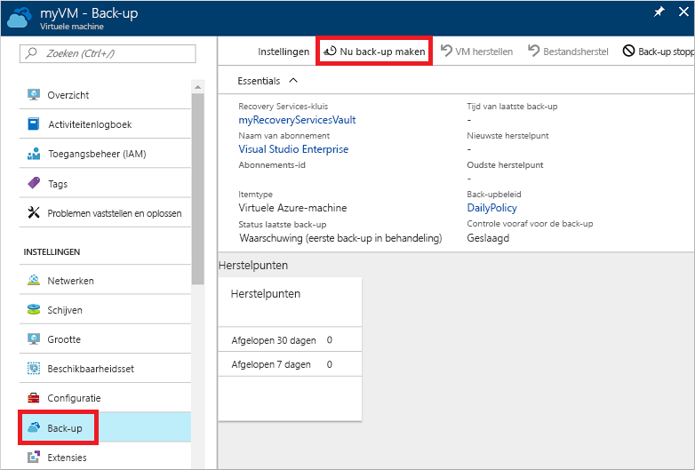
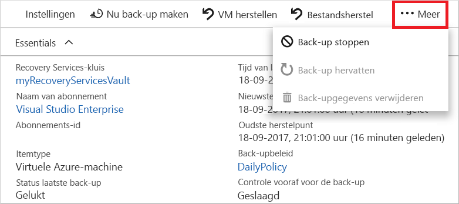

# Een back-up van een virtuele machine maken in Azure
Back-ups in Azure kunt u maken via Azure Portal. Deze methode biedt een gebruikersinterface op basis van een browser voor het maken en configureren van back-ups in Azure en van alle verwante resources. U kunt uw gegevens beschermen door regelmatig back-ups te maken. Gebruik Azure Backup om herstelpunten te maken die kunnen worden opgeslagen in geografisch redundante kluizen van Recovery Services. In dit artikel wordt uitgelegd hoe u een back-up van een virtuele machine (VM) maakt met Azure Portal. 

Deze Quick Start is bedoeld voor een back-up van een bestaande VM in Azure. Als u nog een VM moet maken, kan dat ook [met Azure Portal](../virtual-machines/windows/quick-create-portal.md).

## Meld u aan bij Azure.

Meld u via http://portal.azure.com aan bij Azure Portal.

## VM selecteren waarvan u een back-up wilt maken
U plant als volgt een eenvoudige dagelijkse back-up naar een Recovery Services-kluis. 

1. Selecteer **Virtuele machines** in het menu aan de linkerkant. 
2. Kies in de lijst de VM waarvan u een back-up wilt maken. Als u de opdrachten in de Quick Start voor een voorbeeld-VM hebt gebruikt, heeft de VM de naam *myVM* in de resourcegroep *myResourceGroup*.
3. Kies **Back-up** in de sectie **Instellingen**. Het venster **Back-up inschakelen** wordt geopend.

## Back-up inschakelen voor een VM
Een Recovery Services-kluis is een logische container waarin de back-upgegevens voor elke beveiligde resource worden opgeslagen, zoals virtuele Azure-machines. Wanneer de back-uptaak voor een beveiligde resource wordt uitgevoerd, wordt er binnen de Recovery Services-kluis een herstelpunt gemaakt. U kunt vervolgens een van deze herstelpunten gebruiken om gegevens voor dat tijdstip te herstellen.

1. Selecteer **Nieuwe maken** en geef een naam op voor de nieuwe kluis, zoals **myRecoveryServicesVault**.
2. Als die optie nog niet is geselecteerd, schakelt u het keuzerondje **Bestaande gebruiken** in en selecteert u vervolgens de resourcegroep van de VM in de vervolgkeuzelijst.

    

    De kluis is standaard ingesteld voor geografisch redundante opslag. Voor nog betere bescherming van uw gegevens zorgt dit redundantieniveau ervoor dat uw back-upgegevens worden gerepliceerd naar een secundaire Azure-regio die honderden kilometers van de primaire regio verwijderd is.

    U maakt en gebruikt beleidsregels om te definiëren wanneer een back-uptaak wordt uitgevoerd en hoe lang de herstelpunten worden opgeslagen. Met het standaardbeleid voor beveiliging wordt elke dag een back-uptaak uitgevoerd en worden herstelpunten gedurende 30 dagen bewaard. U kunt deze standaardwaarden gebruiken om uw VM snel te beveiligen. 

3. Selecteer **Back-up inschakelen** om de standaardwaarden voor het back-upbeleid te accepteren.

## Een back-uptaak starten
U kunt een back-up direct starten in plaats van te wachten totdat de back-up volgens het standaardbeleid op het geplande tijdstip wordt uitgevoerd. Met deze eerste back-uptaak wordt een volledig herstelpunt gemaakt. Bij elke volgende back-uptaak worden incrementele herstelpunten gemaakt. Incrementele herstelpunten zijn efficiënt qua opslag en tijd aangezien ze alleen wijzigingen bevatten die sinds de laatste back-up zijn doorgevoerd.

1. Selecteer **Nu back-up maken** in het venster **Back-up** voor de VM.

    

2. Laat de datum bij **Back-up behouden tot en met** ongewijzigd om het back-upbewaarbeleid van 30 dagen te accepteren. Selecteer **Back-up** om de taak te starten.

## Uitvoering van back-uptaak volgen
In het venster **Back-up** voor de VM ziet u de status van de back-up en het aantal voltooide herstelpunten. Zodra de back-up van de VM is voltooid, wordt aan de rechterkant van het venster  **Overzicht** informatie weergegeven zoals **Tijd van de laatste back-up**, **Laatste herstelpunt** en **Oudste herstelpunt**.

## Opschonen van implementatie
Wanneer een back-up niet meer nodig is, kunt u de beveiliging van de VM uitschakelen, de herstelpunten en de Recovery Services-kluis verwijderen, en vervolgens de resourcegroep en de bijbehorende VM-resources verwijderen.

Als u nog een zelfstudie wilt volgen waarin wordt uitgelegd hoe u gegevens terugzet voor een VM, slaat u de stappen in deze sectie over en gaat u naar [Volgende stappen](#next-steps).

1. Selecteer de optie **Back-up** voor uw VM.

2. Selecteer **...Meer** om extra opties weer te geven en kies vervolgens **Back-up stoppen**.

    

3. Selecteer **Back-upgegevens verwijderen** in de vervolgkeuzelijst.

4. Voer in het dialoogvenster **Typ de naam van het back-upitem** de naam van de VM in, zoals *myVM*. Selecteer **Back-up stoppen**.

    Zodra de back-up van de VM is gestopt en de herstelpunten zijn verwijderd, kunt u de resourcegroep verwijderen. Als u een bestaande VM hebt gebruikt, kunt u de resourcegroep en de VM houden.

5. Selecteer **Resourcegroepen** in het menu aan de linkerkant. 
6. Kies uw resourcegroep in de lijst. Als u de opdrachten in de Quick Start voor een voorbeeld-VM hebt gebruikt, heeft de resourcegroep de naam *myResourceGroup*.
7. Selecteer **Resourcegroep verwijderen**. Voer ter bevestiging de naam van de resourcegroep in en selecteer **Verwijderen**.

    

## Volgende stappen
In deze Quick Start hebt u een Recovery Services-kluis gemaakt, de beveiliging op een VM ingeschakeld en het eerste herstelpunt gemaakt. Volg de andere zelfstudies als u nog meer wilt weten over Azure Backup en Recovery Services.

> [!div class="nextstepaction"]
> [Back-up maken van meerdere virtuele Azure-machines](./tutorial-backup-vm-at-scale.md)
