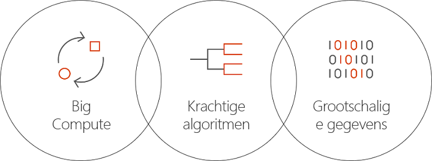

# Wat is Batch AI in Azure?
Batch AI is een beheerde service waarmee gegevenswetenschappers en AI-onderzoekers AI en andere Machine Learning-modellen kunnen trainen op clusters met virtuele Azure-machines, inclusief VM's met GPU-ondersteuning. U beschrijft de vereisten van uw taak, waar de invoer kan worden gevonden en de uitvoer moet worden opgeslagen, en Batch AI doet de rest.  
 
## Waarom Batch AI? 
Het ontwikkelen van krachtige AI-algoritmen is een rekenintensief en iteratief proces. Gegevenswetenschappers en AI-onderzoekers werken met steeds grotere gegevenssets. Ze ontwikkelen modellen met meer lagen, en doen dit met meer experimenten op het gebied van netwerkontwerp en het afstemmen van hyperparameters. Om dit efficiënt te doen zijn meerdere CPU's of GPU's per model vereist, moeten experimenten parallel worden uitgevoerd, en is gedeelde opslag nodig voor trainingsgegevens, logboeken en modeluitvoer.   
 

Gegevenswetenschappers en AI-onderzoekers zijn experts in hun vakgebied, maar het beheren van een infrastructuur op schaal kan een obstakel vormen. Voor het op schaal ontwikkelen van AI zijn veel infrastructuurtaken vereist: inrichten van VM-clusters, installeren van software en containers, in de wachtrij plaatsen van werk, prioriteren en plannen van taken, verwerken van fouten, distribueren van gegevens, delen van resultaten, schalen van resources voor kostenbeheer, en integreren met hulpmiddelen en werkstromen. Deze taken worden verwerkt met Batch AI. 
 
## Wat is Batch AI? 

Batch AI biedt resourcebeheer en taakplanning speciaal bedoeld voor AI-training en -tests. De belangrijkste mogelijkheden omvatten: 

* Uitvoeren van langlopende batchtaken, iteratieve experimenten en interactieve training 
* Automatisch of handmatig schalen van VM-clusters met behulp van GPU's of CPU's 
* SSH-communicatie configureren tussen VM's en voor externe toegang 
* Ondersteuning voor alle Deep Learning- of Machine Learning-frameworks, met geoptimaliseerde configuratie voor populaire toolkits zoals [Microsoft Cognitive Toolkit](https://github.com/Microsoft/CNTK) (CNTK), [TensorFlow](https://www.tensorflow.org/) en [Chainer](https://chainer.org/) 
* Taakwachtrijen op basis van prioriteit om clusters te delen en te profiteren van VM's met lage prioriteit en Azure-reserveringen  
* Flexibele opslagopties inclusief Azure Files en een beheerde NFS-server 
* Koppelen van externe bestandsshares aan de VM en optionele container 
* Taakstatus opgeven en opnieuw starten in het geval van VM-fouten 
* Toegang tot de logboeken met uitvoergegevens, stdout, stderr en modellen, met inbegrip van streaming uit Azure Storage 
* Azure-[opdrachtregelinterface](/cli/azure) (CLI), SDK's voor [Python](https://github.com/Azure/azure-sdk-for-python), [C#](https://www.nuget.org/packages/Microsoft.Azure.Management.BatchAI/1.0.0-preview) en Java, controle in Azure Portal, en integratie met Microsoft AI-hulpprogramma's 

De Batch AI SDK biedt ondersteuning bij het schrijven van scripts of toepassingen voor het beheer van trainingspijplijnen en integratie met hulpprogramma's. De SDK biedt momenteel ondersteuning voor Python, C#, Java en REST API's.  
 

Batch AI maakt gebruik van Azure Resource Manager voor beheerlaagbewerkingen (maken, weergeven, ophalen, verwijderen). Azure Active Directory wordt gebruikt voor verificatie en toegangsbeheer op basis van rollen.  
 
## Batch AI gebruiken 

Voor het gebruik van Batch AI definieert en beheert u *clusters* en *taken*. 

 
Met **clusters** worden uw rekenvereisten beschreven: 
* De Azure-regio waarin u wilt uitvoeren 
* De familie en grootte van de VM die moet worden gebruikt, bijvoorbeeld een NC24-VM met 4 NVIDIA R80-GPU's 
* Het aantal VM's of het minimum en maximum aantal voor automatisch schalen 
* De VM-installatiekopie, bijvoorbeeld Ubuntu 16.04 LTS of [Microsoft Deep Learning Virtual Machine](https://azuremarketplace.microsoft.com/marketplace/apps/microsoft-ads.dsvm-deep-learning)
* Alle externe bestandssharevolumes die moeten worden gekoppeld, bijvoorbeeld vanuit Azure Files of een NFS-server die wordt beheerd met Batch AI 
* Gebruikersnaam en SSH-sleutel of -wachtwoord die moeten worden geconfigureerd op de VM's om interactieve aanmelding in te schakelen voor het opsporen van fouten  
 

Met **taken** worden beschreven: 
* Het cluster en de regio voor gebruik 
* Het aantal VM's voor de taak 
* Invoer- en uitvoermappen die bij het starten moeten worden doorgegeven aan de taak. Hiervoor wordt meestal gebruikgemaakt van het gedeelde bestandssysteem dat is gekoppeld tijdens de clusterinstallatie 
* Een optionele container om uw software of installatiescript uit te voeren 
* Een AI-frameworkconfiguratie of de opdrachtregel en parameters om de taak te starten 
 

Ga aan de slag met Batch AI met behulp van [Azure CLI](/cli/azure) en de configuratiebestanden voor clusters en taken. Gebruik deze methode om snel clusters te maken indien nodig, en om taken uit te voeren om te experimenteren met netwerkontwerp of hyperparameters.  
 

Met Batch AI kunt u eenvoudig parallel werken met meerdere GPU's. Wanneer taken moeten worden geschaald over meerdere GPU's, wordt met Batch AI een beveiligde netwerkconnectiviteit ingesteld tussen de VM's. Wanneer u InfiniBand gebruikt, worden de stuurprogramma's geconfigureerd met Batch AI en wordt MPI gestart op de knooppunten in een taak.  

## Gegevensbeheer
Batch AI biedt flexibele opties voor uw trainingsscripts, gegevens en uitvoer:
  
* Gebruik de **lokale schijf** voor vroege experimenten en kleinere gegevenssets. Voor dit scenario moet u mogelijk via SSH verbinding maken met de VM om scripts te bewerken en logboeken te lezen. 

* Gebruik **Azure Files** om trainingsgegevens te verdelen over meerdere taken, en de logboeken met uitvoergegevens en modellen op één locatie op te slaan 

* Stel een **NFS-server** in ter ondersteuning van een grotere schaal gegevens en VM's voor trainingsdoeleinden. Met Batch AI kan een NFS-server voor u worden ingesteld als een speciaal type cluster, met back-ups van schijven in Azure Storage. 
 
* Een **parallel bestandssysteem** biedt meer schaalbaarheid voor gegevens, en parallelle training. Met Batch AI kunnen geen parallelle bestandssystemen worden beheerd, maar voorbeelden van implementatiesjablonen zijn beschikbaar voor Lustre, Gluster en BeeGFS.  

## Volgende stappen

* Begin met het maken van uw eerste Batch AI-trainingstaak met behulp van [Azure CLI](quickstart-cli.md) of [Python](quickstart-python.md).
* Bekijk voorbeelden van [trainingsrecepten](https://github.com/Azure/BatchAI) voor verschillende frameworks.

