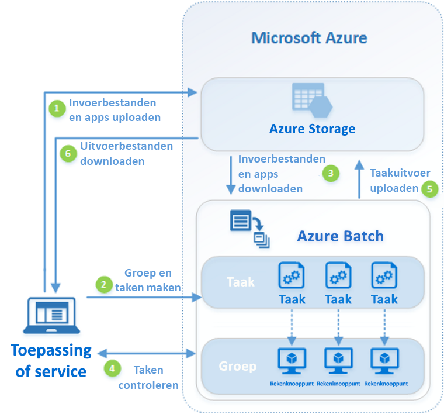

# Wat is Azure Batch?

Met Azure Batch kunt u grootschalige parallelle en HPC-batchrekentaken (High Performance Computing) efficiënt uitvoeren in Azure. Azure Batch maakt en beheert een pool van rekenknooppunten (virtuele machines), installeert de toepassingen die u wilt uitvoeren, en plant het uitvoeren van taken op de knooppunten. Er is geen cluster- of taakplanner-software die u moet installeren, beheren of schalen. In plaats daarvan gebruikt u [Batch-API's en hulpprogramma's](batch-apis-tools.md), scripts voor de opdrachtregel of de Azure-portal voor het configureren, beheren en bewaken van uw taken. 

Ontwikkelaars kunnen Batch gebruiken als een platformservice voor het bouwen van de SaaS-toepassingen of de client-apps waar grootschalige uitvoering is vereist. Bijvoorbeeld een service met Batch bouwen die een Monte Carlo risicosimulatie uitvoert voor een financiële dienstverlener, of een service voor het verwerken van vele installatiekopieën.

Er worden geen extra kosten berekend voor het gebruik van Batch. U betaalt alleen voor bijbehorende verbruikte resources, zoals de virtuele machines, opslag en netwerken.

Zie [HPC-, Batch- en Big Compute-oplossingen](../virtual-machines/linux/high-performance-computing.md) voor een vergelijking tussen Batch en andere HPC-oplossingsopties in Azure.

## Uitvoeren van parallelle workloads
Batch is bijzonder geschikt voor intrinsiek parallelle (ook wel bekend als ‘perfect parallelle’) workloads. Bij intrinsiek parallelle workloads kunnen de toepassingen onafhankelijk worden uitgevoerd en voltooit elke instantie een deel van het werk. Wanneer de toepassingen worden uitgevoerd, kunnen ze toegang krijgen tot een aantal algemene gegevens, maar ze communiceren niet met andere instanties van de toepassing. Intrinsiek parallelle workloads kunnen daarom op grote schaal worden uitgevoerd. Dit wordt bepaald door de hoeveelheid rekenresources die beschikbaar zijn voor toepassingen die tegelijkertijd worden uitgevoerd.

Enkele voorbeelden van intrinsiek parallelle workloads die u kunt overbrengen naar Batch:

* Modellering van financiële risico's met behulp van Monte Carlo-simulaties
* Rendering van VFX en 3D-afbeeldingen
* Analyse en verwerking van beelden
* Transcodering van media
* Genetische sequentieanalyse
* Optische tekenherkenning (OCR)
* Gegevensopname, -verwerking en ETL-bewerkingen
* Software-testuitvoering

U kunt met Batch ook [nauw gekoppelde workloads uitvoeren](batch-mpi.md); dit zijn wo waar de toepassingen die u uitvoert met elkaar moeten communiceren, in tegenstelling tot wanneer ze onafhankelijk van elkaar worden uitgevoerd. Nauw gekoppelde toepassingen gebruiken normaal gesproken de Message Passing Interface (MPI) API. U kunt uw nauw gekoppelde workloads met Batch uitvoeren met behulp van [Microsoft MPI](https://msdn.microsoft.com/library/bb524831(v=vs.85).aspx) of Intel MPI. Toepassingsprestaties verbeteren met gespecialiseerde [HPC](../virtual-machines/linux/sizes-hpc.md) en [GPU-geoptimaliseerde](../virtual-machines/linux/sizes-gpu.md) VM-grootten.

Enkele voorbeelden van nauw gekoppelde workloads:
* Beperkte elementanalyse
* Vloeiende dynamics
* AI-training met meerdere knooppunten

Met behulp van Batch kunnen veel nauw gekoppelde taken parallel worden uitgevoerd. Voer bijvoorbeeld meerdere simulaties uit van een vloeistof die door een leiding met verschillende leidingbreedtes loopt.

## Aanvullende functies van Batch

Workload-specifieke mogelijkheden van een hoger niveau zijn voor Azure Batch ook beschikbaar:
* Batch ondersteunt grootschalige [rendering-workloads](batch-rendering-service.md) met hulpprogramma's voor rendering inclusief Autodesk Maya, 3ds Max, Arnold en V-Ray. 
* R-gebruikers kunnen het [doAzureParallel R-pakket](https://github.com/Azure/doAzureParallel) installeren om eenvoudig de uitvoering van R-algoritmen voor Batch-pools uit te schalen.

U kunt ook Batch-taken uitvoeren als onderdeel van een grotere Azure-werkstroom, beheerd door hulpprogramma's zoals [Azure Data Factory](../data-factory/v1/data-factory-data-processing-using-batch.md).

## Hoe werkt het?
Een gangbare oplossing voor Batch, bestaat uit het uitschalen van intrinsiek parallel werk, zoals de rendering van beelden voor 3D-scènes, op een pool van rekenknooppunten. Deze pool van rekenknooppunten kan uw "render farm" zijn, die tientallen, honderden of zelfs duizenden kernen aan uw renderingjob beschikbaar stelt.

Het volgende diagram toont een algemene Batch-werkstroom, met een clienttoepassing of gehoste service die gebruikmaakt van Batch om een parallelle workload uit te voeren.

|Stap  |Beschrijving  |
|---------|---------|
|1.  Upload de **invoerbestanden** en de **toepassingen** die deze bestanden zullen verwerken naar uw Azure Storage-account.     |De invoerbestanden kunnen alle gegevens zijn die uw toepassing zal verwerken, zoals de modellering van financiële gegevens of te transcoderen videobestanden. De toepassingsbestanden kunnen scripts of toepassingen bevatten die de gegevens verwerken, zoals een mediatranscoder.|
|2.  Maak een Batch-**pool** van rekenknooppunten in uw Batch-account, een **taak** voor het uitvoeren van de workload op de groep, en **opdrachten** binnen de taak.     | Pool-knooppunten zijn de virtuele machines die uw taken uitvoeren. Geef eigenschappen op, zoals het aantal en de grootte van de knooppunten, een Windows- of Linux-VM-installatiekopie, en een toepassing wordt geïnstalleerd wanneer de knooppunten aan de pool worden toegevoegd. Beheer de kosten en de grootte van de pool met behulp van [Lage-prioriteit VM’s](batch-low-pri-vms.md) of [automatisch schalen](batch-automatic-scaling.md) van het aantal knooppunten als de workload wordt gewijzigd.   Wanneer u taken aan een taak toevoegt, plant de Batch-service automatisch de taken voor uitvoering op de rekenknooppunten in de pool. Elke taak maakt gebruik van de toepassing die u hebt geüpload om de invoerbestanden te verwerken. |
|3.  Download **invoerbestanden** en de **toepassingen** in Batch     |Voordat elke taak wordt uitgevoerd, kan deze de invoerbestanden naar het toegewezen rekenknooppunt downloaden. Als de toepassing nog niet op de pool-knooppunten is geïnstalleerd, kan deze in plaats daarvan hier worden gedownload. Als het downloaden vanuit Azure Storage is voltooid, wordt de taak wordt uitgevoerd op het toegewezen knooppunt.|
|4.  **Taakuitvoering** controleren     |Wanneer de taken worden uitgevoerd, kunt u in Batch een query uitvoeren om de voortgang van de taak en de bijbehorende opdrachten te controleren. Uw clienttoepassing of -service communiceert met de Batch-service via HTTPS. Omdat u mogelijk duizenden taken bewaakt die worden uitgevoerd op duizenden rekenknooppunten, moet u ervoor zorgen dat u [een query op de Batch-service op efficiënte wijze uitvoert](batch-efficient-list-queries.md).|
|5.  **Taakuitvoer** uploaden     |Nadat de taken zijn voltooid, kunnen ze hun resultaatgegevens uploaden naar Azure Storage. U kunt ook bestanden rechtstreeks ophalen van het bestandssysteem op een rekenknooppunt.|
|6.  **Uitvoerbestanden** downloaden     |Wanneer u bij uw controle detecteert dat de taken in uw job zijn voltooid, kan uw clienttoepassing of service de uitvoergegevens downloaden voor verdere verwerking.|

Houd er rekening mee dat dit slechts één manier is om Batch te gebruiken en dat in dit scenario slechts enkele van de beschikbare functies worden beschreven. Bijvoorbeeld, kunt u [meerdere taken parallel](batch-parallel-node-tasks.md) op elk rekenknooppunt uitvoeren. Of gebruik [taakvoorbereiding en -voltooiingsopdrachten](batch-job-prep-release.md) om de knooppunten voor te bereiden op uw taken, schoon het daarna op. 

Zie het [Overzicht van de Batch-functies voor ontwikkelaars](batch-api-basics.md) voor meer gedetailleerde informatie over pools, knooppunten, opdrachten en taken, en de vele API-functies die u tijdens het bouwen van uw Batch-toepassing kunt gebruiken. 

## Volgende stappen

Lees een van deze snelstartgidsen om snel aan de slag te gaan met Azure Batch:
* [Uw eerste Batch-taak uitvoeren met Azure CLI](quick-create-cli.md)
* [Uw eerste Batch-taak uitvoeren met de Azure-portal](quick-create-portal.md)
* [Uw eerste Batch-taak uitvoeren met de .NET-API](quick-run-dotnet.md)
* [Uw eerste Batch-taak uitvoeren met de Python-API](quick-run-python.md)

