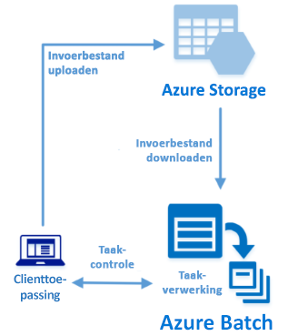

# <a name="quickstart-run-your-first-azure-batch-job-with-the-net-api"></a>Snelstartgids: Uw eerste Azure Batch-taak uitvoeren met .NET API

In deze snelstartgids wordt een Azure Batch-taak uitgevoerd vanuit een C#-toepassing die is gebouwd op de Azure Batch .NET API. Met de app worden verschillende invoerbestanden geüpload naar Azure-opslag en wordt vervolgens een *pool* met Batch-rekenknooppunten (virtuele machines) gemaakt. Vervolgens wordt een *Batch-voorbeeldtaak* gemaakt waarmee *taken* worden uitgevoerd om elk invoerbestand in de pool te verwerken met behulp van een basisopdracht. Nadat u deze snelstartgids hebt voltooid, begrijpt u de belangrijkste principes van de Batch-service en bent u er klaar voor om Batch op grotere schaal te gebruiken voor meer realistische workloads.



[!INCLUDE [quickstarts-free-trial-note.md](../../includes/quickstarts-free-trial-note.md)]

## <a name="prerequisites"></a>Vereisten

* [Visual Studio IDE](https://www.visualstudio.com/vs) (Visual Studio 2015 of een nieuwere versie). 

* Een Batch-account en een gekoppeld Azure Storage-account. Raadpleeg de Batch-quickstarts met behulp van [Azure Portal](quick-create-portal.md) of [Azure CLI](quick-create-cli.md) voor instructies voor het maken van deze accounts. 

## <a name="sign-in-to-azure"></a>Aanmelden bij Azure

Meld u aan bij de Azure Portal op [https://portal.azure.com](https://portal.azure.com).

[!INCLUDE [batch-common-credentials](../../includes/batch-common-credentials.md)]

## <a name="download-the-sample"></a>Het voorbeeld downloaden

[Download of kloon de voorbeeld-app](https://github.com/Azure-Samples/batch-dotnet-quickstart) vanuit GitHub. Als u de opslagplaats van de voorbeeld-app wilt klonen met een Git-client, gebruikt u de volgende opdracht:

```
git clone https://github.com/Azure-Samples/batch-dotnet-quickstart.git
```

Ga naar de map met het Visual Studio-oplossingsbestand `BatchDotNetQuickstart.sln`.

Open het oplossingsbestand in Visual Studio en werk de referentietekenreeksen in `program.cs` bij met de waarden die u hebt verkregen voor uw accounts. Bijvoorbeeld:

```csharp
// Batch account credentials
private const string BatchAccountName = "mybatchaccount";
private const string BatchAccountKey  = "xxxxxxxxxxxxxxxxE+yXrRvJAqT9BlXwwo1CwF+SwAYOxxxxxxxxxxxxxxxx43pXi/gdiATkvbpLRl3x14pcEQ==";
private const string BatchAccountUrl  = "https://mybatchaccount.mybatchregion.batch.azure.com";

// Storage account credentials
private const string StorageAccountName = "mystorageaccount";
private const string StorageAccountKey  = "xxxxxxxxxxxxxxxxy4/xxxxxxxxxxxxxxxxfwpbIC5aAWA8wDu+AFXZB827Mt9lybZB1nUcQbQiUrkPtilK5BQ==";
```

## <a name="build-and-run-the-app"></a>De app bouwen en uitvoeren

Bouw een toepassing en voer deze uit om de Batch-werkstroom in actie te zien. Nadat de toepassing is uitgevoerd, bekijkt u de code voor meer informatie over wat elk onderdeel van de toepassing doet. 

* Klik met de rechtermuisknop op de oplossing in Solution Explorer en klik op **Build-oplossing**. 

* Bevestig het herstel van alle NuGet-pakketten als dit wordt gevraagd. Als u ontbrekende pakketten wilt downloaden, zorgt u ervoor dat [NuGet-pakketbeheer](https://docs.nuget.org/consume/installing-nuget) is geïnstalleerd.

Voer dit pakketbeheer vervolgens uit. Wanneer u de voorbeeldtoepassing uitvoert, ziet de uitvoer van de console er ongeveer als volgt uit. De actieve uitvoering wordt bij `Monitoring all tasks for 'Completed' state, timeout in 00:30:00...` onderbroken terwijl de rekenknooppunten van de pool worden gestart. Taken worden in de wachtrij geplaatst om te worden uitgevoerd zodra het eerste rekenknooppunt actief is. Ga naar uw Batch-account in [Azure Portal](https://portal.azure.com) om de pool, rekenknooppunten en taken te controleren.

```
Sample start: 12/4/2017 4:02:54 PM

Container [input] created.
Uploading file taskdata0.txt to container [input]...
Uploading file taskdata1.txt to container [input]...
Uploading file taskdata2.txt to container [input]...
Creating pool [DotNetQuickstartPool]...
Creating job [DotNetQuickstartJob]...
Adding 3 tasks to job [DotNetQuickstartJob]...
Monitoring all tasks for 'Completed' state, timeout in 00:30:00...
```

Nadat taken zijn voltooid, ziet u uitvoer voor elke taak die er ongeveer als volgt uitziet:

```
Printing task output.
Task: Task0
Node: tvm-2850684224_3-20171205t000401z
Standard out:
Batch processing began with mainframe computers and punch cards. Today it still plays a central role in business, engineering, science, and other pursuits that require running lots of automated tasks....
stderr:
...
```

Wanneer u de toepassing uitvoert in de standaardconfiguratie, bedraagt de uitvoeringstijd doorgaans ongeveer 5 minuten. De eerste keer dat u de pool instelt, neemt dit de meeste tijd in beslag. Als u de taak opnieuw wilt uitvoeren, verwijdert u de taak uit de vorige uitvoering en verwijdert u de groep niet. Bij een vooraf geconfigureerde pool is de taak binnen een paar seconden voltooid.


## <a name="review-the-code"></a>De code bekijken

Met de .NET-app in deze snelstartgids worden de volgende bewerkingen uitgevoerd:

* Er worden drie kleine tekstbestanden geüpload naar een blobcontainer in het Azure-opslagaccount. Deze bestanden bevatten invoergegevens voor verwerking met Batch.
* Er wordt een pool met rekenknooppunten gemaakt waarop Windows Server wordt uitgevoerd.
* Er wordt een Batch-taak gemaakt, plus drie taken die moeten worden uitgevoerd op de knooppunten. Met elke taak wordt een van de invoerbestanden verwerkt met behulp van een Windows-opdrachtregel. 
* Er worden bestanden weergegeven die zijn geretourneerd met de taken.

Bekijk het bestand `Program.cs` en de volgende secties voor de details. 

### <a name="preliminaries"></a>Voorbereidingen

De app gebruikt de Azure Storage-clientbibliotheek voor .NET om te kunnen werken met een opslagaccount. Er wordt een verwijzing naar het account gemaakt met [CloudStorageAccount](/dotnet/api/microsoft.windowsazure.storage.cloudstorageaccount) en van hieruit wordt een [CloudBlobClient](/dotnet/api/microsoft.windowsazure.storage.blob.cloudblobclient) gemaakt.

```csharp
CloudBlobClient blobClient = storageAccount.CreateCloudBlobClient();
```

De app gebruikt de `blobClient`-verwijzing om een container te maken in het opslagaccount en om gegevensbestanden naar de container te uploaden. De bestanden in de opslag zijn gedefinieerd als Batch [ResourceFile](/dotnet/api/microsoft.azure.batch.resourcefile)-objecten die later met Batch kunnen worden gedownload op rekenknooppunten.

```csharp
List<string> inputFilePaths = new List<string>
{
    @"..\..\taskdata0.txt",
    @"..\..\taskdata1.txt",
    @"..\..\taskdata2.txt"
};

List<ResourceFile> inputFiles = new List<ResourceFile>();

foreach (string filePath in inputFilePaths)
{
    inputFiles.Add(UploadFileToContainer(blobClient, inputContainerName, filePath));
}
```

De app maakt een [BatchClient](/dotnet/api/microsoft.azure.batch.batchclient)-object om pools, Batch-taken en taken in de Batch-service te maken en te beheren. De Batch-client in het voorbeeld gebruikt verificatie op basis van gedeelde sleutels. (Batch ondersteunt ook Azure Active Directory-verificatie.)

```csharp
BatchSharedKeyCredentials cred = new BatchSharedKeyCredentials(BatchAccountUrl, BatchAccountName, BatchAccountKey);

using (BatchClient batchClient = BatchClient.Open(cred))
...    
```

### <a name="create-a-pool-of-compute-nodes"></a>Een pool van rekenknooppunten maken

Voor het maken van een Batch-pool gebruikt de app de [BatchClient.PoolOperations.CreatePool](/dotnet/api/microsoft.azure.batch.pooloperations.createpool)-methode om het aantal knooppunten, de VM-grootte en de poolconfiguratie in te stellen. Hier geeft het [VirtualMachineConfiguration](/dotnet/api/microsoft.azure.batch.virtualmachineconfiguration)-object een [ImageReference](/dotnet/api/microsoft.azure.batch.imagereference) naar een Windows Server-installatiekopie op die is gepubliceerd in Azure Marketplace. Batch ondersteunt diverse Linux- en Windows Server-installatiekopieën in Azure Marketplace, evenals aangepaste VM-installatiekopieën.

Het aantal knooppunten (`PoolNodeCount`) en de VM-grootte (`PoolVMSize`) zijn gedefinieerde constanten. In het voorbeeld wordt standaard een pool met *Standard_A1_v2*-knooppunten van 2 grootten gemaakt. De voorgestelde grootte in dit snelle voorbeeld biedt een goede balans tussen prestaties en kosten. 

Met de [Commit](/dotnet/api/microsoft.azure.batch.cloudpool.commit)-methode wordt de pool naar de Batch-service verzonden.

```csharp
ImageReference imageReference = new ImageReference(
    publisher: "MicrosoftWindowsServer",
    offer: "WindowsServer",
    sku: "2012-R2-Datacenter-smalldisk",
    version: "latest");

VirtualMachineConfiguration virtualMachineConfiguration =
new VirtualMachineConfiguration(
   imageReference: imageReference,
   nodeAgentSkuId: "batch.node.windows amd64");

try
{
    CloudPool pool = batchClient.PoolOperations.CreatePool(
    poolId: PoolId,
    targetDedicatedComputeNodes: PoolNodeCount,
    virtualMachineSize: PoolVMSize,
    virtualMachineConfiguration: virtualMachineConfiguration);

    pool.Commit();
}
...

```
### <a name="create-a-batch-job"></a>Een Batch-taak maken

Een Batch-taak is een logische groep met een of meer taken. Een Batch-taak omvat instellingen die gemeenschappelijk zijn voor de taken, zoals prioriteit en de pool waarop taken moeten worden uitgevoerd. De app gebruikt de [BatchClient.JobOperations.CreateJob](/dotnet/api/microsoft.azure.batch.joboperations.createjob)-methode om een Batch-taak te maken in de pool. 

Met de [Commit](/dotnet/api/microsoft.azure.batch.cloudjob.commit)-methode wordt de taak naar de Batch-service verzonden. De Batch-taak heeft in eerste instantie geen taken.

```csharp
try
{
    CloudJob job = batchClient.JobOperations.CreateJob();
    job.Id = JobId;
    job.PoolInformation = new PoolInformation { PoolId = PoolId };

    job.Commit(); 
}
...       
```

### <a name="create-tasks"></a>Taken maken
De app maakt een lijst met [CloudTask](/dotnet/api/microsoft.azure.batch.cloudtask)-objecten. Met elke taak wordt een `ResourceFile`-invoerobject verwerkt met behulp van een eigenschap [CommandLine](/dotnet/api/microsoft.azure.batch.cloudtask.commandline). In het voorbeeld wordt met de opdrachtregel de opdracht `type` voor Windows uitgevoerd om het invoerbestand weer te geven. Deze opdracht is een eenvoudig voorbeeld voor demonstratiedoeleinden. Wanneer u Batch gebruikt, geeft u uw app of script op de opdrachtregel op. Batch biedt een aantal manieren om apps en scripts te implementeren op rekenknooppunten.

Vervolgens worden met de app taken toegevoegd aan de Batch-taak met behulp van de [AddTask](/dotnet/api/microsoft.azure.batch.joboperations.addtask)-methode. Deze methode plaatst de taken in een wachtrij voor uitvoering op de rekenknooppunten. 

```csharp
for (int i = 0; i < inputFiles.Count; i++)
{
    string taskId = String.Format("Task{0}", i);
    string inputFilename = inputFiles[i].FilePath;
    string taskCommandLine = String.Format("cmd /c type {0}", inputFilename);

    CloudTask task = new CloudTask(taskId, taskCommandLine);
    task.ResourceFiles = new List<ResourceFile> { inputFiles[i] };
    tasks.Add(task);
}

batchClient.JobOperations.AddTask(JobId, tasks);
```
 
### <a name="view-task-output"></a>Taakuitvoer weergeven

De app maakt een [TaskStateMonitor](/dotnet/api/microsoft.azure.batch.taskstatemonitor) om te controleren of de taken worden voltooid. Vervolgens gebruikt de app de eigenschap [CloudTask.ComputeNodeInformation](/dotnet/api/microsoft.azure.batch.cloudtask.computenodeinformation) om het `stdout.txt`-bestand weer te geven dat wordt gegenereerd na elke voltooide taak. Wanneer de taak is voltooid, wordt de uitvoer van de taakopdracht geschreven naar `stdout.txt`:

```csharp
foreach (CloudTask task in completedtasks)
{
    string nodeId = String.Format(task.ComputeNodeInformation.ComputeNodeId);
    Console.WriteLine("Task: {0}", task.Id);
    Console.WriteLine("Node: {0}", nodeId);
    Console.WriteLine("Standard out:");
    Console.WriteLine(task.GetNodeFile(Constants.StandardOutFileName).ReadAsString());
}
```

## <a name="clean-up-resources"></a>Resources opschonen

De gemaakte opslagcontainer wordt automatisch verwijderd met de app en u krijgt de mogelijkheid de Batch-pool en -taak te verwijderen. Er worden kosten berekend voor de pool zolang de knooppunten actief zijn, zelfs als er geen taken zijn gepland. Verwijder de pool wanneer u deze niet meer nodig hebt. Wanneer u de pool verwijdert, wordt ook alle taakuitvoer op de knooppunten verwijderd.

Verwijder de resourcegroep, het Batch-account en het opslagaccount wanneer u deze niet meer nodig hebt. Hiervoor selecteert u in Azure Portal de resourcegroep voor het Batch-account en klikt u op **Resourcegroep verwijderen**.

## <a name="next-steps"></a>Volgende stappen

In deze snelstartgids hebt u een kleine app gebouwd met behulp van de Batch .NET API om een Batch-pool en een Batch-taak te maken. Met de taak zijn voorbeeldtaken uitgevoerd, en u hebt de uitvoer van de knooppunten gedownload. Nu u de belangrijkste principes van de Batch-service begrijpt, bent u er klaar voor om Batch op grotere schaal te gebruiken voor meer realistische workloads. Ga verder met de Batch .NET-zelfstudie voor meer informatie over Azure Batch en een stapsgewijze uitleg over een parallelle workload met een toepassing uit de praktijk.


> [!div class="nextstepaction"]
> [Een parallelle workload verwerken met .NET](tutorial-parallel-dotnet.md)
