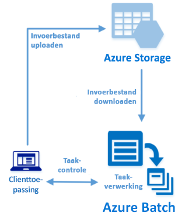

# <a name="quickstart-run-your-first-batch-job-with-the-python-api"></a>Snelstartgids: Uw eerste Batch-taak uitvoeren met de Python API

In deze snelstartgids wordt een Azure Batch-taak uitgevoerd vanuit een toepassing die is gebouwd op de Azure Batch Python API. Met de app worden verschillende invoerbestanden geüpload naar Azure-opslag en wordt vervolgens een *pool* met Batch-rekenknooppunten (virtuele machines) gemaakt. Vervolgens wordt een *Batch-voorbeeldtaak* gemaakt waarmee *taken* worden uitgevoerd om elk invoerbestand in de pool te verwerken met behulp van een basisopdracht. Nadat u deze snelstartgids hebt voltooid, begrijpt u de belangrijkste principes van de Batch-service en bent u er klaar voor om Batch op grotere schaal te gebruiken voor meer realistische workloads.
 


[!INCLUDE [quickstarts-free-trial-note.md](../../includes/quickstarts-free-trial-note.md)]

## <a name="prerequisites"></a>Vereisten

* [Python-versie 2.7 of 3.3 of later](https://www.python.org/downloads/)

* [PIP](https://pip.pypa.io/en/stable/installing/)-pakketbeheer

* Een Azure Batch-account en een gekoppeld Azure Storage-account. Raadpleeg de Batch-quickstarts met behulp van [Azure Portal](quick-create-portal.md) of [Azure CLI](quick-create-cli.md) voor instructies voor het maken van deze accounts. 

## <a name="sign-in-to-azure"></a>Aanmelden bij Azure

Meld u aan bij de Azure Portal op [https://portal.azure.com](https://portal.azure.com).

[!INCLUDE [batch-common-credentials](../../includes/batch-common-credentials.md)]

## <a name="download-the-sample"></a>Het voorbeeld downloaden

[Download of kloon de voorbeeld-app](https://github.com/Azure-Samples/batch-python-quickstart) vanuit GitHub. Als u de opslagplaats van de voorbeeld-app wilt klonen met een Git-client, gebruikt u de volgende opdracht:

```
git clone https://github.com/Azure-Samples/batch-python-quickstart.git
```

Ga naar de map met het Python-script `python_quickstart_client.py`.

Installeer de vereiste pakketten in de Python-ontwikkelomgeving met behulp van `pip`.

```bash
pip install -r requirements.txt
```

Open het bestand `config.py`. Werk de referentietekenreeksen van het Batch- en Storage-account bij met de waarden die u hebt gekregen voor de accounts. Bijvoorbeeld:

```Python
_BATCH_ACCOUNT_NAME = 'mybatchaccount'
_BATCH_ACCOUNT_KEY = 'xxxxxxxxxxxxxxxxE+yXrRvJAqT9BlXwwo1CwF+SwAYOxxxxxxxxxxxxxxxx43pXi/gdiATkvbpLRl3x14pcEQ=='
_BATCH_ACCOUNT_URL = 'https://mybatchaccount.mybatchregion.batch.azure.com'
_STORAGE_ACCOUNT_NAME = 'mystorageaccount'
_STORAGE_ACCOUNT_KEY = 'xxxxxxxxxxxxxxxxy4/xxxxxxxxxxxxxxxxfwpbIC5aAWA8wDu+AFXZB827Mt9lybZB1nUcQbQiUrkPtilK5BQ=='
```

[!INCLUDE [batch-credentials-include](../../includes/batch-credentials-include.md)]

## <a name="run-the-app"></a>De app uitvoeren

Als u de werking van de Batch-werkstroom wilt zien, voert u het volgende script uit:

```
python python_quickstart_client.py
```

Nadat het script is uitgevoerd, bekijkt u de code voor meer informatie over wat elk onderdeel van de toepassing doet. 

Wanneer u de voorbeeldtoepassing uitvoert, ziet de uitvoer van de console er ongeveer als volgt uit. De actieve uitvoering wordt bij `Monitoring all tasks for 'Completed' state, timeout in 00:30:00...` onderbroken terwijl de rekenknooppunten van de pool worden gestart. Taken worden in de wachtrij geplaatst om te worden uitgevoerd zodra het eerste rekenknooppunt actief is. Ga naar uw Batch-account in [ Azure Portal](https://portal.azure.com) om de pool, rekenknooppunten en taken in het Batch-account te controleren.

```
Sample start: 11/26/2018 4:02:54 PM

Container [input] created.
Uploading file taskdata0.txt to container [input]...
Uploading file taskdata1.txt to container [input]...
Uploading file taskdata2.txt to container [input]...
Creating pool [PythonQuickstartPool]...
Creating job [PythonQuickstartJob]...
Adding 3 tasks to job [PythonQuickstartJob]...
Monitoring all tasks for 'Completed' state, timeout in 00:30:00...
```

Nadat taken zijn voltooid, ziet u uitvoer voor elke taak die er ongeveer als volgt uitziet:

```
Printing task output...
Task: Task0
Node: tvm-2850684224_3-20171205t000401z
Standard out:
Batch processing began with mainframe computers and punch cards. Today it still plays a central role in business, engineering, science, and other pursuits that require running lots of automated tasks....
...
```

Wanneer u de toepassing uitvoert in de standaardconfiguratie, bedraagt de uitvoeringstijd doorgaans ongeveer 3 minuten. De eerste keer dat u de pool instelt, neemt dit de meeste tijd in beslag.

## <a name="review-the-code"></a>De code bekijken

Met de Python-app in deze snelstartgids worden de volgende bewerkingen uitgevoerd:

* Er worden drie kleine tekstbestanden geüpload naar een blobcontainer in het Azure-opslagaccount. Deze bestanden bevatten invoergegevens voor verwerking met Batch-taken.
* Er wordt een pool met twee rekenknooppunten gemaakt waarop Ubuntu 18.04 LTS wordt uitgevoerd.
* Er wordt een Batch-taak gemaakt, plus drie taken die moeten worden uitgevoerd op de knooppunten. Met elke taak wordt een van de invoerbestanden verwerkt met behulp van een Bash-shell-opdrachtregel.
* Er worden bestanden weergegeven die zijn geretourneerd met de taken.

Bekijk het bestand `python_quickstart_client.py` en de volgende secties voor de details.

### <a name="preliminaries"></a>Voorbereidingen

Voor het werken met een opslagaccount gebruikt de app het [azure-storage-blob](https://pypi.python.org/pypi/azure-storage-blob)-pakket om een [BlockBlobService](/python/api/azure.storage.blob.blockblobservice.blockblobservice)-object te maken.

```python
blob_client = azureblob.BlockBlobService(
    account_name=config._STORAGE_ACCOUNT_NAME,
    account_key=config._STORAGE_ACCOUNT_KEY)
```

De app gebruikt de `blob_client`-verwijzing om een container te maken in het opslagaccount en om gegevensbestanden naar de container te uploaden. De bestanden in de opslag zijn gedefinieerd als Batch [ResourceFile](/python/api/azure.batch.models.resourcefile)-objecten die later met Batch kunnen worden gedownload op rekenknooppunten.

```python
input_file_paths =  [os.path.join(sys.path[0], 'taskdata0.txt'),
                     os.path.join(sys.path[0], 'taskdata1.txt'),
                     os.path.join(sys.path[0], 'taskdata2.txt')]

input_files = [
    upload_file_to_container(blob_client, input_container_name, file_path)
    for file_path in input_file_paths]
```

De app maakt een [BatchServiceClient](/python/api/azure.batch.batchserviceclient)-object om pools, Batch-taken en taken in de Batch-service te maken en te beheren. De Batch-client in het voorbeeld gebruikt verificatie op basis van gedeelde sleutels. Batch ondersteunt ook Azure Active Directory-verificatie.

```python
credentials = batch_auth.SharedKeyCredentials(config._BATCH_ACCOUNT_NAME,
    config._BATCH_ACCOUNT_KEY)

batch_client = batch.BatchServiceClient(
    credentials,
    base_url=config._BATCH_ACCOUNT_URL)
```

### <a name="create-a-pool-of-compute-nodes"></a>Een pool met rekenknooppunten maken

Voor het maken van een Batch-pool gebruikt de app de [PoolAddParameter](/python/api/azure.batch.models.pooladdparameter)-klasse om het aantal rekenknooppunten, de VM-grootte en een poolconfiguratie in te stellen. Hier geeft het object [VirtualMachineConfiguration](/python/api/azure.batch.models.virtualmachineconfiguration) een [ImageReference](/python/api/azure.batch.models.imagereference) naar een Ubuntu Server 18.04 LTS-installatiekopie op die is gepubliceerd in de Azure Marketplace. Batch ondersteunt diverse Linux- en Windows Server-installatiekopieën in Azure Marketplace, evenals aangepaste VM-installatiekopieën.

Het aantal knooppunten (`_POOL_NODE_COUNT`) en de VM-grootte (`_POOL_VM_SIZE`) zijn gedefinieerde constanten. In het voorbeeld wordt standaard een pool met *Standard_A1_v2*-knooppunten van 2 grootten gemaakt. De voorgestelde grootte in dit snelle voorbeeld biedt een goede balans tussen prestaties en kosten.

Met de [pool.add](/python/api/azure.batch.operations.pooloperations#azure_batch_operations_PoolOperations_add)-methode wordt de pool naar de Batch-service verzonden.

```python
new_pool = batch.models.PoolAddParameter(
    id=pool_id,
    virtual_machine_configuration=batchmodels.VirtualMachineConfiguration(
        image_reference=batchmodels.ImageReference(
            publisher="Canonical",
            offer="UbuntuServer",
            sku="18.04-LTS",
            version="latest"
            ),
        node_agent_sku_id="batch.node.ubuntu 18.04"),
    vm_size=config._POOL_VM_SIZE,
    target_dedicated_nodes=config._POOL_NODE_COUNT
)
batch_service_client.pool.add(new_pool)
```

### <a name="create-a-batch-job"></a>Een Batch-taak maken

Een Batch-taak is een logische groep met een of meer taken. Een Batch-taak omvat instellingen die gemeenschappelijk zijn voor de taken, zoals prioriteit en de pool waarop taken moeten worden uitgevoerd. De app gebruikt de [JobAddParameter](/python/api/azure.batch.models.jobaddparameter)-klasse om een taak te maken in de pool. Met de [job.add](/python/api/azure.batch.operations.joboperations#azure_batch_operations_JobOperations_add)-methode wordt de pool naar de Batch-service verzonden. De Batch-taak heeft in eerste instantie geen taken.

```python
job = batch.models.JobAddParameter(
    id=job_id,
    pool_info=batch.models.PoolInformation(pool_id=pool_id))
batch_service_client.job.add(job)
```

### <a name="create-tasks"></a>Taken maken

De app gebruikt de [TaskAddParameter](/python/api/azure.batch.models.taskaddparameter)-klasse om een lijst met taakobjecten te maken. Met elke taak wordt een `resource_files`-invoerobject verwerkt met behulp van een `command_line`-parameter. In het voorbeeld wordt met de opdrachtregel de opdracht `cat` voor de Bash-shell uitgevoerd om het tekstbestand weer te geven. Deze opdracht is een eenvoudig voorbeeld voor demonstratiedoeleinden. Wanneer u Batch gebruikt, geeft u uw app of script op de opdrachtregel op. Batch biedt een aantal manieren om apps en scripts te implementeren op rekenknooppunten.

Vervolgens worden met de app taken toegevoegd aan de Batch-taak met behulp van de [task.add_collection](/python/api/azure.batch.operations.taskoperations#azure_batch_operations_TaskOperations_add_collection)-methode. Deze methode plaatst de taken in een wachtrij voor uitvoering op de rekenknooppunten. 

```python
tasks = list()

for idx, input_file in enumerate(input_files): 
    command = "/bin/bash -c \"cat {}\"".format(input_file.file_path)
    tasks.append(batch.models.TaskAddParameter(
        id='Task{}'.format(idx),
        command_line=command,
        resource_files=[input_file]
    )
)
batch_service_client.task.add_collection(job_id, tasks)
```

### <a name="view-task-output"></a>Taakuitvoer weergeven

In de app wordt de taakstatus bijgehouden om te controleren of de taken zijn voltooid. Vervolgens ziet u in de app het `stdout.txt`-bestand dat na elke voltooide taak wordt gegenereerd. Wanneer de taak is voltooid, wordt de uitvoer van de taakopdracht geschreven naar `stdout.txt`:

```python
tasks = batch_service_client.task.list(job_id)

for task in tasks:
    
    node_id = batch_service_client.task.get(job_id, task.id).node_info.node_id
    print("Task: {}".format(task.id))
    print("Node: {}".format(node_id))

    stream = batch_service_client.file.get_from_task(job_id, task.id, config._STANDARD_OUT_FILE_NAME)

    file_text = _read_stream_as_string(
        stream,
        encoding)
    print("Standard output:")
    print(file_text)
```

## <a name="clean-up-resources"></a>Resources opschonen

De gemaakte opslagcontainer wordt automatisch verwijderd met de app en u krijgt de mogelijkheid de Batch-pool en -taak te verwijderen. Er worden kosten berekend voor de pool zolang de knooppunten actief zijn, zelfs als er geen taken zijn gepland. Verwijder de pool wanneer u deze niet meer nodig hebt. Wanneer u de pool verwijdert, wordt ook alle taakuitvoer op de knooppunten verwijderd. 

Verwijder de resourcegroep, het Batch-account en het opslagaccount wanneer u deze niet meer nodig hebt. Hiervoor selecteert u in Azure Portal de resourcegroep voor het Batch-account en klikt u op **Resourcegroep verwijderen**.

## <a name="next-steps"></a>Volgende stappen

In deze snelstartgids hebt u een kleine app gebouwd met behulp van de Batch Python API om een Batch-pool en een Batch-taak te maken. Met de taak zijn voorbeeldtaken uitgevoerd, en u hebt de uitvoer van de knooppunten gedownload. Nu u de belangrijkste principes van de Batch-service begrijpt, bent u er klaar voor om Batch op grotere schaal te gebruiken voor meer realistische workloads. Ga verder met de Batch Python-zelfstudie voor meer informatie over Azure Batch en een stapsgewijze uitleg over een parallelle workload met een toepassing uit de praktijk.

> [!div class="nextstepaction"]
> [Een parallelle workload verwerken met Python](tutorial-parallel-python.md)
