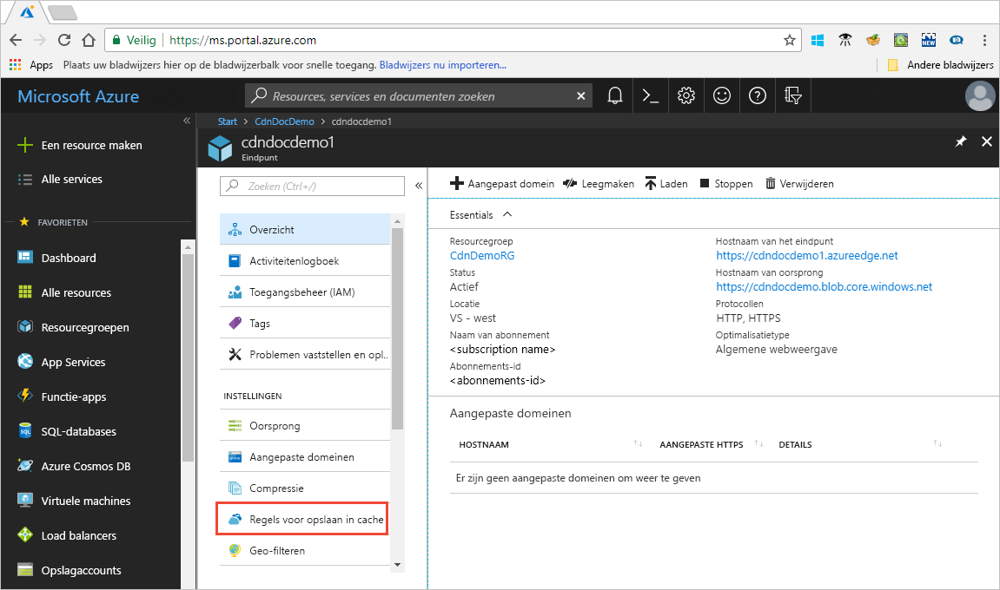

# Besturingselement Azure Content Delivery Network cachegedrag met caching van regels

> [!NOTE] 
> In het cachegeheugen regels zijn alleen beschikbaar voor **Azure CDN van Verizon standaard** en **Azure CDN van Akamai standaard**. Voor **Azure CDN van Verizon Premium**, kunt u de [Azure CDN regelengine](cdn-rules-engine.md) in de **beheren** portal voor vergelijkbare functionaliteit.
 
Azure Content Delivery Network biedt twee manieren om te bepalen hoe uw bestanden in de cache opgeslagen: 

- Regels opslaan in cache: dit artikel wordt beschreven hoe u content delivery network (CDN) opslaan in cache regels instellen of wijzigen van standaardgedrag cache verloopt zowel globaal en met aangepaste voorwaarden, zoals een URL-pad en de bestandsnaam uitbreiding kunt gebruiken. Azure CDN biedt twee typen regels opslaan in cache:
   - Global regels opslaan in cache: U kunt een globale cacheregel voor elk eindpunt instellen in uw profiel dat gevolgen heeft voor alle aanvragen voor het eindpunt. De globale cacheregel overschrijft instructie cache HTTP-headers als ingesteld.
   - Aangepaste regels voor opslaan in cache: U kunt een of meer aangepaste caching regels voor elk eindpunt dat in uw profiel. Aangepaste regels overeen specifieke paden bestandsextensies, in volgorde worden verwerkt en overschrijven van de globale cacheregel caching als is ingesteld. 

- Query opslaan in cache: kunt u aanpassen hoe Azure CDN omgaat met aanvragen met querytekenreeksen in cache opslaan. Zie voor informatie [besturingselement Azure CDN cachegedrag met queryreeksen](cdn-query-string.md). Als het bestand geen caching geschikte is, heeft de queryreeks cache-instelling geen effect, op basis van regels en het standaardgedrag CDN caching.

Zie voor meer informatie over standaard cachegedrag en caching richtlijn headers [werking van cacheopslag](cdn-how-caching-works.md).

## Zelfstudie

Het instellen van CDN regels opslaan in cache:

1. De Azure portal openen, selecteer een CDN-profiel en selecteer vervolgens een eindpunt.
2. Klik in het linkerdeelvenster onder instellingen op **regels opslaan in cache**.

   

1. Hiermee maakt u een globale cacheregel als volgt:
   1. Onder **Global caching regels**stelt **queryreeks cachegedrag** naar **querytekenreeksen negeren**.
   2. Stel **cachegedrag** naar **ingesteld indien deze ontbreken**.
       
   3. Voor **duur voor het verlopen in de Cache**, voert u 10 in de **dagen** veld.

       De globale cacheregel is van invloed op alle aanvragen voor het eindpunt. Deze regel zich houdt aan de headers van de instructie cache oorsprong als deze bestaan (`Cache-Control` of `Expires`); anders als ze niet zijn opgegeven, wordt de cache ingesteld op 10 dagen. 

     

4. Maak een aangepaste regel in de cache als volgt:
    1. Onder **aangepaste regels opslaan in cache**stelt **overeenkomen met de voorwaarde** naar **pad** en **overeenkomen met waarde** naar `/images/*.jpg`.
    2. Stel **cachegedrag** naar **overschrijven** en geef 30 in de **dagen** veld.
       
       Deze aangepaste cacheregel een Cacheduur van 30 dagen ingesteld op een `.jpg` afbeeldingsbestanden in de `/images` map van uw eindpunt. Deze voorrang op een `Cache-Control` of `Expires` HTTP-headers zijn verzonden door de bronserver.

    

> [!NOTE] 
> Bestanden die in de cache voordat de wijziging van een regel opgeslagen behouden hun duur van de oorsprong cache-instelling. Als u de duur van de cache herstellen, moet u [opschonen van het bestand](cdn-purge-endpoint.md). Voor **Azure CDN van Verizon** eindpunten, het kan tot 90 minuten duren voordat voor het opslaan van regels te laten treden.

## Naslaginformatie

### Van caching-gedraginstellingen
Voor globale en aangepaste regels in het cachegeheugen, kunt u de volgende **cachegedrag** instellingen:

- **Cache overslaan**: niet in de cache en oorsprong opgegeven instructie cache headers negeren.
- **Overschrijven**: negeren oorsprong opgegeven instructie cache headers; gebruik in plaats daarvan de opgegeven Cacheduur.
- **Indien deze ontbreken ingesteld**: EER oorsprong opgegeven instructie cache kopteksten, indien ze bestaan; anders gebruikt u de opgegeven Cacheduur.

### Vervaltijd van de cache
Voor globale en aangepaste regels in het cachegeheugen, kunt u de vervaldatum Cacheduur opgeven in dagen, uren, minuten en seconden:

- Voor de **overschrijven** en **ingesteld indien deze ontbreken** **cachegedrag** instellingen, het bereik van geldige cache duur tussen 0 en 366 dagen. Voor een waarde van 0 seconden, de CDN slaat de inhoud, maar moet elke aanvraag met de oorspronkelijke server valideren.
- Voor de **cache overslaan** instellen, de Cacheduur van de wordt automatisch ingesteld op 0 seconden en kan niet worden gewijzigd.

### Aangepaste caching regels identieke voorwaarden

Voor aangepaste cacheregels zijn twee identieke voorwaarden zijn beschikbaar:
 
- **Pad**: deze voorwaarde overeenkomt met het pad van de URL, met uitzondering van de domeinnaam en biedt ondersteuning voor het jokerteken (\*). Bijvoorbeeld: `/myfile.html`, `/my/folder/*`, en `/my/images/*.jpg`. De maximale lengte is 260 tekens.

- **Extensie**: deze situatie komt overeen met de bestandsextensie van het aangevraagde bestand. U kunt een lijst met bestandsextensies overeenkomen met door komma's gescheiden opgeven. Bijvoorbeeld: `.jpg`, `.mp3`, of `.png`. Het maximum aantal uitbreidingen is 50 en het maximum aantal tekens per uitbreiding is 16. 

### De verwerkingsvolgorde globale en aangepaste regel
Globale en aangepaste cachebewerkingen regels worden verwerkt in de volgende volgorde:

- Globale cachebewerkingen regels hebben voorrang op de standaard-CDN-cachegedrag (http-header van de instructie cache-instellingen). 

- Aangepaste cachebewerkingen regels hebben voorrang op globale cache in regels, waar ze van toepassing. Aangepaste regels voor caching worden in volgorde van boven naar beneden verwerkt. Dat wil zeggen, als een aanvraag aan beide voorwaarden voldoet, hebben regels onder aan de lijst voorrang boven regels boven aan de lijst. Daarom, plaatst u specifiekere regels lager in de lijst.

**Voorbeeld**:
- Globale cacheregel: 
   - Cachegedrag: **overschrijven**
   - Duur voor het verlopen in de cache: 1 dag

- Aangepaste regel #1 opslaan in cache:
   - Overeenkomen met de voorwaarde: **pad**
   - Overeenkomende waarde:`/home/*`
   - Cachegedrag: **overschrijven**
   - Duur voor het verlopen in de cache: 2 dagen

- Aangepaste regel #2 opslaan in cache:
   - Overeenkomen met de voorwaarde: **extensie**
   - Overeenkomende waarde:`.html`
   - Cachegedrag: **indien deze ontbreken instellen**
   - Duur voor het verlopen in de cache: 3 dagen

Wanneer deze regels zijn ingesteld, een aanvraag voor `<endpoint>.azureedge.net/home/index.html` triggers aangepaste caching #2, die is ingesteld op regel: **ingesteld indien deze ontbreken** en 3 dagen. Daarom als de `index.html` bestand heeft `Cache-Control` of `Expires` HTTP-headers zijn gebruikt; anders, als deze headers zijn niet ingesteld, het bestand is opgeslagen in de cache voor 3 dagen.

