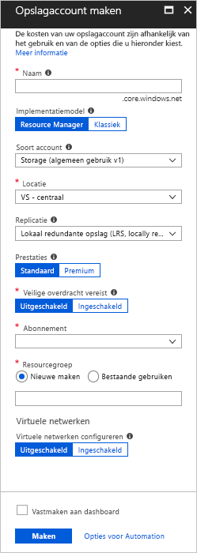
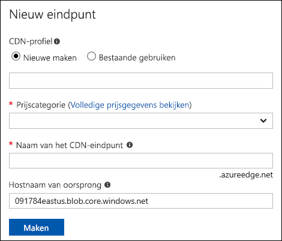
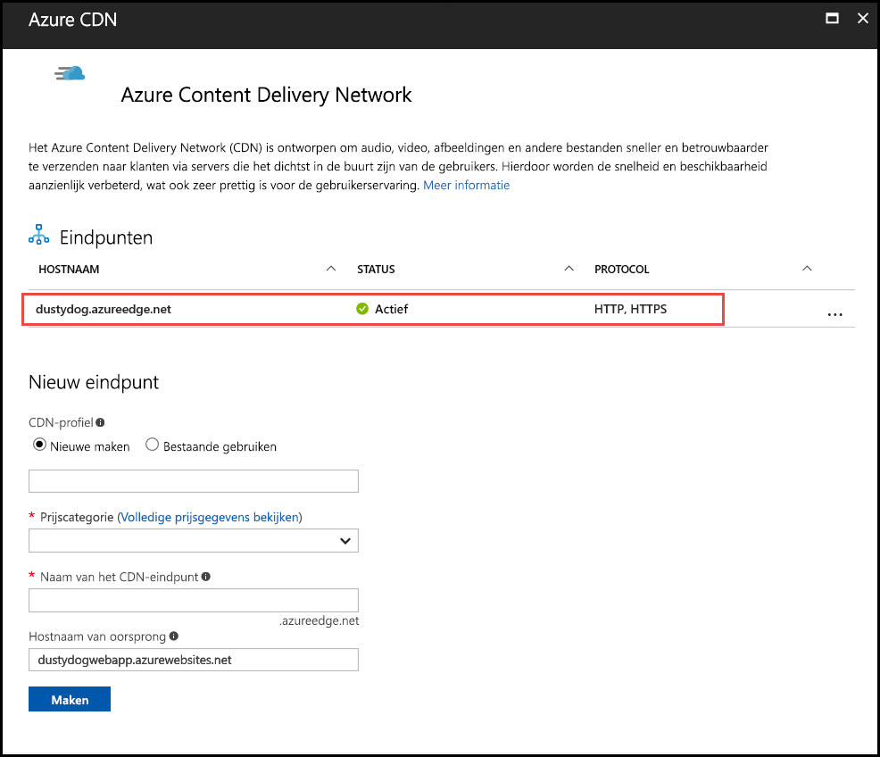
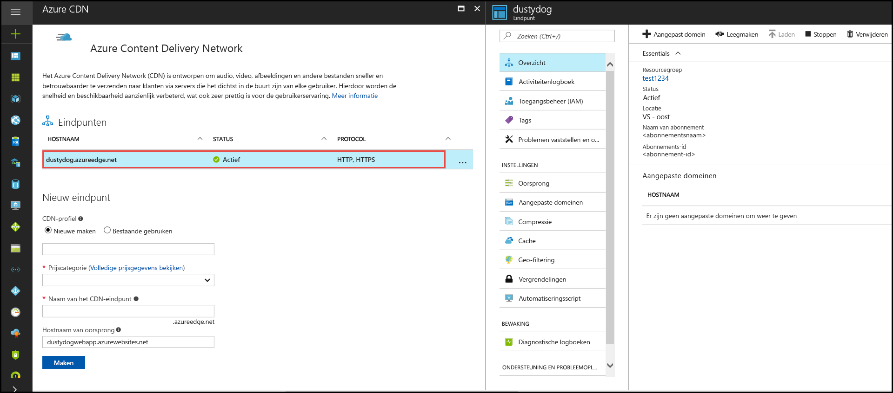

# Een Azure storage-account integreren met Azure CDN
U kunt Azure inhoud Delivery Network (CDN) inschakelen voor cache-inhoud uit Azure storage. Azure CDN biedt ontwikkelaars een globale oplossing voor het leveren van inhoud met hoge bandbreedte. Deze cache blobs en statische inhoud van de compute-exemplaren op fysieke knooppunten in de Verenigde Staten, Europa, Azië, Australië en Zuid-Amerika.

## Stap 1: Een opslagaccount maken
Gebruik de volgende procedure voor het maken van een nieuw opslagaccount voor een Azure-abonnement. Een opslagaccount biedt toegang tot Azure Storage-services. Het opslagaccount vertegenwoordigt het hoogste niveau van de naamruimte voor het openen van elk van de onderdelen van de Azure Storage-service: opslag in Azure Blob, wachtrijen en tabellen. Zie voor meer informatie [Inleiding tot Microsoft Azure Storage](../storage/common/storage-introduction.md).

Als u wilt een opslagaccount maakt, moet u de servicebeheerder of een CO-beheerder voor het gekoppelde abonnement.

> [!NOTE]
> U kunt verschillende methoden gebruiken voor het maken van een opslagaccount, met inbegrip van de Azure-portal en PowerShell. Deze zelfstudie laat zien hoe de Azure portal gebruiken.   
> 

**Een opslagaccount voor een Azure-abonnement maken**

1. Meld u aan bij [Azure Portal](https://portal.azure.com).
2. Selecteer in de linkerbovenhoek **maken van een resource**. In de **nieuw** deelvenster **opslag**, en selecteer vervolgens **opslagaccount - blob, bestand, tabel, wachtrij**.
    
    De **storage-account maken** deelvenster wordt weergegeven.   

    

3. In de **naam** en voer de subdomeinnaam. Deze vermelding kan 3 tot 24 kleine letters en cijfers bevatten.
   
    Deze waarde wordt de hostnaam van de in de URI die wordt gebruikt om blob, wachtrij of tabel bronnen voor het abonnement. De bron van een container in Blob-opslag, gebruikt u een URI in de volgende indeling:
   
    http://*&lt;StorageAcountLabel&gt;*.blob.core.windows.net/*&lt;mycontainer&gt;*

    waar  *&lt;StorageAccountLabel&gt;*  verwijst naar de waarde die u hebt ingevoerd in de **naam** vak.
   
    > [!IMPORTANT]    
    > Het URL-label vormt het subdomein van de URI van het opslagaccount en moet uniek zijn in alle gehoste services in Azure.
   
    Deze waarde wordt ook gebruikt als de naam van het opslagaccount in de portal, of als u gebruik van dit account via een programma.
    
4. Gebruik de standaardwaarden voor **implementatiemodel**, **Account kind**, **prestaties**, en **replicatie**. 
    
5. Voor **abonnement**, selecteer het abonnement voor gebruik met de storage-account.
    
6. Voor **resourcegroep**selecteert of maakt u een resourcegroep. Zie voor meer informatie over resourcegroepen [overzicht van Azure Resource Manager](../azure-resource-manager/resource-group-overview.md#resource-groups).
    
7. Voor **locatie**, selecteer een locatie voor uw opslagaccount.
    
8. Selecteer **Maken**. Het proces van het storage-account maken kan enige tijd duren om te voltooien.

## Stap 2: CDN inschakelen voor het opslagaccount

U kunt CDN inschakelen voor uw opslagaccount rechtstreeks vanuit uw opslagaccount. 

1. Selecteer een opslagaccount van het dashboard en selecteer vervolgens **Azure CDN** in het linkerdeelvenster. Als de **Azure CDN** knop niet onmiddellijk zichtbaar is, kunt u CDN in de **Search** vak van het linkerdeelvenster.
    
    De **Azure Content Delivery Network** deelvenster wordt weergegeven.

    
    
2. Maak een nieuw eindpunt door te voeren van de vereiste gegevens:
    - **CDN-profiel**: Maak een nieuw CDN-profiel of een bestaande CDN-profiel gebruiken.
    - **Prijscategorie**: Selecteer een prijscategorie alleen als u een CDN-profiel maakt.
    - **De naam van de CDN-eindpunt**: Voer de naam van een CDN-eindpunt.

    > [!TIP]
    > Standaard wordt een nieuw CDN-eindpunt de hostnaam van uw storage-account gebruikt als de bronserver.

3. Selecteer **Maken**. Nadat het eindpunt is gemaakt, wordt deze weergegeven in de lijst met eindpunten.

    

> [!NOTE]
> Als u wilt opgeven, geavanceerde configuratie-instellingen voor uw CDN-eindpunt, zoals het type optimalisatie, kunt u in plaats daarvan gebruiken de [Azure CDN extensie](cdn-create-new-endpoint.md#create-a-new-cdn-endpoint) om een CDN-eindpunt of een CDN-profiel te maken.

## Stap 3: Extra CDN-functies inschakelen

Vanuit het opslagaccount **Azure CDN** deelvenster, selecteer het CDN-eindpunt in de lijst om de CDN configuratie deelvenster te openen. U kunt aanvullende CDN-functies inschakelen voor uw levering, zoals compressie, queryreeks en geo filteren. U kunt ook aangepaste domein toewijzing aan uw CDN-eindpunt toevoegen en inschakelen van aangepast domein HTTPS.
    

## Stap 4: Toegang tot CDN-inhoud
Gebruik voor toegang tot de inhoud in cache op de CDN moet de CDN-URL in de portal. Het adres van een blob in de cache heeft de volgende indeling:

http://<*EndpointName*\>.azureedge.net/<*myPublicContainer*\>/<*BlobName*\>

> [!NOTE]
> Nadat u CDN toegang tot een opslagaccount hebt ingeschakeld, zijn alle openbaar beschikbare objecten in aanmerking komen voor CDN edge cache. Als u een object dat momenteel in cache in de CDN wijzigt, wordt de nieuwe inhoud pas beschikbaar via CDN CDN wordt de inhoud vernieuwd nadat de time-to-live-outperiode voor inhoud in de cache is verlopen.

## Stap 5: De inhoud van het CDN verwijderen
Als u niet langer in de cache van een object in Azure CDN wilt, kunt u een van de volgende stappen uitvoeren:

* De container persoonlijke in plaats van openbaar. Zie voor meer informatie [anonieme leestoegang tot containers en blobs beheren](../storage/blobs/storage-manage-access-to-resources.md).
* Uitschakelen of verwijderen van het CDN-eindpunt met behulp van de Azure-portal.
* De gehoste service niet meer reageren op aanvragen voor het object wijzigen.

Een object dat al in de cache in Azure CDN blijft in de cache, totdat de time-to-live voor het object zijn verstreken of het eindpunt wordt verwijderd. Als de time-to-live-periode is verstreken, wordt Azure CDN controleert of het CDN-eindpunt nog geldig is en het object nog steeds anoniem toegankelijk is. Als dat niet het geval is, wordt het object niet langer in cache.

## Aanvullende resources
* [Een aangepast domein aan uw CDN-eindpunt toevoegen](cdn-map-content-to-custom-domain.md)
* [HTTPS configureren op een aangepaste Azure CDN-domein](cdn-custom-ssl.md)

