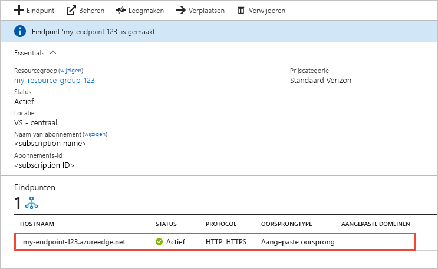

# Een Azure CDN-eindpunt maken
In dit artikel beschrijft alle instellingen voor het maken van een [Azure Content Delivery Network (CDN)](cdn-overview.md) -eindpunt in een bestaande CDN-profiel. Nadat u een profiel en een eindpunt hebt gemaakt, kunt u beginnen met het leveren van inhoud aan uw klanten. Zie voor een snelstartgids over het maken van een profiel en eindpunt, [Quickstart: maken van een Azure CDN-profiel en een eindpunt](cdn-create-new-endpoint.md).

## Vereisten
Voordat u een CDN-eindpunt maken kunt, moet hebt u ten minste één CDN-profiel, die een of meer CDN-eindpunten kan bevatten die zijn gemaakt. U kunt meerdere profielen gebruiken om de CDN-eindpunten te ordenen op basis van het internetdomein, de webtoepassing of andere criteria. Omdat het CDN-prijzen op het niveau van het CDN-profiel wordt toegepast, moet u meerdere CDN-profielen maken als u gebruiken van een combinatie van Azure CDN wilt-Prijscategorieën. Voor het maken van een CDN-profiel, Zie [maken van een nieuw CDN-profiel](cdn-create-new-endpoint.md#create-a-new-cdn-profile).

## Aanmelden bij Azure Portal
Meld u met uw Azure-account aan bij het [Azure Portal](https://portal.azure.com).

## Nieuwe CDN-eindpunten maken

1. Navigeer in [Azure Portal](https://portal.azure.com) naar uw CDN-profiel. Mogelijk hebt u het profiel in de vorige stap vastgemaakt aan het dashboard. Zo niet, dan kunt u het vinden door **Alle services** en vervolgens **CDN-profielen** te selecteren. Selecteer in het deelvenster **CDN-profielen** het profiel waaraan u uw eindpunt wilt toevoegen. 
   
    Het deelvenster CDN-profiel wordt weergegeven.

2. Selecteer **Eindpunt**.
   
    
   
    De pagina **Een eindpunt toevoegen** wordt weergegeven.
   
    

3. Voer voor **Naam** een unieke naam voor het nieuwe CDN-eindpunt in. Deze naam wordt gebruikt voor toegang tot uw resources in de cache in het domein _<endpointname>_. azureedge.net.

4. Voor **oorsprongtype**, kies een van de volgende oorsprongstypen: 
   - **Opslag** voor Azure-opslag
   - **Cloudservice** voor Azure Cloud Services
   - **Web-App** voor Azure WebApps
   - **Aangepaste oorsprong** voor een andere openbaar toegankelijke oorsprong webserver (die wordt gehost in Azure of ergens anders)

5. Voor **hostnaam van oorsprong**Selecteer of typ uw domein van oorsprong-server. De vervolgkeuzelijst bevat alle beschikbare bronservers van het type dat u hebt opgegeven in stap 4. Als u hebt geselecteerd **aangepaste oorsprong** als oorsprongtype, voert u het domein van de server van uw aangepaste oorsprong.
    
6. Voor **oorsprongpad**, geef het pad naar de resources die u cache wilt. Als u wilt toestaan van alle resources in het domein dat u in stap 5 hebt opgegeven in de cache, laat u deze instelling leeg.
    
7. Geef bij **Host-header van oorsprong** de host-header op die voor elke aanvraag door Azure CDN moet worden verzonden of laat de standaardinstelling staan.
   
   > [!NOTE]
   > Bepaalde oorsprongtypen, zoals Azure Storage en Web Apps, vereisen dat de hostheader overeenkomt met het domein van de oorsprong. Tenzij u een oorsprong hebt waarvoor een andere host-header is vereist dan die van het domein, laat u de standaardwaarde ongewijzigd.
   > 
    
8. Voor **Protocol** en **poort van oorsprong**, geef de protocollen en poorten gebruiken voor toegang tot uw resources in de oorspronkelijke server. Er moet minimaal één protocol (HTTP of HTTPS) worden geselecteerd. Het opgegeven CDN domein (_<endpointname>_. azureedge.net) voor toegang tot HTTPS-inhoud. 
   
   > [!NOTE]
   > De **poort van oorsprong** waarde bepaalt alleen de poort die gebruikmaakt van het eindpunt van de gegevens ophalen uit de oorspronkelijke server. Het eindpunt zelf is alleen beschikbaar voor eindclients op de standaard-HTTP- en -HTTPS-poorten (80 en 443), ongeacht de waarde voor **Poort van oorsprong**.  
   > 
   > Eindpunten in **Azure CDN van Akamai**-profielen staan niet het volledige TCP-poortbereik voor oorsprongpoorten toe. Zie [Azure CDN from Akamai Allowed Origin Ports](https://msdn.microsoft.com/library/mt757337.aspx) (Door Azure CDN van Akamai toegestane poorten van oorsprong) voor een lijst met poorten van oorsprong die niet zijn toegestaan.  
   > 
   > HTTPS-ondersteuning voor aangepaste domeinen voor Azure CDN wordt niet ondersteund op **Azure CDN van Akamai** producten. Zie [HTTPS op een aangepast Azure CDN-domein configureren](cdn-custom-ssl.md) voor meer informatie.
    
9. Voor **geoptimaliseerd voor**, selecteer een type eindpuntoptimalisatie die het beste het scenario en type inhoud dat u wilt dat het eindpunt te leveren. Zie voor meer informatie, [optimaliseren Azure CDN voor het type van de levering van inhoud](cdn-optimization-overview.md).

    De volgende optimalisatie-instellingen worden ondersteund, op basis van profieltype:
    - **Azure CDN Standard van Microsoft** profielen:
       - [**Algemene webweergave**](cdn-optimization-overview.md#general-web-delivery)

    - **Azure CDN Standard van Verizon** en **Azure CDN Premium van Verizon** profielen:
       - [**Algemene webweergave**](cdn-optimization-overview.md#general-web-delivery)
       - [**Dynamische siteversnelling**](cdn-optimization-overview.md#dynamic-site-acceleration)

    - **Azure CDN Standard van Akamai** profielen:
       - [**Algemene webweergave**](cdn-optimization-overview.md#general-web-delivery)
       - [**Algemene mediastreaming**](cdn-optimization-overview.md#general-media-streaming)
       - [**Video on-demandstreaming van media**](cdn-optimization-overview.md#video-on-demand-media-streaming)
       - [**Grote bestanden downloaden**](cdn-optimization-overview.md#large-file-download)
       - [**Dynamische siteversnelling**](cdn-optimization-overview.md#dynamic-site-acceleration)

10. Selecteer **Toevoegen** om het nieuwe eindpunt te maken.
   
    Zodra het eindpunt is gemaakt, wordt deze weergegeven in de lijst met eindpunten voor het profiel.
    
    
    
    Het eindpunt is niet onmiddellijk beschikbaar voor gebruik, aangezien het enige tijd vergt om de registratie door te geven: 
    - Voor profielen van **Azure CDN Standard van Microsoft** is het doorgeven gewoonlijk binnen 10 minuten voltooid. 
    - Profielen van **Azure CDN Standard van Akamai** worden doorgaans binnen één minuut doorgegeven. 
    - Profielen van **Azure CDN Standard van Verizon** en **Azure CDN Premium van Verizon** worden doorgaans binnen 90 minuten doorgegeven, maar in sommige gevallen kan dit langer duren. 
   
    Als u probeert te gebruiken van de naam van het CDN-domein voordat de eindpuntconfiguratie is doorgegeven aan de point of presence (POP)-servers, ontvangt u mogelijk een HTTP 404-reactiestatus. Als u een aantal uren sinds u uw eindpunt hebt gemaakt en u nog steeds een 404-reactiestatus ontvangt Zie [problemen oplossen met Azure CDN-eindpunten die 404-statuscode retourneren](cdn-troubleshoot-endpoint.md).

## Resources opschonen
Als u wilt een eindpunt verwijderen wanneer deze niet meer nodig is, selecteert u deze en selecteer vervolgens **verwijderen**. 

## Volgende stappen
Voor meer informatie over aangepaste domeinen, gaat u naar de zelfstudie voor het toevoegen van een aangepast domein aan uw CDN-eindpunt.

> [!div class="nextstepaction"]
> [Een aangepast domein toevoegen](cdn-map-content-to-custom-domain.md)

