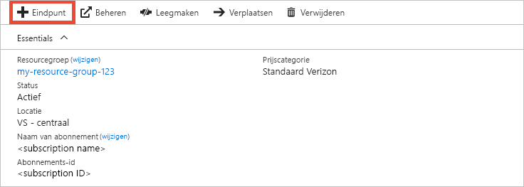
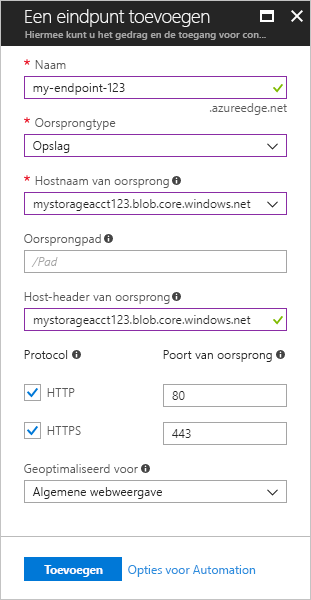

# Snelstart: Een Azure CDN-profiel en een eindpunt maken
In deze snelstart wordt beschreven hoe u Azure Content Delivery Network (CDN) inschakelt door een nieuw CDN-profiel en -eindpunt te maken. Nadat u een profiel en een eindpunt hebt gemaakt, kunt u beginnen met het leveren van inhoud aan uw klanten.

[!INCLUDE [quickstarts-free-trial-note](../../includes/quickstarts-free-trial-note.md)]

## Vereisten
Voor deze snelstart moet u een opslagaccount hebben gemaakt met de naam *mystorageacct123*, die u gebruikt als de oorspronkelijke hostnaam. Zie voor meer informatie [Integreren van een Azure storage-account met Azure CDN](cdn-create-a-storage-account-with-cdn.md)

## Aanmelden bij Azure Portal
Meld u met uw Azure-account aan bij het [Azure Portal](https://portal.azure.com).

[!INCLUDE [cdn-create-profile](../../includes/cdn-create-profile.md)]

## Nieuwe CDN-eindpunten maken

Nadat u een CDN-profiel hebt gemaakt, kunt u het gebruiken om een eindpunt te maken.

1. Selecteer in het dashboard het CDN-profiel dat u hebt gemaakt in het Azure Portal. Selecteer **Alle services** als u deze niet kunt vinden, selecteer daarna **CDN-profielen**. In de pagina **CDN-profielen** selecteert u het profiel dat u wilt gebruiken. 
   
    De CDN-profielpagina wordt weergegeven.

2. Selecteer **Eindpunt**.
   
    
   
    De pagina **Een eindpunt toevoegen** wordt weergegeven.

    Gebruik de instellingen zoals opgegeven in de tabel onder de afbeelding.
   
    

    | Instelling | Waarde |
    | ------- | ----- |
    | **Naam** | Voer *my-endpoint-123* in als hostnaam van uw eindpunt. Deze naam moet globaal uniek zijn. Als deze al in gebruik is, kunt u een andere invoeren. Deze naam wordt gebruikt voor toegang tot uw resources in de cache van de domein- _&lt;eindpuntnaam&gt;_.azureedge.net.|
    | **Oorsprongtype** | Selecteer **Opslag**. | 
    | **Hostnaam van oorsprong** | Voer *mystorageacct123.blob.core.windows.net* in als hostnaam. Deze naam moet globaal uniek zijn. Als deze al in gebruik is, kunt u een andere invoeren |
    | **Pad voor de oorsprong** | Leeg laten. |
    | **Host-header van oorsprong** | Laat de standaard gegenereerde waarde staan. |  
    | **Protocol** | Laat de standaard geselecteerde opties **HTTP** en **HTTPS** staan. |
    | **Poort van oorsprong** | Laat de standaard gegenereerde poortwaardes staan. | 
    | **Geoptimaliseerd voor** | Laat de standaardselectie **Algemene weboverdracht** staan. |
    
3. Selecteer **Toevoegen** om het nieuwe eindpunt te maken.
   
   Zodra het eindpunt is gemaakt, wordt deze weergegeven in de lijst met eindpunten voor het profiel.
    
   
    
   Het eindpunt is niet onmiddellijk beschikbaar voor gebruik, aangezien het enige tijd vergt om de registratie door te geven: 
   - Voor profielen van **Azure CDN Standard van Microsoft** is het doorgeven gewoonlijk binnen 10 minuten voltooid. 
   - Profielen van **Azure CDN Standard van Akamai** worden doorgaans binnen één minuut doorgegeven. 
   - Profielen van **Azure CDN Standard van Verizon** en **Azure CDN Premium van Verizon** worden doorgaans binnen 90 minuten doorgegeven, maar in sommige gevallen kan dit langer duren. 

## Resources opschonen
In de voorgaande stappen hebt u een CDN-profiel en een eindpunt in een resourcegroep gemaakt. Sla deze resources op als u naar [Vervolgstappen](#next-steps) wilt gaan en informatie wilt krijgen over het toevoegen van een aangepast domein aan uw eindpunt. Als u echter denkt deze resources in de toekomst niet meer nodig te hebben, kunt u ze verwijderen door de resourcegroep te verwijderen. Op deze manier voorkomt u bijkomende kosten:

1. Selecteer in het linkermenu in het Azure Portal **Resourcegroepen** en selecteer vervolgens **my-resource-group-123**.

2. Selecteer op de **Resourcegroep**-pagina **Resourcegroep verwijderen**, voer *mijn-resource-group-123* in het tekstvak in en selecteer **Verwijderen**.

    Deze actie zal de resourcegroep, het profiel en het eindpunt dat u in deze snelstart hebt gemaakt verwijderen.

## Volgende stappen
Zie voor meer informatie over het toevoegen van een aangepast domein aan uw CDN-eindpunt, de volgende zelfstudie:

> [!div class="nextstepaction"]
> [Zelfstudie: Een aangepast domein toevoegen aan uw Azure CDN-eindpunt](cdn-map-content-to-custom-domain.md)

