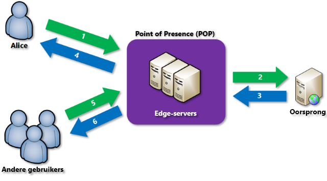

# Overzicht van Azure Content Delivery Network (CDN)
> [!NOTE]
> In dit document wordt uitgelegd wat Azure Content Delivery Network (CDN) is, hoe het werkt en wat de functies van elk Azure CDN-product zijn.  Zie [Azure CDN gebruiken](cdn-create-new-endpoint.md) als u deze informatie wilt overslaan om rechtstreeks naar een zelfstudie over het maken van een CDN-eindpunt te aan.  Zie [Azure CDN POP-locaties](cdn-pop-locations.md) als u een lijst met de huidige CDN-knooppuntlocaties wilt weergeven.
> 
> 

Azure Content Delivery Network (CDN) slaat op strategisch geplaatste locaties statische webinhoud in de cache om een maximale doorvoer voor de levering van inhoud te waarborgen.  Het CDN biedt ontwikkelaars een globale oplossing voor de levering van inhoud met een hoge bandbreedte door de inhoud op fysieke knooppunten over de hele wereld op te slaan in de cache. 

Enkele voordelen van het gebruik van de CDN om website-assets op te slaan in de cache:

* Betere prestaties en gebruikerservaring voor eindgebruikers wanneer er toepassingen worden gebruikt waarbij meerdere retouren zijn vereist om inhoud te laden.
* Grote schaalbaarheid zodat een korte hoge belasting, bijvoorbeeld wanneer een product wordt gestart, beter kan worden verwerkt.
* Door de gebruikersaanvragen te distribueren en de inhoud uit te voeren vanaf randservers wordt er minder verkeer naar de oorsprong verzonden.

## Hoe werkt het?

1. Een gebruiker (Els) gebruikt een URL met een speciale domeinnaam, zoals `<endpointname>.azureedge.net`, om een bestand (ook wel een asset genoemd) aan te vragen.  De aanvraag wordt door DNS naar de best presterende POP-locatie (Point-of-Presence) gerouteerd.  Doorgaans is dit het POP dat zie geografisch gezien het dichtst bij de gebruiker bevindt.
2. Als het bestand niet beschikbaar is in het cachegeheugen van de randservers in het POP, vraagt de randserver het bestand aan bij de oorsprong.  De oorsprong kan Azure-web-app, Azure Cloud-service, Azure Storage-account of een openbaar toegankelijke webserver zijn.
3. De oorsprong retourneert het bestand naar de randserver, inclusief optionele HTTP-headers met een beschrijving van de TTL (Time-to-Live) van het bestand.
4. De randserver neemt het bestand op in de cache en retourneert het bestand naar de oorspronkelijke aanvrager (Alice).  Het bestand blijft in cache op de randserver totdat de TTL verloopt.  Als de oorsprong geen TTL heeft opgegeven, is de standaard-TTL zeven dagen.
5. Extra gebruikers kunnen dan diezelfde URL gebruiken om hetzelfde bestand aan te vragen en worden mogelijk ook omgeleid naar hetzelfde POP.
6. Als de TTL voor het bestand niet is verlopen, retourneert de randserver het bestand uit de cache.  Dit resulteert in een snellere, responsievere gebruikerservaring.

## Functies van Azure CDN
Er zijn drie Azure CDN-producten: **Azure CDN Standard van Akamai**, **Azure CDN Standard van Verizon** en **Azure CDN Premium van Verizon**.  De volgende tabel bevat de functies die beschikbaar zijn voor elk product.

|  | Standard Akamai | Standard Verizon | Premium Verizon |
| --- | --- | --- | --- |
| &nbsp;&nbsp;&nbsp;&nbsp;&nbsp;&nbsp;&nbsp;__Prestatiefuncties en -optimalisatie__ |
| [Dynamische siteversnelling](https://docs.microsoft.com/azure/cdn/cdn-dynamic-site-acceleration) | **&#x2713;**  | **&#x2713;** | **&#x2713;** |
| &nbsp;&nbsp;&nbsp;&nbsp;&nbsp;[Dynamische siteversnelling - adaptieve afbeeldingscompressie](https://docs.microsoft.com/azure/cdn/cdn-dynamic-site-acceleration#adaptive-image-compression-akamai-only) | **&#x2713;**  |  |  |
| &nbsp;&nbsp;&nbsp;&nbsp;&nbsp;[Dynamische siteversnelling - vooraf ophalen van objecten](https://docs.microsoft.com/azure/cdn/cdn-dynamic-site-acceleration#object-prefetch-akamai-only) | **&#x2713;**  |  |  |
| [Optimalisatie van videostreaming](https://docs.microsoft.com/azure/cdn/cdn-media-streaming-optimization) | **&#x2713;**  | \* |  \* |
| [Optimalisatie van grote bestanden](https://docs.microsoft.com/azure/cdn/cdn-large-file-optimization) | **&#x2713;**  | \* |  \* |
| [GSLB (Global Server Load balancing)](https://docs.microsoft.com/azure/traffic-manager/traffic-manager-load-balancing-azure) |**&#x2713;** |**&#x2713;** |**&#x2713;** |
| [Snel leegmaken](cdn-purge-endpoint.md) |**&#x2713;** |**&#x2713;** |**&#x2713;** |
| [Vooraf laden van assets](cdn-preload-endpoint.md) | |**&#x2713;** |**&#x2713;** |
| [Queryreeksen opslaan in cache](cdn-query-string.md) |**&#x2713;** |**&#x2713;** |**&#x2713;** |
| IPv4/IPv6 dual stack |**&#x2713;** |**&#x2713;** |**&#x2713;** |
| [Ondersteuning voor HTTP/2](cdn-http2.md) |**&#x2713;** |**&#x2713;** |**&#x2713;** |
| &nbsp;&nbsp;&nbsp;&nbsp;&nbsp;&nbsp;&nbsp; __Beveiliging__ |
| HTTPS-ondersteuning met CDN-eindpunt |**&#x2713;** |**&#x2713;** |**&#x2713;** |
| [HTTPS voor aangepaste domeinen](cdn-custom-ssl.md) | |**&#x2713;** |**&#x2713;** |
| [Ondersteuning voor aangepaste domeinnamen](cdn-map-content-to-custom-domain.md) |**&#x2713;** |**&#x2713;** |**&#x2713;** |
| [Geofilters](cdn-restrict-access-by-country.md) |**&#x2713;** |**&#x2713;** |**&#x2713;** |
| [Tokenverificatie](cdn-token-auth.md)|  |  |**&#x2713;**| 
| [DDOS-beveiliging](https://www.us-cert.gov/ncas/tips/ST04-015) |**&#x2713;** |**&#x2713;** |**&#x2713;** |
| &nbsp;&nbsp;&nbsp;&nbsp;&nbsp;&nbsp;&nbsp; __Analyse en rapportage__ |
| [Basisanalyse](cdn-analyze-usage-patterns.md) | **&#x2713;** |**&#x2713;** |**&#x2713;** |
| [Geavanceerde HTTP-rapporten](cdn-advanced-http-reports.md) | | |**&#x2713;** |
| [Realtime statistieken](cdn-real-time-stats.md) | | |**&#x2713;** |
| [Realtime waarschuwingen](cdn-real-time-alerts.md) | | |**&#x2713;** |
| &nbsp;&nbsp;&nbsp;&nbsp;&nbsp;&nbsp;&nbsp; __Gebruiksgemak__ |
| Eenvoudige integratie met Azure-services, zoals [Storage](cdn-create-a-storage-account-with-cdn.md), [Cloud Services](cdn-cloud-service-with-cdn.md), [Web Apps](../app-service/app-service-web-tutorial-content-delivery-network.md) en [Media Services](../media-services/media-services-portal-manage-streaming-endpoints.md) |**&#x2713;** |**&#x2713;** |**&#x2713;** |
| Beheer via [REST API](https://msdn.microsoft.com/library/mt634456.aspx), [.NET](cdn-app-dev-net.md), [Node.js](cdn-app-dev-node.md) of [PowerShell](cdn-manage-powershell.md). |**&#x2713;** |**&#x2713;** |**&#x2713;** |
| [Aanpasbare, op regels gebaseerde engine voor contentlevering](cdn-rules-engine.md) | | |**&#x2713;** |
| Instellingen voor cache/koptekst (met behulp van [regels-engine](cdn-rules-engine.md)) | | |**&#x2713;** |
| URL-omleidings-/herschrijfbewerking (met behulp van [regels-engine](cdn-rules-engine.md)) | | |**&#x2713;** |
| Regels voor mobiele apparaten (met behulp van [regels-engine](cdn-rules-engine.md)) | | |**&#x2713;** |

\* Verizon ondersteunt de levering van grote bestanden en media rechtstreeks via algemene webweergave.

> [!TIP]
> Is er een functie die u graag zou willen zien in Azure CDN?  [Geef ons feedback](https://feedback.azure.com/forums/169397-cdn). 
> 
> 

## Volgende stappen
Zie [Azure CDN gebruiken](cdn-create-new-endpoint.md) om aan de slag te gaan met CDN.

Als u een bestaande CDN-klant bent, kunt u uw CDN-eindpunten nu beheren via [Microsoft Azure Portal](https://portal.azure.com) of met [PowerShell](cdn-manage-powershell.md).

Bekijk de [video van de Build 2016-sessie](https://azure.microsoft.com/documentation/videos/build-2016-leveraging-the-new-azure-cdn-apis-to-build-wicked-fast-applications/) om CDN in actie te zien.

Meer informatie over hoe u Azure CDN kunt automatiseren met [.NET](cdn-app-dev-net.md) of [Node.js](cdn-app-dev-node.md).

Zie [Prijzen van CDN](https://azure.microsoft.com/pricing/details/cdn/) voor informatie over de prijzen.

