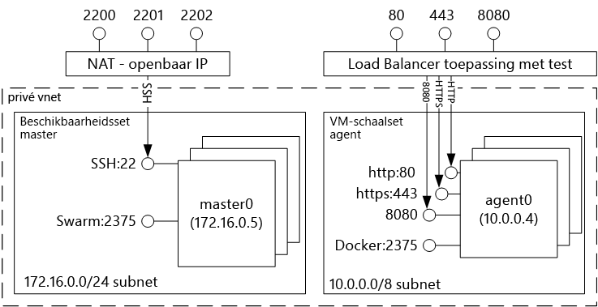

# Inleiding tot oplossingen voor Docker-containerhosting met Azure Container Service 

Azure Container Service helpt u bij het eenvoudig maken, configureren en beheren van een cluster virtuele machines die vooraf zijn geconfigureerd voor het uitvoeren van beperkte toepassingen. De service maakt gebruik van een geoptimaliseerde configuratie van populaire open-source tools voor planning en orchestration. U kunt hierbij dan uitgaan van uw eigen vaardigheden of gebruikmaken van een grote en groeiende groep community experts om toepassingen op basis van containers te implementeren en beheren in Microsoft Azure.

Azure Container Service maakt gebruik van de Docker-containerindeling om ervoor te zorgen dat uw toepassingscontainers volledig draagbaar zijn. De service biedt ook ondersteuning als u Marathon en DC/OS, Docker Swarm of Kubernetes kiest, zodat u deze toepassingen kunt schalen naar duizenden of zelfs tienduizenden containers.

Azure Container Service biedt het voordeel van de hoogwaardige functies van Azure in combinatie met draagbare toepassingen, met inbegrip van draagbaarheid in de orchestration-lagen.

## Azure Container Service gebruiken
Azure Container Service is bedoeld om een hostomgeving voor containers te bieden door gebruik te maken van de open source tools en technologieën die tegenwoordig populair zijn onder onze klanten. Daarom worden er standaard-API-eindpunten beschikbaar gesteld voor uw gekozen orchestrator (DC/OS, Docker Swarm of Kubernetes). Met behulp van deze eindpunten kunt u gebruikmaken van alle software die geschikt is voor communicatie met deze eindpunten. In het geval van een Docker Swarm-eindpunt kunt u bijvoorbeeld kiezen om gebruik te maken van de Docker CLI (opdrachtregelinterface). Voor DC/OS kunt u kiezen voor de DCOS CLI. Voor Kubernetes zou u `kubectl` kunnen gebruiken.

## Een Docker-cluster maken met behulp van Azure Container Service
Als u Azure Container Service wilt gebruiken, moet u eerst een Azure Container Service-cluster implementeren via de portal (zoek in Marketplace naar **Azure Container Service**). U kunt hierbij gebruikmaken van een Azure Resource Manager-sjabloon ([Docker Swarm](https://github.com/Azure/azure-quickstart-templates/tree/master/101-acs-swarm), [DC/OS](https://github.com/Azure/azure-quickstart-templates/tree/master/101-acs-dcos) of [Kubernetes](https://github.com/Azure/azure-quickstart-templates/tree/master/101-acs-kubernetes)), maar u kunt ook de [Azure CLI 2.0](container-service-create-acs-cluster-cli.md) gebruiken. De verstrekte snelstartsjablonen kunnen worden aangepast om aanvullende of geavanceerde Azure-configuratie toe te voegen. Zie [Een Azure Container Service-cluster implementeren](container-service-deployment.md) voor meer informatie.

## Een toepassing implementeren
Voor orchestration met Azure Container Service kunt u kiezen uit Docker Swarm, DC/OS of Kubernetes. De implementatie van uw toepassing hangt af van de orchestrator die u kiest.

### Met DC/OS
DC/OS is een gedistribueerd besturingssysteem op basis van de Apache Mesos-kernel voor gedistribueerde systemen. Apache Mesos is ondergebracht bij de Apache Software Foundation. Onder de gebruikers en medewerkers van het product tellen we enkele van de [grootste namen in IT](http://mesos.apache.org/documentation/latest/powered-by-mesos/).

DC/OS en Apache Mesos bieden een indrukwekkende functieset:

* In de praktijk beproefde schaalbaarheid
* Fouttolerante gerepliceerde master en slaves op basis van Apache ZooKeeper
* Ondersteuning voor containers met Docker-indeling
* Systeemeigen isolatie tussen taken met Linux-containers
* Multiresource planning (geheugen, CPU, schijf en poorten)
* Java, Python en C++ API's voor het ontwikkelen van nieuwe parallelle toepassingen
* Een web-UI voor weergave van de clusterstatus

DC/OS in Azure Container Service omvat standaard het Marathon Orchestration Platform voor het plannen van werkbelastingen. De DC/OS-implementatie van ACS bevat echter ook Mesosphere Universe-services die u kunt toevoegen aan uw service. De services van Universe zijn Spark, Hadoop Cassandra en nog veel meer.

#### Met Marathon
Marathon is een clusterbreed initialisatie- en beheersysteem voor services in cgroups of, in het geval van Azure Container Service, voor containers in Docker-indeling. Marathon biedt een web-UI van waaruit u uw toepassingen kunt implementeren. U hebt hiertoe toegang via een URL die er ongeveer als volgt uitziet: `http://DNS_PREFIX.REGION.cloudapp.azure.com`. DNS\_VOORVOEGSEL en REGIO worden gedefinieerd tijdens de implementatie. Indien gewenst, kunt u ook uw eigen DNS-naam opgeven. Zie [DC/OS-containerbeheer via de Marathon-webgebruikersinterface](container-service-mesos-marathon-ui.md) voor meer informatie over het uitvoeren van een container met de Marathon-webgebruikersinterface.

U kunt ook de REST API's gebruiken voor communicatie met Marathon. Er zijn een aantal clientbibliotheken beschikbaar voor elke tool. Hier vindt u tools in diverse talen. Uiteraard kunt u ook het HTTP-protocol in elke gewenste taal gebruiken. Daarnaast bieden veel populaire DevOps-tools ondersteuning voor Marathon. Zo beschikt u over maximale flexibiliteit voor uw bedrijfsteam wanneer u met een Azure Container Service-cluster werkt. Zie [DC/OS-containerbeheer via de Marathon REST-API](container-service-mesos-marathon-rest.md) voor meer informatie over het uitvoeren van een container met de Marathon REST-API.

### Met Docker Swarm
Docker Swarm biedt systeemeigen clustering voor Docker. Aangezien Docker Swarm werkt met de standaard Docker API, kan elke tool die al communiceert met een Docker-daemon, gebruikmaken van Swarm om meerdere hosts op transparante manier te schalen in Azure Container Service.

[!INCLUDE [container-service-swarm-mode-note](../../../includes/container-service-swarm-mode-note.md)]

Tools die worden ondersteund voor het beheer van containers in een Swarm-cluster, zijn bijvoorbeeld:

* Dokku
* Docker CLI en Docker Compose
* Krane
* Jenkins

### Kubernetes gebruiken
Kubernetes is een populaire open-source orchestrator van productieklasse voor containers. Kubernetes automatiseert het implementeren, schalen en beheren van toepassingen in containers. Omdat het een open-source oplossing is en up-to-date wordt gehouden door de open-source community, werkt het naadloos in Azure Container Service en kan het worden gebruikt om containers op de gewenste schaal uit te voeren in Azure Container Service.

De applicatie bevat een uitgebreide set functies, zoals:
* Horizontaal schalen
* Servicedetectie en taakverdeling
* Geheimen en configuratiebeheer
* Op API gebaseerde geautomatiseerde implementaties en terugdraaiacties
* Automatisch herstel

## Video's
Aan de slag met Azure Container Service (101):  

> [!VIDEO https://channel9.msdn.com/Shows/Azure-Friday/Azure-Container-Service-101/player]
>
>

Toepassingen ontwikkelen met Azure Container Service (Build 2016)

> [!VIDEO https://channel9.msdn.com/Events/Build/2016/B822/player]
>
>

## Volgende stappen

Implementeer een Container Service-cluster met de [portal](container-service-deployment.md) of [Azure CLI 2.0](container-service-create-acs-cluster-cli.md).