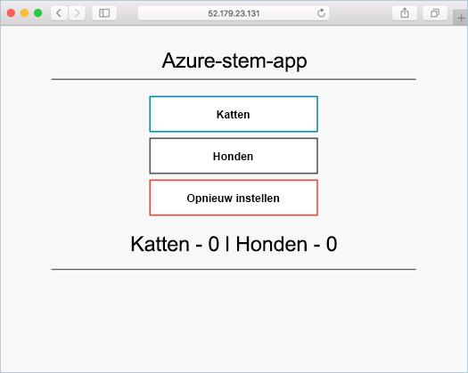

# <a name="deploy-docker-swarm-mode-cluster"></a>Docker Swarm Mode-cluster implementeren

In deze snelstartgids wordt een Docker Swarm Mode-cluster geïmplementeerd met behulp van de Azure CLI. Vervolgens wordt er een toepassing met meerdere containers die bestaat uit een web-front-end en een Redis-exemplaar, geïmplementeerd en uitgevoerd op het cluster. Zodra de toepassing is voltooid, is deze toegankelijk via internet.

Docker Swarm Mode in Azure Container Service is in de preview-fase. **Gebruik dit daarom niet voor productieworkloads**.

Als u nog geen abonnement op Azure hebt, maak dan een [gratis account](https://azure.microsoft.com/free/?WT.mc_id=A261C142F) aan voordat u begint.

Als u ervoor kiest om de CLI lokaal te installeren en te gebruiken, moet u voor deze snelstartgids de versie Azure CLI 2.0.4 of hoger uitvoeren. Voer `az --version` uit om de versie te bekijken. Als u Azure CLI 2.0 wilt installeren of upgraden, raadpleegt u [Azure CLI 2.0 installeren]( /cli/azure/install-azure-cli).

## <a name="create-a-resource-group"></a>Een resourcegroep maken

Een resourcegroep maken met de opdracht [az group create](/cli/azure/group#create). Een Azure-resourcegroep is een logische groep waarin Azure-resources worden geïmplementeerd en beheerd.

In het volgende voorbeeld wordt een resourcegroep met de naam *myResourceGroup* gemaakt op de locatie *ukwest*.

```azurecli-interactive
az group create --name myResourceGroup --location ukwest
```

Uitvoer:

```json
{
  "id": "/subscriptions/00000000-0000-0000-0000-000000000000/resourceGroups/myResourceGroup",
  "location": "westcentralus",
  "managedBy": null,
  "name": "myResourceGroup",
  "properties": {
    "provisioningState": "Succeeded"
  },
  "tags": null
}
```

## <a name="create-docker-swarm-cluster"></a>Docker Swarm-cluster maken

Maak een Docker Swarm Mode-cluster in Azure Container Service met de opdracht [az acs create](/cli/azure/acs#create). 

In het volgende voorbeeld wordt een cluster gemaakt met de naam *mySwarmCluster* met een Linux-hoofdknooppunt en drie knooppunten van de Linux-agent.

```azurecli-interactive
az acs create --name mySwarmCluster --orchestrator-type dockerce --resource-group myResourceGroup --generate-ssh-keys
```

Na enkele minuten is de opdracht voltooid en retourneert deze informatie over het cluster in json-indeling.

## <a name="connect-to-the-cluster"></a>Verbinding maken met het cluster

In deze snelstartgids hebt u de FQDN nodig van zowel de Docker Swarm-master als de Docker-agentpool. Voer de volgende opdracht uit om FQDN van de master en van de agent te retourneren.


```bash
az acs list --resource-group myResourceGroup --query '[*].{Master:masterProfile.fqdn,Agent:agentPoolProfiles[0].fqdn}' -o table
```

Uitvoer:

```bash
Master                                                               Agent
-------------------------------------------------------------------  --------------------------------------------------------------------
myswarmcluster-myresourcegroup-d5b9d4mgmt.ukwest.cloudapp.azure.com  myswarmcluster-myresourcegroup-d5b9d4agent.ukwest.cloudapp.azure.com
```

Maak een SSH-tunnel naar de Swarm-master. Vervang `MasterFQDN` door het FQDN-adres van de Swarm-master.

```bash
ssh -p 2200 -fNL localhost:2374:/var/run/docker.sock azureuser@MasterFQDN
```

Stel de omgevingsvariabele `DOCKER_HOST` in. Hierdoor kunt u Docker-opdrachten voor de Docker-swarm uitvoeren zonder dat u de hostnaam hoeft op te geven.

```bash
export DOCKER_HOST=localhost:2374
```

U bent nu klaar om Docker-services uit te voeren op de Docker-swarm.


## <a name="run-the-application"></a>De toepassing uitvoeren

Maak een bestand met de naam `azure-vote.yaml` en kopieer de volgende inhoud in het bestand.


```yaml
version: '3'
services:
  azure-vote-back:
    image: redis
    ports:
        - "6379:6379"

  azure-vote-front:
    image: microsoft/azure-vote-front:redis-v1
    environment:
      REDIS: azure-vote-back
    ports:
        - "80:80"
```

Voer de opdracht [docker stack deploy](https://docs.docker.com/engine/reference/commandline/stack_deploy/) uit om de Azure Vote-service te maken.

```bash
docker stack deploy azure-vote --compose-file azure-vote.yaml
```

Uitvoer:

```bash
Creating network azure-vote_default
Creating service azure-vote_azure-vote-back
Creating service azure-vote_azure-vote-front
```

Gebruik de opdracht [docker stack ps](https://docs.docker.com/engine/reference/commandline/stack_ps/) om de implementatiestatus van de toepassing te retourneren.

```bash
docker stack ps azure-vote
```

De toepassing is gereed, zodra de `CURRENT STATE` van elke service is: `Running`.

```bash
ID                  NAME                            IMAGE                                 NODE                               DESIRED STATE       CURRENT STATE                ERROR               PORTS
tnklkv3ogu3i        azure-vote_azure-vote-front.1   microsoft/azure-vote-front:redis-v1   swarmm-agentpool0-66066781000004   Running             Running 5 seconds ago                            
lg99i4hy68r9        azure-vote_azure-vote-back.1    redis:latest                          swarmm-agentpool0-66066781000002   Running             Running about a minute ago
```

## <a name="test-the-application"></a>De toepassing testen

Browse naar de FQDN van de Swarm-agentpool om de Azure Vote-toepassing te testen.



## <a name="delete-cluster"></a>Cluster verwijderen
U kunt de opdracht [az group delete](/cli/azure/group#delete) gebruiken om de resourcegroep, de containerservice en alle gerelateerde resources te verwijderen wanneer u het cluster niet meer nodig hebt.

```azurecli-interactive
az group delete --name myResourceGroup --yes --no-wait
```

## <a name="get-the-code"></a>Code ophalen

In deze snelstartgids zijn vooraf gemaakte containerinstallatiekopieën gebruikt om een Docker-service te maken. De gerelateerde toepassingscode, Dockerfile en het Opstellen-bestand zijn beschikbaar op GitHub.

[https://github.com/Azure-Samples/azure-voting-app-redis](https://github.com/Azure-Samples/azure-voting-app-redis.git)

## <a name="next-steps"></a>Volgende stappen

In deze snelstartgids hebt u een Docker Swarm-cluster geïmplementeerd. Vervolgens hebt u een toepassing met meerdere containers op dit cluster geïmplementeerd.

Ga naar CI/CD met Docker Swarm en VSTS voor informatie over het integreren van Docker Swarm met Visual Studio Team Services.

> [!div class="nextstepaction"]
> [CI/CD met Docker Swarm en VSTS](./container-service-docker-swarm-setup-ci-cd.md)
