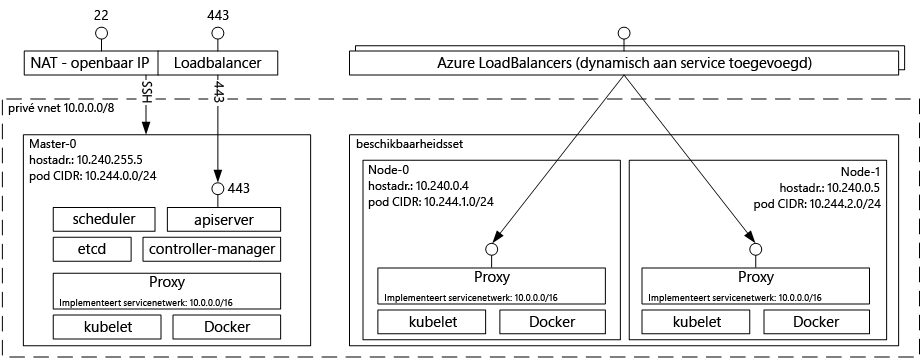

# Inleiding tot Azure Container Service voor Kubernetes

[!INCLUDE [aks-preview-redirect.md](../../../includes/aks-preview-redirect.md)]

Met Azure Container Service voor Kubernetes kunt u eenvoudig een cluster virtuele machines maken, configureren en beheren die vooraf zijn geconfigureerd voor het uitvoeren van beperkte toepassingen. U kunt hierbij dan uitgaan van uw eigen vaardigheden of gebruikmaken van een grote en groeiende groep community experts om toepassingen op basis van containers te implementeren en beheren in Microsoft Azure.

Met Azure Container Service profiteert u van de hoogwaardige functies van Azure en behoudt u draagbaarheid van toepassingen via Kubernetes en het Docker-installatiekopieformaat.

## Azure Container Service voor Kubernetes gebruiken
Azure Container Service is bedoeld om een hostomgeving voor containers te bieden door gebruik te maken van de open source tools en technologieën die tegenwoordig populair zijn onder onze klanten. Om dit te bereiken, maken we de standaard API-eindpunten van Kubernetes beschikbaar. Met behulp van deze standaard eindpunten kunt u gebruikmaken van alle software die geschikt is voor communicatie met een Kubernetes-cluster. U kunt bijvoorbeeld [kubectl](https://kubernetes.io/docs/user-guide/kubectl-overview/), [helm](https://helm.sh/) of [draft](https://github.com/Azure/draft) gebruiken.

## Een Kubernetes-cluster maken met Azure Container Service
Als u Azure Container Service wilt gebruiken, implementeert u eerst een Azure Container Service-cluster met de [Azure CLI 2.0](container-service-kubernetes-walkthrough.md) of via de portal (zoek op de Marketplace naar **Azure Container Service**). Als u een ervaren gebruiker bent die meer controle wil over de Azure Resource Manager-sjablonen, kunt u het open source [acs-engine](https://github.com/Azure/acs-engine)-project gebruiken om uw eigen aangepaste Kubernetes-cluster te bouwen en het te implementeren via de `az` CLI.

### Kubernetes gebruiken
Kubernetes automatiseert het implementeren, schalen en beheren van toepassingen in containers. De applicatie bevat een uitgebreide set functies, zoals:
* Automatische binpacking
* Automatisch herstel
* Horizontaal schalen
* Servicedetectie en taakverdeling
* Geautomatiseerde implementaties en terugdraaiacties
* Geheimen- en configuratiebeheer
* Opslagindeling
* Batchuitvoering

Architectuurdiagram van Kubernetes geïmplementeerd via Azure Container Service:

## Video's

Ondersteuning voor Kubernetes in Azure Container Service (Azure Friday, januari 2017):

> [!VIDEO https://channel9.msdn.com/Shows/Azure-Friday/Kubernetes-Support-in-Azure-Container-Services/player]
>
>

Hulpprogramma's voor het ontwikkelen en implementeren van toepassingen in Kubernetes (Azure OpenDev, juni 2017):

> [!VIDEO https://channel9.msdn.com/Events/AzureOpenDev/June2017/Tools-for-Developing-and-Deploying-Applications-on-Kubernetes/player]
>
>

## Volgende stappen

Bekijk de [Kubernetes-snelstartgids](container-service-kubernetes-walkthrough.md) en begin vandaag nog met het verkennen van Azure Container Service.