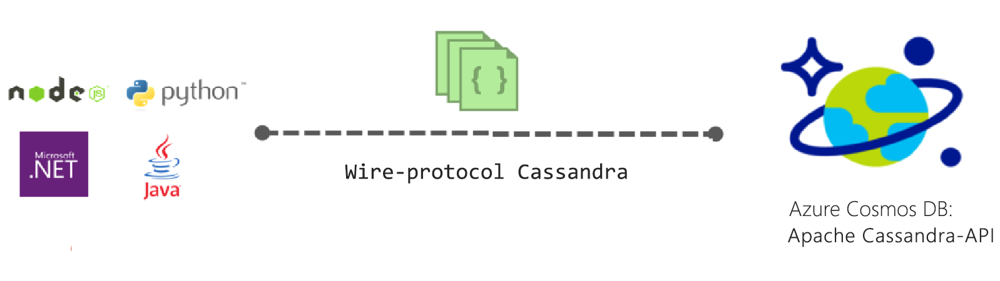
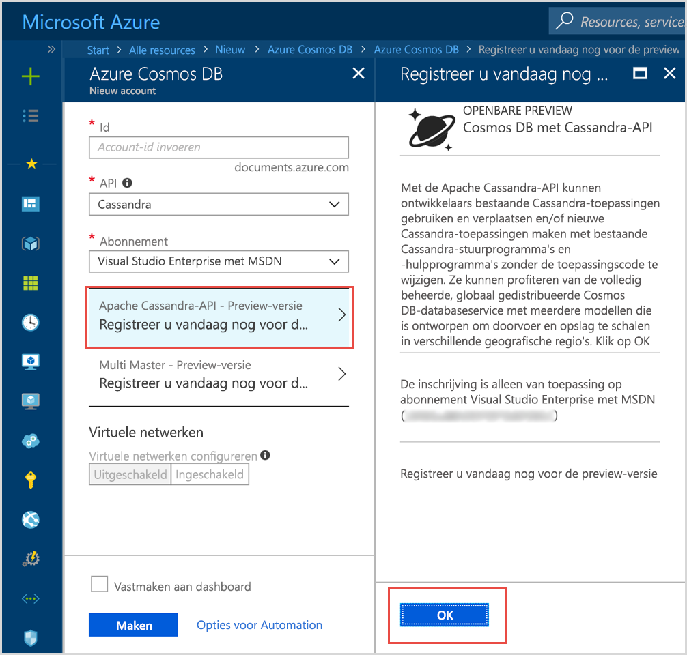

# Inleiding tot Azure Cosmos DB: Apache Cassandra-API

Azure Cosmos DB biedt de Cassandra-API (preview) voor toepassingen die zijn geschreven voor Azure Cassandra en die premium-mogelijkheden nodig hebben, zoals:

* [Schaalbare opslaggrootte en doorvoer](partition-data.md).
* [Kant en klare wereldwijde distributie](distribute-data-globally.md)
* Latentie van slechts enkele milliseconden op het 99e percentiel.
* [Vijf duidelijk gedefinieerde consistentieniveaus](consistency-levels.md)
* [Automatisch indexeren van gegevens](http://www.vldb.org/pvldb/vol8/p1668-shukla.pdf) zonder dat u te maken krijgt met schema- en indexbeheer. 
* Gegarandeerde hoge beschikbaarheid, ondersteund met [toonaangevende SLA’s](https://azure.microsoft.com/support/legal/sla/cosmos-db/)

## Wat is de Azure Cosmos DB Apache Cassandra-API?

Azure Cosmos DB kan worden gebruikt als gegevensopslag voor apps die zijn geschreven voor [Apache Cassandra](https://cassandra.apache.org/), door gebruik te maken van de Apache Cassandra-API. Dit betekent dat uw toepassing die is geschreven voor Cassandra, nu kan communiceren met de Azure Cosmos DB Cassandra-API, door gebruik te maken van bestaande [apparaatstuurprogramma’s met een Apache-licentie die compatibel zijn met CQLv4](https://cassandra.apache.org/doc/latest/getting_started/drivers.html?highlight=driver). In veel gevallen kunt u eenvoudig overschakelen van Apache Cassandra naar de Apache Cassandra-API van Azure Cosmos DB door een verbindingsreeks te wijzigen. Met behulp van deze functionaliteit kunt u eenvoudig databasetoepassingen van Cassandra-API bouwen en uitvoeren in de Azure-cloud met de wereldwijde distributie en [uitgebreide toonaangevende SLA’s](https://azure.microsoft.com/support/legal/sla/cosmos-db) van Azure Cosmos DB, terwijl u gebruik kunt blijven maken van de vertrouwde vaardigheden en hulpprogramma’s voor de Cassandra-API.

De Cassandra-API stelt u in staat om gegevens te gebruiken die zijn opgeslagen in Azure Cosmos DB. Dit doet u via hulpprogramma’s op basis van de Cassandra-querytaal (bijvoorbeeld CQLSH) en Cassandra-clientstuurprogramma’s waarmee u al vertrouwd bent. Principal Engineering Manager Kirill Gavrylyuk geeft u hier meer informatie over in deze Microsoft Mechanics-video.

> [!VIDEO https://www.youtube.com/embed/1Sf4McGN1AQ]
>

## Wat is het voordeel van het gebruik van de Apache Cassandra-API voor Azure Cosmos DB?

**Geen operationeel management**: Azure Cosmos DB is een volledig beheerde service, waardoor beheerders van de Cassandra-API zich niet bezig hoeven te houden met het beheren en controleren van talloze instellingen in OS-, JVM- en yaml-bestanden en de bijbehorende wisselwerking. Azure Cosmos DB biedt controle van doorvoer, latentie, opslag en beschikbaarheid, en waarschuwingen die kunnen worden geconfigureerd. 

**Prestatiebeheer**: Azure Cosmos DB biedt lage latentie van lees- en schrijfbewerkingen voor een percentiel van 99%, ondersteund met een SLA. Gebruikers hoeven zich geen zorgen te maken over een enorme operationele overhead om goede SLA’s voor lezen en schrijven te bieden. Deze omvatten gewoonlijk compressie van planning, beheer van tombstones, instellingen voor bloom-filters, en replicavertragingen. Met Azure Cosmos DB krijgt u niet te maken met deze zaken, waardoor u zich beter kunt focussen op de resultaten van de toepassing.

**Automatisch indexeren**: in Azure Cosmos DB worden alle kolommen van de tabel in de Cassandra-API-database automatisch geïndexeerd. U hoeft in Azure Cosmos DB geen secundaire indexen te maken om de query’s te versnellen. Er wordt een lage latentie geboden voor lezen en schrijven, terwijl er automatisch consistent wordt geïndexeerd. 

**Mogelijkheid om bestaande code en hulpprogramma’s te gebruiken**: Azure Cosmos DB biedt compatibiliteit van wire-protocolniveau’s met bestaande SDK’s en hulpprogramma’s. Door deze compatibiliteit kunt u bestaande codebase gebruiken met de Cassandra-API van Azure Cosmos DB, met slechts een klein aantal wijzigingen.

**Elasticiteit van doorvoer en opslag**: het Azure Cosmos-platform biedt elasticiteit van gegarandeerde doorvoer naar verschillende regio’s via eenvoudige bewerkingen in de portal, in PowerShell of met de CLI. Naarmate uw toepassing groeit, kunt u Azure Cosmos DB-tabellen naadloos elastisch schalen met voorspelbare prestaties. Azure Cosmos DB biedt ondersteuning voor Cassandra-API-tabellen die nagenoeg onbeperkt kunnen worden geschaald. 

**Wereldwijde distributie en beschikbaarheid**: Azure Cosmos DB heeft de mogelijkheid om gegevens te distribueren over verschillende Azure-regio’s en gebruikers zo een lage latentie te bieden, terwijl de beschikbaarheid gegarandeerd blijft. Azure Cosmos DB biedt 99,99% beschikbaarheid binnen een regio, en 99,999% beschikbaarheid voor lezen in meerdere regio’s, zonder operationele overhead. Azure Cosmos DB is beschikbaar in meer dan 30 [Azure-regio’s](https://azure.microsoft.com/regions/services/). Zie [Gegevens wereldwijd distribueren](distribute-data-globally.md) voor meer informatie. 

**Keuze in consistentie**: Azure Cosmos DB biedt de keuze uit vijf goed gedefinieerde consistentieniveaus voor een optimale balans tussen consistentie en prestaties. Deze consistentieniveaus zijn: sterk, gebonden-verouderd, sessie, consistent voorvoegsel en mogelijk. Op basis van deze gedetailleerde, goed gedefinieerde consistentieniveaus kunnen ontwikkelaars een goede balans vinden tussen de consistentie, beschikbaarheid en latentie. Zie [Consistentieniveaus gebruiken om de beschikbaarheid en prestaties te maximaliseren](consistency-levels.md) voor meer informatie. 

**Zakelijk niveau**: Azure Cosmos DB biedt [nalevingscertificeringen](https://www.microsoft.com/trustcenter) om ervoor te zorgen dat het platform veilig kan worden gebruikt. Azure Cosmos DB biedt ook versleuteling van niet-actieve en actieve gegevens, een IP-firewall, en auditlogboeken voor beheeractiviteiten.  

## Nu registreren 

Als u al een Azure-abonnement hebt, kunt u zich in [Azure Portal](https://aka.ms/cosmosdb-cassandra-signup) registreren voor deelname aan het Cassandra-API-programma (preview).  Als u een nieuwe klant bent van Azure, registreert u zich voor een [gratis proefversie](https://azure.microsoft.com/free), waarna u 12 maanden gratis toegang krijgt tot Azure Cosmos DB. Voltooi de volgende stappen om toegang aan te vragen tot het Cassandra-API-programma (preview).

1. Klik in [Azure Portal](https://portal.azure.com) op **Resource maken** > **Databases** > **Azure Cosmos DB**. 

2. Selecteer op de pagina Nieuw account de optie **Cassandra** in het API-vak. 

3. Selecteer in het vak **Abonnement** het Azure-abonnement dat u wilt gebruiken voor dit account.

4. Klik op **Registreer u vandaag nog voor de preview-versie**.

    

3. Klik in het deelvenster Registreer u vandaag nog voor de preview-versie op **OK**. 

    Zodra u de aanvraag hebt verzonden, wordt de status in het deelvenster Nieuw account gewijzigd in **Goedkeuring in behandeling**. 

Nadat u de aanvraag hebt verzonden, wacht u op een e-mailmelding waarin staat dat de aanvraag is goedgekeurd. Vanwege het grote aantal aanvragen kan het maximaal een week duren voordat u een melding ontvangt. U hoeft geen ondersteuningsticket te maken om de aanvraag te voltooien. Aanvragen worden beoordeeld in de volgorde waarin ze zijn ontvangen. 

## Hoe gaat u aan de slag
Zodra u deelneemt aan het preview-programma, volgt u de Cassandra-API-quickstarts om een app te maken met behulp van de Cassandra-API:

* [Quickstart: Een Cassandra-web-app bouwen met Node.js en Azure Cosmos DB](create-cassandra-nodejs.md)
* [Quickstart: Een Cassandra-web-app bouwen met Java en Azure Cosmos DB](create-cassandra-java.md)
* [Quickstart: Een Cassandra-web-app bouwen met .NET en Azure Cosmos DB](create-cassandra-dotnet.md)
* [Quickstart: Een Cassandra-web-app bouwen met Python en Azure Cosmos DB](create-cassandra-python.md)

## Volgende stappen

Informatie over de Azure Cosmos DB Cassandra-API is geïntegreerd in de algemene documentatie voor Azure Cosmos DB, maar hier zijn enkele aanwijzingen om u op gang te helpen:

* Volg de [quickstarts](create-cassandra-nodejs.md) om een account en een nieuwe app te maken met behulp van een Git-voorbeeld
* Volg de [zelfstudie](tutorial-develop-cassandra-java.md) om een nieuwe app te maken met behulp van een programma.
* Volg de [zelfstudie voor het importeren van Cassandra-gegevens](cassandra-import-data.md) om bestaande gegevens te importeren in Azure Cosmos DB.
* Lees de [veelgestelde vragen](faq.md#cassandra).
