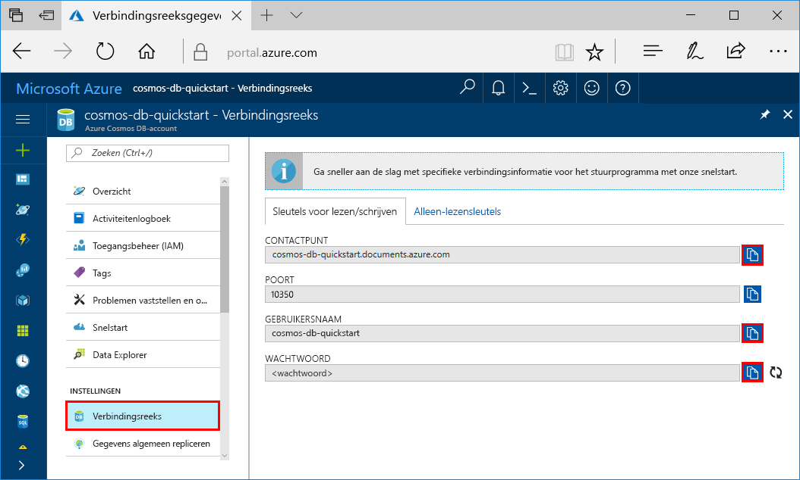
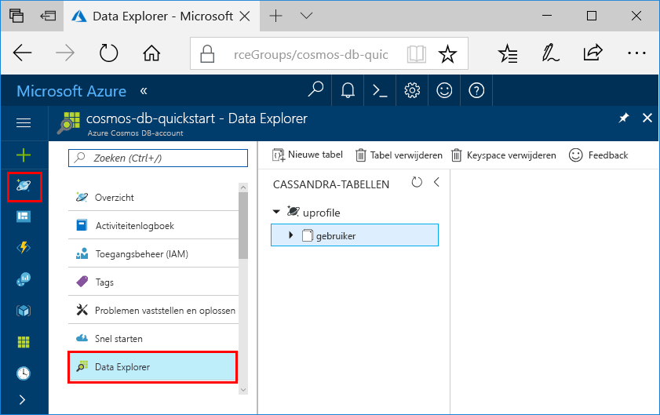

# <a name="quickstart-build-a-cassandra-app-with-net-and-azure-cosmos-db"></a>Quickstart: Een Cassandra-app bouwen met .NET en Azure Cosmos DB

Deze quickstart laat zien hoe u .NET en de [Cassandra-API](cassandra-introduction.md) van Azure Cosmos DB gebruikt om een profiel-app te maken door een voorbeeld uit GitHub te klonen. Deze quickstart begeleidt u ook bij het maken van een Azure Cosmos DB-account via Azure Portal op het web.   

Azure Cosmos DB is de wereldwijd gedistribueerde multimodel-databaseservice van Microsoft. U kunt snel databases maken van documenten, sleutel/waarde-paren en grafieken en hier query's op uitvoeren. Deze databases genieten allemaal het voordeel van de wereldwijde distributie en horizontale schaalmogelijkheden die ten grondslag liggen aan Azure Cosmos DB. 

## <a name="prerequisites"></a>Vereisten

[!INCLUDE [quickstarts-free-trial-note](../../includes/quickstarts-free-trial-note.md)] [Probeer Azure Cosmos DB gratis uit](https://azure.microsoft.com/try/cosmosdb/) zonder Azure-abonnement, zonder kosten en zonder verplichtingen.

Toegang tot het preview-programma van de Cassandra-API van Azure Cosmos DB. Als u nog geen toegang hebt aangevraagd, [meldt u zich nu aan](cassandra-introduction.md#sign-up-now).

Daarnaast doet u het volgende: 
* Als u Visual Studio 2017 nog niet hebt geïnstalleerd, kunt u het downloaden en de **gratis** [Community Edition van Visual Studio 2017](https://www.visualstudio.com/downloads/) gebruiken. Zorg ervoor dat u **Azure-ontwikkeling** inschakelt tijdens de installatie van Visual Studio.
* Installeer [Git](https://www.git-scm.com/) zodat u het voorbeeld kunt klonen.

<a id="create-account"></a>
## <a name="create-a-database-account"></a>Een databaseaccount maken

[!INCLUDE [cosmos-db-create-dbaccount-cassandra](../../includes/cosmos-db-create-dbaccount-cassandra.md)]


## <a name="clone-the-sample-application"></a>De voorbeeldtoepassing klonen

Nu gaan we werken met code. We gaan een Cassandra API-app klonen vanuit GitHub, de verbindingsreeks instellen en de app uitvoeren. U zult zien hoe gemakkelijk het is om op een programmatische manier met gegevens te werken. 

1. Open een git-terminalvenster, bijvoorbeeld git bash, en gebruik de opdracht `cd` om naar een map te gaan voor het installeren van de voorbeeld-app. 

    ```bash
    cd "C:\git-samples"
    ```

2. Voer de volgende opdracht uit om de voorbeeldopslagplaats te klonen. Deze opdracht maakt een kopie van de voorbeeld-app op uw computer.

    ```bash
    git clone https://github.com/Azure-Samples/azure-cosmos-db-cassandra-dotnet-getting-started.git
    ```

3. Open vervolgens het oplossingsbestand CassandraQuickStartSample in Visual Studio. 

## <a name="review-the-code"></a>De code bekijken

Deze stap is optioneel. Als u wilt weten hoe de databaseresources in de code worden gemaakt, kunt u de volgende codefragmenten bekijken. De codefragmenten zijn allemaal afkomstig uit het bestand `Program.cs` dat is geïnstalleerd in de map C:\git-samples\azure-cosmos-db-cassandra-dotnet-getting-started\CassandraQuickStartSample. Als u deze stap wilt overslaan, kunt u verdergaan naar [Uw verbindingsreeks bijwerken](#update-your-connection-string).

* Initialiseer de sessie door verbinding te maken met een eindpunt van het Cassandra-cluster. De Cassandra-API voor Azure Cosmos DB biedt alleen ondersteuning voor TLSv1.2. 

  ```csharp
   var options = new Cassandra.SSLOptions(SslProtocols.Tls12, true, ValidateServerCertificate);
   options.SetHostNameResolver((ipAddress) => CassandraContactPoint);
   Cluster cluster = Cluster.Builder().WithCredentials(UserName, Password).WithPort(CassandraPort).AddContactPoint(CassandraContactPoint).WithSSL(options).Build();
   ISession session = cluster.Connect();
   ```

* Maak een nieuwe keyspace.

    ```csharp
    session.Execute("CREATE KEYSPACE uprofile WITH REPLICATION = { 'class' : 'NetworkTopologyStrategy', 'datacenter1' : 1 };"); 
    ```

* Maak een nieuwe tabel.

   ```csharp
  session.Execute("CREATE TABLE IF NOT EXISTS uprofile.user (user_id int PRIMARY KEY, user_name text, user_bcity text)");
   ```

* Voeg gebruikersentiteiten toe met behulp van het IMapper-object in een nieuwe sessie die verbinding maakt met de uprofile-keyspace.

    ```csharp
    mapper.Insert<User>(new User(1, "LyubovK", "Dubai"));
    ```
    
* Voer een query uit voor het ophalen van de gebruikersgegevens van alle gebruikers.

    ```csharp
   foreach (User user in mapper.Fetch<User>("Select * from user"))
   {
      Console.WriteLine(user);
   }
    ```
    
 * Voer een query uit voor het ophalen van de gebruikersgegevens van één gebruiker.

    ```csharp
    mapper.FirstOrDefault<User>("Select * from user where user_id = ?", 3);
    ```

## <a name="update-your-connection-string"></a>Uw verbindingsreeks bijwerken

Ga nu terug naar Azure Portal om de verbindingsreeksinformatie op te halen en kopieer deze in de app. De verbindingsreeksinformatie stelt uw app in staat om te communiceren met de gehoste database.

1. Klik in [Azure Portal](http://portal.azure.com/) op **Verbindingsreeks**. 

    Gebruik de  aan de rechterkant van het scherm om de waarde USERNAME te kopiëren.

    

2. Open in Visual Studio 2017 het bestand Program.cs. 

3. Plak de USERNAME-waarde uit de portal over `<FILLME>` op regel 13 heen.

    Regel 13 van USERNAME moet er nu als volgt uitzien 

    `private const string UserName = "cosmos-db-quickstart";`

3. Ga terug naar de portal en kopieer de PASSWORD-waarde. Plak de PASSWORD-waarde uit de portal over `<FILLME>` op regel 14 heen.

    Regel 14 van Program.cs moet er nu als volgt uitzien 

    `private const string Password = "2Ggkr662ifxz2Mg...==";`

4. Ga terug naar de portal en kopieer de CONTACT POINT-waarde. Plak de CONTACT POINT-waarde uit de portal over `<FILLME>` op regel 15 heen.

    Regel 15 van Program.cs moet er nu als volgt uitzien 

    `private const string CassandraContactPoint = "cosmos-db-quickstarts.documents.azure.com"; //  DnsName`

5. Sla het bestand Program.cs op.
    
## <a name="run-the-app"></a>De app uitvoeren

1. Klik in Visual Studio op **Hulpprogramma's** > **NuGet Package Manager** > **Package Manager Console**.

2. Ga naar de opdrachtprompt en gebruik de volgende opdracht om het pakket NuGet van het .NET-stuurprogramma te installeren. 

    ```cmd
    Install-Package CassandraCSharpDriver
    ```
3. Klik op CTRL+F5 om de toepassing te starten. Uw app wordt in het consolevenster weergegeven. 

    

    Druk op Ctrl+C om de uitvoering van het programma te stoppen en het consolevenster te sluiten. 
    
    U kunt nu Data Explorer openen in Azure Portal om deze nieuwe gegevens te bekijken, te wijzigen, een query erop uit te voeren of er iets anders mee te doen. 

    

## <a name="review-slas-in-the-azure-portal"></a>SLA’s bekijken in Azure Portal

[!INCLUDE [cosmosdb-tutorial-review-slas](../../includes/cosmos-db-tutorial-review-slas.md)]

## <a name="clean-up-resources"></a>Resources opschonen

[!INCLUDE [cosmosdb-delete-resource-group](../../includes/cosmos-db-delete-resource-group.md)]

## <a name="next-steps"></a>Volgende stappen

In deze Quick Start hebt u geleerd hoe u een Azure Cosmos DB-account kunt maken, hoe u een verzameling kunt maken met Data Explorer en hebt u een web-app uitgevoerd. Nu kunt u aanvullende gegevens in uw Cosmos DB-account importeren. 

> [!div class="nextstepaction"]
> [Cassandra-gegevens importeren in Azure Cosmos DB](cassandra-import-data.md)
