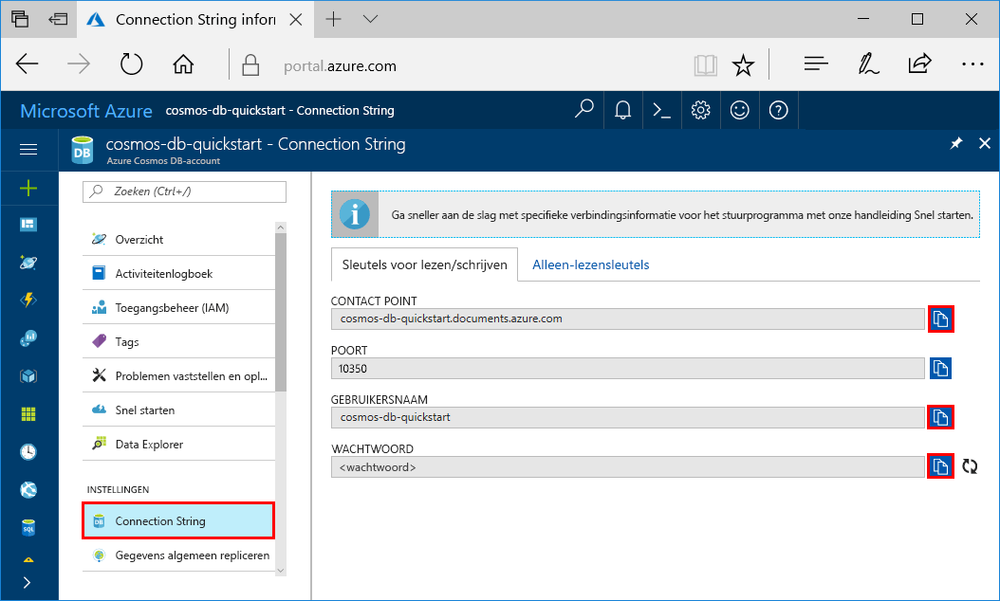
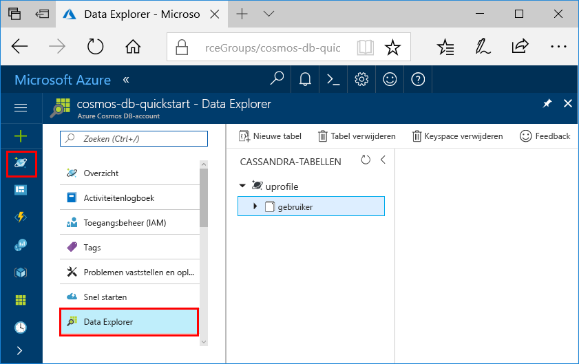

# <a name="quickstart-build-a-cassandra-app-with-nodejs-and-azure-cosmos-db"></a>Quickstart: Een Cassandra-app bouwen met Node.js en Azure Cosmos DB

Deze quickstart laat zien hoe u Node.js en de [Cassandra-API](cassandra-introduction.md) van Azure Cosmos DB gebruikt voor het compileren van een profiel-app door een voorbeeld uit GitHub te klonen. Deze quickstart begeleidt u ook bij het maken van een Azure Cosmos DB-account via Azure Portal op het web.

Azure Cosmos DB is de wereldwijd gedistribueerde multimodel-databaseservice van Microsoft. U kunt snel databases maken van documenten, sleutel/waarde-paren en grafieken en hier query's op uitvoeren. Deze databases genieten allemaal het voordeel van de wereldwijde distributie en horizontale schaalmogelijkheden die ten grondslag liggen aan Azure Cosmos DB. 

## <a name="prerequisites"></a>Vereisten

[!INCLUDE [quickstarts-free-trial-note](../../includes/quickstarts-free-trial-note.md)] [Probeer Azure Cosmos DB gratis uit](https://azure.microsoft.com/try/cosmosdb/) zonder Azure-abonnement, zonder kosten en zonder verplichtingen.

Toegang tot het preview-programma van de Cassandra-API van Azure Cosmos DB. Als u nog geen toegang hebt aangevraagd, [meldt u zich nu aan](cassandra-introduction.md#sign-up-now).

Daarnaast doet u het volgende:
* [Node.js](https://nodejs.org/en/) versie v0.10.29 of hoger
* [Git](http://git-scm.com/)

## <a name="create-a-database-account"></a>Een databaseaccount maken

Voordat u een documentdatabase kunt maken, moet u een Cassandra-account maken met Azure Cosmos DB.

[!INCLUDE [cosmos-db-create-dbaccount-cassandra](../../includes/cosmos-db-create-dbaccount-cassandra.md)]

## <a name="clone-the-sample-application"></a>De voorbeeldtoepassing klonen

We gaan nu een Cassandra API-app klonen vanuit GitHub, de verbindingsreeks instellen en de app uitvoeren. U zult zien hoe gemakkelijk het is om op een programmatische manier met gegevens te werken. 

1. Open een git-terminalvenster, bijvoorbeeld git bash, en gebruik de opdracht `cd` om naar een map te gaan voor het installeren van de voorbeeld-app. 

    ```bash
    cd "C:\git-samples"
    ```

2. Voer de volgende opdracht uit om de voorbeeldopslagplaats te klonen. Deze opdracht maakt een kopie van de voorbeeld-app op uw computer.

    ```bash
    git clone https://github.com/Azure-Samples/azure-cosmos-db-cassandra-nodejs-getting-started.git
    ```

## <a name="review-the-code"></a>De code bekijken

Deze stap is optioneel. Als u wilt weten hoe de databaseresources in de code worden gemaakt, kunt u de volgende codefragmenten bekijken. De codefragmenten zijn allemaal afkomstig uit het bestand `uprofile.js` in de map C:\git-samples\azure-cosmos-db-cassandra-nodejs-getting-started. Als u deze stap wilt overslaan, kunt u verdergaan naar [Uw verbindingsgegevens bijwerken](#update-your-connection-string). 

* Gebruikersnaam en wachtwoord zijn ingesteld met behulp van de pagina Verbindingsreeks in Azure Portal. 'path\to\cert' bevat een pad naar een X509 certificaat. 

   ```nodejs
   var ssl_option = {
        cert : fs.readFileSync("path\to\cert"),
        rejectUnauthorized : true,
        secureProtocol: 'TLSv1_2_method'
        };
   const authProviderLocalCassandra = new cassandra.auth.PlainTextAuthProvider(config.username, config.password);
   ```

* De `client` wordt geïnitialiseerd met contactPoint-informatie. Het contactPoint wordt opgehaald uit Azure Portal.

    ```nodejs
    const client = new cassandra.Client({contactPoints: [config.contactPoint], authProvider: authProviderLocalCassandra, sslOptions:ssl_option});
    ```

* De `client` maakt verbinding met de Cassandra-API van Azure Cosmos DB.

    ```nodejs
    client.connect(next);
    ```

* Er wordt een nieuwe keyspace gemaakt.

    ```nodejs
    function createKeyspace(next) {
        var query = "CREATE KEYSPACE IF NOT EXISTS uprofile WITH replication = {\'class\': \'NetworkTopologyStrategy\', \'datacenter1\' : \'1\' }";
        client.execute(query, next);
        console.log("created keyspace");    
  }
    ```

* Er wordt een nieuwe tabel gemaakt.

   ```nodejs
   function createTable(next) {
    var query = "CREATE TABLE IF NOT EXISTS uprofile.user (user_id int PRIMARY KEY, user_name text, user_bcity text)";
        client.execute(query, next);
        console.log("created table");
   },
   ```

* Sleutel/waarde-entiteiten worden ingevoegd.

    ```nodejs
    ...
       {
          query: 'INSERT INTO  uprofile.user  (user_id, user_name , user_bcity) VALUES (?,?,?)',
          params: [5, 'IvanaV', 'Belgaum', '2017-10-3136']
        }
    ];
    client.batch(queries, { prepare: true}, next);
    ```

* Voer een query uit om alle sleutelwaarden op te halen.

    ```nodejs
   var query = 'SELECT * FROM uprofile.user';
    client.execute(query, { prepare: true}, function (err, result) {
      if (err) return next(err);
      result.rows.forEach(function(row) {
        console.log('Obtained row: %d | %s | %s ',row.user_id, row.user_name, row.user_bcity);
      }, this);
      next();
    });
    ```  
    
* Voer een query uit om een sleutelwaarde op te halen.

    ```nodejs
    function selectById(next) {
        console.log("\Getting by id");
        var query = 'SELECT * FROM uprofile.user where user_id=1';
        client.execute(query, { prepare: true}, function (err, result) {
        if (err) return next(err);
            result.rows.forEach(function(row) {
            console.log('Obtained row: %d | %s | %s ',row.user_id, row.user_name, row.user_bcity);
        }, this);
        next();
        });
    }
    ```  

## <a name="update-your-connection-string"></a>Uw verbindingsreeks bijwerken

Ga nu terug naar Azure Portal om de verbindingsreeksinformatie op te halen en kopieer deze in de app. Hierdoor kan de app communiceren met de gehoste database.

1. Klik in [Azure Portal](http://portal.azure.com/) op **Verbindingsreeks**. 

    Gebruik de  aan de rechterkant van het scherm om de bovenste waarde (het CONTACT POINT) te kopiëren.

    

2. Open het `config.js`-bestand. 

3. Plak de waarde van CONTACT POINT uit de portal over `<FillMEIN>` op regel 4.

    Regel 4 moet er nu ongeveer als volgt uitzien: 

    `config.contactPoint = "cosmos-db-quickstarts.documents.azure.com:10350"`

4. Kopieer de waarde van USERNAME uit de portal en plak deze over `<FillMEIN>` op regel 2.

    Regel 2 moet er nu ongeveer als volgt uitzien: 

    `config.username = 'cosmos-db-quickstart';`
    
5. Kopieer de waarde van PASSWORD uit de portal en plak deze over `<FillMEIN>` op regel 3.

    Regel 3 moet nu ongeveer als volgt uitzien:

    `config.password = '2Ggkr662ifxz2Mg==';`

6. Sla het bestand config.js op.
    
## <a name="use-the-x509-certificate"></a>Het X509-certificaat gebruiken 

1. Als u Baltimore CyberTrust Root moet toevoegen, heeft deze serienummer 02:00:00:b9 en SHA1-vingerafdruk d4🇩🇪20:d0:5e:66:fc:53:fe:1a:50:88:2c:78:db:28:52:ca:e4:74. Deze kan worden gedownload vanaf https://cacert.omniroot.com/bc2025.crt, en worden opgeslagen als een lokaal bestand met de extensie .cer. 

2. Open uprofile.js en wijzig 'path\to\cert', zodat dit verwijst naar het nieuwe certificaat. 

3. Sla uprofile.js op. 

## <a name="run-the-app"></a>De app uitvoeren

1. Voer `npm install` uit in het git-terminalvenster om de vereiste npm-modules te installeren.

2. Voer `node uprofile.js` uit om de knooppunttoepassing te starten.

3. Controleer of de resultaten op de opdrachtregel aan de verwachting voldoen.

    

    Druk op Ctrl+C om de uitvoering van het programma te stoppen en het consolevenster te sluiten. 

    U kunt nu Data Explorer openen in Azure Portal om deze nieuwe gegevens te bekijken, te wijzigen, een query erop uit te voeren of er iets anders mee te doen. 

     

## <a name="review-slas-in-the-azure-portal"></a>SLA’s bekijken in Azure Portal

[!INCLUDE [cosmosdb-tutorial-review-slas](../../includes/cosmos-db-tutorial-review-slas.md)]

## <a name="clean-up-resources"></a>Resources opschonen

[!INCLUDE [cosmosdb-delete-resource-group](../../includes/cosmos-db-delete-resource-group.md)]

## <a name="next-steps"></a>Volgende stappen

In deze Quick Start hebt u geleerd hoe u een Azure Cosmos DB-account kunt maken, hoe u een verzameling kunt maken met Data Explorer en hebt u een app uitgevoerd. Nu kunt u aanvullende gegevens in uw Cosmos DB-account importeren. 

> [!div class="nextstepaction"]
> [Cassandra-gegevens importeren in Azure Cosmos DB](cassandra-import-data.md)


