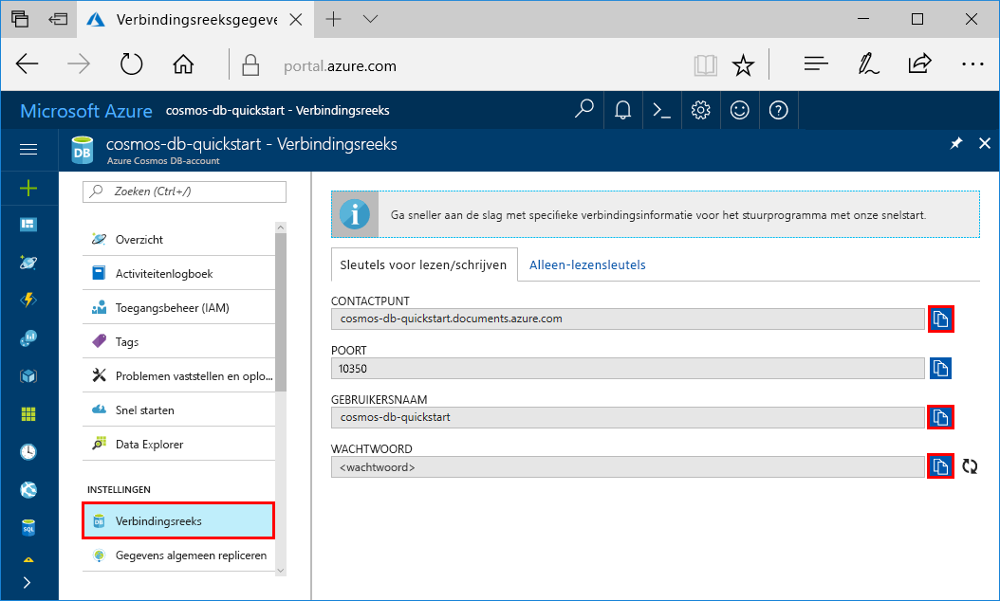
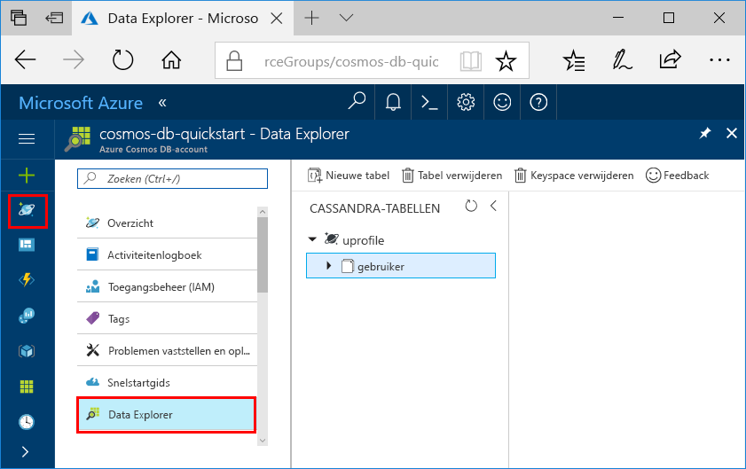

# <a name="quickstart-build-a-cassandra-app-with-python-and-azure-cosmos-db"></a>Quickstart: Een Cassandra-app compileren met Python en Azure Cosmos DB

Deze quickstart laat zien hoe u Python en de [Cassandra-API](cassandra-introduction.md) van Azure Cosmos DB gebruikt voor het compileren van een profiel-app door een voorbeeld uit GitHub te klonen. Deze quickstart begeleidt u ook bij het maken van een Azure Cosmos DB-account via Azure Portal op het web.

Azure Cosmos DB is de wereldwijd gedistribueerde multimodel-databaseservice van Microsoft. U kunt snel databases maken van documenten, sleutel/waarde-paren en grafen en hier query's op uitvoeren. Deze databases genieten allemaal het voordeel van de wereldwijde distributie en horizontale schaalmogelijkheden die ten grondslag liggen aan Azure Cosmos DB.   

## <a name="prerequisites"></a>Vereisten

[!INCLUDE [quickstarts-free-trial-note](../../includes/quickstarts-free-trial-note.md)] [Probeer Azure Cosmos DB gratis uit](https://azure.microsoft.com/try/cosmosdb/) zonder Azure-abonnement, zonder kosten en zonder verplichtingen.

Toegang tot het previewprogramma van de Cassandra-API van Azure Cosmos DB. Als u nog geen toegang hebt aangevraagd, [meldt u zich nu aan](cassandra-introduction.md#sign-up-now).

Daarnaast doet u het volgende:
* [Python](https://www.python.org/downloads/)-versie v2.7.14
* [Git](http://git-scm.com/)
* [Python-stuurprogramma voor Apache Cassandra](https://github.com/datastax/python-driver)

## <a name="create-a-database-account"></a>Een databaseaccount maken

Voordat u een documentdatabase kunt maken, moet u een Cassandra-account maken met Azure Cosmos DB.

[!INCLUDE [cosmos-db-create-dbaccount-cassandra](../../includes/cosmos-db-create-dbaccount-cassandra.md)]

## <a name="clone-the-sample-application"></a>De voorbeeldtoepassing klonen

We gaan nu een Cassandra API-app klonen vanaf GitHub, de verbindingsreeks instellen en de app uitvoeren. U zult zien hoe gemakkelijk het is om op een programmatische manier met gegevens te werken. 

1. Open een git-terminalvenster, bijvoorbeeld git bash, en gebruik de `cd`-opdracht om naar een map te gaan voor de installatie van de voorbeeld-app. 

    ```bash
    cd "C:\git-samples"
    ```

2. Voer de volgende opdracht uit om de voorbeeldopslagplaats te klonen. Deze opdracht maakt een kopie van de voorbeeld-app op uw computer. 

    ```bash
    git clone https://github.com/Azure-Samples/azure-cosmos-db-cassandra-python-getting-started.git
    ```

## <a name="review-the-code"></a>De code bekijken

Deze stap is optioneel. Als u wilt weten hoe de databaseresources in de code worden gemaakt, kunt u de volgende codefragmenten bekijken. De fragmenten zijn afkomstig uit het `pyquickstart.py`-bestand. Als u deze stap wilt overslaan, kunt u verdergaan naar [Uw verbindingsgegevens bijwerken](#update-your-connection-string). 

* Gebruikersnaam en wachtwoord zijn ingesteld met behulp van de pagina Verbindingsreeks in Azure Portal. Vervang path\to\cert door het pad naar uw X509-certificaat.

   ```python
    ssl_opts = {
            'ca_certs': 'path\to\cert',
            'ssl_version': ssl.PROTOCOL_TLSv1_2
            }
    auth_provider = PlainTextAuthProvider( username=cfg.config['username'], password=cfg.config['password'])
    cluster = Cluster([cfg.config['contactPoint']], port = cfg.config['port'], auth_provider=auth_provider, ssl_options=ssl_opts)
    session = cluster.connect()
   
   ```

* De `cluster` wordt geïnitialiseerd met contactPoint-informatie. Het contactPoint wordt opgehaald uit Azure Portal.

    ```python
   cluster = Cluster([cfg.config['contactPoint']], port = cfg.config['port'], auth_provider=auth_provider)
    ```

* De `cluster` maakt verbinding met de Cassandra-API van Azure Cosmos DB.

    ```python
    session = cluster.connect()
    ```

* Er wordt een nieuwe keyspace gemaakt.

    ```python
   session.execute('CREATE KEYSPACE IF NOT EXISTS uprofile WITH replication = {\'class\': \'NetworkTopologyStrategy\', \'datacenter1\' : \'1\' }')
    ```

* Er wordt een nieuwe tabel gemaakt.

   ```
   session.execute('CREATE TABLE IF NOT EXISTS uprofile.user (user_id int PRIMARY KEY, user_name text, user_bcity text)');
   ```

* Sleutel/waarde-entiteiten worden ingevoegd.

    ```Python
    insert_data = session.prepare("INSERT INTO  uprofile.user  (user_id, user_name , user_bcity) VALUES (?,?,?)")
    batch = BatchStatement()
    batch.add(insert_data, (1, 'LyubovK', 'Dubai'))
    batch.add(insert_data, (2, 'JiriK', 'Toronto'))
    batch.add(insert_data, (3, 'IvanH', 'Mumbai'))
    batch.add(insert_data, (4, 'YuliaT', 'Seattle'))
    ....
    session.execute(batch)
    ```

* Voer een query uit om alle sleutelwaarden op te halen.

    ```Python
    rows = session.execute('SELECT * FROM uprofile.user')
    ```  
    
* Voer een query uit om een sleutelwaarde op te halen.

    ```Python
    
    rows = session.execute('SELECT * FROM uprofile.user where user_id=1')
    ```  

## <a name="update-your-connection-string"></a>Uw verbindingsreeks bijwerken

Ga nu terug naar Azure Portal om de verbindingsreeksinformatie op te halen en kopieer deze in de app. Hierdoor kan de app communiceren met de gehoste database.

1. Klik in [Azure Portal](http://portal.azure.com/) op **Verbindingsreeks**. 

    Gebruik de  aan de rechterkant van het scherm om de bovenste waarde (het CONTACT POINT) te kopiëren.

    

2. Open het `config.py`-bestand. 

3. Plak de waarde CONTACT POINT vanuit de portal over `<FILLME>` op regel 10.

    Regel 10 moet nu ongeveer als volgt uitzien: 

    `'contactPoint': 'cosmos-db-quickstarts.documents.azure.com:10350'`

4. Kopieer de waarde van USERNAME vanuit de portal en plak deze over `<FILLME>` op regel 6.

    Regel 6 moet nu ongeveer als volgt uitzien: 

    `'username': 'cosmos-db-quickstart',`
    
5. Kopieer de waarde van PASSWORD vanuit de portal en plak deze over `<FILLME>` op regel 8.

    Regel 8 moet nu ongeveer als volgt uitzien:

    `'password' = '2Ggkr662ifxz2Mg==`';`

6. Sla het bestand config.py op.
    
## <a name="use-the-x509-certificate"></a>Het X509-certificaat gebruiken

1. Als u Baltimore CyberTrust Root moet toevoegen, heeft deze serienummer 02:00:00:b9 en SHA1-vingerafdruk d4🇩🇪20:d0:5e:66:fc:53:fe:1a:50:88:2c:78:db:28:52:ca:e4:74. Deze kan worden gedownload vanaf https://cacert.omniroot.com/bc2025.crt, opgeslagen als lokaal bestand met extensie .cer

2. Open pyquickstart.py en wijzig path\to\cert, zodat dit verwijst naar het nieuwe certificaat.

3. Sla pyquickstart.py op.

## <a name="run-the-app"></a>De app uitvoeren

1. Gebruik de opdracht cd in de git-terminal om de map azure-cosmos-db-cassandra-python-getting-started te kiezen. 

2. Voer de volgende opdrachten uit om de vereiste modules te installeren:

    ```python
    python -m pip install cassandra-driver
    python -m pip install prettytable
    python -m pip install requests
    python -m pip install pyopenssl
    ```

2. Voer de volgende opdracht uit om de knooppunttoepassing te starten:

    ```
    python pyquickstart.py
    ```

3. Controleer of de resultaten van de opdrachtregel aan de verwachting voldoen.

    Druk op CTRL + C om de uitvoering van het programma te stoppen en het consolevenster te sluiten. 

    
    
    U kunt nu Data Explorer openen in Azure Portal om deze nieuwe gegevens te bekijken, te wijzigen, een query erop uit te voeren of er iets anders mee te doen. 

    

## <a name="review-slas-in-the-azure-portal"></a>SLA’s bekijken in Azure Portal

[!INCLUDE [cosmosdb-tutorial-review-slas](../../includes/cosmos-db-tutorial-review-slas.md)]

## <a name="clean-up-resources"></a>Resources opschonen

[!INCLUDE [cosmosdb-delete-resource-group](../../includes/cosmos-db-delete-resource-group.md)]

## <a name="next-steps"></a>Volgende stappen

In deze Quick Start hebt u geleerd hoe u een Azure Cosmos DB-account kunt maken, hoe u een verzameling kunt maken met Data Explorer en hebt u een app uitgevoerd. Nu kunt u aanvullende gegevens in uw Cosmos DB-account importeren. 

> [!div class="nextstepaction"]
> [Cassandra-gegevens importeren in Azure Cosmos DB](cassandra-import-data.md)

