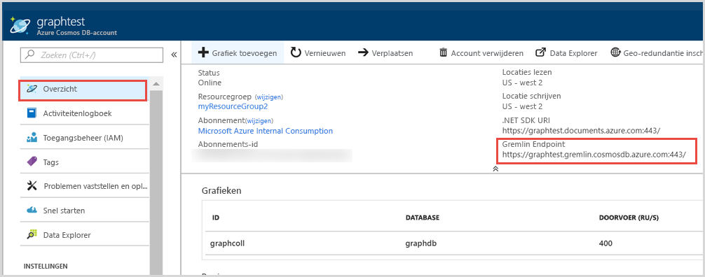
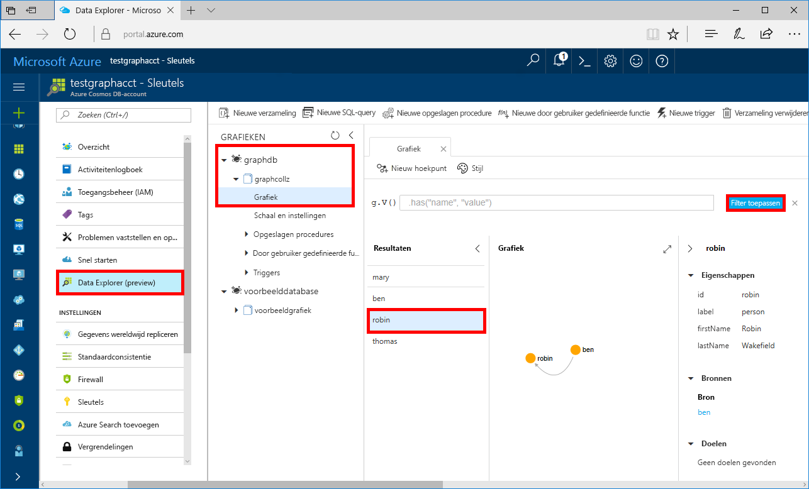

# <a name="azure-cosmos-db-build-a-net-framework-or-core-application-using-the-gremlin-api"></a>Azure Cosmos DB: een .NET Framework- of Core-toepassing ontwikkelen met de Gremlin-API

> [!div class="op_single_selector"]
> * [Gremlin-console](create-graph-gremlin-console.md)
> * [.NET](create-graph-dotnet.md)
> * [Java](create-graph-java.md)
> * [Node.js](create-graph-nodejs.md)
> * [Python](create-graph-python.md)
> * [PHP](create-graph-php.md)
>  

Azure Cosmos DB is de wereldwijd gedistribueerde multimodel-databaseservice van Microsoft. U kunt snel databases maken van documenten, sleutel/waarde-paren en grafieken en hier query’s op uitvoeren. Deze databases genieten allemaal het voordeel van de globale distributie en horizontale schaalmogelijkheden die ten grondslag liggen aan Azure Cosmos DB. 

Deze snelstartgids laat zien hoe u een [Gremlin-API](graph-introduction.md)-account van Azure Cosmos DB, een database en een graaf (container) kunt maken met behulp van Azure Portal. U gaat vervolgens een console-app ontwikkelen en uitvoeren met behulp van het opensourcestuurprogramma [Gremlin.Net](http://tinkerpop.apache.org/docs/3.2.7/reference/#gremlin-DotNet).  

## <a name="prerequisites"></a>Vereisten

Als u Visual Studio 2017 nog niet hebt geïnstalleerd, kunt u het downloaden en de **gratis** [Community Edition van Visual Studio 2017](https://www.visualstudio.com/downloads/) gebruiken. Zorg ervoor dat u **Azure-ontwikkeling** inschakelt tijdens de installatie van Visual Studio.

Als u Visual Studio 2017 al hebt geïnstalleerd, controleert u of u alles hebt geïnstalleerd tot en met [Visual Studio 2017 Update 3](https://www.visualstudio.com/en-us/news/releasenotes/vs2017-relnotes).

[!INCLUDE [quickstarts-free-trial-note](../../includes/quickstarts-free-trial-note.md)]

## <a name="create-a-database-account"></a>Een databaseaccount maken

[!INCLUDE [cosmos-db-create-dbaccount-graph](../../includes/cosmos-db-create-dbaccount-graph.md)]

## <a name="add-a-graph"></a>Een graaf toevoegen

[!INCLUDE [cosmos-db-create-graph](../../includes/cosmos-db-create-graph.md)]

## <a name="clone-the-sample-application"></a>De voorbeeldtoepassing klonen

We gaan nu een Gremlin-API-app klonen vanaf GitHub, de verbindingsreeks instellen en de app uitvoeren. U zult zien hoe gemakkelijk het is om op een programmatische manier met gegevens te werken. 

1. Open een opdrachtprompt, maak een nieuwe map met de naam git-samples en sluit vervolgens de opdrachtprompt.

    ```bash
    md "C:\git-samples"
    ```

2. Open een git-terminalvenster, bijvoorbeeld git bash, en gebruik de `cd`-opdracht om naar de nieuwe map te gaan voor het installeren van de voorbeeld-app.

    ```bash
    cd "C:\git-samples"
    ```

3. Voer de volgende opdracht uit om de voorbeeldopslagplaats te klonen. Deze opdracht maakt een kopie van de voorbeeld-app op uw computer.

    ```bash
    git clone https://github.com/Azure-Samples/azure-cosmos-db-graph-gremlindotnet-getting-started.git
    ```

4. Open vervolgens Visual Studio en open het oplossingenbestand.

5. Herstel de NuGet-pakketten in het project. Dit geldt voor het stuurprogramma Gremlin.Net, evenals het pakket Newtonsoft.Json.


6. U kunt het stuurprogramma Gremlin.Net ook handmatig installeren met Nuget-pakketbeheer of het [Nuget-opdrachtregelprogramma](https://docs.microsoft.com/nuget/install-nuget-client-tools): 

    ```bash
    nuget install Gremlin.Net
    ```

## <a name="review-the-code"></a>De code bekijken

Deze stap is optioneel. Als u wilt weten hoe de databaseresources in de code worden gemaakt, kunt u de volgende codefragmenten bekijken. Als u deze stap wilt overslaan, kunt u verdergaan naar [Uw verbindingsreeks bijwerken](#update-your-connection-string). 

De volgende codefragmenten zijn allemaal afkomstig uit het bestand Program.cs.

* Stel uw verbindingsparameters in op basis van het hierboven gemaakte account (regel 19): 

    ```csharp
    private static string hostname = "your-endpoint.gremlin.cosmosdb.azure.com";
    private static int port = 443;
    private static string authKey = "your-authentication-key";
    private static string database = "your-database";
    private static string collection = "your-graph-container";
    ```

* De uit te voeren Gremlin-opdrachten worden vermeld in een woordenboek (regel 26):

    ```csharp
    private static Dictionary<string, string> gremlinQueries = new Dictionary<string, string>
    {
        { "Cleanup",        "g.V().drop()" },
        { "AddVertex 1",    "g.addV('person').property('id', 'thomas').property('firstName', 'Thomas').property('age', 44)" },
        { "AddVertex 2",    "g.addV('person').property('id', 'mary').property('firstName', 'Mary').property('lastName', 'Andersen').property('age', 39)" },
        { "AddVertex 3",    "g.addV('person').property('id', 'ben').property('firstName', 'Ben').property('lastName', 'Miller')" },
        { "AddVertex 4",    "g.addV('person').property('id', 'robin').property('firstName', 'Robin').property('lastName', 'Wakefield')" },
        { "AddEdge 1",      "g.V('thomas').addE('knows').to(g.V('mary'))" },
        { "AddEdge 2",      "g.V('thomas').addE('knows').to(g.V('ben'))" },
        { "AddEdge 3",      "g.V('ben').addE('knows').to(g.V('robin'))" },
        { "UpdateVertex",   "g.V('thomas').property('age', 44)" },
        { "CountVertices",  "g.V().count()" },
        { "Filter Range",   "g.V().hasLabel('person').has('age', gt(40))" },
        { "Project",        "g.V().hasLabel('person').values('firstName')" },
        { "Sort",           "g.V().hasLabel('person').order().by('firstName', decr)" },
        { "Traverse",       "g.V('thomas').out('knows').hasLabel('person')" },
        { "Traverse 2x",    "g.V('thomas').out('knows').hasLabel('person').out('knows').hasLabel('person')" },
        { "Loop",           "g.V('thomas').repeat(out()).until(has('id', 'robin')).path()" },
        { "DropEdge",       "g.V('thomas').outE('knows').where(inV().has('id', 'mary')).drop()" },
        { "CountEdges",     "g.E().count()" },
        { "DropVertex",     "g.V('thomas').drop()" },
    };
    ```


* Maak een `GremlinServer`-verbindingsobject met de bovenstaande parameters (regel 52):

    ```csharp
    var gremlinServer = new GremlinServer(hostname, port, enableSsl: true, 
                                                    username: "/dbs/" + database + "/colls/" + collection, 
                                                    password: authKey);
    ```

* Maak een nieuw `GremlinClient`-object (regel 56):

    ```csharp
    var gremlinClient = new GremlinClient(gremlinServer);
    ```

* Voer elke Gremlin-query uit met behulp van het `GremlinClient`-object met een asynchrone taak (regel 63). Hiermee worden de Gremlin-query's gelezen uit het hierboven gedefinieerde woordenboek (regel 26):

    ```csharp
    var task = gremlinClient.SubmitAsync<dynamic>(query.Value);
    task.Wait();
    ```

* Haal het resultaat op en lees de waarden, die zijn opgemaakt als een woordenboek, met behulp van de `JsonSerializer`-klasse vanuit Newtonsoft.Json:

    ```csharp
    foreach (var result in task.Result)
    {
        // The vertex results are formed as dictionaries with a nested dictionary for their properties
        string output = JsonConvert.SerializeObject(result);
        Console.WriteLine(String.Format("\tResult:\n\t{0}", output));
    }
    ```

## <a name="update-your-connection-string"></a>Uw verbindingsreeks bijwerken

Ga nu terug naar Azure Portal om de verbindingsreeksinformatie op te halen en kopieer deze in de app.

1. Vanuit [Azure Portal](http://portal.azure.com/) gaat u naar uw grafiekdatabaseaccount. In het tabblad **Overzicht** ziet u twee eindpunten: 
 
   **.Net SDK URI**: deze waarde wordt gebruikt wanneer u verbinding met het grafiekaccount maakt met behulp van de Microsoft.Azure.Graphs-bibliotheek. 

   **Gremlin-eindpunt**: deze waarde wordt gebruikt wanneer u verbinding met het grafiekaccount maakt met behulp van de Gremlin.Net-bibliotheek.

    

   Als u dit voorbeeld wilt uitvoeren, moet u de waarde voor het **Gremlin-eindpunt** kopiëren, het poortnummer aan het eind verwijderen, zodat de URI `https://<your cosmos db account name>.gremlin.cosmosdb.azure.com` wordt.

2. Plak in Program.cs de waarde over `your-endpoint` in de variabele `hostname` op regel 19. 

    `"private static string hostname = "<your cosmos db account name>.gremlin.cosmosdb.azure.com";`

    De eindpuntwaarde ziet er nu als volgt:

    `"private static string hostname = "testgraphacct.gremlin.cosmosdb.azure.com";`

3. Ga vervolgens naar het tabblad **Sleutels** en kopieer de waarde van **PRIMAIRE SLEUTEL** uit de portal en plak deze in de variabele `authkey`, waarbij de tijdelijke aanduiding `"your-authentication-key"` op regel 21 wordt vervangen. 

    `private static string authKey = "your-authentication-key";`

4. Plak met behulp van de gegevens van de hierboven gemaakte database de databasenaam in de variabele `database` op regel 22. 

    `private static string database = "your-database";`

5. Plak op dezelfde manier de container met behulp van de gegevens van de hierboven gemaakte verzameling (die ook de grafieknaam is) in de variabele `collection` op regel 23. 

    `private static string collection = "your-collection-or-graph";`

6. Sla het bestand Program.cs op. 

U hebt uw app nu bijgewerkt met alle informatie die nodig is voor de communicatie met Azure Cosmos DB. 

## <a name="run-the-console-app"></a>De console-app uitvoeren

Klik op Ctrl+F5 om de toepassing uit te voeren. De toepassing drukt zowel de Gremlin-queryopdrachten als de -resultaten af in de console.

   In het consolevenster worden de hoekpunten en randen weergegeven die aan de graaf worden toegevoegd. Zodra het script is voltooid, drukt u op Enter om het consolevenster te sluiten.

## <a name="browse-using-the-data-explorer"></a>Bladeren met Data Explorer

U kunt nu teruggaan naar Data Explorer in Azure Portal en door uw nieuwe graafgegevens bladeren en er query’s op uitvoeren.

1. De nieuwe database wordt in Data Explorer weergegeven in het deelvenster Grafieken. Vouw de database en containerknooppunten uit en klik op **Graph**.

2. Klik op de knop **Filter toepassen** om de standaardquery te gebruiken om alle hoekpunten in de grafiek weer te geven. De gegevens die worden gegenereerd door de voorbeeldapp worden weergegeven in het deelvenster Grafen.

    U kunt op de grafiek in- en uitzoomen, u kunt u de grafiek uitvouwen voor meer ruimte, extra hoekpunten toevoegen en hoekpunten verplaatsen in de weergaveruimte.

    

## <a name="review-slas-in-the-azure-portal"></a>SLA’s bekijken in Azure Portal

[!INCLUDE [cosmosdb-tutorial-review-slas](../../includes/cosmos-db-tutorial-review-slas.md)]

## <a name="clean-up-resources"></a>Resources opschonen

[!INCLUDE [cosmosdb-delete-resource-group](../../includes/cosmos-db-delete-resource-group.md)]

## <a name="next-steps"></a>Volgende stappen

In deze Quick Start hebt u geleerd hoe u een Azure Cosmos DB-account kunt maken, hebt u een graaf gemaakt met Data Explorer en hebt u een app uitgevoerd. U kunt nu complexere query's maken en met Gremlin krachtige logica implementeren om door een graaf te gaan. 

> [!div class="nextstepaction"]
> [Query’s uitvoeren met Gremlin](tutorial-query-graph.md)

