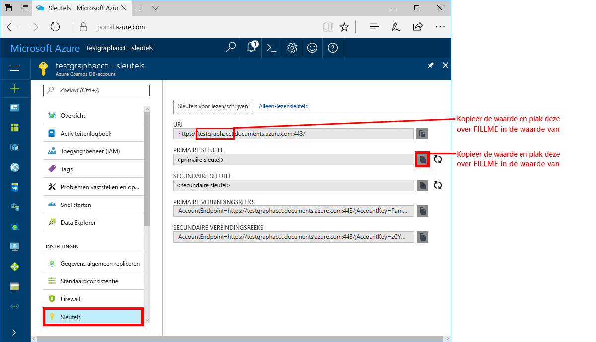

<a id="azure-cosmos-db-build-a-net-application-using-the-graph-api" class="xliff"></a>

# Azure Cosmos DB: een .NET-toepassing ontwikkelen met de Graph API

Azure Cosmos DB is de wereldwijd gedistribueerde multimodel-databaseservice van Microsoft. U kunt snel databases maken van documenten, sleutel/waarde-paren en grafen en hier query’s op uitvoeren. Deze databases genieten allemaal het voordeel van de wereldwijde distributie en horizontale schaalmogelijkheden die ten grondslag liggen aan Azure Cosmos DB. 

Deze Quick Start laat zien hoe u een Azure Cosmos DB-account, een database en een graaf (container) kunt maken met behulp van Azure Portal. Vervolgens ontwikkelt u een console-app die is gebouwd op de [Graph API](graph-sdk-dotnet.md) (preview) en voert u deze uit.  

<a id="prerequisites" class="xliff"></a>

## Vereisten

Als u Visual Studio 2017 nog niet hebt geïnstalleerd, kunt u het downloaden en de **gratis** [Community Edition van Visual Studio 2017](https://www.visualstudio.com/downloads/) gebruiken. Zorg ervoor dat u **Azure-ontwikkeling** inschakelt tijdens de installatie van Visual Studio.

[!INCLUDE [quickstarts-free-trial-note](../../includes/quickstarts-free-trial-note.md)]

<a id="create-a-database-account" class="xliff"></a>

## Een databaseaccount maken

[!INCLUDE [cosmos-db-create-dbaccount-graph](../../includes/cosmos-db-create-dbaccount-graph.md)]

<a id="add-a-graph" class="xliff"></a>

## Een graaf toevoegen

[!INCLUDE [cosmos-db-create-graph](../../includes/cosmos-db-create-graph.md)]

<a id="clone-the-sample-application" class="xliff"></a>

## De voorbeeldtoepassing klonen

We gaan nu een Graph API-app klonen vanaf GitHub, de verbindingsreeks instellen en de app uitvoeren. U zult zien hoe gemakkelijk het is om op een programmatische manier met gegevens te werken. 

1. Open een venster in een git-terminal zoals git bash en `cd` naar een werkmap.  

2. Voer de volgende opdracht uit om de voorbeeldopslagplaats te klonen. 

    ```bash
    git clone https://github.com/Azure-Samples/azure-cosmos-db-graph-dotnet-getting-started.git
    ```

3. Open vervolgens het oplossingenbestand in Visual Studio. 

<a id="review-the-code" class="xliff"></a>

## De code bekijken

Laten we eens kijken wat er precies gebeurt in de app. Open het bestand Program.cs en u zult zien dat deze regels code de Azure Cosmos DB-resources maken. 

* De DocumentClient wordt geïnitialiseerd. In het voorbeeld hebben we een API voor het toevoegen van een graafextensie toegevoegd aan de Azure Cosmos DB-client. We werken op een zelfstandige graafclient die is losgekoppeld van de Azure Cosmos DB-client en -resources.

    ```csharp
    using (DocumentClient client = new DocumentClient(
        new Uri(endpoint),
        authKey,
        new ConnectionPolicy { ConnectionMode = ConnectionMode.Direct, ConnectionProtocol = Protocol.Tcp }))
    ```

* Er wordt een nieuwe database gemaakt.

    ```csharp
    Database database = await client.CreateDatabaseIfNotExistsAsync(new Database { Id = "graphdb" });
    ```

* Er wordt en nieuwe graaf gemaakt.

    ```csharp
    DocumentCollection graph = await client.CreateDocumentCollectionIfNotExistsAsync(
        UriFactory.CreateDatabaseUri("graphdb"),
        new DocumentCollection { Id = "graph" },
        new RequestOptions { OfferThroughput = 1000 });
    ```
* Een reeks Gremlin-stappen wordt uitgevoerd met behulp van de methode `CreateGremlinQuery`.

    ```csharp
    // The CreateGremlinQuery method extensions allow you to execute Gremlin queries and iterate
    // results asychronously
    IDocumentQuery<dynamic> query = client.CreateGremlinQuery<dynamic>(graph, "g.V().count()");
    while (query.HasMoreResults)
    {
        foreach (dynamic result in await query.ExecuteNextAsync())
        {
            Console.WriteLine($"\t {JsonConvert.SerializeObject(result)}");
        }
    }

    ```

<a id="update-your-connection-string" class="xliff"></a>

## Uw verbindingsreeks bijwerken

Ga nu terug naar Azure Portal om de verbindingsreeksinformatie op te halen en kopieer deze in de app.

1. Klik in [Azure Portal](http://portal.azure.com/), in uw Azure Cosmos DB-account, in het linker navigatiegedeelte op **Sleutels** en klik vervolgens op **Sleutels voor lezen/schrijven**. In de volgende stap gebruikt u de kopieerknoppen aan de rechterkant van het scherm om de URI en primaire sleutel in het bestand `App.config` te kopiëren.

    

2. Open in Visual Studio 2017 het bestand `App.config`. 

3. Kopieer uw URI-waarde vanaf de portal (met de kopieerknop) en geef deze als waarde aan de eindpuntsleutel in `App.config`. 

    `<add key="Endpoint" value="FILLME.documents.azure.com:443" />`

4. Kopieer vervolgens de waarde van uw PRIMAIRE SLEUTEL vanaf de portal en geef deze als waarde van de authKey in `App.config`. 

    `<add key="AuthKey" value="FILLME" />`

U hebt uw app nu bijgewerkt met alle informatie die nodig is voor de communicatie met Azure Cosmos DB. 

<a id="run-the-console-app" class="xliff"></a>

## De app console uitvoeren

1. Klik in Visual Studio met de rechtermuisknop op het project in **GraphGetStarted** in **Solution Explorer** en klik vervolgens op **NuGet-pakketten beheren**. 

2. In het NuGet-vak **Bladeren** typt u *Microsoft.Azure.Graphs* en schakelt u het selectievakje **Inclusief voorlopige versie** in. 

3. Installeer vanuit de resultaten het pakket met de bibliotheek **Microsoft.Azure.Graphs**. Hiermee installeert u het pakket met de bibliotheek met graafextensies van Azure Cosmos DB en alle afhankelijkheden.

4. Klik op CTRL+F5 om de toepassing te starten.

   In het consolevenster worden de hoekpunten en randen weergegeven die aan de graaf worden toegevoegd. Zodra het script is voltooid, drukt u tweemaal op ENTER om het consolevenster te sluiten. 

<a id="browse-using-the-data-explorer" class="xliff"></a>

## Bladeren met Data Explorer

U kunt nu teruggaan naar Data Explorer in Azure Portal en door uw nieuwe graafgegevens bladeren en er query’s op uitvoeren.

* De nieuwe database wordt in Data Explorer weergegeven in het deelvenster Verzamelingen. Vouw **graphdb**, **graphcoll** uit en klik vervolgens op **Graaf**.

    De gegevens die worden gegenereerd door de voorbeeldapp worden weergegeven in het deelvenster Grafen.

<a id="review-slas-in-the-azure-portal" class="xliff"></a>

## SLA’s bekijken in Azure Portal

[!INCLUDE [cosmosdb-tutorial-review-slas](../../includes/cosmos-db-tutorial-review-slas.md)]

<a id="clean-up-resources" class="xliff"></a>

## Resources opschonen

Als u deze app niet verder gaat gebruiken, kunt u alle resources verwijderen die door deze Quick Start zijn aangemaakt door onderstaande stappen te volgen in Azure Portal: 

1. Klik in het menu aan de linkerkant in Azure Portal op **Resourcegroepen** en klik vervolgens op de resource die u hebt gemaakt. 
2. Klik op de pagina van uw resourcegroep op **Verwijderen**, typ de naam van de resource die u wilt verwijderen in het tekstvak en klik vervolgens op **Verwijderen**.

<a id="next-steps" class="xliff"></a>

## Volgende stappen

In deze Quick Start hebt u geleerd hoe u een Azure Cosmos DB-account kunt maken, hebt u een graaf gemaakt met Data Explorer en hebt u een app uitgevoerd. U kunt nu complexere query's maken en met Gremlin krachtige logica implementeren om door een graaf te gaan. 

> [!div class="nextstepaction"]
> [Query’s uitvoeren met Gremlin](tutorial-query-graph.md)


