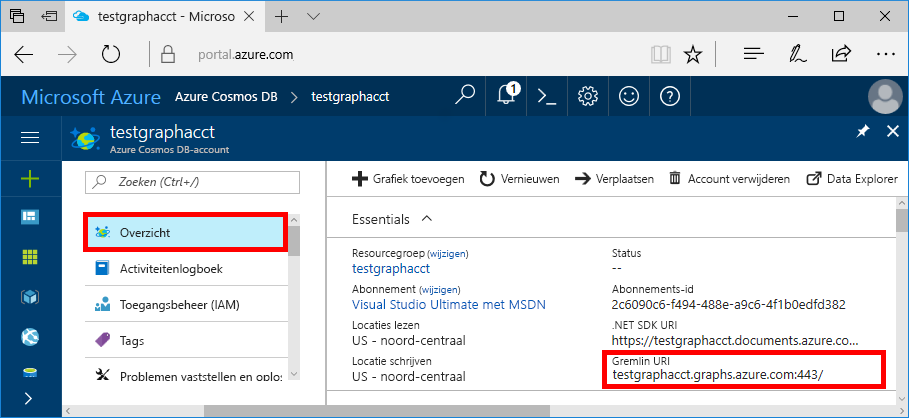
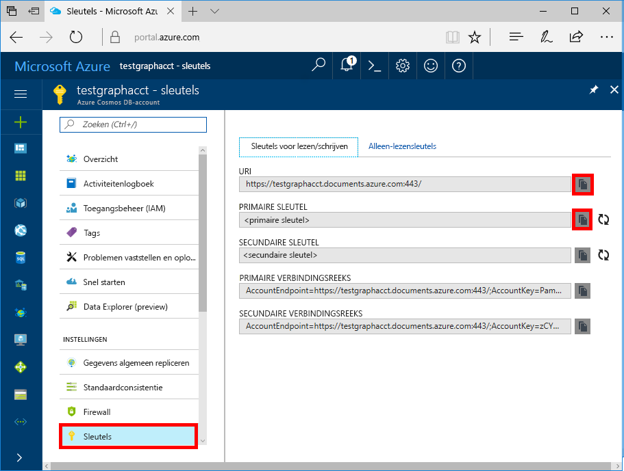

# <a name="azure-cosmos-db-create-query-and-traverse-a-graph-in-the-gremlin-console"></a>Zelfstudie Azure Cosmos DB: gebruik de Gremlin-console om objecten te maken, query’s op grafen uit te voeren en door grafen te gaan

Azure Cosmos DB is de globaal gedistribueerde multimodel-databaseservice van Microsoft. U kunt snel databases maken van documenten, sleutel/waarde-paren en grafieken en hier query’s op uitvoeren. Deze databases genieten allemaal het voordeel van de globale distributie en horizontale schaalmogelijkheden die ten grondslag liggen aan Azure Cosmos DB. 

In deze snelstartgids ziet u hoe u met Azure Portal een Azure Cosmos DB-account, een database en een graaf (container) kunt maken, en vervolgens de [Gremlin-console](https://tinkerpop.apache.org/docs/current/reference/#gremlin-console) van [Apache TinkerPop](http://tinkerpop.apache.org) kunt gebruiken om met gegevens van de Graph API te werken. In deze zelfstudie gaat u hoekpunten en randen maken, er query’s op uitvoeren, een eigenschap van een hoekpunt bijwerken, query’s uitvoeren op hoekpunten, door de graaf gaan en een hoekpunt verwijderen.


De Gremlin-console is op Groovy/Java gebaseerd en wordt uitgevoerd op Linux, Mac en Windows. U kunt de console downloaden van de [Apache TinkerPop-site](http://tinkerpop.apache.org/downloads.html).

## <a name="prerequisites"></a>Vereisten

U moet een Azure-abonnement hebben om een Azure Cosmos DB-account volgens deze Quick Start te kunnen maken.

[!INCLUDE [quickstarts-free-trial-note](../../includes/quickstarts-free-trial-note.md)]

U moet ook de [Gremlin-console](http://tinkerpop.apache.org/) installeren. Gebruik versie 3.2.5 of hoger.

## <a name="create-a-database-account"></a>Een databaseaccount maken

[!INCLUDE [cosmos-db-create-dbaccount-graph](../../includes/cosmos-db-create-dbaccount-graph.md)]

## <a name="add-a-graph"></a>Een graaf toevoegen

[!INCLUDE [cosmos-db-create-graph](../../includes/cosmos-db-create-graph.md)]

## <a id="ConnectAppService"></a>Verbinding maken met uw app service
1. Voordat u de Gremlin-console start, moet u het configuratiebestand remote-secure.yaml in de map `apache-tinkerpop-gremlin-console-3.2.5/conf` maken of wijzigen.
2. Vul uw *host-*, *poort-*, *gebruikersnaam-*, *wachtwoord-*, *connectionPool-* en *serializer-*configuraties in:

    Instelling|Voorgestelde waarde|Beschrijving
    ---|---|---
    hosts|[***.gremlin.cosmosdb.azure.com] of [***.graphs.azure.com] voor accounts die zijn gemaakt vóór 20 december 2017|Zie de onderstaande schermafbeelding. Dit is de Gremlin URI-waarde op de pagina Overzicht van Azure Portal tussen vierkante haken, waarbij de afsluitende: 443/ is verwijderd.<br><br>Deze waarde kan ook worden opgehaald van het tabblad Sleutels met behulp van de URI-waarde door https:// te verwijderen, documenten in grafieken of gremlin.cosmosdb te wijzigen en de afsluitende: 443/ te verwijderen.
    poort|443|Ingesteld op 443.
    gebruikersnaam|*Uw gebruikersnaam*|De bron van het formulier `/dbs/<db>/colls/<coll>` waar `<db>` de naam van uw database is en `<coll>` de naam van uw verzameling is.
    wachtwoord|*Uw primaire sleutel*| Zie de tweede onderstaande schermafbeelding. Dit is uw primaire sleutel, die u kunt ophalen van de pagina Sleutels in Azure Portal, in het vak Primaire sleutel. Gebruik de kopieerknop aan de linkerkant van het vak om de waarde te kopiëren.
    connectionPool|{enableSsl: true}|De instelling van de verbindingsgroep voor SSL.
    serializer|{ className: org.apache.tinkerpop.gremlin.<br>driver.ser.GraphSONMessageSerializerV1d0,<br> config: { serializeResultToString: true }}|Instellen op deze waarden en eventuele `\n`-regeleinden verwijderen bij het plakken in de waarde.

    Kopieer voor de waarde voor hosts de **Gremlin URI**-waarde van de pagina **Overzicht**: 

    Kopieer voor de wachtwoordwaarde de **Primaire sleutel** van de pagina **Sleutels**: 

Het remote-secure.yaml-bestand moet er als volgt uitzien:

```
hosts: [your_database_server.gremlin.cosmosdb.azure.com]
port: 443
username: /dbs/your_database_account/colls/your_collection
password: your_primary_key
connectionPool: {
  enableSsl: true
}
serializer: { className: org.apache.tinkerpop.gremlin.driver.ser.GraphSONMessageSerializerV1d0, config: { serializeResultToString: true }}
```

3. Voer in de terminal `bin/gremlin.bat` of `bin/gremlin.sh` uit of start de [Gremlinc-console](http://tinkerpop.apache.org/docs/3.2.5/tutorials/getting-started/).
4. Voer in de terminal `:remote connect tinkerpop.server conf/remote-secure.yaml` uit om verbinding te maken met uw appservice.

    > [!TIP]
    > Als u de foutmelding `No appenders could be found for logger` ontvangt, moet u controleren of u de serialisatiefunctiewaarde in het bestand afstand secure.yaml hebt bijgewerkt, zoals beschreven in stap 2. 

Goed gedaan. Nu we configuratie hebben voltooid, gaan we een aantal consoleopdrachten uitvoeren.

We proberen een eenvoudige count()-opdracht. Typ wanneer u hierom wordt gevraagd het volgende in de console bij de prompt:
```
:> g.V().count()
```

> [!TIP]
> Ziet u de `:>` die voorafgaat aan de tekst `g.V().count()`? 
>
> Dit maakt deel uit van de opdracht die u moet opgeven. Dit is belangrijk bij het gebruik van de Gremlin-console met Azure Cosmos DB.  
>
> Als u het voorvoegsel `:>` weglaat, laat u de console de opdracht lokaal uitvoeren, vaak op basis van een graaf in het geheugen.
> Door `:>` te gebruiken, laat u de console een externe opdracht uitvoeren, in dit geval op basis van Cosmos DB (de localhost-emulator of een > Azure-instantie).


## <a name="create-vertices-and-edges"></a>Hoekpunten en randen maken

Laten we beginnen met het toevoegen van vijf hoekpunten voor de personen *Thomas*, *Marije*, *Robin*, *Ben* en *Jack*.

Invoer (Thomas):

```
:> g.addV('person').property('firstName', 'Thomas').property('lastName', 'Andersen').property('age', 44).property('userid', 1)
```

Uitvoer:

```
==>[id:796cdccc-2acd-4e58-a324-91d6f6f5ed6d,label:person,type:vertex,properties:[firstName:[[id:f02a749f-b67c-4016-850e-910242d68953,value:Thomas]],lastName:[[id:f5fa3126-8818-4fda-88b0-9bb55145ce5c,value:Andersen]],age:[[id:f6390f9c-e563-433e-acbf-25627628016e,value:44]],userid:[[id:796cdccc-2acd-4e58-a324-91d6f6f5ed6d|userid,value:1]]]]
```
Invoer (Marije):

```
:> g.addV('person').property('firstName', 'Mary Kay').property('lastName', 'Andersen').property('age', 39).property('userid', 2)

```

Uitvoer:

```
==>[id:0ac9be25-a476-4a30-8da8-e79f0119ea5e,label:person,type:vertex,properties:[firstName:[[id:ea0604f8-14ee-4513-a48a-1734a1f28dc0,value:Mary Kay]],lastName:[[id:86d3bba5-fd60-4856-9396-c195ef7d7f4b,value:Andersen]],age:[[id:bc81b78d-30c4-4e03-8f40-50f72eb5f6da,value:39]],userid:[[id:0ac9be25-a476-4a30-8da8-e79f0119ea5e|userid,value:2]]]]

```

Invoer (Robin):

```
:> g.addV('person').property('firstName', 'Robin').property('lastName', 'Wakefield').property('userid', 3)
```

Uitvoer:

```
==>[id:8dc14d6a-8683-4a54-8d74-7eef1fb43a3e,label:person,type:vertex,properties:[firstName:[[id:ec65f078-7a43-4cbe-bc06-e50f2640dc4e,value:Robin]],lastName:[[id:a3937d07-0e88-45d3-a442-26fcdfb042ce,value:Wakefield]],userid:[[id:8dc14d6a-8683-4a54-8d74-7eef1fb43a3e|userid,value:3]]]]
```

Invoer (Ben):

```
:> g.addV('person').property('firstName', 'Ben').property('lastName', 'Miller').property('userid', 4)

```

Uitvoer:

```
==>[id:ee86b670-4d24-4966-9a39-30529284b66f,label:person,type:vertex,properties:[firstName:[[id:a632469b-30fc-4157-840c-b80260871e9a,value:Ben]],lastName:[[id:4a08d307-0719-47c6-84ae-1b0b06630928,value:Miller]],userid:[[id:ee86b670-4d24-4966-9a39-30529284b66f|userid,value:4]]]]
```

Invoer (Jack):

```
:> g.addV('person').property('firstName', 'Jack').property('lastName', 'Connor').property('userid', 5)
```

Uitvoer:

```
==>[id:4c835f2a-ea5b-43bb-9b6b-215488ad8469,label:person,type:vertex,properties:[firstName:[[id:4250824e-4b72-417f-af98-8034aa15559f,value:Jack]],lastName:[[id:44c1d5e1-a831-480a-bf94-5167d133549e,value:Connor]],userid:[[id:4c835f2a-ea5b-43bb-9b6b-215488ad8469|userid,value:5]]]]
```


Laten we nu randen toevoegen om relaties tussen deze personen aan te geven.

Invoer (Thomas -> Marije):

```
:> g.V().hasLabel('person').has('firstName', 'Thomas').addE('knows').to(g.V().hasLabel('person').has('firstName', 'Mary Kay'))
```

Uitvoer:

```
==>[id:c12bf9fb-96a1-4cb7-a3f8-431e196e702f,label:knows,type:edge,inVLabel:person,outVLabel:person,inV:0d1fa428-780c-49a5-bd3a-a68d96391d5c,outV:1ce821c6-aa3d-4170-a0b7-d14d2a4d18c3]
```

Invoer (Thomas -> Robin):

```
:> g.V().hasLabel('person').has('firstName', 'Thomas').addE('knows').to(g.V().hasLabel('person').has('firstName', 'Robin'))
```

Uitvoer:

```
==>[id:58319bdd-1d3e-4f17-a106-0ddf18719d15,label:knows,type:edge,inVLabel:person,outVLabel:person,inV:3e324073-ccfc-4ae1-8675-d450858ca116,outV:1ce821c6-aa3d-4170-a0b7-d14d2a4d18c3]
```

Invoer (Robin -> Ben):

```
:> g.V().hasLabel('person').has('firstName', 'Robin').addE('knows').to(g.V().hasLabel('person').has('firstName', 'Ben'))
```

Uitvoer:

```
==>[id:889c4d3c-549e-4d35-bc21-a3d1bfa11e00,label:knows,type:edge,inVLabel:person,outVLabel:person,inV:40fd641d-546e-412a-abcc-58fe53891aab,outV:3e324073-ccfc-4ae1-8675-d450858ca116]
```

## <a name="update-a-vertex"></a>Een hoekpunt bijwerken

We gaan nu de hoekpunt van *Thomas* bijwerken met een nieuwe leeftijd van *45*.

Invoer:
```
:> g.V().hasLabel('person').has('firstName', 'Thomas').property('age', 45)
```
Uitvoer:

```
==>[id:ae36f938-210e-445a-92df-519f2b64c8ec,label:person,type:vertex,properties:[firstName:[[id:872090b6-6a77-456a-9a55-a59141d4ebc2,value:Thomas]],lastName:[[id:7ee7a39a-a414-4127-89b4-870bc4ef99f3,value:Andersen]],age:[[id:a2a75d5a-ae70-4095-806d-a35abcbfe71d,value:45]]]]
```

## <a name="query-your-graph"></a>Query uitvoeren op uw graaf

Nu gaan we verschillende query's uitvoeren op de graaf.

Eerst gaan we met een filter een query uitvoeren om als resultaat mensen die ouder dan 40 jaar zijn te retourneren.

Invoer (filterquery):

```
:> g.V().hasLabel('person').has('age', gt(40))
```

Uitvoer:

```
==>[id:ae36f938-210e-445a-92df-519f2b64c8ec,label:person,type:vertex,properties:[firstName:[[id:872090b6-6a77-456a-9a55-a59141d4ebc2,value:Thomas]],lastName:[[id:7ee7a39a-a414-4127-89b4-870bc4ef99f3,value:Andersen]],age:[[id:a2a75d5a-ae70-4095-806d-a35abcbfe71d,value:45]]]]
```

Vervolgens gaan we voor de mensen die ouder zijn dan 40 jaar de voornaam projecteren.

Invoer (filter + projectiequery):

```
:> g.V().hasLabel('person').has('age', gt(40)).values('firstName')
```

Uitvoer:

```
==>Thomas
```

## <a name="traverse-your-graph"></a>Door uw graaf gaan

Laten we door de graaf gaan om alle vrienden van Thomas als resultaat te retourneren.

Invoer (vrienden van Thomas):

```
:> g.V().hasLabel('person').has('firstName', 'Thomas').outE('knows').inV().hasLabel('person')
```

Uitvoer: 

```
==>[id:f04bc00b-cb56-46c4-a3bb-a5870c42f7ff,label:person,type:vertex,properties:[firstName:[[id:14feedec-b070-444e-b544-62be15c7167c,value:Mary Kay]],lastName:[[id:107ab421-7208-45d4-b969-bbc54481992a,value:Andersen]],age:[[id:4b08d6e4-58f5-45df-8e69-6b790b692e0a,value:39]]]]
==>[id:91605c63-4988-4b60-9a30-5144719ae326,label:person,type:vertex,properties:[firstName:[[id:f760e0e6-652a-481a-92b0-1767d9bf372e,value:Robin]],lastName:[[id:352a4caa-bad6-47e3-a7dc-90ff342cf870,value:Wakefield]]]]
```

Laten we nu de volgende laag met hoekpunten ophalen. Ga door de graaf om alle vrienden van de vrienden van Thomas als resultaat te retourneren.

Invoer (vrienden van vrienden van Thomas):

```
:> g.V().hasLabel('person').has('firstName', 'Thomas').outE('knows').inV().hasLabel('person').outE('knows').inV().hasLabel('person')
```
Uitvoer:

```
==>[id:a801a0cb-ee85-44ee-a502-271685ef212e,label:person,type:vertex,properties:[firstName:[[id:b9489902-d29a-4673-8c09-c2b3fe7f8b94,value:Ben]],lastName:[[id:e084f933-9a4b-4dbc-8273-f0171265cf1d,value:Miller]]]]
```

## <a name="drop-a-vertex"></a>Een hoekpunt verwijderen

Nu gaan we een hoekpunt verwijderen uit de graafdatabase.

Invoer (hoekpunt van Jack neerzetten):

```
:> g.V().hasLabel('person').has('firstName', 'Jack').drop()
```

## <a name="clear-your-graph"></a>Uw graaf wissen

Ten slotte gaan we de database met alle hoekpunten en randen wissen.

Invoer:

```
:> g.E().drop()
:> g.V().drop()
```

Gefeliciteerd. U hebt deze Cosmos Azure DB-zelfstudie over de Graph API voltooid.

## <a name="review-slas-in-the-azure-portal"></a>SLA’s bekijken in Azure Portal

[!INCLUDE [cosmosdb-tutorial-review-slas](../../includes/cosmos-db-tutorial-review-slas.md)]

## <a name="clean-up-resources"></a>Resources opschonen

Als u deze app niet verder gaat gebruiken, kunt u alle resources verwijderen die door deze Quick Start zijn aangemaakt door onderstaande stappen te volgen in Azure Portal:  

1. Klik in het menu aan de linkerkant in Azure Portal op **Resourcegroepen** en klik vervolgens op de resource die u hebt gemaakt. 
2. Klik op de pagina van uw resourcegroep op **Verwijderen**, typ de naam van de resource die u wilt verwijderen in het tekstvak en klik vervolgens op **Verwijderen**.

## <a name="next-steps"></a>Volgende stappen

In deze Quick Start hebt u geleerd hoe u een Azure Cosmos DB-account kunt maken, een graaf kunt maken met Data Explorer, hoekpunten en randen kunt maken en door de graaf kunt gaan met behulp van de Gremlin-console. U kunt nu complexere query's maken en met Gremlin krachtige logica implementeren om door een graaf te gaan. 

> [!div class="nextstepaction"]
> [Query’s uitvoeren met Gremlin](tutorial-query-graph.md)
