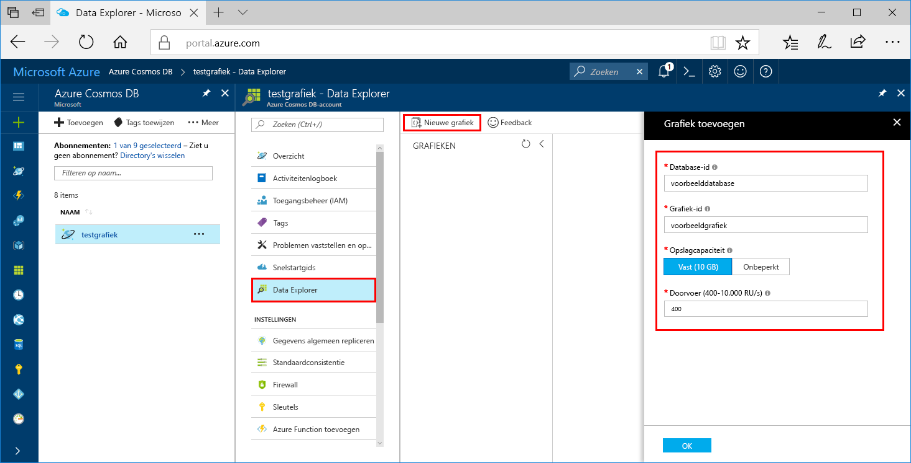
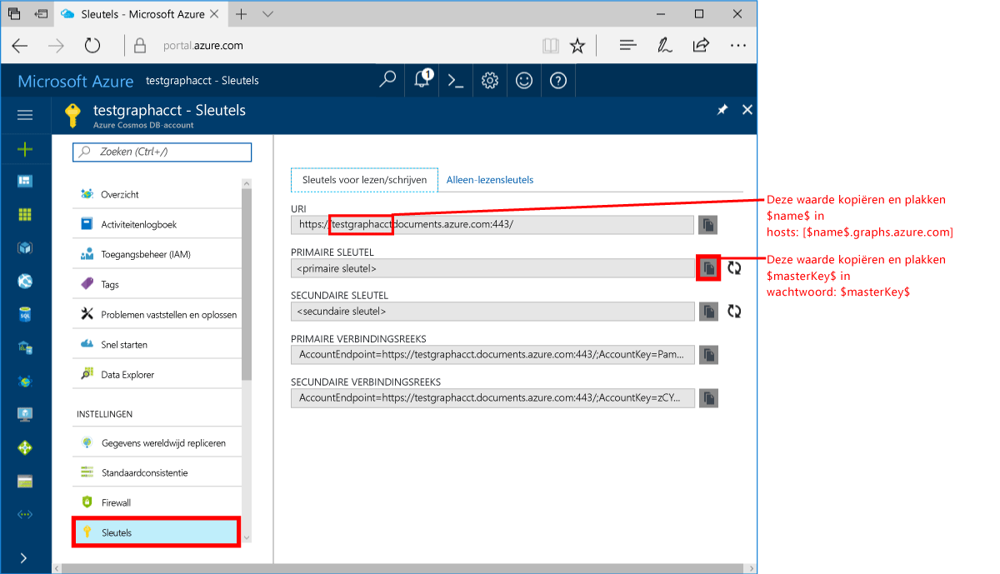
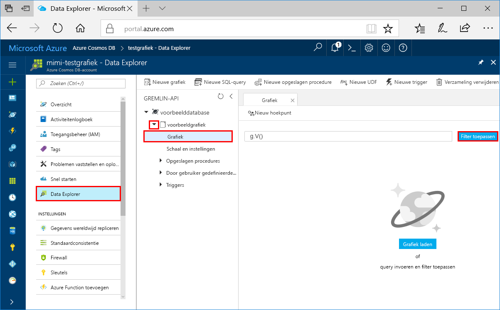
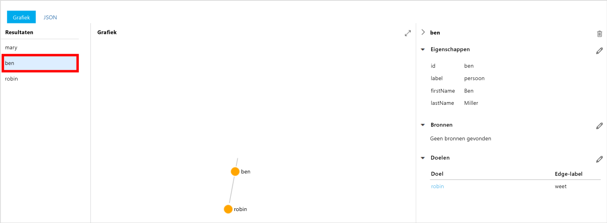
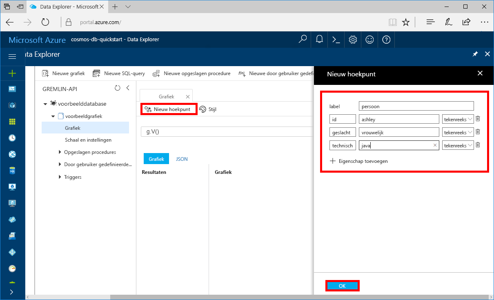

# <a name="azure-cosmos-db-create-a-graph-database-using-java-and-the-azure-portal"></a>Azure Cosmos DB: een grafiek maken met behulp van Java en Azure Portal

Azure Cosmos DB is de globaal gedistribueerde multimodel-databaseservice van Microsoft. Met behulp van Azure Cosmos DB kunt u snel beheerde databases voor documenten, tabellen en grafieken maken en doorzoeken. 

In deze snelstartgids maakt u een eenvoudige grafiekendatabase met behulp van de Azure Portal-hulpprogramma's voor Azure Cosmos DB. In deze snelstartgids leest u ook hoe u snel een Java-console-app kunt maken via een grafiekdatabase met behulp van het OSS-stuurprogramma [Gremlin Java](https://mvnrepository.com/artifact/org.apache.tinkerpop/gremlin-driver). De instructies in deze snelstartgids kunnen worden uitgevoerd in elk besturingssysteem waarmee Java kan worden uitgevoerd. In deze snelstartgids leert u hoe u grafieken kunt maken en wijzigen in de gebruikersinterface of via een programma, afhankelijk van uw voorkeur. 

## <a name="prerequisites"></a>Vereisten
[!INCLUDE [quickstarts-free-trial-note](../../includes/quickstarts-free-trial-note.md)]

Daarnaast doet u het volgende:

* [Java Development Kit (JDK) 1.7+](http://www.oracle.com/technetwork/java/javase/downloads/jdk8-downloads-2133151.html)
    * Voer op Ubuntu `apt-get install default-jdk` uit om de JDK te installeren.
    * Zorg dat de omgevingsvariabele JAVA_HOME verwijst naar de map waarin de JDK is geïnstalleerd.
* [Download](http://maven.apache.org/download.cgi) en [installeer](http://maven.apache.org/install.html) een binair [Maven](http://maven.apache.org/)-archief
    * Op Ubuntu kunt u `apt-get install maven` uitvoeren om Maven te installeren.
* [Git](https://www.git-scm.com/)
    * Op Ubuntu kunt u `sudo apt-get install git` uitvoeren om Git te installeren.

## <a name="create-a-database-account"></a>Een databaseaccount maken

Voordat u een grafiekdatabase kunt maken, moet u een Gremlin-databaseaccount (Graph) maken met Azure Cosmos DB.

[!INCLUDE [cosmos-db-create-dbaccount-graph](../../includes/cosmos-db-create-dbaccount-graph.md)]

## <a name="add-a-graph"></a>Een graaf toevoegen

U kunt nu het hulpprogramma Data Explorer in Azure Portal gebruiken om een grafiekdatabase te maken. 

1. Klik op **Data Explorer** > **Nieuwe grafiek**.

    Uiterst rechts wordt het gebied **Grafiek toevoegen** weergegeven. Mogelijk moet u naar rechts scrollen om het te bekijken.

    

2. Geef op de pagina **Grafiek toevoegen** de instellingen voor de nieuwe grafiek op.

    Instelling|Voorgestelde waarde|Beschrijving
    ---|---|---
    Database-id|voorbeelddatabase|Voer *sample-database* in als de naam voor de nieuwe database. Databasenamen moeten tussen de 1 en 255 tekens zijn en mogen geen `/ \ # ?` bevatten of eindigen op een spatie.
    Grafiek-id|voorbeeldgrafiek|Voer *sample-graph* in als de naam voor uw nieuwe verzameling. Voor namen van grafieken gelden dezelfde tekenvereisten als voor database-id's.
    Opslagcapaciteit|Vast (10 GB)|Wijzig de waarde in **Vast (10 GB)**. Deze waarde is de opslagcapaciteit van de database.
    Doorvoer|400 RU‘s|Wijzig de doorvoer in 400 aanvraageenheden per seconde (RU/s). U kunt de doorvoer later opschalen als u de latentie wilt beperken.

3. Zodra het formulier is ingevuld, klikt u op **OK**.

## <a name="clone-the-sample-application"></a>De voorbeeldtoepassing klonen

Nu gaan we werken met code. We gaan nu een Graph API-app klonen vanaf GitHub, de verbindingsreeks instellen en de app uitvoeren. U zult zien hoe gemakkelijk het is om op een programmatische manier met gegevens te werken.  

1. Open een opdrachtprompt, maak een nieuwe map met de naam git-samples en sluit vervolgens de opdrachtprompt.

    ```bash
    md "C:\git-samples"
    ```

2. Open een git-terminalvenster, bijvoorbeeld git bash, en gebruik de opdracht `cd` om naar een map te gaan voor het installeren van de voorbeeld-app.  

    ```bash
    cd "C:\git-samples"
    ```

3. Voer de volgende opdracht uit om de voorbeeldopslagplaats te klonen. Deze opdracht maakt een kopie van de voorbeeld-app op uw computer. 

    ```bash
    git clone https://github.com/Azure-Samples/azure-cosmos-db-graph-java-getting-started.git
    ```

## <a name="review-the-code"></a>De code bekijken

Deze stap is optioneel. Als u wilt weten hoe de databaseresources in de code worden gemaakt, kunt u de volgende codefragmenten bekijken. De codefragmenten zijn allemaal afkomstig uit het `Program.java`-bestand in de map C:\git-samples\azure-cosmos-db-graph-java-getting-started\src\GetStarted. Als u deze stap wilt overslaan, kunt u verdergaan naar [Uw verbindingsreeks bijwerken](#update-your-connection-information). 

* De Gremlin-`Client` wordt geïnitialiseerd vanuit de configuratie in `src/remote.yaml`.

    ```java
    cluster = Cluster.build(new File("src/remote.yaml")).create();
    ...
    client = cluster.connect();
    ```

* Een reeks Gremlin-stappen wordt uitgevoerd met behulp van de methode `client.submit`.

    ```java
    ResultSet results = client.submit(gremlin);

    CompletableFuture<List<Result>> completableFutureResults = results.all();
    List<Result> resultList = completableFutureResults.get();

    for (Result result : resultList) {
        System.out.println(result.toString());
    }
    ```

## <a name="update-your-connection-information"></a>Uw verbindingsgegevens bijwerken

Ga nu terug naar Azure Portal om de verbindingsgegevens op te halen en deze in de app te kopiëren. Met behulp van deze instellingen kan de app communiceren met de gehoste database.

1. Klik in [Azure Portal](http://portal.azure.com/) op **Sleutels**. 

    Kopieer het eerste gedeelte van de URI-waarde.

    
2. Open het bestand src/remote.yaml en vervang `$name$` in `hosts: [$name$.graphs.azure.com]` door de zojuist gekopieerde waarde.

    Regel 1 van remote.yaml moet er nu als volgt uitzien 

    `hosts: [test-graph.graphs.azure.com]`

3. Wijzig `graphs` in de waarde `endpoint` in `gremlin.cosmosdb`. (Als uw grafiekdatabaseaccount is gemaakt vóór 20 december 2017, brengt u geen wijzigingen aan in de eindpuntwaarde, en gaat u verder met de volgende stap.)

    De eindpuntwaarde ziet er nu als volgt:

    `"endpoint": "https://testgraphacct.gremlin.cosmosdb.azure.com:443/"`

4. Gebruik in Azure Portal de kopieerknop om de PRIMAIRE SLEUTEL te kopiëren en vervang `$masterKey$` in `password: $masterKey$` door deze waarde.

    Regel 4 van remote.yaml moet er nu als volgt uitzien 

    `password: 2Ggkr662ifxz2Mg==`

5. Wijzig regel 3 van remote.yaml van

    `username: /dbs/$database$/colls/$collection$`

    tot 

    `username: /dbs/sample-database/colls/sample-graph`

6. Sla het bestand remote.yaml op.

## <a name="run-the-console-app"></a>De console-app uitvoeren

1. `cd` in het git-terminalvenster naar de map azure-cosmos-db-graph-java-getting-started.

    ```git
    cd "C:\git-samples\azure-cosmos-db-graph-java-getting-started"
    ```

2. Gebruik in het git-terminalvenster de volgende opdracht om de vereiste Java-pakketten te installeren.

   ```
   mvn package
   ```

3. Gebruik in het git-terminalvenster de volgende opdracht om de Java-toepassing te starten.
    
    ```
    mvn exec:java -D exec.mainClass=GetStarted.Program
    ```

    In het terminalvenster ziet u de hoekpunten die worden toegevoegd aan de grafiek. 
    
    Als er time-outfouten optreden, controleert u of u de verbindingsgegevens correct hebt bijgewerkt in [Uw verbindingsgegevens bijwerken](#update-your-connection-information). Probeer ook de laatste opdracht opnieuw uit te voeren. 
    
    Wanneer het programma is gestopt, drukt u op Enter en gaat u in uw internetbrowser terug naar Azure Portal. 

<a id="add-sample-data"></a>
## <a name="review-and-add-sample-data"></a>Voorbeeldgegevens bekijken en toevoegen

U kunt nu teruggaan naar Data Explorer en de hoekpunten bekijken die zijn toegevoegd aan de grafiek. Ook kunt u extra hoekpunten toevoegen.

1. Klik op **Data Explorer**, vouw **sample-graph** uit, en klik achtereenvolgens op **Grafiek** en op **Filter toepassen**. 

   

2. In de lijst met **resultaten** ziet u de nieuwe gebruikers die zijn toegevoegd aan de grafiek. Als u **ben** selecteert, ziet u dat hij is verbonden met robin. U kunt de hoekpunten verplaatsen via slepen en neerzetten, in- en uitzoomen door te scrollen met het muiswiel en de grafiek uitvouwen met de dubbele pijl. 

   

3. Laten we nu enkele nieuwe gebruikers toevoegen. Klik op de knop **Nieuw hoekpunt** om gegevens toe te voegen aan uw grafiek.

   

4. Geef het label *persoon* op.

5. Klik op **Eigenschap toevoegen** om elk van de volgende eigenschappen toe te voegen. U kunt unieke eigenschappen maken voor elke persoon in de grafiek. Alleen de id-sleutel is vereist.

    sleutel|waarde|Opmerkingen
    ----|----|----
    id|ashley|De unieke id voor het hoekpunt. Als u geen id opgeeft, wordt er een id voor u gegenereerd.
    geslacht|vrouwelijk| 
    technisch | java | 

    > [!NOTE]
    > In deze snelstartgids maken we een niet-gepartitioneerde verzameling. Als u echter een gepartitioneerde verzameling maakt door een partitiesleutel op te geven tijdens het maken van de verzameling, moet u de partitiesleutel opnemen als sleutel bij elk nieuw hoekpunt. 

6. Klik op **OK**. Mogelijk moet u het scherm groter maken om **OK** weer te geven onder aan het scherm.

7. Klik op **Nieuw hoekpunt** en voeg nog een nieuwe gebruiker toe. 

8. Geef het label *persoon* op.

9. Klik op **Eigenschap toevoegen** om elk van de volgende eigenschappen toe te voegen:

    sleutel|waarde|Opmerkingen
    ----|----|----
    id|rakesh|De unieke id voor het hoekpunt. Als u geen id opgeeft, wordt er een id voor u gegenereerd.
    geslacht|man| 
    school|MIT| 

10. Klik op **OK**. 

11. Klik op de knop **Filter toepassen** met het standaard-`g.V()`-filter om alle waarden in de grafiek weer te geven. Alle gebruikers worden nu weergegeven in de lijst met **resultaten**. 

    Als u meer gegevens toevoegt, kunt u filters gebruiken om de resultaten te beperken. Data Explorer maakt standaard gebruik van `g.V()` voor het ophalen van alle hoekpunten van een grafiek. U kunt dit wijzigen in een andere [grafiekquery](tutorial-query-graph.md), bijvoorbeeld `g.V().count()`, om een telling van alle hoekpunten in de grafiek in JSON-indeling te retourneren. Nadat u het filter hebt gewijzigd, wijzigt u het weer in `g.V()` en klikt u op **Filter toepassen** om alle resultaten opnieuw weer te geven.

12. Nu kunnen we rakesh en ashley met elkaar verbinden. Zorg ervoor dat **ashley** in de lijst met **resultaten** is geselecteerd en klik vervolgens rechtsonder, naast **Doelen**, op de knop Bewerken. Mogelijk moet u het scherm verbreden om het gedeelte **Eigenschappen** te kunnen zien.

   

13. Typ in het vak **Doel** de naam *rakesh* en in het vak **Edge-label** het woord *kent*. Klik vervolgens op het selectievakje.

   

14. Selecteer nu **rakesh** in de lijst met resultaten en kijk of ashley en rakesh zijn verbonden. 

   

   Hiermee is het onderdeel voor het maken van resources van deze zelfstudie voltooid. U kunt naar eigen inzicht verdergaan met toevoegen van hoekpunten, aanpassen van de bestaande hoekpunten of wijzigen van de query's. Laten we nu de metrische gegevens bekijken die Azure Cosmos DB biedt en vervolgens de resources opschonen. 

## <a name="review-slas-in-the-azure-portal"></a>SLA’s bekijken in Azure Portal

[!INCLUDE [cosmosdb-tutorial-review-slas](../../includes/cosmos-db-tutorial-review-slas.md)]

## <a name="clean-up-resources"></a>Resources opschonen

[!INCLUDE [cosmosdb-delete-resource-group](../../includes/cosmos-db-delete-resource-group.md)]

## <a name="next-steps"></a>Volgende stappen

In deze Quick Start hebt u geleerd hoe u een Azure Cosmos DB-account kunt maken, hebt u een graaf gemaakt met Data Explorer en hebt u een app uitgevoerd. U kunt nu complexere query's maken en met Gremlin krachtige logica implementeren om door een graaf te gaan. 

> [!div class="nextstepaction"]
> [Query’s uitvoeren met Gremlin](tutorial-query-graph.md)

