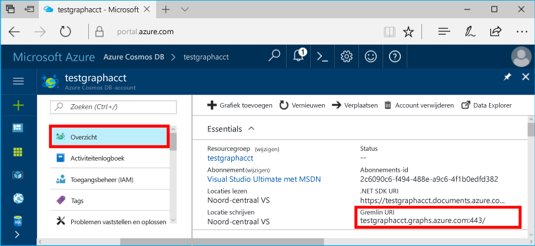

# <a name="azure-cosmos-db-create-a-graph-database-using-java-and-the-azure-portal"></a>Azure Cosmos DB: een grafiek maken met behulp van Java en Azure Portal

Azure Cosmos DB is de wereldwijd gedistribueerde multimodel-databaseservice van Microsoft. U kunt snel databases maken van documenten, sleutel/waarde-paren en grafen en hier query’s op uitvoeren. Deze databases genieten allemaal het voordeel van de wereldwijde distributie en horizontale schaalmogelijkheden die ten grondslag liggen aan Azure Cosmos DB. 

In deze snelstartgids wordt een grafiekdatabase gemaakt met behulp van de hulpprogramma's voor Azure Cosmos DB in Azure Portal. In deze snelstartgids leest u ook hoe u snel een Java-console-app kunt maken via een grafiekdatabase met behulp van het OSS-stuurprogramma [Gremlin Java](https://mvnrepository.com/artifact/org.apache.tinkerpop/gremlin-driver). De instructies in deze snelstartgids kunnen worden uitgevoerd in elk besturingssysteem waarmee Java kan worden uitgevoerd. Als u deze snelstartgids hebt voltooid, weet u hoe u grafiekresources kunt maken en wijzigen in de UI of via een programma, afhankelijk van uw voorkeur. 

## <a name="prerequisites"></a>Vereisten

* [Java Development Kit (JDK) 1.7+](http://www.oracle.com/technetwork/java/javase/downloads/jdk8-downloads-2133151.html)
    * Voer op Ubuntu `apt-get install default-jdk` uit om de JDK te installeren.
    * Zorg dat de omgevingsvariabele JAVA_HOME verwijst naar de map waarin de JDK is geïnstalleerd.
* [Download](http://maven.apache.org/download.cgi) en [installeer](http://maven.apache.org/install.html) een binair [Maven](http://maven.apache.org/)-archief
    * Op Ubuntu kunt u `apt-get install maven` uitvoeren om Maven te installeren.
* [Git](https://www.git-scm.com/)
    * Op Ubuntu kunt u `sudo apt-get install git` uitvoeren om Git te installeren.

[!INCLUDE [quickstarts-free-trial-note](../../includes/quickstarts-free-trial-note.md)]

## <a name="create-a-database-account"></a>Een databaseaccount maken

Voordat u een grafiekdatabase kunt maken, moet u een Gremlin-databaseaccount (Graph) maken met Azure Cosmos DB.

[!INCLUDE [cosmos-db-create-dbaccount-graph](../../includes/cosmos-db-create-dbaccount-graph.md)]

## <a name="add-a-graph"></a>Een graaf toevoegen

U kunt nu het hulpprogramma Data Explorer in Azure Portal gebruiken om een grafiekdatabase te maken. 

1. Klik in Azure Portal in het navigatiemenu links op **Data Explorer (preview-versie)**. 
2. Klik op de blade **Data Explorer (preview-versie)** op **Nieuwe grafiek**. Vul vervolgens de pagina in met behulp van de volgende gegevens.

    

    Instelling|Voorgestelde waarde|Beschrijving
    ---|---|---
    Database-id|voorbeelddatabase|De id voor de nieuwe database. Databasenamen moeten tussen de 1 en 255 tekens zijn en mogen geen `/ \ # ?` bevatten of eindigen op een spatie.
    Grafiek-id|voorbeeldgrafiek|De id voor de nieuwe graaf. Voor graafnamen gelden dezelfde tekenvereisten als voor database-id's.
    Opslagcapaciteit| 10 GB|Laat de standaardwaarde staan. Dit is de opslagcapaciteit van de database.
    Doorvoer|400 RU‘s|Laat de standaardwaarde staan. U kunt de doorvoer later opschalen als u de latentie wilt beperken.
    RU/m|Uit|Laat de standaardwaarde staan.
    Partitiesleutel|Leeg laten|Laat het veld voor de partitiesleutel leeg omwille van deze snelstartgids.

3. Zodra het formulier is ingevuld, klikt u op **OK**.

## <a name="clone-the-sample-application"></a>De voorbeeldtoepassing klonen

We gaan nu een Graph API-app klonen vanaf GitHub, de verbindingsreeks instellen en de app uitvoeren. U zult zien hoe gemakkelijk het is om op een programmatische manier met gegevens te werken. 

1. Open een git-terminalvenster zoals git bash en `cd` naar een werkmap.  

2. Voer de volgende opdracht uit om de voorbeeldopslagplaats te klonen. 

    ```bash
    git clone https://github.com/Azure-Samples/azure-cosmos-db-graph-java-getting-started.git
    ```

## <a name="review-the-code"></a>De code bekijken

Laten we eens kijken wat er precies gebeurt in de app. Open het bestand `Program.java` in de map \src\GetStarted en zoek deze regels code. 

* De Gremlin-`Client` wordt geïnitialiseerd vanuit de configuratie in `src/remote.yaml`.

    ```java
    cluster = Cluster.build(new File("src/remote.yaml")).create();
    ...
    client = cluster.connect();
    ```

* Een reeks Gremlin-stappen wordt uitgevoerd met behulp van de methode `client.submit`.

    ```java
    ResultSet results = client.submit(gremlin);

    CompletableFuture<List<Result>> completableFutureResults = results.all();
    List<Result> resultList = completableFutureResults.get();

    for (Result result : resultList) {
        System.out.println(result.toString());
    }
    ```

## <a name="update-your-connection-string"></a>Uw verbindingsreeks bijwerken

1. Open het bestand src/remote.yaml. 

3. Vul uw *hosts*, *gebruikersnaam*, en *wachtwoord* in het bestand src/remote.yaml in. De andere instellingen hoeven niet te worden gewijzigd.

    Instelling|Voorgestelde waarde|Beschrijving
    ---|---|---
    Hosts|[***.graphs.azure.com]|Bekijk de schermopname onder deze tabel. Deze waarde is de Gremlin URI-waarde op de pagina Overzicht van Azure Portal tussen vierkante haken, waarbij de afsluitende: 443/ is verwijderd.<br><br>Deze waarde kan ook worden opgehaald van het tabblad Sleutels met behulp van de URI-waarde door https:// te verwijderen, documenten in grafieken te wijzigen en de afsluitende: 443/ te verwijderen.
    Gebruikersnaam|/dbs/sample-database/colls/sample-graph|De resource van het formulier `/dbs/<db>/colls/<coll>` waarbij `<db>` de naam is van de bestaande database en `<coll>` de naam van de bestaande verzameling.
    Wachtwoord|*Uw primaire hoofdsleutel*|Bekijk de tweede schermopname onder deze tabel. Deze waarde is de primaire sleutel die u kunt ophalen op de pagina Sleutels in Azure Portal, in het vak Primaire sleutel. Kopieer de waarde met behulp van de knop Kopiëren aan de rechterkant van het vak.

    Kopieer voor de waarde Hosts de **Gremlin-URI** op de pagina **Overzicht**. Als deze waarde leeg is, raadpleegt u de instructies in de rij Hosts van de voorgaande tabel over het maken van de Gremlin-URI vanaf de blade Sleutels.


    Kopieer als wachtwoord de **Primaire sleutel** op de blade **Sleutels**: 

## <a name="run-the-console-app"></a>De console-app uitvoeren

1. `cd` in het git-terminalvenster naar de map azure-cosmos-db-graph-java-getting-started.

2. Type `mvn package` in het git-terminalvenster om de vereiste Java-pakketten te installeren.

3. Voer `mvn exec:java -D exec.mainClass=GetStarted.Program` uit in het git-terminalvenster om de Java-toepassing te starten.

In het terminalvenster ziet u de hoekpunten die worden toegevoegd aan de grafiek. Zodra het programma is voltooid, gaat u terug naar Azure Portal in de internetbrowser. 

<a id="add-sample-data"></a>
## <a name="review-and-add-sample-data"></a>Voorbeeldgegevens bekijken en toevoegen

U kunt nu teruggaan naar Data Explorer en de hoekpunten bekijken die zijn toegevoegd aan de grafiek. Ook kunt u extra hoekpunten toevoegen.

1. Vouw in Data Explorer de **voorbeelddatabase**/**voorbeeldgrafiek** uit en klik op **Grafiek**. Klik vervolgens op **Filter toepassen**. 

   

2. In de lijst met **resultaten** ziet u de nieuwe gebruikers die zijn toegevoegd aan de grafiek. Als u **ben** selecteert, ziet u dat hij is verbonden met robin. U kunt de hoekpunten verplaatsen in Grafiekverkenner, in- en uitzoomen, en het Grafiekverkenner-oppervlak vergroten. 

   

3. We gaan nu met behulp van Data Explorer enkele nieuwe gebruikers toevoegen aan de grafiek. Klik op de knop **Nieuw hoekpunt** om gegevens toe te voegen aan uw grafiek.

   

4. Voer een label *Persoon* in. Voer vervolgens de volgende sleutels en waarden in om het eerste hoekpunt in de grafiek te maken. U kunt unieke eigenschappen maken voor elke persoon in de grafiek. Alleen de id-sleutel is vereist.

    sleutel|waarde|Opmerkingen
    ----|----|----
    id|ashley|De unieke id voor het hoekpunt. Als u geen id opgeeft, wordt er een id voor u gegenereerd.
    geslacht|vrouwelijk| 
    technisch | java | 

    > [!NOTE]
    > In deze snelstartgids maken we een niet-gepartitioneerde verzameling. Als u echter een gepartitioneerde verzameling maakt door een partitiesleutel op te geven tijdens het maken van de verzameling, moet u de partitiesleutel opnemen als sleutel bij elk nieuw hoekpunt. 

5. Klik op **OK**. Mogelijk moet u het scherm groter maken om **OK** weer te geven onder aan het scherm.

6. Klik op **Nieuw hoekpunt** en voeg nog een nieuwe gebruiker toe. Voer een label *Persoon* in en voer vervolgens de volgende sleutels en waarden in:

    sleutel|waarde|Opmerkingen
    ----|----|----
    id|rakesh|De unieke id voor het hoekpunt. Als u geen id opgeeft, wordt er een id voor u gegenereerd.
    geslacht|man| 
    school|MIT| 

7. Klik op **OK**. 

8. Klik op **Filter toepassen** met het standaardfilter `g.V()`. Alle gebruikers worden nu weergegeven in de lijst met **resultaten**. Als u meer gegevens toevoegt, kunt u filters gebruiken om de resultaten te beperken. Data Explorer gebruikt standaard `g.V()` om alle hoekpunten van een grafiek op te halen. U kunt dit echter wijzigen in een andere [grafiekquery](tutorial-query-graph.md), bijvoorbeeld `g.V().count()`, om alle hoekpunten van de grafiek op te halen in JSON-indeling.

9. Nu kunnen we rakesh en ashley met elkaar verbinden. Selecteer **ashley** in de lijst met **resultaten** en klik vervolgens rechts onderaan naast **Doelen** op de knop Bewerken. Mogelijk moet u het scherm verbreden om het gedeelte **Eigenschappen** te kunnen zien.

   

10. Typ in het vak **Doel** de naam *rakesh* en typ in het vak **Edge-label** het woord *kent*. Klik vervolgens op het selectievakje.

   

11. Selecteer nu **rakesh** in de lijst met resultaten en kijk of ashley en rakesh zijn verbonden. 

   

    U kunt Data Explorer ook gebruiken voor het maken van opgeslagen procedures, UDF's en triggers om bedrijfslogica aan de serverzijde uit te voeren en doorvoer te schalen. In Data Explorer wordt alle ingebouwde programmatische gegevenstoegang zichtbaar die beschikbaar is in de API's, maar biedt eenvoudige toegang tot uw gegevens in Azure Portal.


## <a name="review-slas-in-the-azure-portal"></a>SLA’s bekijken in Azure Portal

[!INCLUDE [cosmosdb-tutorial-review-slas](../../includes/cosmos-db-tutorial-review-slas.md)]

## <a name="clean-up-resources"></a>Resources opschonen

Als u deze app niet verder gaat gebruiken, kunt u alle resources verwijderen die door deze Quick Start zijn aangemaakt door onderstaande stappen te volgen in Azure Portal: 

1. Klik in het menu aan de linkerkant in Azure Portal op **Resourcegroepen** en klik vervolgens op de resource die u hebt gemaakt. 
2. Klik op de pagina van uw resourcegroep op **Verwijderen**, typ de naam van de resource die u wilt verwijderen in het tekstvak en klik vervolgens op **Verwijderen**.

## <a name="next-steps"></a>Volgende stappen

In deze Quick Start hebt u geleerd hoe u een Azure Cosmos DB-account kunt maken, hebt u een graaf gemaakt met Data Explorer en hebt u een app uitgevoerd. U kunt nu complexere query's maken en met Gremlin krachtige logica implementeren om door een graaf te gaan. 

> [!div class="nextstepaction"]
> [Query’s uitvoeren met Gremlin](tutorial-query-graph.md)


