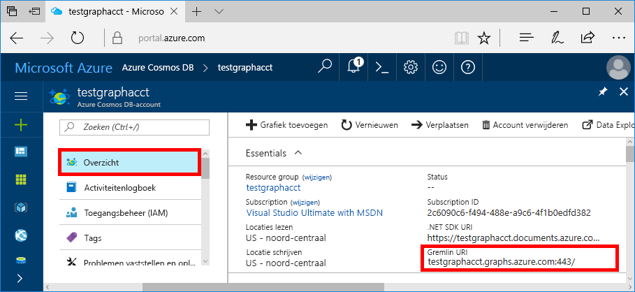
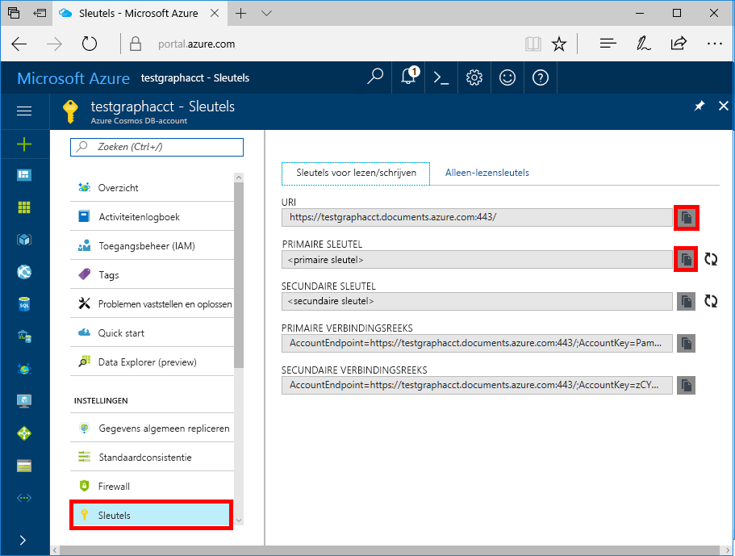

# <a name="azure-cosmos-db-build-a-nodejs-application-by-using-graph-api"></a>Azure Cosmos DB: een Node.js-toepassing ontwikkelen met de Graph API

Azure Cosmos-database is de globaal gedistribueerde multimodel database-service van Microsoft. U kunt snel databases maken van documenten, sleutel/waarde-paren en grafen en hier query’s op uitvoeren. Deze databases genieten allemaal het voordeel van de wereldwijde distributie en horizontale schaalmogelijkheden die ten grondslag liggen aan Azure Cosmos DB. 

In dit artikel snelstartgids demonstreert hoe u een Cosmos-DB Azure-account voor Graph API (preview), de database en de grafiek te maken met behulp van de Azure-portal. U gaat vervolgens een console-app ontwikkelen en uitvoeren met behulp van het opensourcestuurprogramma [Gremlin Node.js](https://www.npmjs.com/package/gremlin).

## <a name="prerequisites"></a>Vereisten

Voordat u met dit voorbeeld aan de slag gaat, moet u aan de volgende vereisten voldoen:
* [Node.js](https://nodejs.org/en/) versie v0.10.29 of hoger
* [Git](http://git-scm.com/)

[!INCLUDE [quickstarts-free-trial-note](../../includes/quickstarts-free-trial-note.md)]

## <a name="create-a-database-account"></a>Een databaseaccount maken

[!INCLUDE [cosmos-db-create-dbaccount-graph](../../includes/cosmos-db-create-dbaccount-graph.md)]

## <a name="add-a-graph"></a>Een graaf toevoegen

[!INCLUDE [cosmos-db-create-graph](../../includes/cosmos-db-create-graph.md)]

## <a name="clone-the-sample-application"></a>De voorbeeldtoepassing klonen

We gaan nu een Graph API-app klonen vanaf GitHub, de verbindingsreeks instellen en de app uitvoeren. U zult zien hoe gemakkelijk het is om op een programmatische manier met gegevens te werken. 

1. Open een venster in een Git-terminal, zoals Git Bash, en ga (met de opdracht `cd`) naar een werkmap.

2. Voer de volgende opdracht om de voorbeeld-opslagplaats klonen: 

    ```bash
    git clone https://github.com/Azure-Samples/azure-cosmos-db-graph-nodejs-getting-started.git
    ```

3. Open het oplossingenbestand in Visual Studio. 

## <a name="review-the-code"></a>De code bekijken

Laten we eens kijken wat er precies gebeurt in de app. Open de `app.js` -bestand en u ziet u de volgende regels code. 

* De Gremlin-client wordt gemaakt.

    ```nodejs
    const client = Gremlin.createClient(
        443, 
        config.endpoint, 
        { 
            "session": false, 
            "ssl": true, 
            "user": `/dbs/${config.database}/colls/${config.collection}`,
            "password": config.primaryKey
        });
    ```

  De configuraties bevinden zich allemaal in `config.js`, wat in het volgende gedeelte wordt bewerkt.

* Een reeks Gremlin-stappen wordt uitgevoerd met behulp van de methode `client.execute`.

    ```nodejs
    console.log('Running Count'); 
    client.execute("g.V().count()", { }, (err, results) => {
        if (err) return console.error(err);
        console.log(JSON.stringify(results));
        console.log();
    });
    ```

## <a name="update-your-connection-string"></a>Uw verbindingsreeks bijwerken

1. Open het bestand config.js. 

2. Vul in config.js voor de sleutel config.endpoint de **Gremlin URI**-waarde in van de pagina **Overzicht** van de Azure Portal. 

    `config.endpoint = "GRAPHENDPOINT";`

    

   Als de **Gremlin URI** waarde leeg is, kunt u de waarde van de genereren de **sleutels** pagina in de portal. Gebruik de **URI** waarde, https:// verwijderen en wijzigen van documenten aan grafieken.

   Het Gremlin-eindpunt moet alleen de hostnaam zijn zonder het protocol-/poortnummer, zoals `mygraphdb.graphs.azure.com` (niet `https://mygraphdb.graphs.azure.com` of `mygraphdb.graphs.azure.com:433`).

3. In het bestand config.js, vult u de waarde config.primaryKey met de **primaire sleutel** waarde uit de **sleutels** pagina van de Azure-portal. 

    `config.primaryKey = "PRIMARYKEY";`

   

4. Voer de databasenaam en de naam van de graaf (container) in voor de waarde van config.database en config.collection. 

Hier volgt een voorbeeld van wat het bestand config.js voltooide als eruitzien moet:

```nodejs
var config = {}

// Note that this must not have HTTPS or the port number
config.endpoint = "testgraphacct.graphs.azure.com";
config.primaryKey = "Pams6e7LEUS7LJ2Qk0fjZf3eGo65JdMWHmyn65i52w8ozPX2oxY3iP0yu05t9v1WymAHNcMwPIqNAEv3XDFsEg==";
config.database = "graphdb"
config.collection = "Persons"

module.exports = config;
```

## <a name="run-the-console-app"></a>De console-app uitvoeren

1. Open een terminalvenster en ga (via de opdracht `cd`) naar de installatiemap voor het bestand package.json dat is opgenomen in het project.

2. Voer `npm install` uit om de vereiste npm-modules, waaronder `gremlin`, te installeren.

3. Voer `node app.js` uit op een terminal om uw knooppunttoepassing te starten.

## <a name="browse-with-data-explorer"></a>Bladeren met Data Explorer

U kunt nu teruggaan naar Data Explorer in Azure Portal en uw nieuwe graafgegevens bekijken, aanpassen en bewerken en er query's op uitvoeren.

De nieuwe database wordt in Data Explorer weergegeven in het deelvenster **Grafieken**. Vouw de database, gevolgd door de verzameling, en selecteer vervolgens **grafiek**.

De gegevens die worden gegenereerd door de voorbeeld-app wordt weergegeven in het volgende venster binnen de **grafiek** tabblad wanneer u selecteert **Filter toepassen**.

Probeer `g.V()` voltooien met `.has('firstName', 'Thomas')` om het filter te testen. Houd er rekening mee dat de waarde hoofdlettergevoelig is.

## <a name="review-slas-in-the-azure-portal"></a>SLA’s bekijken in Azure Portal

[!INCLUDE [cosmosdb-tutorial-review-slas](../../includes/cosmos-db-tutorial-review-slas.md)]

## <a name="clean-up-your-resources"></a>Uw resources opschonen

Als u niet van plan bent om door te gaan met het gebruik van deze app, verwijdert u alle resources die u in dit artikel hebt gemaakt als volgt: 

1. Selecteer in de Azure-portal in het menu linkernavigatievenster **resourcegroepen**. Selecteer vervolgens de naam van de resource die u hebt gemaakt. 

2. Selecteer **Verwijderen** op de pagina van de resourcegroep. Typ de naam van de resource moet worden verwijderd en selecteer vervolgens **verwijderen**.

## <a name="next-steps"></a>Volgende stappen

In dit artikel hebt u geleerd hoe een Azure DB die Cosmos-account maken en uitvoeren van een app maken van een grafiek met behulp van Data Explorer. U kunt nu complexere query's maken en met Gremlin krachtige logica implementeren om door een graaf te gaan. 

> [!div class="nextstepaction"]
> [Query uitvoeren met behulp van Gremlin](tutorial-query-graph.md)
