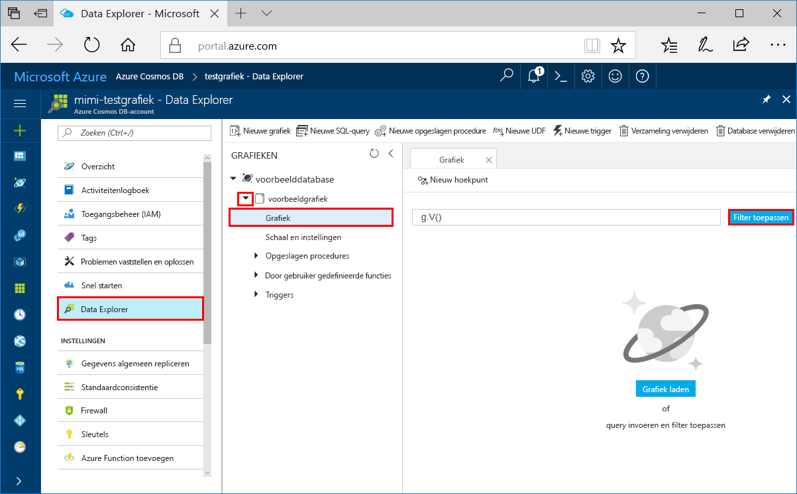
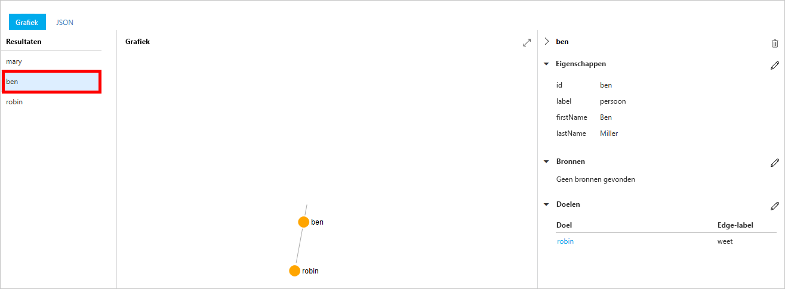
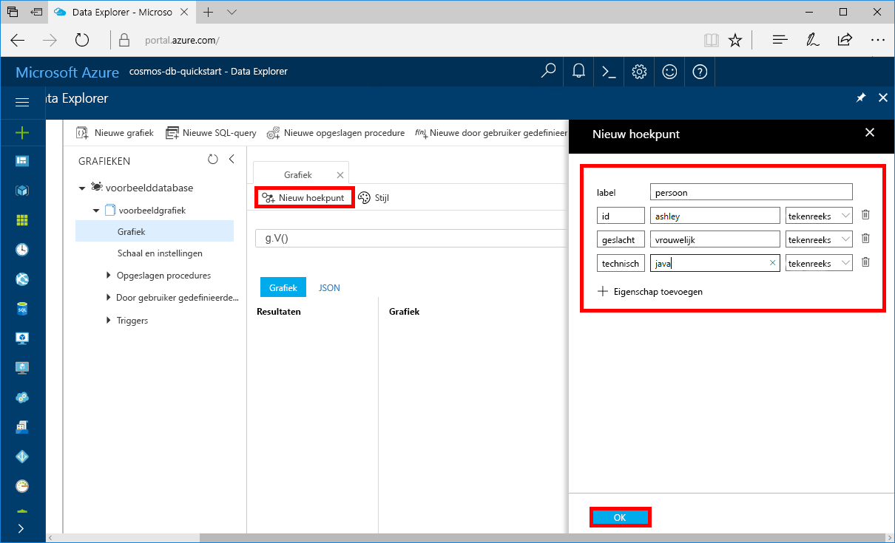
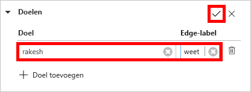
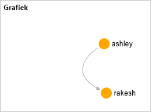

# <a name="quickstart-create-a-graph-database-in-azure-cosmos-db-using-php-and-the-azure-portal"></a>Quickstart: een grafiekdatabase maken in Azure Cosmos DB met behulp van PHP en de Azure-portal

> [!div class="op_single_selector"]
> * [Gremlin-console](create-graph-gremlin-console.md)
> * [.NET](create-graph-dotnet.md)
> * [Java](create-graph-java.md)
> * [Node.js](create-graph-nodejs.md)
> * [Python](create-graph-python.md)
> * [PHP](create-graph-php.md)
>  

Deze snelstart laat zien hoe u PHP en de [Gremlin API](graph-introduction.md) van Azure Cosmos DB gebruikt om een console-app te maken door een voorbeeld uit GitHub te klonen. Deze quickstart begeleidt u ook bij het maken van een Azure Cosmos DB-account via Azure Portal op het web.   

Azure Cosmos DB is de wereldwijd gedistribueerde multimodel-databaseservice van Microsoft. U kunt snel databases maken van documenten, sleutel/waarde-paren en grafieken en hier query's op uitvoeren. Deze databases genieten allemaal het voordeel van de wereldwijde distributie en horizontale schaalmogelijkheden die ten grondslag liggen aan Azure Cosmos DB.  

## <a name="prerequisites"></a>Vereisten

[!INCLUDE [quickstarts-free-trial-note](../../includes/quickstarts-free-trial-note.md)] [Probeer Azure Cosmos DB gratis uit](https://azure.microsoft.com/try/cosmosdb/) zonder Azure-abonnement, zonder kosten en zonder verplichtingen.

Daarnaast doet u het volgende:
* [PHP](https://php.net/) 5.6 of hoger
* [Composer](https://getcomposer.org/download/)

## <a name="create-a-database-account"></a>Een databaseaccount maken

Voordat u een grafiekdatabase kunt maken, moet u een Gremlin-databaseaccount (Graph) maken met Azure Cosmos DB.

[!INCLUDE [cosmos-db-create-dbaccount-graph](../../includes/cosmos-db-create-dbaccount-graph.md)]

## <a name="add-a-graph"></a>Een graaf toevoegen

[!INCLUDE [cosmos-db-create-graph](../../includes/cosmos-db-create-graph.md)]

## <a name="clone-the-sample-application"></a>De voorbeeldtoepassing klonen

Nu gaan we werken met code. We gaan nu een Gremlin API-app klonen vanaf GitHub, de verbindingsreeks instellen en de app uitvoeren U zult zien hoe gemakkelijk het is om op een programmatische manier met gegevens te werken.  

1. Open een opdrachtprompt, maak een nieuwe map met de naam git-samples en sluit vervolgens de opdrachtprompt.

    ```bash
    md "C:\git-samples"
    ```

2. Open een git-terminalvenster, bijvoorbeeld git bash, en gebruik de opdracht `cd` om naar een map te gaan voor het installeren van de voorbeeld-app.  

    ```bash
    cd "C:\git-samples"
    ```

3. Voer de volgende opdracht uit om de voorbeeldopslagplaats te klonen. Deze opdracht maakt een kopie van de voorbeeld-app op uw computer. 

    ```bash
    git clone https://github.com/Azure-Samples/azure-cosmos-db-graph-php-getting-started.git
    ```

## <a name="review-the-code"></a>De code bekijken

Deze stap is optioneel. Als u wilt weten hoe de databaseresources in de code worden gemaakt, kunt u de volgende codefragmenten bekijken. De codefragmenten zijn allemaal afkomstig uit het bestand connect.php in de map C:\git-samples\azure-cosmos-db-graph-php-getting-started\. Als u deze stap wilt overslaan, kunt u verdergaan naar [Uw verbindingsreeks bijwerken](#update-your-connection-information). 

* De Gremlin-`connection` wordt geïnitialiseerd in het begin van het bestand `connect.php` met behulp van het object `$db`.

    ```php
    $db = new Connection([
        'host' => '<your_server_address>.graphs.azure.com',
        'username' => '/dbs/<db>/colls/<coll>',
        'password' => 'your_primary_key'
        ,'port' => '443'

        // Required parameter
        ,'ssl' => TRUE
    ]);
    ```

* Een reeks Gremlin-stappen wordt uitgevoerd met behulp van de methode `$db->send($query);`.

    ```php
    $query = "g.V().drop()";
    ...
    $result = $db->send($query);
    $errors = array_filter($result);
    }
    ```

## <a name="update-your-connection-information"></a>Uw verbindingsgegevens bijwerken

Ga nu terug naar Azure Portal om de verbindingsgegevens op te halen en deze in de app te kopiëren. Met behulp van deze instellingen kan de app communiceren met de gehoste database.

1. Klik in [Azure Portal](https://portal.azure.com/) op **Sleutels**. 

    Kopieer het eerste gedeelte van de URI-waarde.

    
2. Open het bestand `connect.php` en plak in regel 8 de URI-waarde over `your_server_address` heen.

    De initialisatie van het verbindingsobject moet er nu uitzien als de volgende code:

    ```php
    $db = new Connection([
        'host' => 'testgraphacct.graphs.azure.com',
        'username' => '/dbs/<db>/colls/<coll>',
        'password' => 'your_primary_key'
        ,'port' => '443'

        // Required parameter
        ,'ssl' => TRUE
    ]);
    ```

3. Als uw grafiekdatabaseaccount is gemaakt op of na 20 december 2017, wijzigt u `graphs.azure.com` in de hostnaam in `gremlin.cosmosdb.azure.com`.

4. Wijzig de parameter `username` in het verbindingsobject in de naam van uw database en de grafiek. Als u de aanbevolen waarden van `sample-database` en `sample-graph` gebruikt, moeten deze er als de volgende code uitzien:

    `'username' => '/dbs/sample-database/colls/sample-graph'`

    Het hele verbindingsobject moet er nu uitzien als het volgende codefragment:

    ```php
    $db = new Connection([
        'host' => 'testgraphacct.graphs.azure.com',
        'username' => '/dbs/sample-database/colls/sample-graph',
        'password' => 'your_primary_key',
        'port' => '443'

        // Required parameter
        ,'ssl' => TRUE
    ]);
    ```

5. Gebruik in Azure Portal de kopieerknop om de PRIMAIRE SLEUTEL te kopiëren en vervang `your_primary_key` in de wachtwoordparameter door deze waarde.

    De initialisatie van het verbindingsobject moet er nu als de volgende code uitzien:

    ```php
    $db = new Connection([
        'host' => 'testgraphacct.graphs.azure.com',
        'username' => '/dbs/sample-database/colls/sample-graph',
        'password' => '2Ggkr662ifxz2Mg==',
        'port' => '443'

        // Required parameter
        ,'ssl' => TRUE
    ]);
    ```

6. Sla het bestand `connect.php` op.

## <a name="run-the-console-app"></a>De console-app uitvoeren

1. `cd` in het git-terminalvenster naar de map azure-cosmos-db-graph-php-getting-started.

    ```git
    cd "C:\git-samples\azure-cosmos-db-graph-php-getting-started"
    ```

2. Gebruik in het git-terminalvenster de volgende opdracht om de vereiste PHP-afhankelijkheden te installeren.

   ```
   composer install
   ```

3. Gebruik in het git-terminalvenster de volgende opdracht om de PHP-toepassing te starten.
    
    ```
    php connect.php
    ```

    In het terminalvenster ziet u de hoekpunten die worden toegevoegd aan de grafiek. 
    
    Als er time-outfouten optreden, controleert u of u de verbindingsgegevens correct hebt bijgewerkt in [Uw verbindingsgegevens bijwerken](#update-your-connection-information). Probeer ook de laatste opdracht opnieuw uit te voeren. 
    
    Wanneer het programma is gestopt, drukt u op Enter en gaat u in uw internetbrowser terug naar Azure Portal. 

<a id="add-sample-data"></a>
## <a name="review-and-add-sample-data"></a>Voorbeeldgegevens bekijken en toevoegen

U kunt nu teruggaan naar Data Explorer en de hoekpunten bekijken die zijn toegevoegd aan de grafiek. Ook kunt u extra hoekpunten toevoegen.

1. Klik op **Data Explorer**, vouw **sample-graph** uit, en klik achtereenvolgens op **Grafiek** en op **Filter toepassen**. 

   

2. In de lijst met **resultaten** ziet u de nieuwe gebruikers die zijn toegevoegd aan de grafiek. Als u **ben** selecteert, ziet u dat hij is verbonden met robin. U kunt de hoekpunten verplaatsen via slepen en neerzetten, in- en uitzoomen door te scrollen met het muiswiel en de grafiek uitvouwen met de dubbele pijl. 

   

3. Laten we nu enkele nieuwe gebruikers toevoegen. Klik op de knop **Nieuw hoekpunt** om gegevens toe te voegen aan uw grafiek.

   

4. Geef het label *persoon* op.

5. Klik op **Eigenschap toevoegen** om elk van de volgende eigenschappen toe te voegen. U kunt unieke eigenschappen maken voor elke persoon in de grafiek. Alleen de id-sleutel is vereist.

    sleutel|waarde|Opmerkingen
    ----|----|----
    id|ashley|De unieke id voor het hoekpunt. Als u geen id opgeeft, wordt er een id voor u gegenereerd.
    geslacht|vrouwelijk| 
    technisch | java | 

    > [!NOTE]
    > In deze snelstart gaat u een niet-gepartitioneerde verzameling maken. Als u echter een gepartitioneerde verzameling maakt door een partitiesleutel op te geven tijdens het maken van de verzameling, moet u de partitiesleutel opnemen als sleutel bij elk nieuw hoekpunt. 

6. Klik op **OK**. Mogelijk moet u het scherm groter maken om **OK** weer te geven onder aan het scherm.

7. Klik op **Nieuw hoekpunt** en voeg nog een nieuwe gebruiker toe. 

8. Geef het label *persoon* op.

9. Klik op **Eigenschap toevoegen** om elk van de volgende eigenschappen toe te voegen:

    sleutel|waarde|Opmerkingen
    ----|----|----
    id|rakesh|De unieke id voor het hoekpunt. Als u geen id opgeeft, wordt er een id voor u gegenereerd.
    geslacht|man| 
    school|MIT| 

10. Klik op **OK**. 

11. Klik op de knop **Filter toepassen** met het standaard-`g.V()`-filter om alle waarden in de grafiek weer te geven. Alle gebruikers worden nu weergegeven in de lijst met **resultaten**. 

    Als u meer gegevens toevoegt, kunt u filters gebruiken om de resultaten te beperken. Data Explorer maakt standaard gebruik van `g.V()` voor het ophalen van alle hoekpunten van een grafiek. U kunt dit wijzigen in een andere [grafiekquery](tutorial-query-graph.md), bijvoorbeeld `g.V().count()`, om een telling van alle hoekpunten in de grafiek in JSON-indeling te retourneren. Nadat u het filter hebt gewijzigd, wijzigt u het weer in `g.V()` en klikt u op **Filter toepassen** om alle resultaten opnieuw weer te geven.

12. Nu kunt u rakesh en ashley met elkaar verbinden. Zorg ervoor dat **ashley** in de lijst met **resultaten** is geselecteerd en klik vervolgens rechtsonder, naast **Doelen**, op de knop Bewerken. Mogelijk moet u het scherm verbreden om het gedeelte **Eigenschappen** te kunnen zien.

   

13. Typ in het vak **Doel** de naam *rakesh* en in het vak **Edge-label** het woord *kent*. Klik vervolgens op het selectievakje.

   

14. Selecteer nu **rakesh** in de lijst met resultaten en kijk of ashley en rakesh zijn verbonden. 

   

   Hiermee is het onderdeel voor het maken van resources van deze snelstart voltooid. U kunt naar eigen inzicht verdergaan met toevoegen van hoekpunten, aanpassen van de bestaande hoekpunten of wijzigen van de query's. Laten we nu de metrische gegevens bekijken die Azure Cosmos DB biedt en vervolgens de resources opschonen. 

## <a name="review-slas-in-the-azure-portal"></a>SLA’s bekijken in Azure Portal

[!INCLUDE [cosmosdb-tutorial-review-slas](../../includes/cosmos-db-tutorial-review-slas.md)]

## <a name="clean-up-resources"></a>Resources opschonen

[!INCLUDE [cosmosdb-delete-resource-group](../../includes/cosmos-db-delete-resource-group.md)]

## <a name="next-steps"></a>Volgende stappen

In deze Quick Start hebt u geleerd hoe u een Azure Cosmos DB-account kunt maken, hebt u een graaf gemaakt met Data Explorer en hebt u een app uitgevoerd. U kunt nu complexere query's maken en met Gremlin krachtige logica implementeren om door een graaf te gaan. 

> [!div class="nextstepaction"]
> [Query’s uitvoeren met Gremlin](tutorial-query-graph.md)

