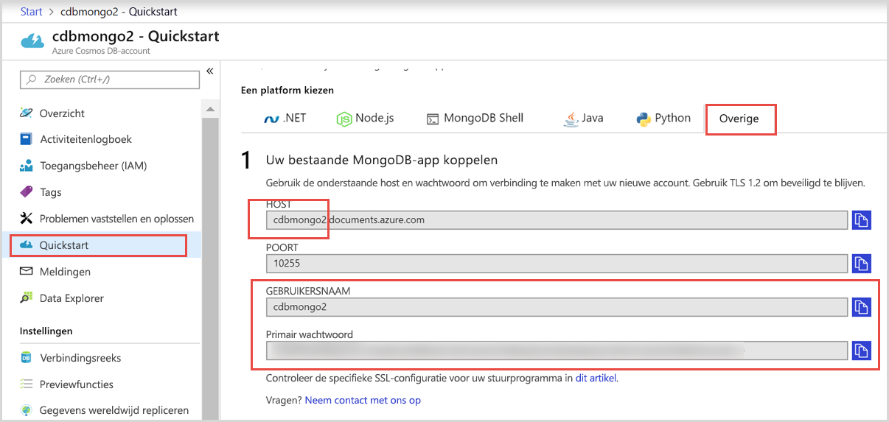
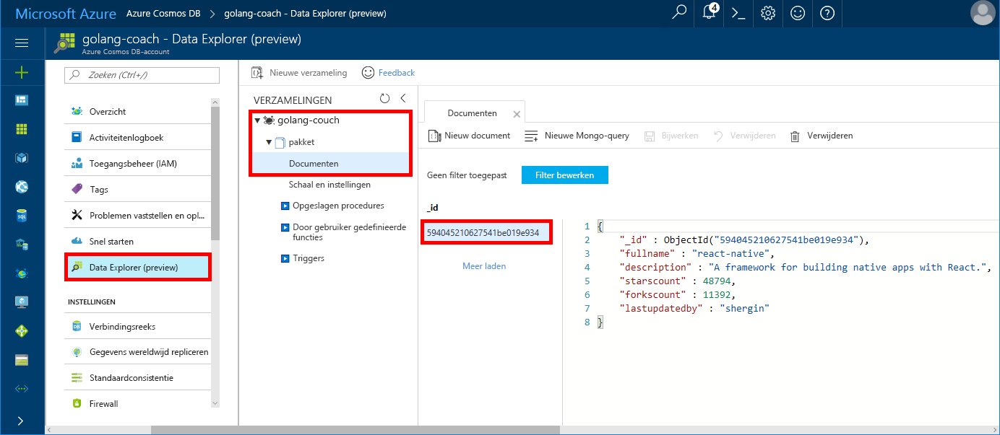

# <a name="quickstart-build-a-console-app-using-azure-cosmos-dbs-api-for-mongodb-and-golang-sdk"></a>Quickstart: Met de API van Azure Cosmos DB voor MongoDB en de Golang-SDK een console-app maken

> [!div class="op_single_selector"]
> * [.NET](create-mongodb-dotnet.md)
> * [Java](create-mongodb-java.md)
> * [Node.js](create-mongodb-nodejs.md)
> * [Python](create-mongodb-flask.md)
> * [Xamarin](create-mongodb-xamarin.md)
> * [Golang](create-mongodb-golang.md)
>  

Azure Cosmos DB is de globaal gedistribueerde multimodel-databaseservice van Microsoft. U kunt snel databases maken van documenten, sleutel/waarde-paren en grafieken en hier query's op uitvoeren. Deze databases genieten allemaal het voordeel van de globale distributie en horizontale schaalmogelijkheden die ten grondslag liggen aan Cosmos DB.

In deze snelstart ziet u hoe u een bestaande, in [Golang](https://golang.org/) geschreven MongoDB-app met behulp van de API van Azure Cosmos DB voor MongoDB kunt verbinden met uw Cosmo-database.

Met andere woorden, uw Golang-toepassing weet alleen dat deze wordt verbonden met behulp van een MongoDB-client. Het is duidelijk voor de toepassing dat de gegevens worden opgeslagen in een Cosmos-database.

## <a name="prerequisites"></a>Vereisten

- Een Azure-abonnement. Als u nog geen abonnement op Azure hebt, maakt u een [gratis account](https://azure.microsoft.com/free) aan voordat u begint. 

  [!INCLUDE [cosmos-db-emulator-mongodb](../../includes/cosmos-db-emulator-mongodb.md)]

- [Go](https://golang.org/dl/) en basiskennis van de [Go](https://golang.org/)-taal.
- Een IDE: [Goland](https://www.jetbrains.com/go/) van Jetbrains, [Visual Studio Code](https://code.visualstudio.com/) van Microsoft, of [Atom](https://atom.io/). In deze zelfstudie wordt GoLand gebruikt.

<a id="create-account"></a>
## <a name="create-a-database-account"></a>Een databaseaccount maken

[!INCLUDE [cosmos-db-create-dbaccount](../../includes/cosmos-db-create-dbaccount-mongodb.md)]

## <a name="clone-the-sample-application"></a>De voorbeeldtoepassing klonen

Kloon de voorbeeldtoepassing en installeer de vereiste pakketten.

1. Maak een map met de naam CosmosDBSample in de map GOROOT\src. Standaard heet de map C:\Go\.
2. Voer de volgende opdracht uit met een Git-terminalvenster zoals Git-bash om de voorbeeldopslagplaats te klonen in de map CosmosDBSample. 

    ```bash
    git clone https://github.com/Azure-Samples/azure-cosmos-db-mongodb-golang-getting-started.git
    ```
3.  Voer de volgende opdracht uit om het mgo-pakket op te halen. 

    ```
    go get gopkg.in/mgo.v2
    ```

Het [mgo](https://labix.org/mgo)-stuurprogramma is een [MongoDB](https://www.mongodb.com/)-stuurprogramma voor de [Go-taal](https://golang.org/). Hiermee wordt een uitgebreide en goed geteste reeks functies geïmplementeerd op basis van een heel eenvoudige API die is voorzien van standaard-Go-terminologie.

<a id="connection-string"></a>

## <a name="update-your-connection-string"></a>Uw verbindingsreeks bijwerken

Ga nu terug naar Azure Portal om de verbindingsreeksinformatie op te halen en kopieer deze in de app.

1. Klik op **Snel starten** in het navigatiemenu links en klik op **Overige** om de verbindingstekenreeksinformatie te bekijken die is vereist voor de Go-toepassing.

2. In Goglang opent u het bestand main.go in de map GOROOT\CosmosDBSample. Werk de volgende regels code bij met de verbindingstekenreeksinformatie uit Azure Portal, zoals in de volgende schermafbeelding te zien is. 

    De naam van de database is het voorvoegsel van de waarde **Host** in het deelvenster met de verbindingstekenreeks in Azure Portal. Voor het account dat in de onderstaande afbeelding wordt weergegeven, is de databasenaam golang-coach.

    ```go
    Database: "The prefix of the Host value in the Azure portal",
    Username: "The Username in the Azure portal",
    Password: "The Password in the Azure portal",
    ```

    

3. Sla het bestand main.go op.

## <a name="review-the-code"></a>De code bekijken

Deze stap is optioneel. Als u wilt weten hoe de databaseresources in de code worden gemaakt, kunt u de volgende codefragmenten bekijken. Sla dit anders over en ga naar [De app uitvoeren](#run-the-app). 

De volgende codefragmenten zijn allemaal afkomstig uit het bestand main.go.

### <a name="connecting-the-go-app-to-cosmos-db"></a>De Go-app verbinden met Cosmos DB

De API van Azure Cosmos DB voor MongoDB biedt ondersteuning voor verbindingen waarop SSL is ingeschakeld. Als u verbinding wilt maken, moet u de functie **DialServer** definiëren in [mgo. DialInfo](https://godoc.org/gopkg.in/mgo.v2#DialInfo) en gebruikmaken van de functie [tls.*Dial*](https://golang.org/pkg/crypto/tls#Dial) om de verbinding tot stand te brengen.

Met het volgende Golang-codefragment verbindt u de Go-app met de API van Azure Cosmos DB voor MongoDB. De klasse *DialInfo* bevat opties voor het starten van een sessie.

```go
// DialInfo holds options for establishing a session.
dialInfo := &mgo.DialInfo{
    Addrs:    []string{"golang-couch.documents.azure.com:10255"}, // Get HOST + PORT
    Timeout:  60 * time.Second,
    Database: "database", // It can be anything
    Username: "username", // Username
    Password: "Azure database connect password from Azure Portal", // PASSWORD
    DialServer: func(addr *mgo.ServerAddr) (net.Conn, error) {
        return tls.Dial("tcp", addr.String(), &tls.Config{})
    },
}

// Create a session which maintains a pool of socket connections
// to Cosmos database (using Azure Cosmos DB's API for MongoDB).
session, err := mgo.DialWithInfo(dialInfo)

if err != nil {
    fmt.Printf("Can't connect, go error %v\n", err)
    os.Exit(1)
}

defer session.Close()

// SetSafe changes the session safety mode.
// If the safe parameter is nil, the session is put in unsafe mode, 
// and writes become fire-and-forget,
// without error checking. The unsafe mode is faster since operations won't hold on waiting for a confirmation.
// 
session.SetSafe(&mgo.Safe{})
```

De methode **mgo.Dial()** wordt gebruikt als er geen SSL-verbinding is. Voor een SSL-verbinding is de methode **mgo.DialWithInfo()** vereist.

Er wordt een exemplaar van het object **DialWIthInfo{}** gebruikt om het sessieobject te maken. Zodra de sessie is gestart, kunt u de verzameling openen met het volgende codefragment:

```go
collection := session.DB("database").C("package")
```

<a id="create-document"></a>

### <a name="create-a-document"></a>Een document maken

```go
// Model
type Package struct {
    Id bson.ObjectId  `bson:"_id,omitempty"`
    FullName      string
    Description   string
    StarsCount    int
    ForksCount    int
    LastUpdatedBy string
}

// insert Document in collection
err = collection.Insert(&Package{
    FullName:"react",
    Description:"A framework for building native apps with React.",
    ForksCount: 11392,
    StarsCount:48794,
    LastUpdatedBy:"shergin",

})

if err != nil {
    log.Fatal("Problem inserting data: ", err)
    return
}
```

### <a name="query-or-read-a-document"></a>Query's uitvoeren voor een document of een document lezen

Cosmos DB biedt ondersteuning voor uitgebreide query's op gegevens die zijn opgeslagen in elke verzameling. In de volgende voorbeeldcode ziet u een query die u kunt uitvoeren op de documenten in uw verzameling.

```go
// Get a Document from the collection
result := Package{}
err = collection.Find(bson.M{"fullname": "react"}).One(&result)
if err != nil {
    log.Fatal("Error finding record: ", err)
    return
}

fmt.Println("Description:", result.Description)
```


### <a name="update-a-document"></a>Een document bijwerken

```go
// Update a document
updateQuery := bson.M{"_id": result.Id}
change := bson.M{"$set": bson.M{"fullname": "react-native"}}
err = collection.Update(updateQuery, change)
if err != nil {
    log.Fatal("Error updating record: ", err)
    return
}
```

### <a name="delete-a-document"></a>Een document verwijderen

Cosmos DB biedt ondersteuning voor het verwijderen van documenten.

```go
// Delete a document
query := bson.M{"_id": result.Id}
err = collection.Remove(query)
if err != nil {
   log.Fatal("Error deleting record: ", err)
   return
}
```
    
## <a name="run-the-app"></a>De app uitvoeren

1. In Golang controleert u of uw GOPATH (beschikbaar via **Bestand**, **Instellingen**, **Go**, **GOPATH**) de locatie bevat waarin de gopkg is geïnstalleerd. Standaard is dit USERPROFILE\go. 
2. Markeer de regels waarmee het document wordt verwijderd (regel 103-107) als commentaar, zodat u het document na het uitvoeren van de app kunt bekijken.
3. In Golang klikt u op **Uitvoeren** en daarna op **'Build main.go and run' uitvoeren**.

    De app wordt voltooid en de beschrijving wordt weergegeven van het document dat u hebt gemaakt in [Een document maken](#create-document).
    
    ```
    Description: A framework for building native apps with React.
    
    Process finished with exit code 0
    ```

    
    
## <a name="review-your-document-in-data-explorer"></a>Uw document bekijken in Data Explorer

Ga terug naar Azure Portal om uw document te bekijken in Data Explorer.

1. Klik op **Data Explorer (Preview)** in het navigatiemenu links, vouw **golang-coach**, **package** uit en klik vervolgens op **Documenten**. Op het tabblad **Documenten** klikt u op de \_-id om het document in het rechterdeelvenster weer te geven. 

    
    
2. U kunt vervolgens inline met het document werken. Klik op **Bijwerken** om het op te slaan. U kunt het document ook verwijderen of nieuwe documenten of query's aanmaken.

## <a name="review-slas-in-the-azure-portal"></a>SLA’s bekijken in Azure Portal

[!INCLUDE [cosmosdb-tutorial-review-slas](../../includes/cosmos-db-tutorial-review-slas.md)]

## <a name="clean-up-resources"></a>Resources opschonen

[!INCLUDE [cosmosdb-delete-resource-group](../../includes/cosmos-db-delete-resource-group.md)]

## <a name="next-steps"></a>Volgende stappen

In deze snelstart hebt u geleerd hoe u een Cosmos-account kunt maken en hoe u een Golang-app kunt uitvoeren. Nu kunt u aanvullende gegevens in uw Cosmos database importeren. 

> [!div class="nextstepaction"]
> [MongoDB-gegevens importeren in Azure Cosmos DB](mongodb-migrate.md)
