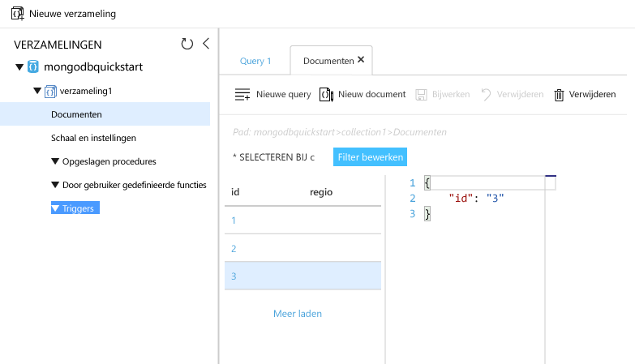

# <a name="azure-cosmos-db-migrate-an-existing-nodejs-mongodb-web-app"></a>Azure Cosmos DB: een bestaande Node.js MongoDB-web-app migreren 

Azure Cosmos DB is de globaal gedistribueerde multimodel-databaseservice van Microsoft. U kunt snel databases maken van documenten, sleutel/waarde-paren en grafieken en hier query’s op uitvoeren. Deze databases genieten allemaal het voordeel van de globale distributie en horizontale schaalmogelijkheden die ten grondslag liggen aan Azure Cosmos DB. 

Deze Quick Start laat zien hoe u een bestaande, in Node.js geschreven [MongoDB](mongodb-introduction.md)-app kunt gebruiken en verbinden met uw Azure Cosmos DB-database, die MongoDB-clientverbindingen ondersteunt. Met andere woorden, uw Node.js-toepassing weet alleen dat het wordt verbonden met een database met behulp van MongoDB-API’s. Het is duidelijk voor de toepassing dat de gegevens worden opgeslagen in Azure Cosmos DB.

Als u klaar bent, beschikt u over een MEAN-toepassing (MongoDB, Express, Angular en Node.js) die wordt uitgevoerd op [Azure Cosmos DB](https://azure.microsoft.com/services/cosmos-db/). 


[!INCLUDE [cloud-shell-try-it](../../includes/cloud-shell-try-it.md)]

Als u ervoor kiest om de CLI lokaal te installeren en te gebruiken, moet u voor dit onderwerp gebruikmaken van Azure CLI versie 2.0 of hoger. Voer `az --version` uit om de versie te bekijken. Als u Azure CLI 2.0 wilt installeren of upgraden, raadpleegt u [Azure CLI 2.0 installeren]( /cli/azure/install-azure-cli). 

## <a name="prerequisites"></a>Vereisten 
Als u nog geen abonnement op Azure hebt, maak dan een [gratis account](https://azure.microsoft.com/free/?WT.mc_id=A261C142F) aan voordat u begint. 
[!INCLUDE [cosmos-db-emulator-mongodb](../../includes/cosmos-db-emulator-mongodb.md)]

Naast Azure CLI moet u [Node.js](https://nodejs.org/) en [Git](http://www.git-scm.com/downloads) lokaal geïnstalleerd hebben om `npm`- en `git`-opdrachten uit te voeren.

U moet bekend zijn met de basisbegrippen van Node.js. Deze Quick Start is niet bedoeld als hulp bij het ontwikkelen van Node.js-toepassingen in het algemeen.

## <a name="clone-the-sample-application"></a>De voorbeeldtoepassing klonen

Open een git-terminalvenster zoals git bash en `cd` naar een werkmap.  

Voer de volgende opdrachten uit om de voorbeeldopslagplaats te klonen. Deze voorbeeldopslagplaats bevat de standaard [MEAN.js](http://meanjs.org/)-toepassing. 

```bash
git clone https://github.com/prashanthmadi/mean
```

## <a name="run-the-application"></a>De toepassing uitvoeren

Installeer de vereiste pakketten en start de toepassing.

```bash
cd mean
npm install
npm start
```
Er wordt een poging gedaan om de toepassing te verbinden met een MongoDB-bron, wat mislukt. Sluit de toepassing wanneer de uitvoer het volgende retourneert: [MongoError: connect ECONNREFUSED 127.0.0.1:27017].

## <a name="log-in-to-azure"></a>Meld u aan bij Azure.

Als u een geïnstalleerde Azure CLI gebruikt, meldt u zich aan bij uw Azure-abonnement met de opdracht [az login](/cli/azure/#login) en volgt u de instructies op het scherm. U kunt deze stap overslaan als u de Azure Cloud Shell gebruikt.

```azurecli
az login 
``` 
   
## <a name="add-the-azure-cosmos-db-module"></a>De Azure Cosmos DB-module toevoegen

Als u van een geïnstalleerde Azure CLI gebruikmaakt, controleert u of het onderdeel `cosmosdb` al is geïnstalleerd door de opdracht `az` uit te voeren. Als `cosmosdb` in de lijst met basisopdrachten staat, gaat u verder met de volgende opdracht. U kunt deze stap overslaan als u de Azure Cloud Shell gebruikt.

Als `cosmosdb` niet in de lijst met basisopdrachten staat, installeert u [Azure CLI 2.0]( /cli/azure/install-azure-cli).

## <a name="create-a-resource-group"></a>Een resourcegroep maken

Maak een [resourcegroep](../azure-resource-manager/resource-group-overview.md) met de opdracht [az group create](/cli/azure/group#create). Een Azure-resourcegroep is een logische container waarin Azure-resources, zoals web-apps, databases en opslagaccounts, worden geïmplementeerd en beheerd. 

In het volgende voorbeeld wordt een resourcegroep gemaakt in de regio West-Europa. Kies een unieke naam voor de resourcegroep.

Als u van Azure Cloud Shell gebruikmaakt, klikt u op **Uitproberen**, volgt u de aanwijzingen op het scherm om u aan te melden en kopieert u de opdracht naar de opdrachtprompt.

```azurecli-interactive
az group create --name myResourceGroup --location "West Europe"
```

## <a name="create-an-azure-cosmos-db-account"></a>Maak een Azure Cosmos DB-account

Maak een Azure Cosmos DB-account met de opdracht [az cosmosdb create](/cli/azure/cosmosdb#create).

Vervang in de volgende opdracht waar u de plaatsaanduiding `<cosmosdb-name>` ziet staan, de accountnaam met uw unieke Azure Cosmos DB-accountnaam. Deze unieke naam wordt gebruikt als onderdeel van uw Azure Cosmos DB-eindpunt (`https://<cosmosdb-name>.documents.azure.com/`), dus de naam moet uniek zijn binnen alle Azure Cosmos DB-accounts in Azure. 

```azurecli-interactive
az cosmosdb create --name <cosmosdb-name> --resource-group myResourceGroup --kind MongoDB
```

De parameter `--kind MongoDB` maakt MongoDB-clientverbindingen mogelijk.

Wanneer de Azure Cosmos DB-account wordt gemaakt toont de Azure CLI informatie die lijkt op het volgende voorbeeld. 

> [!NOTE]
> In dit voorbeeld wordt JSON gebruikt als de Azure CLI-uitvoerindeling. Dit is standaardindeling. Zie [Output formats for Azure CLI 2.0 commands](https://docs.microsoft.com/cli/azure/format-output-azure-cli) (Uitvoerindelingen voor Azure CLI 2.0-opdrachten) als u een andere uitvoerindeling wilt gebruiken.

```json
{
  "databaseAccountOfferType": "Standard",
  "documentEndpoint": "https://<cosmosdb-name>.documents.azure.com:443/",
  "id": "/subscriptions/00000000-0000-0000-0000-000000000000/resourceGroups/myResourceGroup/providers/Microsoft.Document
DB/databaseAccounts/<cosmosdb-name>",
  "kind": "MongoDB",
  "location": "West Europe",
  "name": "<cosmosdb-name>",
  "readLocations": [
    {
      "documentEndpoint": "https://<cosmosdb-name>-westeurope.documents.azure.com:443/",
      "failoverPriority": 0,
      "id": "<cosmosdb-name>-westeurope",
      "locationName": "West Europe",
      "provisioningState": "Succeeded"
    }
  ],
  "resourceGroup": "myResourceGroup",
  "type": "Microsoft.DocumentDB/databaseAccounts",
  "writeLocations": [
    {
      "documentEndpoint": "https://<cosmosdb-name>-westeurope.documents.azure.com:443/",
      "failoverPriority": 0,
      "id": "<cosmosdb-name>-westeurope",
      "locationName": "West Europe",
      "provisioningState": "Succeeded"
    }
  ]
} 
```

## <a name="connect-your-nodejs-application-to-the-database"></a>Uw Node.js-toepassing verbinden met de database

In deze stap verbindt u uw MEAN.js-voorbeeldtoepassing met een Azure Cosmos DB-database die u zojuist hebt gemaakt, met behulp van een MongoDB-verbindingsreeks. 

<a name="devconfig"></a>
## <a name="configure-the-connection-string-in-your-nodejs-application"></a>Configureer de verbindingsreeks in uw Node.js-toepassing

Open `config/env/local-development.js` in uw MEAN.js-opslagplaats.

Vervang de inhoud van dit bestand door de volgende code. Zorg ervoor dat u ook de twee `<cosmosdb-name>`-plaatsaanduidingen vervangt door de naam van uw Azure Cosmos DB-account.

```javascript
'use strict';

module.exports = {
  db: {
    uri: 'mongodb://<cosmosdb-name>:<primary_master_key>@<cosmosdb-name>.documents.azure.com:10255/mean-dev?ssl=true&sslverifycertificate=false'
  }
};
```

## <a name="retrieve-the-key"></a>De sleutel ophalen

U hebt de databasesleutel nodig om verbinding te kunnen maken met een Azure Cosmos DB-database. Gebruik de opdracht [az cosmosdb list-keys](/cli/azure/cosmosdb#list-keys) om de primaire sleutel op te halen.

```azurecli-interactive
az cosmosdb list-keys --name <cosmosdb-name> --resource-group myResourceGroup --query "primaryMasterKey"
```

De Azure CLI voert informatie uit die lijkt op het volgende voorbeeld. 

```json
"RUayjYjixJDWG5xTqIiXjC..."
```

Kopieer de waarde van `primaryMasterKey`. Plak deze op de `<primary_master_key>` in `local-development.js`.

Sla uw wijzigingen op.

### <a name="run-the-application-again"></a>Voer de toepassing opnieuw uit.

Voer `npm start` opnieuw uit. 

```bash
npm start
```

Er verschijnt nu een consolebericht dat de ontwikkelomgeving gereed is voor gebruik. 

Ga naar `http://localhost:3000` in een browser. Klik op **Registreren** in het bovenste menu en probeer twee fictieve gebruikers te maken. 

De MEAN.js-voorbeeldtoepassing slaat gebruikersgegevens op in de database. Als het lukt en MEAN.js automatisch aanmeldt met de gemaakte gebruiker, is uw Azure Cosmos DB-verbinding actief. 


## <a name="view-data-in-data-explorer"></a>Gegevens bekijken in Data Explorer

Gegevens die door een Azure Cosmos DB worden opgeslagen, kunnen in de Azure Portal bekeken worden en u kunt query’s erop uitvoeren en business-logic toepassen.

Meld u aan bij de [Azure Portal](https://portal.azure.com) in uw webbrowser om de gebruikersgegevens die u in de vorige stap hebt gemaakt, te bekijken, query’s erop uit te voeren of andere taken ermee uit te voeren.

Typ ‘Azure Cosmos DB’ in het bovenste vak Zoeken. Wanneer uw Cosmos DB-accountblade wordt geopend, selecteert u uw Cosmos DB-account. Klik in het linker navigatiegedeelte op Data Explorer. Vouw uw verzameling uit in het venster Verzamelingen. Dan kunt u de documenten in de verzameling zien, query’s op de gegevens uitvoeren en zelfs opgeslagen procedures, triggers en UDF’s maken en uitvoeren. 




## <a name="deploy-the-nodejs-application-to-azure"></a>De Node.js-toepassing implementeren naar Azure

In deze step implementeert u uw met MongoDB verbonden Node.js -toepassing naar Azure Cosmos DB.

U hebt wellicht opgemerkt dat het configuratiebestand dat u eerder had gewijzigd, bestemd is voor de ontwikkelomgeving (`/config/env/local-development.js`). Wanneer u uw toepassing implementeert naar App Service, wordt deze standaard in de productieomgeving uitgevoerd. U moet nu dus dezelfde wijziging toepassing op het respectieve configuratiebestand.

Open `config/env/production.js` in uw MEAN.js-opslagplaats.

Vervang in het object `db` de waarde van `uri` zoals getoond in het volgende voorbeeld. Zorg dat u de plaatsaanduidingen vervangt zoals eerder beschreven.

```javascript
'mongodb://<cosmosdb-name>:<primary_master_key>@<cosmosdb-name>.documents.azure.com:10255/mean?ssl=true&sslverifycertificate=false',
```

> [!NOTE] 
> De optie `ssl=true` is belangrijk omdat [Azure Cosmos DB SSL vereist](connect-mongodb-account.md#connection-string-requirements). 
>
>

Voer in de terminal al uw wijzigingen door in Git. U kunt beide opdrachten kopiëren om ze samen uit te voeren.

```bash
git add .
git commit -m "configured MongoDB connection string"
```
## <a name="clean-up-resources"></a>Resources opschonen

Als u deze app niet verder gaat gebruiken, kunt u alle resources verwijderen die door deze Quick Start zijn aangemaakt door onderstaande stappen te volgen in Azure Portal:

1. Klik in het menu aan de linkerkant in Azure Portal op **Resourcegroepen** en klik vervolgens op de resource die u hebt gemaakt. 
2. Klik op de pagina van uw resourcegroep op **Verwijderen**, typ de naam van de resource die u wilt verwijderen in het tekstvak en klik vervolgens op **Verwijderen**.

## <a name="next-steps"></a>Volgende stappen

In deze Quick Start hebt u geleerd hoe u een Azure Cosmos DB-account kunt maken en hebt u een MongoDB-verzameling gemaakt met Data Explorer. U kunt uw MongoDB-gegevens nu naar Azure Cosmos DB migreren.  

> [!div class="nextstepaction"]
> [MongoDB-gegevens importeren in Azure Cosmos DB](mongodb-migrate.md)
